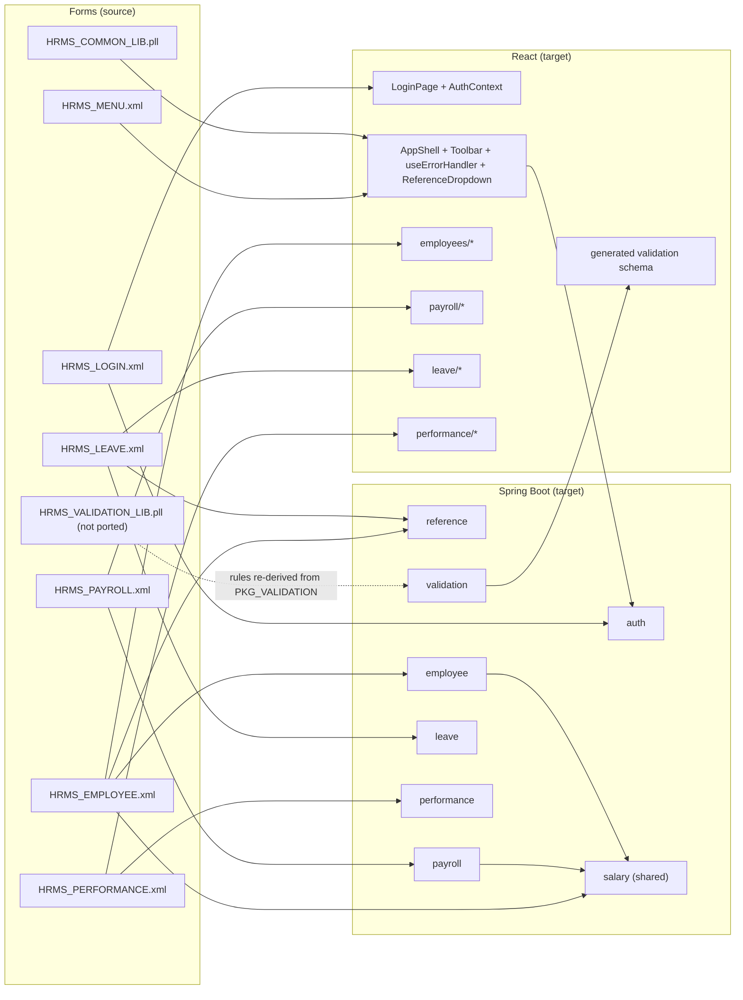

# Component Mapping: Oracle Forms → Spring Boot + React

Form-by-form mapping of the six checked-in Forms XML exports (`forms/xml-exports/`) and the two PLL libraries (`forms/libraries/`) onto proposed Spring Boot and React components. Strategy per area follows [MODERNIZATION_BLUEPRINT.md](MODERNIZATION_BLUEPRINT.md) §8; phase per area follows [CUTOVER_PLAN.md](CUTOVER_PLAN.md). Table/column facts come from [DATA_DICTIONARY.md](DATA_DICTIONARY.md); package/form edges from [DEPENDENCY_MAP.md](DEPENDENCY_MAP.md); defect IDs from [TECH_DEBT_REGISTRY.md](TECH_DEBT_REGISTRY.md).

> Forms **not** in the repo and therefore **not mapped**: `HRMS_REPORTS`, `HRMS_ADMIN` (opened from `HRMS_MENU.xml` lines 119, 161 and 165, and from `HRMS_MENU.mmb.sql`), `HRMS_DEPARTMENT`, `HRMS_LOV`, `HRMS_TOOLBAR`, `HRMS_REPORT_LIB.pll` ([APPLICATION_INVEONTORY.md](APPLICATION_INVEONTORY.md) §8, PROC-02). Their targets (`ReportsPage`, `AdminPage`, role management UI) must be specified from business requirements, not from source.

Proposed target layout used throughout:

```text
backend/src/main/java/com/acme/hrms/
  auth/         AuthController, AuthService, JwtTokenService, RoleService, UserAccount(entity)
  common/       BusinessCalendar, FiscalCalendar, SystemParameterService, ApiError, ErrorCode
  validation/   HrmsValidationRules (Bean Validation groups), schema export
  audit/        AuditService, AuditLog(entity)
  notification/ NotificationService, NotificationQueue(entity)
  reference/    ReferenceDataController, Department/JobTitle/Location/LeaveType(entities)
  salary/       SalaryService, SalaryRecord(entity)          <- shared, breaks ARCH-01
  employee/     EmployeeController, EmployeeService, Employee, EmployeeHistory(entities)
  payroll/      PayrollController, PayrollRunService, TaxEngine, PayPeriod, PayrollRun, PayrollDetail
  leave/        LeaveController, LeaveRequestService, LeaveBalanceService, LeaveRequest, LeaveBalance, Holiday
  performance/  PerformanceController, ReviewCycleService, PerformanceReviewService, GoalService, entities
frontend/src/
  app/          AppShell, AuthContext, ProtectedRoute, Toolbar, useErrorHandler, ReferenceDropdown
  pages/        LoginPage, HomePage, employees/, payroll/, leave/, performance/
```

Every JPA entity maps to the `HRMS` schema table named in [DATA_DICTIONARY.md](DATA_DICTIONARY.md); IDs come from the existing `SEQ_*` sequences (`schema/sequences/hrms_sequences.sql`) via `@SequenceGenerator` so legacy and new rows never collide during the parallel-run period.

---

## 1. `HRMS_LOGIN` → `LoginPage` + `auth-service`

Source: `forms/xml-exports/HRMS_LOGIN.xml` (1 block `LOGIN`, 0 LOVs). Strategy: **full rewrite** (option b) – the PL/SQL it calls is *not* reused ([MODERNIZATION_BLUEPRINT.md](MODERNIZATION_BLUEPRINT.md) §2.3). Phase 0.

| Source file | Target file(s) | Business rules to preserve | Data access patterns to convert | UI elements to recreate |
|---|---|---|---|---|
| `HRMS_LOGIN.xml` block `LOGIN` (items `USERNAME`, `PASSWORD`, `ERROR_MSG`, `BTN_LOGIN`, `COMPANY_LOGO`) | `frontend/src/pages/LoginPage.tsx`; `frontend/src/app/AuthContext.tsx` | Username is the employee e-mail (`WHERE UPPER(EMAIL) = UPPER(:LOGIN.USERNAME)`, line 87); only `EMPLOYMENT_STATUS='ACTIVE'` may log in; Enter in password field submits (`KEY-NEXT-ITEM`, line 108) | Form-level `:GLOBAL.session_id/current_user/current_emp_id` (lines 82–90) → JWT claims `sub` (user id), `empId`, `roles`; stored in `AuthContext`, never in URL/localStorage plaintext | Username / password fields, error display item, login button, logo; "Login failed" message on any failure (no user enumeration) |
| `HRMS_LOGIN.xml` `BTN_LOGIN` `WHEN-BUTTON-PRESSED` (lines 62–104) calling `PKG_SECURITY.authenticate(username, password, CLIENT_HOST)` | `backend/.../auth/AuthController.java` (`POST /api/auth/login`, `POST /api/auth/logout`, `POST /api/auth/refresh`), `AuthService.java`, `JwtTokenService.java`, `UserAccount.java` (**new** table `USER_ACCOUNTS` – no `USER_CREDENTIALS` DDL exists, SEC-05) | Audit login (`PKG_AUDIT.log_action('USER_SESSIONS', …)`); record `IP_ADDRESS`; session timeout 30 min **read from `SYSTEM_PARAMETERS.SECURITY.SESSION_TIMEOUT_MIN`** (VAL-06) rather than `c_session_timeout_min` | `INSERT INTO USER_SESSIONS` with `SEQ_USER_SESSION` (SEC-08) → still write a `USER_SESSIONS` row for audit/parallel-run visibility, but the client token is a signed JWT (`jti` random UUID); `USERNAME VARCHAR2(30)` overflow (DATA-04) → widen column in Phase 0 migration | – |
| `PKG_SECURITY.hash_password` (MD5, SEC-02), `change_password` (stub) | `auth/PasswordService.java` (BCrypt or Argon2 via Spring Security `PasswordEncoder`), `PUT /api/auth/password` | Complexity rules from `change_password` (`-20310` ≥ 8 chars, `-20311` uppercase, `-20312` digit) – keep, but read min length from `SYSTEM_PARAMETERS.SECURITY.PASSWORD_MIN_LENGTH` | No legacy hashes exist to migrate → first login is a forced set-password / SSO federation | Change-password dialog (no Forms equivalent exists – new) |
| `PKG_SECURITY.is_session_valid` (called by every other form) | `auth/JwtAuthenticationFilter.java`; Spring Security filter chain | Expired or closed session → redirect to login | Per-request `SELECT` on `USER_SESSIONS` → stateless signature check + short-lived access token / refresh token; explicit logout revokes `jti` | Session-expired toast + redirect |
| `PKG_SECURITY.has_permission(emp_id, module, action)` (grade-based, SEC-07) | `auth/RoleService.java`, `@PreAuthorize("hasAuthority('PAYROLL_APPROVE')")` on controllers; **new** tables `ROLES`, `ROLE_PERMISSIONS`, `USER_ROLES` | Permission *names* used in source must exist as authorities: `PAYROLL:VIEW`, `PAYROLL:APPROVE`, `EMPLOYEE:EDIT`, `ADMIN:VIEW`, `REPORTS:VIEW` (the module/action pairs passed to `has_permission` across `HRMS_MENU.xml`, `HRMS_PAYROLL.xml`, `HRMS_EMPLOYEE.xml`), plus `LEAVE:CREATE`/`LEAVE:VIEW`/`EMPLOYEE:VIEW` which `has_permission` grants to everyone; grade ≥ 8 rule is used **only** to seed initial role assignments | `JOIN JOB_TITLES` per call → roles resolved at login into the JWT | `ProtectedRoute` component hides routes without the authority (mirrors `BTN_PAYROLL` / `BTN_REPORTS` enable/disable in `HRMS_MENU.xml`) |
| `PKG_SECURITY.encrypt_ssn` / `decrypt_ssn` (literal AES key, SEC-01) | `common/FieldEncryptionService.java` (AES-GCM, key from vault/KMS); JPA `AttributeConverter` on `Employee.ssnEncrypted` and `EmployeeBankAccount.accountNumberEnc` | Only authorised roles may decrypt; return masked `***-**-1234` by default | One-off re-encryption migration (decrypt with legacy key, encrypt with vault key) in Phase 0 – see [RISK_REGISTER.md](RISK_REGISTER.md) R-03 | Masked SSN display with "reveal" action (audited) |

Rejected for reuse: `PKG_SECURITY.authenticate` body (never verifies a password, SEC-05), `SEQ_USER_SESSION` as token (SEC-08), `MIN(EMP_ID)` on duplicate e-mail (SEC-10 – the new system rejects the login and alerts admin instead).

---

## 2. `HRMS_MENU` → `AppShell` + `HomePage`

Source: `forms/xml-exports/HRMS_MENU.xml` (1 control block `MENU_CONTROL`, menu `MM_HRMS`), `forms/menus/HRMS_MENU.mmb.sql`. Phase 0/1 (delivered with the auth foundation).

| Source file | Target file(s) | Business rules to preserve | Data access patterns to convert | UI elements to recreate |
|---|---|---|---|---|
| `HRMS_MENU.xml` `WHEN-NEW-FORM-INSTANCE` (lines 19–40): session check, `has_permission` for `PAYROLL/ADMIN/REPORTS` to enable buttons | `frontend/src/app/AppShell.tsx`, `ProtectedRoute.tsx`, `pages/HomePage.tsx` | Entry without valid session → login; module tiles enabled by authority | `PKG_SECURITY.is_session_valid(TO_NUMBER(:GLOBAL.session_id))` → `AuthContext` token check + `GET /api/auth/me` returning `{empId, name, roles}` | Welcome text (`WELCOME_TEXT`), user info (`USER_INFO`), six tiles/buttons (`BTN_EMPLOYEES`, `BTN_PAYROLL`, `BTN_LEAVE`, `BTN_PERFORMANCE`, `BTN_REPORTS`, `BTN_LOGOUT`), top menu `MM_HRMS` (File/Logout, module items) |
| `OPEN_FORM('HRMS_EMPLOYEE'/'HRMS_PAYROLL'/'HRMS_LEAVE'/'HRMS_PERFORMANCE', ACTIVATE, SESSION)` | React Router routes `/employees`, `/payroll`, `/leave`, `/performance` | `SESSION` mode = each form had its own DB session; in the SPA all pages share one token | n/a | Navigation |
| `OPEN_FORM('HRMS_REPORTS')` (line 119), `OPEN_FORM('HRMS_ADMIN')` (`MI_ADMIN`, line 165) | `/reports`, `/admin` routes **reserved; no source to map** (PROC-02). During Phases 0–4 the reverse proxy routes these paths to legacy Forms if the binaries can be recovered, else the tiles are hidden | – | – | Tiles hidden until Phase 5 |
| `MI_CHANGE_PWD` (line 166) | `PUT /api/auth/password` (see §1) | – | – | Change-password dialog |
| `BTN_LOGOUT` → `PKG_SECURITY.logout(session_id)`; `EXIT_FORM` | `POST /api/auth/logout` (revoke `jti`, set `USER_SESSIONS.SESSION_STATUS='CLOSED'`, `LOGOUT_TIME`) | Logout audit row | `UPDATE USER_SESSIONS` – keep for parallel-run parity | Logout menu item + button |

---

## 3. `HRMS_EMPLOYEE` → `employee-service` + `salary-module` + `EmployeePage`

Source: `forms/xml-exports/HRMS_EMPLOYEE.xml` (blocks `EMPLOYEE`, `SALARY`; relation `EMP_SALARY_REL`; record groups `RG_DEPARTMENTS`, `RG_JOB_TITLES`, `RG_MANAGERS`, `RG_LOCATIONS`; tab pages `TP_PERSONAL`, `TP_JOB`, `TP_DEPENDENTS`, `TP_HISTORY`), `plsql/packages/PKG_EMPLOYEE.pks/.pkb`, `plsql/triggers/trg_employees.sql`. Strategy: **rewrite** with `SalaryService` extracted first (ARCH-01/ARCH-02). Phase 3.

> Header (lines 10–12) claims 5 blocks and 8 LOVs; the export contains **2 blocks and 4 LOVs**. `DEPENDENTS`, `EMERGENCY_CONTACTS`, `EMP_HISTORY` blocks and Status/Gender/Marital/Country LOVs are not present, although `EMPLOYEE_DEPENDENTS`, `EMERGENCY_CONTACTS` and `EMPLOYEE_HISTORY` tables exist in the DDL. Their pages are mapped from the *tables*, not from form source.

### 3.1 Blocks → entities and endpoints

| Source file | Target file(s) | Business rules to preserve | Data access patterns to convert | UI elements to recreate |
|---|---|---|---|---|
| Block `EMPLOYEE` (`QueryDataSourceName="HRMS.EMPLOYEES"`, `DMLDataTargetName="HRMS.EMPLOYEES"`, lines 110–425) | `employee/Employee.java` (`@Entity @Table(name="EMPLOYEES")`, `@SequenceGenerator(sequenceName="SEQ_EMPLOYEE")`), `EmployeeRepository`, `EmployeeController` (`GET /api/employees`, `GET /api/employees/{id}`, `POST /api/employees`, `PUT /api/employees/{id}`), `EmployeeService` (wraps `create_employee`, `update_employee`, `transfer_employee`, `promote_employee`, `terminate_employee`, `rehire_employee`) | All `CHECK` constraints in `DATA_DICTIONARY.md` §1.5 (`GENDER`, `MARITAL_STATUS`, `EMPLOYMENT_TYPE`, `EMPLOYMENT_STATUS`, `ACTIVE_FLAG`); e-mail unique among active employees; `UK_EMP_NUMBER`; terminated employees re-activated only through rehire (`-20503`); no physical delete (`-20504`) | Base-table block query/DML (ARCH-02) → **all writes via `EmployeeService`**, which is the *only* code path (replaces Forms DML + `TRG_EMP_*` + `PKG_EMPLOYEE`); `EXECUTE_QUERY` with Enter-Query mode → `GET /api/employees?lastName=&firstName=&deptId=&status=&locationCode=&hireDateFrom=&hireDateTo=` implemented with JPA `Specification` (replaces `search_employees` dynamic SQL, SEC-03) with server-side paging | Tab **Personal Information** (`EMP_NUMBER` read-only, `FIRST_NAME`, `LAST_NAME`, `DATE_OF_BIRTH`, `GENDER` list, `MARITAL_STATUS` list, `EMAIL`, `PHONE_WORK`, `PHONE_MOBILE`, address fields); Tab **Job & Compensation** (`HIRE_DATE`, `DEPT_ID`+`DEPT_NAME_DISP`, `JOB_ID`+`JOB_TITLE_DISP`, `MANAGER_EMP_ID`+`MANAGER_NAME_DISP`, `LOCATION_CODE`, `EMPLOYMENT_TYPE`, `EMPLOYMENT_STATUS`, `TERMINATION_DATE`); `RecordsDisplayed="1"` master form → `pages/employees/EmployeeDetailPage.tsx`; list/search → `EmployeeSearchPage.tsx` |
| Block `SALARY` (`QueryDataSourceName="HRMS.SALARY_RECORDS"`, `Insert/Update/DeleteAllowed="No"`, `RecordsDisplayed="5"`, lines 431–457) with `Relation EMP_SALARY_REL` (`SALARY.EMP_ID = EMPLOYEE.EMP_ID`, `AutoQuery="Yes"`, `DeleteRecordBehavior="Cascading"`) | `salary/SalaryRecord.java` (`@Table(name="SALARY_RECORDS")`, `@ManyToOne Employee`), `Employee.salaryRecords` (`@OneToMany(mappedBy="employee")`), `SalaryService` (`create_salary_record` semantics), `GET /api/employees/{id}/salary-history`, `POST /api/employees/{id}/salary-changes` | Exactly one `ACTIVE_FLAG='Y'` row per employee; new record closes the previous (`END_DATE`, `ACTIVE_FLAG='N'`); `BASE_SALARY > 0` (`-20101`); `CHANGE_PCT` derived; `TRG_SALARY_AUDIT` → `AuditService` | Master/detail auto-query → nested resource endpoint; **`Cascading` delete is not reproduced** – `EMPLOYEES` cannot be deleted (`-20504`), so the relation's cascade is dead code | Read-only salary history grid (`EFFECTIVE_DATE`, `END_DATE`, `BASE_SALARY` `$999,999,990.00`, `CHANGE_REASON`, `CHANGE_PCT` `990.00%`) on the Job & Compensation tab; "Adjust salary" dialog (new – Forms had no insert path; `PKG_PAYROLL.create_salary_record` was API-only) |
| *(missing blocks)* `DEPENDENTS`, `EMERGENCY_CONTACTS`, `EMP_HISTORY` | `employee/EmployeeDependent.java` (`EMPLOYEE_DEPENDENTS`), `EmergencyContact.java` (`EMERGENCY_CONTACTS`), `EmployeeHistory.java` (`EMPLOYEE_HISTORY` – **real** columns `HIST_ID`, `EFFECTIVE_DATE`, `OLD_DEPT_ID`… per DDL, not the trigger's phantom columns, BUG-03); `GET /api/employees/{id}/dependents|emergency-contacts|history` | `EMPLOYEE_HISTORY` written by `EmployeeService.logHistory` on status/department/job change (the rule `TRG_EMP_BEFORE_UPDATE` *intended*) | Not in form source; tables in `schema/tables/01_core_tables.sql` | Tabs **Dependents**, **Employment History** (tab pages exist at lines 512–513 with no items) |

### 3.2 Triggers → service logic / Bean Validation

| Source file | Target file(s) | Business rules to preserve | Data access patterns to convert | UI elements to recreate |
|---|---|---|---|---|
| `HRMS_EMPLOYEE.xml` `PRE-INSERT` (lines 323–333): `EMP_ID := SEQ_EMPLOYEE.NEXTVAL`, `EMP_NUMBER := PKG_EMPLOYEE.generate_emp_number`, `ACTIVE_FLAG='Y'`, `EMPLOYMENT_STATUS='ACTIVE'`, `CREATED_BY := :GLOBAL.current_user` | `employee/EmployeeNumberGenerator.java` (`'EMP-' || LPAD(SEQ_EMP_NUMBER.NEXTVAL, 6, '0')` – replaces `MAX()+1`, BUG-01/PERF-04/DATA-03), `EmployeeService.create()` sets defaults; `CREATED_BY` from `SecurityContext` via JPA `@CreatedBy` auditing | Format `EMP-000001` (`DATA_DICTIONARY.md` §8, seed uses IDs 1–24); defaults on insert | Forms `PRE-INSERT` + `TRG_EMP_BEFORE_INSERT` defaults (`CREATED_BY`, `CREATED_DATE`, `ACTIVE_FLAG`, `EMPLOYMENT_STATUS`) → one `@PrePersist` | – |
| `WHEN-VALIDATE-ITEM` (lines 370–413): e-mail via `PKG_VALIDATION.validate_email_format`; **hire date ≤ SYSDATE+90**; `DEPT_ID`/`JOB_ID` must exist and be `ACTIVE_FLAG='Y'` | `validation/HrmsValidationRules.java`: `@Email`, `@HireDateWithinLimit` custom constraint reading limit from `SYSTEM_PARAMETERS` (single value – resolve VAL-01: form says 90, `TRG_EMP_BEFORE_INSERT` says 180; decision recorded in [TEST_STRATEGY.md](TEST_STRATEGY.md) §4), `@ActiveReference(Department.class)`, `@ActiveReference(JobTitle.class)` | `-20003` invalid/inactive department, `-20011` invalid/inactive job (`PKG_EMPLOYEE.validate_employee`), `-20010` first/last name required | Per-keystroke `SELECT … INTO` → `POST /api/employees` returns `400` with field errors; React form uses the exported validation schema for pre-validation | Inline field errors; the `DEPT_NAME_DISP`/`JOB_TITLE_DISP`/`MANAGER_NAME_DISP` display items become label rendering of the `ReferenceDropdown` selection |
| `PRE-UPDATE` (lines 336–342): `MODIFIED_BY/MODIFIED_DATE` | JPA `@LastModifiedBy/@LastModifiedDate` | – | – | – |
| `POST-QUERY` (lines 345–367): 3 lookups per row | `EmployeeDto` joins `DEPARTMENTS.DEPT_NAME`, `JOB_TITLES.JOB_TITLE`, manager name in one query (`@EntityGraph`) | – | N+1 per-row lookups → single join | – |
| `ON-ERROR` (lines 66–88): suppress `FRM-40202`, map `FRM-40401` "No changes", `FRM-40501` "Record locked" | `common/ApiError.java` + `@ControllerAdvice`; `OptimisticLockException` → `409 Conflict` "Record was changed by another user" | Lock message semantics | Forms pessimistic row lock → `@Version` optimistic locking on `Employee` | `useErrorHandler` toast (see §7) |
| `trg_employees.sql` `TRG_EMP_BEFORE_INSERT` | `EmployeeService.create()` / Bean Validation | **`-20501`** hire date > SYSDATE+180 → `HIRE_DATE_TOO_FAR` (same limit as above after VAL-01 resolution); **`-20502`** e-mail already used by an active employee (case-insensitive) → `EMAIL_IN_USE` (`409`) – also enforced on *update* (SEC-10 gap) | Trigger `SELECT COUNT(*)` → `EmployeeRepository.existsByEmailIgnoreCaseAndActiveFlag` inside the service transaction + DB unique index on `UPPER(EMAIL)` where `ACTIVE_FLAG='Y'` | – |
| `TRG_EMP_BEFORE_UPDATE` | `EmployeeService.update()/transfer()/promote()/terminate()/rehire()` | **`-20503`** direct `TERMINATED → ACTIVE` forbidden → `USE_REHIRE_PROCESS` (`422`); status / department / job changes write `EMPLOYEE_HISTORY` (`STATUS_CHANGE`, `DEPARTMENT_CHANGE`, `JOB_CHANGE`) against the **real** DDL columns (BUG-03) | Trigger-side history insert → `EmployeeHistoryService.record(...)` | – |
| `TRG_EMP_INSTEAD_OF_DELETE` | No `DELETE /api/employees/{id}`; `POST /api/employees/{id}/terminate` | **`-20504`** physical delete forbidden → soft delete only (`ACTIVE_FLAG='N'` via termination) | Forms "delete → set `ACTIVE_FLAG='N'` + `CLEAR_RECORD` workaround" → explicit termination action | Toolbar "Delete" is replaced by "Terminate" on this page |
| `PKG_EMPLOYEE.terminate_employee` TODOs (BUG-07) | `EmployeeService.terminate()` also calls `AuthService.revokeSessions(empId)` and publishes `EmployeeTerminatedEvent` (consumed by leave/payroll in later phases) | Termination closes open `USER_SESSIONS` and disables the login | – | – |
| `PKG_EMPLOYEE.validate_employee` circular-manager check (`-20004`) and `get_org_chart` (`CONNECT BY`, PERF-03) | `EmployeeService.assertAcyclicManagerChain()` (walk up ≤ N levels in Java or `CONNECT BY NOCYCLE`); `GET /api/org-chart` | Reject a manager assignment that creates a loop (`ORA-01436` guard, DATA-02) | Recursive query with `NOCYCLE` | Org chart page (`VW_ORG_HIERARCHY` retained as read model) |
| `PKG_EMPLOYEE.set_session_context` (called by `PKG_SECURITY`, ARCH-03) | Moves to `auth/AuthService` | – | `DBMS_SESSION`/context → JWT claims | – |

### 3.3 LOVs → reference data

| Source file | Target file(s) | Business rules to preserve | Data access patterns to convert | UI elements to recreate |
|---|---|---|---|---|
| `RG_DEPARTMENTS` (line 465) `SELECT DEPT_ID, DEPT_NAME, DEPT_CODE FROM DEPARTMENTS WHERE ACTIVE_FLAG='Y'` | `reference/ReferenceDataController` `GET /api/reference/departments?active=true`; `frontend/src/app/ReferenceDropdown.tsx` | Only active departments selectable; display name, return id | Record group query → cached REST endpoint (`Cache-Control`, `@Cacheable`) | `LOV_DEPARTMENTS` → `<ReferenceDropdown source="departments" />` |
| `RG_JOB_TITLES` (line 475) `FROM JOB_TITLES j JOIN JOB_GRADES g … WHERE ACTIVE_FLAG='Y'` | `GET /api/reference/job-titles?active=true` (returns `jobId`, `jobTitle`, `gradeId`, `gradeName`) | Grade shown with title | same | `LOV_JOB_TITLES` |
| `RG_MANAGERS` (line 487) `FROM EMPLOYEES WHERE EMPLOYMENT_STATUS='ACTIVE' AND ACTIVE_FLAG='Y'` | `GET /api/employees?status=ACTIVE&fields=id,name,jobTitle&q=` (searchable, paged) | Only active employees may be managers; exclude self (the form does not, `-20004` catches it later) | Record group → server-side search (24 rows in seed, but unbounded in production) | `LOV_MANAGERS` → searchable `ReferenceDropdown` variant |
| `RG_LOCATIONS` (line 499) `FROM LOCATIONS WHERE ACTIVE_FLAG='Y'` | `GET /api/reference/locations?active=true` | Codes `HQ`, `SF`, `CHI` in seed | same | `LOV_LOCATIONS` |
| `HRMS_COMMON_LIB.refresh_lov('LOV_X')` → `POPULATE_GROUP('RG_X')` | `ReferenceDropdown` `refetch()` / React Query cache invalidation | – | – | – |

---

## 4. `HRMS_PAYROLL` → `payroll-service` + `PayrollPage`

Source: `forms/xml-exports/HRMS_PAYROLL.xml` (blocks `PAY_PERIOD`, `PAYROLL_RUN`; **0 LOVs**; header claims 4 blocks / 3 LOVs and tab "Pay Details" – `PAYROLL_DETAIL`, `PAYSLIP_SUMMARY` are not present), `plsql/packages/PKG_PAYROLL.pks/.pkb`. Strategy: **hybrid façade first, then rewrite** ([MODERNIZATION_BLUEPRINT.md](MODERNIZATION_BLUEPRINT.md) §4.3). Phase 4.

| Source file | Target file(s) | Business rules to preserve | Data access patterns to convert | UI elements to recreate |
|---|---|---|---|---|
| `WHEN-NEW-FORM-INSTANCE` (lines 22–45): `is_session_valid`, `has_permission(:GLOBAL.current_emp_id,'PAYROLL','VIEW')`, `DEFAULT_WHERE "STATUS = 'OPEN' ORDER BY PERIOD_START_DATE DESC"` on `PAY_PERIOD` | `payroll/PayrollController` `GET /api/payroll/periods?status=OPEN&sort=periodStartDate,desc` with `@PreAuthorize("hasAuthority('PAYROLL:VIEW')")` | Default view shows only open periods | `SET_BLOCK_PROPERTY(DEFAULT_WHERE)` → query parameter with server-side filter | Tab **Pay Periods** grid (`PERIOD_NAME`, `PERIOD_START_DATE`, `PERIOD_END_DATE`, `PAY_DATE`, `STATUS`) |
| Block `PAY_PERIOD` (`HRMS.PAY_PERIODS`, read-only, lines 51–67) | `payroll/PayPeriod.java` (`PAY_PERIODS`, `SEQ_PAY_PERIOD`) | `CHK_PERIOD_DATES` (`END >= START`), `CHK_PAY_DATE`, `CHK_PERIOD_STATUS` (`OPEN/PROCESSING/CLOSED/REVERSED`); `close_pay_period` `-20102` | Read-only block → repository query | Grid |
| Block `PAYROLL_RUN` (`HRMS.PAYROLL_RUNS`, detail of period, lines 69–150) | `payroll/PayrollRun.java` (`PAYROLL_RUNS`, `SEQ_PAYROLL_RUN`), `GET /api/payroll/periods/{periodId}/runs` | `RUN_TYPE` domain `REGULAR/SUPPLEMENTAL/BONUS/FINAL` (`CHK_RUN_TYPE`); status machine `PENDING → CALCULATING → CALCULATED → APPROVED → PAID`, plus `REVERSED`, `ERROR` (`CHK_RUN_STATUS`); totals `EMPLOYEE_COUNT`, `TOTAL_GROSS`, `TOTAL_NET` | Master/detail → nested endpoint | Tab **Payroll Runs** grid (`RUN_TYPE`, `RUN_DATE`, `STATUS`, `EMPLOYEE_COUNT`, `TOTAL_GROSS`, `TOTAL_NET`) + three action buttons |
| `BTN_CREATE_RUN` (lines 90–106) → `PKG_PAYROLL.create_payroll_run(p_period_id, 'REGULAR', :GLOBAL.current_user)` | `POST /api/payroll/periods/{periodId}/runs {runType}`; **Phase 4a (hybrid):** `PayrollLegacyGateway` calls the package via `SimpleJdbcCall`; **Phase 4b:** `PayrollRunService.createRun()` | `-20102` cannot create run for closed period; audit row | Stored-procedure call from Forms → JDBC call, then Java | "Create Run" button |
| `BTN_CALCULATE` (lines 108–129) → `calculate_payroll(:PAYROLL_RUN.RUN_ID, :GLOBAL.current_user)` | `POST /api/payroll/runs/{runId}/calculate` → async job (`202 Accepted` + `GET /api/payroll/runs/{runId}/status`); Phase 4b `PayrollRunService.calculate()` + `TaxEngine` | Per employee: gross from active `SALARY_RECORDS` (`-20104` if none) by `PAY_FREQUENCY`; earnings/deductions from `EMPLOYEE_PAY_ELEMENTS`; taxes into elements **100 `FED_TAX`, 101 `STATE_TAX`, 102 `FICA`, 103 `MEDICARE`** (hard-coded IDs preserved as constants but validated against `PAY_ELEMENTS` at startup); errors recorded as `PAYROLL_DETAILS.STATUS='ERROR'` rows, not aborting the run; sign convention (earnings +, taxes/deductions −) that `VW_PAYROLL_LATEST` depends on | Row-by-row cursor with `COMMIT` every 50 (PERF-01/02) → Spring Batch chunked step with restartability; **`TaxEngine` reads `TAX_BRACKETS`** (year, filing status, state) instead of hard-coded 2024 brackets and the `ELSE 0.05` state default (BUG-02); allowance amount and standard deductions become rows in `TAX_BRACKETS`/`SYSTEM_PARAMETERS` | "Calculate" button, progress indicator, error-count badge |
| `BTN_APPROVE` (lines 131–148): `has_permission('PAYROLL','APPROVE')` then `approve_payroll` | `POST /api/payroll/runs/{runId}/approve` with `@PreAuthorize("hasAuthority('PAYROLL:APPROVE')")` | `-20103` only `CALCULATED` runs can be approved; sets `APPROVED_BY/APPROVED_DATE`; `reverse_payroll` sets `REVERSED` | Same | "Approve" button (hidden without authority) |
| `PKG_PAYROLL.get_payslip` (YTD = 0, BUG-08), `generate_pay_register` (`UTL_FILE` → `PAYROLL_OUTPUT`, SEC-11, ARCH-05) | `GET /api/payroll/runs/{runId}/payslips/{empId}` (YTD computed from approved runs in the calendar year), `GET /api/payroll/runs/{runId}/register.csv` (streamed, masked bank data) | Register layout columns | `UTL_FILE` to undefined directory object → HTTP download / object storage | Tab **Pay Details** (not in source; built from `PAYROLL_DETAILS`) |
| `PKG_PAYROLL.create_salary_record` (called by `PKG_EMPLOYEE.create_employee`, ARCH-01) | **`salary/SalaryService`** – shared module owned by neither Employee nor Payroll | See §3.1 | – | – |

---

## 5. `HRMS_LEAVE` → `leave-service` + `LeavePage`

Source: `forms/xml-exports/HRMS_LEAVE.xml` (blocks `LEAVE_REQUEST`, `NEW_REQUEST` (control), `LEAVE_BALANCE`; LOV `LOV_LEAVE_TYPES` / `RG_LEAVE_TYPES`; header claims tabs "Approvals" and "Team Calendar" with blocks `PENDING_APPROVAL`, `TEAM_CAL` that are **not present**), `plsql/packages/PKG_LEAVE.pks/.pkb`. Strategy: **rewrite**, fixing BUG-04/05/06. Phase 2.

| Source file | Target file(s) | Business rules to preserve | Data access patterns to convert | UI elements to recreate |
|---|---|---|---|---|
| `WHEN-NEW-FORM-INSTANCE` (lines 21–44): title with `:GLOBAL.current_user`; **`SET_BLOCK_PROPERTY('LEAVE_REQUEST', DEFAULT_WHERE, 'EMP_ID = ' \|\| :GLOBAL.current_emp_id \|\| ' ORDER BY CREATED_DATE DESC')`** (line 36) | `leave/LeaveController` `GET /api/leave/requests/mine` – **`empId` is taken from the JWT claim on the server; it is never a request parameter.** A manager/HR variant `GET /api/leave/requests?empId=` requires `LEAVE:VIEW_ALL` | A user sees only their own requests, newest first | Client-side `DEFAULT_WHERE` string built from a global (trusting the Forms runtime) → server-side `WHERE EMP_ID = :jwt.empId ORDER BY CREATED_DATE DESC`; this closes the class of bug where a manipulated global reveals another employee's records | Tab **My Requests** grid (`LEAVE_TYPE_NAME_DISP`, `START_DATE`, `END_DATE`, `TOTAL_DAYS`, `STATUS`, `REASON`) |
| Block `LEAVE_REQUEST` (`HRMS.LEAVE_REQUESTS`, read-only, lines 53–108) + `POST-QUERY` lookup of `LEAVE_TYPE_NAME` | `leave/LeaveRequest.java` (`LEAVE_REQUESTS`, `SEQ_LEAVE_REQUEST`, `@ManyToOne LeaveType`) | `STATUS` domain `PENDING/APPROVED/REJECTED/CANCELLED/TAKEN`; `CHK_LEAVE_DATES`; `HALF_DAY_FLAG`/`HALF_DAY_PERIOD` | `POST-QUERY` lookup → join | Grid |
| `BTN_CANCEL_REQUEST` (lines 73–92) → `PKG_LEAVE.cancel_leave_request(request_id, 'Cancelled by employee', :GLOBAL.current_user)` | `POST /api/leave/requests/{id}/cancel` – service verifies `request.empId == jwt.empId` (or approver authority) | `-20204` only `PENDING`/`APPROVED` may be cancelled; approved cancellation restores `USED`, pending cancellation restores `PENDING` balance; notification to approver | Package call → `LeaveRequestService.cancel()` | "Cancel Request" button (enabled only for cancellable statuses) |
| Block `NEW_REQUEST` (control, lines 110–172) + `BTN_SUBMIT` → `PKG_LEAVE.submit_leave_request(p_emp_id => :GLOBAL.current_emp_id, …)` | `POST /api/leave/requests {leaveTypeId, startDate, endDate, halfDay, halfDayPeriod, reason}`; `LeaveRequestService.submit()`; `LeaveRequestDto` with Bean Validation | Reproduce the error contract of `submit_leave_request` (`PKG_LEAVE.pkb:92–150`): `-20001` employee not active; `-20203` invalid type / tenure < `LEAVE_TYPES.MIN_TENURE_DAYS`; `-20210` start > end; `-20211` start > 5 days in the past; `-20212` zero business days; `-20202` overlap (**fix BUG-06**: AM + PM on the same day is not an overlap); `-20201` insufficient balance when `LEAVE_TYPES.ACCRUAL_FLAG='Y'` (compare against `AVAILABLE` = `OPENING + ACCRUED − USED + ADJUSTMENT − PENDING`, i.e. the table's virtual column, *not* the view, VAL-05); `TOTAL_DAYS` = business days (0.5 for half day); `PENDING` incremented; `APPROVER_EMP_ID` = manager; notification | `p_emp_id` from a global → from JWT (server ignores any client-supplied `empId`); business-day count `PKG_LEAVE.calculate_business_days` → `common/BusinessCalendar.businessDays(start, end, locationCode)` **including observed-holiday shifting (fix BUG-05)** | Tab **Submit Request**: `NR_LEAVE_TYPE_ID` + `LOV_LEAVE_TYPES`, `NR_START_DATE`, `NR_END_DATE`, `NR_HALF_DAY` checkbox, `NR_REASON`, live `NR_CALC_DAYS` and `NR_BALANCE_DISP` (→ `GET /api/leave/business-days?start&end` and `GET /api/leave/balances/mine`), "Submit" button |
| Block `LEAVE_BALANCE` (`HRMS.LEAVE_BALANCES`, read-only, lines 174–191) | `leave/LeaveBalance.java` (`LEAVE_BALANCES`, `UK_LEAVE_BAL (EMP_ID, LEAVE_TYPE_ID, CALENDAR_YEAR)`), `GET /api/leave/balances/mine?year=` | Show `OPENING_BALANCE`, `ACCRUED`, `USED`, `PENDING`, `AVAILABLE` (table semantics – **subtracts PENDING**) | Read-only block filtered by current employee/year → server-side | Balance grid on My Requests tab |
| `RG_LEAVE_TYPES` (line 193+) `FROM LEAVE_TYPES WHERE ACTIVE_FLAG='Y'` | `GET /api/reference/leave-types?active=true`; `ReferenceDropdown source="leave-types"` | Codes `PTO/SICK/COMP/FMLA/JURY/BEREAVE`; `ACCRUAL_FLAG`, `MIN_TENURE_DAYS`, `REQUIRES_APPROVAL`, `REQUIRES_DOCUMENT` returned so the UI can pre-warn | Record group → REST | `LOV_LEAVE_TYPES` |
| `PKG_LEAVE.approve_leave_request` / `reject_leave_request` / `get_pending_requests` (no UI in export) | `POST /api/leave/requests/{id}/approve|reject` (approver = `jwt.empId` must equal `APPROVER_EMP_ID` or have `LEAVE:APPROVE`); `GET /api/leave/approvals/pending` | `-20204` state transitions; approve moves `PENDING → USED`, reject releases `PENDING`; `VW_PENDING_APPROVALS` semantics | – | Tab **Approvals** (from header/package, not from form source) |
| `PKG_LEAVE.get_team_calendar` | `GET /api/leave/team-calendar?from&to` (direct reports of `jwt.empId`) | – | – | Tab **Team Calendar** (header only) |
| `PKG_LEAVE.run_monthly_accrual`, `process_carryover`, `expire_carryover`, `initialize_balances` (batch; `DBMS_SCHEDULER` jobs **not in repo**, PROC-02) | `leave/LeaveAccrualJob.java` (`@Scheduled`/Spring Batch, set-based, PERF-05) | Accrual per `LEAVE_TYPES.ACCRUAL_RATE`, capped at `MAX_BALANCE`; carryover capped at `LEAVE_TYPES.CARRYOVER_MAX`; **fix BUG-04**: expiry deducts `GREATEST(0, CARRYOVER_FROM_PREV − USED)` and is idempotent (`CARRYOVER_EXPIRED_FLAG` or `LEAVE_ACCRUAL_LOG` row) | Cursor loops → set-based updates; `LEAVE_ACCRUAL_LOG` written per run | Admin-only "Run accrual" action (Phase 5) |

---

## 6. `HRMS_PERFORMANCE` → `performance-service` + `PerformancePage`

Source: `forms/xml-exports/HRMS_PERFORMANCE.xml` (blocks `REVIEW_CYCLE`, `PERFORMANCE_REVIEW`, `PERFORMANCE_GOAL`; 0 LOVs; header claims a 4th block `REVIEW_DETAIL` – not present), `plsql/packages/PKG_PERFORMANCE.pks/.pkb`. Strategy: **rewrite**, first cutover. Phase 1.

| Source file | Target file(s) | Business rules to preserve | Data access patterns to convert | UI elements to recreate |
|---|---|---|---|---|
| `WHEN-NEW-FORM-INSTANCE` (lines 20–38): `is_session_valid`; `DEFAULT_WHERE "STATUS IN ('OPEN','DRAFT') ORDER BY CYCLE_YEAR DESC"` on `REVIEW_CYCLE` | `performance/PerformanceController` `GET /api/performance/cycles?status=OPEN,DRAFT&sort=cycleYear,desc` | Default list excludes `CLOSED` cycles | `DEFAULT_WHERE` → query parameter, validated against the `STATUS` domain | Tab **Review Cycles** grid (`CYCLE_NAME`, `CYCLE_YEAR`, `START_DATE`, `END_DATE`, `STATUS`) |
| Block `REVIEW_CYCLE` (`HRMS.REVIEW_CYCLES`, lines 40–55) | `performance/ReviewCycle.java` (`REVIEW_CYCLES`, `SEQ_REVIEW_CYCLE`), `ReviewCycleService` (`create_review_cycle`, `open_review_cycle`, `close_review_cycle`, `generate_reviews_for_cycle`) | `-20401` open only from `DRAFT`; cycle status domain `DRAFT/OPEN/IN_PROGRESS/CALIBRATION/CLOSED` (`CHK_CYCLE_STATUS`); `generate_reviews_for_cycle` creates one `NOT_STARTED` review per active employee with `REVIEWER_EMP_ID = MANAGER_EMP_ID` | Base-table block → repository; batch generation set-based (PERF-05) | Grid + admin actions "Open cycle", "Close cycle", "Generate reviews" (`PERFORMANCE:ADMIN`) |
| Block `PERFORMANCE_REVIEW` (`HRMS.PERFORMANCE_REVIEWS`, **`UpdateAllowed="Yes"`**, lines 57–93; `POST-QUERY` derives `EMP_NAME_DISP`, `RATING_LABEL`) | `performance/PerformanceReview.java` (`PERFORMANCE_REVIEWS`, `SEQ_PERF_REVIEW`), `GET /api/performance/cycles/{cycleId}/reviews`, `GET /api/performance/reviews/mine`, `POST /api/performance/reviews/{id}/self-assessment`, `POST …/manager-review`, `POST …/acknowledge` | Status machine `NOT_STARTED → SELF_REVIEW → MANAGER_REVIEW → MEETING_SCHEDULED → COMPLETED → ACKNOWLEDGED` (`CHK_REVIEW_STATUS`; `-20402` wrong status); `OVERALL_RATING` 1.0–5.0 (`-20403`, `CHK_RATING`); `RATING_LABEL` from `PKG_PERFORMANCE.get_rating_label`; self-assessment only by the reviewee (`EMP_ID == jwt.empId`), manager review only by `REVIEWER_EMP_ID` | **Direct base-table update bypassing `PKG_PERFORMANCE` is not reproduced** – all writes go through `PerformanceReviewService`; `POST-QUERY` lookups → DTO joins | Tab **My Reviews**: `EMP_NAME_DISP`, `STATUS`, `OVERALL_RATING`, `RATING_LABEL`, `SELF_ASSESSMENT` (multi-line), `MANAGER_ASSESSMENT` (multi-line, editable by reviewer) |
| Block `PERFORMANCE_GOAL` (`HRMS.PERFORMANCE_GOALS`, detail of review, **`InsertAllowed="Yes"`**, lines 95–119) | `performance/PerformanceGoal.java` (`PERFORMANCE_GOALS`, `SEQ_PERF_GOAL`), `GET/POST /api/performance/reviews/{reviewId}/goals`, `PATCH /api/performance/goals/{id}/progress` (`update_goal_progress`) | `GOAL_CATEGORY` list (`BUSINESS/DEVELOPMENT/LEADERSHIP/INNOVATION/COMPLIANCE`, `CHK_GOAL_CATEGORY`), `WEIGHT_PCT` 0–100, `PROGRESS_PCT` 0–100, `STATUS` domain `NOT_STARTED/IN_PROGRESS/COMPLETED/DEFERRED/CANCELLED`; progress 100 → `COMPLETED` automatically (`update_goal_progress`) | Master/detail auto-query → nested endpoint; base-table insert → `GoalService.add()` | Tab **Goals** grid (`GOAL_TITLE`, `GOAL_CATEGORY` list item, `WEIGHT_PCT`, `PROGRESS_PCT`, `STATUS`) + "Add goal" |
| `PKG_PERFORMANCE.get_team_reviews`, `get_rating_distribution` (no UI in export) | `GET /api/performance/cycles/{id}/team-reviews`, `GET /api/performance/cycles/{id}/rating-distribution` | Manager sees direct reports only | Ref-cursor procedures → JSON | Manager dashboard widgets (new) |

---

## 7. `HRMS_COMMON_LIB.pll` → app shell primitives

Source: `forms/libraries/HRMS_COMMON_LIB.pll.sql`. Attached by all five child forms ([DEPENDENCY_MAP.md](DEPENDENCY_MAP.md) §2.3). Phase 0/1.

| Source file | Target file(s) | Business rules to preserve | Data access patterns to convert | UI elements to recreate |
|---|---|---|---|---|
| `handle_error(p_module, p_location)` (lines 16–38): logs via `PKG_COMMON.log_error(module, location, SQLERRM, :GLOBAL.current_user)`, shows `MESSAGE` twice, raises `FORM_TRIGGER_FAILURE` | Backend: `common/ApiError.java` `{code, message, field?, traceId}` + `@ControllerAdvice` mapping domain exceptions (`-20xxx` codes above) and `ErrorLogService` (legacy `PKG_COMMON.log_error` writes an `AUDIT_LOG` row with `TABLE_NAME='ERROR_LOG'` – there is no `ERROR_LOG` table; the new service writes a dedicated `ERROR_LOG` table plus structured logs); Frontend: `frontend/src/app/useErrorHandler.ts` (toast + optional field mapping) and `ErrorBoundary.tsx` | Every failure is logged server-side *and* shown to the user; the user message includes module/location context | `PKG_COMMON.log_error` swallowed all exceptions (ARCH-04) → structured logging + error-log insert in a separate transaction (`REQUIRES_NEW`, the equivalent of its `PRAGMA AUTONOMOUS_TRANSACTION`) so a logging failure never hides the business error | Toast/snackbar (the double `MESSAGE` hack is not reproduced) |
| `toolbar_save/clear/query/first/prev/next/last/insert/delete/exit` (lines 44–98) | `frontend/src/app/Toolbar.tsx` with props `{onSave, onClear, onSearch, onNew, onDelete, onExit, pagination}`; `useRecordNavigation.ts` | Save = commit current form; Query = enter search mode → execute; navigation = paginate; Delete disabled where the domain forbids it (Employee, §3.2) | `COMMIT_FORM`, `EXECUTE_QUERY`, `FIRST_RECORD`… → REST calls + client state | Toolbar (referenced canvas `HRMS_TOOLBAR` is **not in the repo**; icons/labels come from the procedure names) |
| `format_date` (`MM/DD/YYYY`), `format_datetime` (`MM/DD/YYYY HH24:MI`) (lines 101–110) | `frontend/src/app/format.ts` (`formatDate`, `formatDateTime`, locale-aware but defaulting to the legacy masks); backend uses ISO-8601 on the wire | Display masks used by every form item (`FormatMask="MM/DD/YYYY"`) | – | – |
| `get_current_user`, `get_session_id` (lines 114–124) reading `:GLOBAL.*` | `AuthContext` (`useAuth().user`, `useAuth().token`) | – | Globals → context | – |
| `check_session` (lines 127–138): `PKG_SECURITY.is_session_valid(get_session_id)` else "Session has expired" | `ProtectedRoute.tsx` + axios interceptor: `401` → refresh → else redirect to `/login` with message | Expired session forces re-login | Per-navigation DB check → token check | Session-expired message |
| `refresh_lov(p_lov_name)` (lines 143+) | `ReferenceDropdown` refetch / React Query `invalidateQueries(['reference', name])` | – | `POPULATE_GROUP` → cache invalidation | – |

---

## 8. `HRMS_VALIDATION_LIB.pll` → **not ported**; replaced by the shared validation schema

Source: `forms/libraries/HRMS_VALIDATION_LIB.pll.sql` (`validate_email`, `validate_phone`, `validate_ssn`, `validate_date_not_future`, `validate_salary_range`). Attached by `HRMS_EMPLOYEE` (and the missing `HRMS_ADMIN`).

**Decision:** this library is **not** translated function-by-function. Its rules already exist in `PKG_VALIDATION` and inline in `PKG_EMPLOYEE.validate_employee` (VAL-03 – three copies), and the PLL copy is the *wrong* one in at least one case (VAL-02: `validate_email` regex rejects `user@mail.company.com`, which the server accepts). Its header also mis-describes its own caching (VAL-04). Porting it would carry the drift into the React tier.

Instead, `backend/.../validation/` is the single definition, and the React app consumes a generated schema so both tiers enforce the same rule.

| Source file | Target file(s) | Business rules to preserve | Data access patterns to convert | UI elements to recreate |
|---|---|---|---|---|
| `validate_email` (line 21) vs `PKG_VALIDATION.validate_email_format` / `PKG_COMMON.is_valid_email` | `validation/HrmsValidationRules.java`: `@Email` (RFC-compliant, accepts sub-domains – server rule wins, VAL-02); exported to `frontend/src/generated/validation-schema.json` (e.g. via a build step that emits Zod/Yup from the Bean Validation metadata) | Server-side rule is canonical | Three implementations → one | Inline field error |
| `validate_phone` (line 47) | `@Pattern` on `Employee.phoneWork/phoneMobile` matching `PKG_VALIDATION.validate_phone_format` (the *server* pattern) | – | – | – |
| `validate_ssn` (line 69) | `@Ssn` custom constraint; value immediately encrypted by `FieldEncryptionService` and never echoed back | Format `NNN-NN-NNNN` | – | Masked input |
| `validate_date_not_future` (line 96) | `@PastOrPresent` on `dateOfBirth`; hire-date rule is the separate `@HireDateWithinLimit` (§3.2, VAL-01) | – | – | – |
| `validate_salary_range(p_job_id, p_salary)` (line 108) – queries `JOB_GRADES.MIN_SALARY/MAX_SALARY` live (contrary to its header, VAL-04) | `salary/SalaryService.assertWithinGrade()` (server-side, since it needs `JOB_TITLES → JOB_GRADES`); the UI shows `GRADE_MIN/GRADE_MAX` from `GET /api/reference/job-titles` for pre-warning only | Salary must fall within the job's grade band; compa-ratio shown from `VW_EMPLOYEE_COMPENSATION` semantics (`BASE_SALARY / ((MIN+MAX)/2) * 100`) | Live lookup → service check inside the salary-change transaction | Warning banner on the salary dialog |

---

## 9. Cross-cutting packages (summary mapping)

| Source | Target | Note |
|---|---|---|
| `PKG_COMMON` (`is_business_day`, `add_business_days`, `get_fiscal_year`, `format_*`, `get_parameter`/`set_parameter`, `log_error`) | `common/BusinessCalendar`, `FiscalCalendar` (start month from `SYSTEM_PARAMETERS.PAYROLL.FISCAL_YEAR_START`, VAL-06), `SystemParameterService` (`@Cacheable`), `ErrorLogService` | `is_business_day` gains observed-holiday handling (BUG-05) |
| `PKG_AUDIT.log_action(table, id, action, user)` | `audit/AuditService` + `AuditLog` (`AUDIT_LOG`); `CHK_AUDIT_ACTION` widened to include `STATUS_CHANGE` (ARCH-04) | Called from every service write |
| `PKG_NOTIFICATION` (`send_email` via `UTL_SMTP`, `NOTIFICATION_QUEUE`) | `notification/NotificationService` (Spring Mail; SMTP host from `SYSTEM_PARAMETERS.NOTIFICATION.SMTP_HOST`) + queue table kept | Removes `UTL_SMTP` from DB (ARCH-05) |
| `PKG_REPORTING` (ref cursors) | `reporting/ReportingController` read-only over the six `VW_*` views (Phase 5) | Views retained as reconciliation oracles ([TEST_STRATEGY.md](TEST_STRATEGY.md)) |
| `PKG_INTEGRATION` (`UTL_FILE` feeds, TODO stubs) | `integration/*` (Phase 5) – GL/benefits feed writers; time-attendance import is unspecified in source (BUG-08) | Directory objects `PAYROLL_OUTPUT` etc. have no DDL (PROC-02) |

---

## 10. Dependency view of the mapped components



---

## 11. Error-code contract to reproduce

The React `useErrorHandler` maps these server `ApiError.code` values (kept as the legacy numeric codes for parallel-run diffing, see [TEST_STRATEGY.md](TEST_STRATEGY.md) §2):

| Legacy code | Source | Meaning | HTTP |
|---|---|---|---|
| `-20001` | `PKG_EMPLOYEE`, `PKG_LEAVE` | Employee not found / not active | 404 |
| `-20002` | `PKG_EMPLOYEE.create_employee` | Duplicate employee number (should become unreachable with `SEQ_EMP_NUMBER`) | 409 |
| `-20003` / `-20011` | `PKG_EMPLOYEE.validate_employee` | Invalid or inactive department / job | 400 |
| `-20004` | `PKG_EMPLOYEE.validate_employee` | Invalid manager or circular reporting chain | 400 |
| `-20005` | `terminate_employee` | Already terminated | 422 |
| `-20010` | `validate_employee` | First/last name required | 400 |
| `-20012` | `transfer_employee` | Cannot transfer non-active employee | 422 |
| `-20101` … `-20104` | `PKG_PAYROLL` | Salary ≤ 0; period closed; run not approvable; no active salary | 400 / 422 |
| `-20201` … `-20204`, `-20210` … `-20212` | `PKG_LEAVE` | Balance, overlap, type/tenure, status transition, date rules | 400 / 409 / 422 |
| `-20301`, `-20310` … `-20312` | `PKG_SECURITY` | Invalid credentials; password complexity | 401 / 400 |
| `-20401` … `-20403` | `PKG_PERFORMANCE` | Cycle status, review status, rating range | 422 / 400 |
| `-20501` … `-20504` | `trg_employees.sql` | Hire-date limit; e-mail in use; direct reactivation; direct delete | 400 / 409 / 422 / 405 |

---

## Sources

- [APPLICATION_INVEONTORY.md](APPLICATION_INVEONTORY.md) – §1 forms, §3 libraries, §4 packages, §8 missing artefacts.
- [DEPENDENCY_MAP.md](DEPENDENCY_MAP.md) – §2.3 forms→PLL, §2.4 forms→packages, §2.5 forms→tables, §2.7 package graph.
- [DATA_DICTIONARY.md](DATA_DICTIONARY.md) – table/column/constraint definitions, §6 views, §7 triggers, §8 seed domains.
- [TECH_DEBT_REGISTRY.md](TECH_DEBT_REGISTRY.md) – SEC-01/02/03/05/07/08/10, VAL-01…06, BUG-01…08, ARCH-01…05, DATA-02/03/04, PROC-02.
- [README.md](README.md) – module overview.
- [MODERNIZATION_BLUEPRINT.md](MODERNIZATION_BLUEPRINT.md), [CUTOVER_PLAN.md](CUTOVER_PLAN.md), [TEST_STRATEGY.md](TEST_STRATEGY.md), [RISK_REGISTER.md](RISK_REGISTER.md) – companion documents.
- `forms/xml-exports/*.xml`, `forms/libraries/*.pll.sql`, `plsql/packages/*.pks/.pkb`, `plsql/triggers/trg_employees.sql`.
