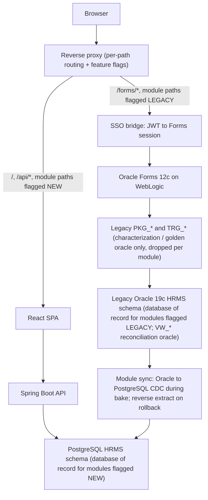
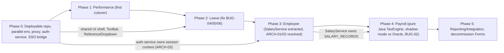
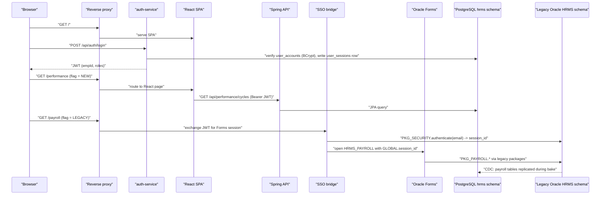

# Cutover Plan: Strangler-Fig Migration from Oracle Forms to Spring Boot + React

Phased plan for replacing the Forms tier module by module while legacy Forms and the new React application run side by side behind one reverse proxy and one identity. Per-area strategy follows [MODERNIZATION_BLUEPRINT.md](MODERNIZATION_BLUEPRINT.md) §8; component targets follow [COMPONENT_MAPPING.md](COMPONENT_MAPPING.md); validation gates are detailed in [TEST_STRATEGY.md](TEST_STRATEGY.md); risks in [RISK_REGISTER.md](RISK_REGISTER.md).

---

## 1. Ordering rationale

Three structural facts from [DEPENDENCY_MAP.md](DEPENDENCY_MAP.md) fix the order:

| Constraint | Evidence | Consequence |
|---|---|---|
| **Auth first.** Every child form starts with `PKG_SECURITY.is_session_valid(TO_NUMBER(:GLOBAL.session_id))` (`HRMS_EMPLOYEE.xml:35`, `HRMS_PAYROLL.xml:28`, `HRMS_LEAVE.xml:25`, `HRMS_PERFORMANCE.xml:23`, `HRMS_COMMON_LIB.pll.sql:134` `check_session`), and `HRMS_MENU`/`HRMS_PAYROLL`/`HRMS_EMPLOYEE` gate actions with `has_permission`. | `DEPENDENCY_MAP.md` §2.4 | No React page can go live until a token that *both* tiers accept exists → the auth service and SSO bridge are Phase 0 deliverables. |
| **ARCH-01: `PKG_EMPLOYEE` ⇄ `PKG_PAYROLL`.** `create_employee` calls `PKG_PAYROLL.create_salary_record`; `PKG_PAYROLL.pks` declares a dependency on `PKG_EMPLOYEE`. Both write `SALARY_RECORDS`. | `DEPENDENCY_MAP.md` §3.1, `TECH_DEBT_REGISTRY.md` ARCH-01 | Neither domain can be cut over cleanly while the other still owns half of `SALARY_RECORDS`. A shared `SalaryService` is extracted **before** Employee (Phase 3) and reused by Payroll (Phase 4). |
| **ARCH-03: `PKG_SECURITY.authenticate` → `PKG_EMPLOYEE.set_session_context`.** | `PKG_SECURITY.pkb:75`, `DEPENDENCY_MAP.md` §3.2 | The new auth service must own session context itself so that legacy `PKG_SECURITY` can be frozen without waiting for the Employee rewrite. |

Additional facts that decide *which* module goes first:

| Module | Cross-domain writes | DB triggers on its tables | Package calls from form | Money / PII | Verdict |
|---|---|---|---|---|---|
| Performance | none (`PKG_PERFORMANCE` → `PKG_AUDIT`, `PKG_NOTIFICATION` only) | none | only `PKG_SECURITY.is_session_valid` | none | **lowest risk – Phase 1** |
| Leave | none (`PKG_LEAVE` → `PKG_AUDIT`, `PKG_NOTIFICATION`) | `TRG_LEAVE_REQUEST_AUDIT` (audit only, currently dropped by `CHK_AUDIT_ACTION`, ARCH-04) | `submit_leave_request`, `cancel_leave_request` | none | self-service, self-contained – Phase 2 |
| Employee | `PKG_EMPLOYEE` → `PKG_PAYROLL.create_salary_record` (ARCH-01); Forms writes `EMPLOYEES` directly (ARCH-02) | `TRG_EMP_BEFORE_INSERT/UPDATE`, `TRG_EMP_INSTEAD_OF_DELETE`, `TRG_SALARY_AUDIT` | `generate_emp_number`, `PKG_VALIDATION.validate_email_format` | SSN (SEC-01) | three write paths – Phase 3 |
| Payroll | reads `SALARY_RECORDS`, `EMPLOYEE_TAX_INFO`, `EMPLOYEE_PAY_ELEMENTS` for every active employee | `TRG_SALARY_AUDIT` | `create_payroll_run`, `calculate_payroll`, `approve_payroll` | money, bank data (SEC-11) | highest complexity, tax correctness (BUG-02) – Phase 4 |
| Reporting / Integration | read-only + outbound files | – | (forms missing) | GL / benefits feeds | after all writers have moved – Phase 5 |

---

## 2. Coexistence architecture

The Spring Boot API never opens a connection to Oracle. Legacy PL/SQL runs on Oracle only, only as the golden oracle for the module currently in parallel run ([TEST_STRATEGY.md](TEST_STRATEGY.md) §3), and each package is dropped when its module exits.

Rules of coexistence:

1. **Two databases, one owner per table group.** The legacy tier reads and writes the Oracle `HRMS` schema; the new tier reads and writes the PostgreSQL `hrms` schema. Every table group (`PERFORMANCE_*`/`GOALS`; `LEAVE_*`; `EMPLOYEES`/`SALARY_RECORDS`/`EMPLOYEE_HISTORY`; `PAY_*`/`PAYROLL_*`) has exactly one **database of record** at any moment, decided by that module's feature flag. Reference tables read by both tiers (`DEPARTMENTS`, `JOB_TITLES`, `JOB_GRADES`, `LOCATIONS`, `HOLIDAYS`, `LEAVE_TYPES`, `PAY_ELEMENTS`, `TAX_BRACKETS`, `SYSTEM_PARAMETERS`) are migrated in Phase 0, remain Oracle-owned (maintained through Forms/admin scripts) and are replicated one-way to PostgreSQL until Phase 5, when the admin UI takes ownership. Rollback is therefore **not** a pure route flip: flipping a flag changes *who writes* **and** *where the data of record is*, so every flip is paired with the sync step in rule 6.
2. **Per-module feature flags in the proxy** (`performance=NEW|LEGACY`, `leave=…`, `employee=…`, `payroll=…`). Rollback for any phase = set the flag back to `LEGACY` **and** run the module's reverse extract (rule 6).
3. **SSO bridge.** After the user authenticates against the new `auth-service`, the bridge obtains a legacy Forms session by calling `PKG_SECURITY.authenticate(email, <ignored>, ip)` (which does not verify a password – SEC-05 – so the bridge is the *only* component allowed to call it, on an internal network) and populates `:GLOBAL.session_id/current_user/current_emp_id` via the Forms servlet's `otherparams`. Legacy `HRMS_LOGIN.xml` is disabled at the proxy from Phase 0 onward.
4. **Sequences are partitioned, not shared.** The 29 `SEQ_*` sequences (`schema/sequences/hrms_sequences.sql`) are re-created on PostgreSQL (`CREATE SEQUENCE … CACHE 1`). Because two databases cannot share a sequence, ids are kept collision-free by ownership + offset: during a module's bake the PostgreSQL sequences for that module are restarted at `MAX(id) + 1` from the final Oracle extract *plus a fixed offset of 1,000,000* so any row created on Oracle during rollback can never collide with a row created on PostgreSQL; `SEQ_EMP_NUMBER` (business-visible `EMP_NUMBER`) is the exception – it is migrated as a plain `MAX+1` restart at Employee cutover and the Forms tier's `EMPLOYEES` block is made read-only at that moment (Phase 3, `employee=NEW_READONLY`). Oracle `CACHE 20` gaps are harmless and expected.
5. **Legacy `VW_*` views stay untouched on Oracle until Phase 5** as the independent reconciliation oracle ([TEST_STRATEGY.md](TEST_STRATEGY.md) §2.3). Equivalent reconciliation queries (`WITH RECURSIVE` for the hierarchy) run against PostgreSQL; the two result sets are diffed.
6. **Per-module data synchronisation and cutover migration.** Each module's cutover follows the same sequence: **(i) Bulk load** – the module's table group is extracted from Oracle (consistent `AS OF SCN` snapshot), transformed per the type/empty-string rules in [MODERNIZATION_BLUEPRINT.md](MODERNIZATION_BLUEPRINT.md) §10 and loaded into PostgreSQL; row counts and per-column checksums must match. **(ii) Bake with one-way CDC Oracle → PostgreSQL** – while the flag is still `LEGACY`, log-based change capture (Debezium Oracle connector or Oracle GoldenGate, decision in Phase 0) keeps the PostgreSQL copy current so the Java path can be exercised in shadow/read-only mode against live data; the Level-3 reconciliation runs nightly across both stores. **(iii) Flip** – a short write freeze on the module's Forms screens (the proxy returns a maintenance page for the module's paths), CDC lag drained to zero, final checksum, flag set to `NEW`, CDC for that table group stopped. PostgreSQL is now the database of record for the module. **(iv) Reverse extract kept warm** – for the module's rollback window (see each phase) a reverse job (PostgreSQL → Oracle, plain JDBC batch keyed on primary key, same type mapping inverted) is tested nightly against a copy of Oracle but *not* applied. **Rollback across two stores** = freeze the module's API paths, run the reverse extract so Oracle holds every row written on PostgreSQL since the flip, verify checksums, set the flag to `LEGACY`, restart one-way CDC. Rollback is measured in minutes-to-an-hour rather than seconds, which is why each phase's bake period is longer than in a single-database plan and why R-11 in [RISK_REGISTER.md](RISK_REGISTER.md) exists. Once the module's rollback window closes, the reverse job is deleted and the module's `PKG_*` package and triggers are dropped from Oracle.

---

## 3. Phase dependency diagram

---

## 4. Phase 0 — Make the repo deployable, stand up the parallel environment, deliver the foundation

**Goal:** a reproducible build of *what exists*, a running legacy Oracle instance for parallel-run (the golden oracle), an empty-but-migrated PostgreSQL target, and the auth/proxy/shared-UI foundation everything else needs.

### 4.1 Entry dependencies

None (starting point). Requires access to an Oracle 19c instance (legacy, coexistence only) and a Forms 12c / WebLogic runtime, plus a PostgreSQL 16+ instance for the target.

### 4.2 Work items

| # | Item | Evidence / gap addressed |
|---|---|---|
| 0.1 | Repair `data/seed/01_reference_data.sql`: `LOCATIONS.PHONE` → `PHONE_NUMBER`; remove `JOB_GRADES.GRADE_LEVEL`, add NOT NULL `GRADE_CODE`; `SYSTEM_PARAMETERS.DESCRIPTION` → `PARAM_DESCRIPTION`. Seed must load without `ORA-00904`. | DATA-01 |
| 0.2 | Write the missing build script (`schema/tables → sequences → views → packages (pks then pkb) → triggers → seed`), run it in CI against a containerised Oracle; report `INVALID` objects. Expect `TRG_EMP_BEFORE_UPDATE` to fail validation against `EMPLOYEE_HISTORY` (BUG-03) – record the result, do not "fix" the trigger (it is retired in Phase 3). | PROC-03, BUG-03 |
| 0.3 | Recover or explicitly retire missing artefacts: `HRMS_REPORTS`, `HRMS_ADMIN`, `HRMS_DEPARTMENT`, `HRMS_LOV`, `HRMS_TOOLBAR` forms; `HRMS_REPORT_LIB.pll`; `.rdf` reports; `DBMS_SCHEDULER` job DDL (accrual, carryover, calibration, notification queue); directory objects (`PAYROLL_OUTPUT`, GL/benefits/time-attendance dirs). Decision recorded per artefact: *recovered from production export* / *re-specified from requirements* / *out of scope*. | PROC-02, [APPLICATION_INVEONTORY.md](APPLICATION_INVEONTORY.md) §8 |
| 0.4 | Regenerate `.fmb/.pll/.mmb` from the XML exports (`frmf2xml` reverse) so the legacy tier can actually be deployed to the parallel environment. | PROC-03 |
| 0.5 | Establish the **golden oracle**: utPLSQL characterization suites for `PKG_SECURITY.authenticate`, `PKG_EMPLOYEE.generate_emp_number`, `PKG_LEAVE.submit_leave_request`, `PKG_PAYROLL.create_payroll_run/calculate_payroll/approve_payroll` against the seeded legacy schema **on Oracle**. This Oracle instance is kept for the whole programme solely to run these suites and the parallel-run/shadow comparisons. | PROC-01, [TEST_STRATEGY.md](TEST_STRATEGY.md) §3 |
| 0.5a | **PostgreSQL target schema**: Flyway migrations translating the 30 tables, 29 sequences and constraints per [MODERNIZATION_BLUEPRINT.md](MODERNIZATION_BLUEPRINT.md) §10 (lower-case identifiers, `NUMERIC`/`TIMESTAMP`/`DATE` mapping, `leave_balances.available GENERATED ALWAYS AS … STORED`, no triggers, no PL/pgSQL); PostgreSQL equivalents of the six `VW_*` reconciliation queries (`WITH RECURSIVE` for the hierarchy) under `tests/reconciliation/pg/`; repaired seed loaded into both databases and `COUNT(*)` per table compared. | Decision (A), [TEST_STRATEGY.md](TEST_STRATEGY.md) §2.3 |
| 0.5b | **Sync tooling**: choose and stand up log-based CDC Oracle → PostgreSQL (Debezium Oracle connector or GoldenGate) and the reverse-extract job template; one-way replication of the reference tables (§2 rule 1) switched on; round-trip smoke test on `HOLIDAYS`. | §2 rule 6, [RISK_REGISTER.md](RISK_REGISTER.md) R-11 |
| 0.6 | Schema additions on **PostgreSQL** (the Oracle schema is never changed except for additive columns needed by the SSO bridge and re-encryption): `user_accounts`, `roles`, `role_permissions`, `user_roles`; `user_sessions.username VARCHAR(100)`; `error_log`; `CHK_AUDIT_ACTION` value `STATUS_CHANGE`; unique index on `LOWER(employees.email)`. On Oracle only: `USER_SESSIONS` write-through columns and `SSN_ENCRYPTED_V2` / `ACCOUNT_NUMBER_ENC_V2`. | SEC-05, SEC-07, DATA-04, ARCH-04, PERF-07 |
| 0.7 | **`auth-service`**: Spring Security, BCrypt/Argon2, JWT/OIDC, `RoleService`, `FieldEncryptionService` with vault-managed key; one-off re-encryption job for `EMPLOYEES.SSN_ENCRYPTED` and `EMPLOYEE_BANK_ACCOUNTS.ACCOUNT_NUMBER_ENC` (decrypt with legacy literal key, encrypt with vault key; legacy `decrypt_ssn` then returns `***DECRYPT_ERROR***` by design). Initial role assignment seeded from the grade rule (`GRADE_ID ≥ 8` → all, `≥ 5` → viewer). | SEC-01, SEC-02, SEC-05, SEC-07, SEC-08 |
| 0.8 | Reverse proxy with per-module flags, SSO bridge, `USER_SESSIONS` write-through to Oracle (the one place the bridge, not the API, touches the legacy database) for audit parity. Legacy `HRMS_LOGIN` route disabled. | – |
| 0.9 | React app shell: `AuthContext`, `ProtectedRoute`, `Toolbar`, `useErrorHandler`, `ReferenceDropdown`, `HomePage` replacing `HRMS_MENU`. `reference` endpoints for departments, job titles, locations, leave types, active employees. | [COMPONENT_MAPPING.md](COMPONENT_MAPPING.md) §2, §3.3, §7 |
| 0.10 | Shared Spring modules: `hrms-common`, `hrms-validation` (+ schema export), `hrms-audit`, `hrms-notification`. `SystemParameterService` reads `SYSTEM_PARAMETERS`. | VAL-02/03/06, ARCH-04/05 |

### 4.3 Rollback strategy

- Proxy flag `auth=LEGACY` re-enables the `HRMS_LOGIN` route; users authenticate the old way. Because Phase 0 changes to the Oracle schema are additive, nothing has to be dropped; the PostgreSQL schema is not yet a database of record for anything, so it can be rebuilt freely.
- **Exception – re-encryption (0.7) is one-way once the legacy key is retired.** Run it in two steps: (i) dual-write new ciphertext into new columns `SSN_ENCRYPTED_V2` / `ACCOUNT_NUMBER_ENC_V2`, (ii) switch readers, (iii) drop old columns only in Phase 5. Rollback before (iii) = point readers back at the old columns.

### 4.4 Acceptance criteria

| Level | Criterion |
|---|---|
| Unit | `auth-service` tests: BCrypt verify, JWT issue/verify/expiry from `SYSTEM_PARAMETERS.SECURITY.SESSION_TIMEOUT_MIN`, role resolution reproduces `has_permission` truth table for grades 1–10 × modules × actions. `FieldEncryptionService` round-trip; migration verifies `decrypt_legacy(x) == decrypt_v2(x')` for all 24 seed employees. |
| API contract diff | Not applicable to auth (legacy has no comparable API). Instead: SSO bridge smoke test – token → Forms session → `HRMS_MENU` opens with correct `:GLOBAL.current_emp_id` for each seed user. |
| Data reconciliation | Seed loads clean on **both** databases; `SELECT COUNT(*)` matches [DATA_DICTIONARY.md](DATA_DICTIONARY.md) §8 (24 `EMPLOYEES`, 23 active `SALARY_RECORDS`, 10 `DEPARTMENTS`, 3 `LOCATIONS`, 6 `LEAVE_TYPES`, 11 `PAY_ELEMENTS`, 10 `HOLIDAYS`) on Oracle and PostgreSQL; all six Oracle `VW_*` views compile and return rows and their PostgreSQL equivalent queries return identical result sets over the seed; utPLSQL golden suites green and their outputs committed as fixtures; CDC round-trip on `HOLIDAYS` shows zero lag. |
| Process | CI builds the Oracle schema from scratch and runs utPLSQL; `INVALID` object list is empty except the documented `TRG_EMP_BEFORE_UPDATE` (BUG-03). CI builds the PostgreSQL schema with Flyway and runs the reconciliation queries. |

---

## 5. Phase 1 — Performance (first cutover)

### 5.1 Why Performance is the safest first cutover

- **Read-mostly.** `HRMS_PERFORMANCE.xml` calls *no* `PKG_PERFORMANCE` procedure; the form only queries `REVIEW_CYCLES`, `PERFORMANCE_REVIEWS`, `PERFORMANCE_GOALS` and allows base-table edits on two blocks ([COMPONENT_MAPPING.md](COMPONENT_MAPPING.md) §6).
- **Self-contained.** `PKG_PERFORMANCE` depends only on `PKG_AUDIT` and `PKG_NOTIFICATION` (`DEPENDENCY_MAP.md` §2.7); no other package writes its three tables; no DB triggers exist on them (`DATA_DICTIONARY.md` §7).
- **Single external dependency** is `PKG_SECURITY.is_session_valid`, which Phase 0 has already replaced.
- **No cross-domain writes, no money, no PII beyond names.** A wrong write affects a review, not a paycheck or a legal record.
- **Cheap reconciliation.** Three tables, `VW_PENDING_APPROVALS` (`PERFORMANCE` rows) as the oracle.

### 5.2 Entry dependencies

Phase 0 complete: auth-service, proxy flags, app shell, `hrms-audit`, `hrms-notification`, golden oracle.

### 5.3 Work items

`performance-service` (`ReviewCycleService`, `PerformanceReviewService`, `GoalService`, entities on `REVIEW_CYCLES` / `PERFORMANCE_REVIEWS` / `PERFORMANCE_GOALS` with `SEQ_REVIEW_CYCLE` / `SEQ_PERF_REVIEW` / `SEQ_PERF_GOAL`), React `performance/*` pages, state-machine enforcement (`-20401/-20402/-20403`), `generate_reviews_for_cycle` set-based, manager dashboard endpoints (`get_team_reviews`, `get_rating_distribution`). Proxy flag `performance=NEW`.

### 5.4 Rollback strategy

- Flag `performance=LEGACY` → `HRMS_PERFORMANCE` via SSO bridge, preceded by the §2 rule 6 reverse extract of `REVIEW_CYCLES` / `PERFORMANCE_REVIEWS` / `PERFORMANCE_GOALS` back to Oracle so Forms sees the rows written on PostgreSQL.
- No dual-write: exactly one database of record at a time. During the bake period (4 weeks recommended – longer than a single-database plan because rollback involves a data move) the React tier is **read-write for reviews/goals but read-only for cycle admin**; `open/close/generate` are done by HR in the Java `ReviewCycleService` behind an `ADMIN`-only flag, never via legacy `PKG_PERFORMANCE`, which by now only serves as the golden oracle. Cycle admin flips to NEW at the end of the bake.

### 5.5 Acceptance criteria

| Level | Criterion |
|---|---|
| Unit | JUnit: review status transitions match `PKG_PERFORMANCE` (`submit_self_assessment`, `submit_manager_review`, `acknowledge_review`); rating bounds; `get_rating_label` table; goal auto-`COMPLETED` at 100 %. |
| API contract diff | Replay the golden fixtures for `create_review_cycle`, `open_review_cycle`, `create_review`, `submit_*`, `add_goal`, `update_goal_progress` through legacy utPLSQL and `POST /api/performance/*`; row-level diff of the three tables (excluding audit columns) is empty; error codes identical. |
| Data reconciliation | Nightly: `COUNT(*)` and `COUNT(*) GROUP BY STATUS` for the three tables and `VW_PENDING_APPROVALS WHERE APPROVAL_TYPE='PERFORMANCE'` equal between a legacy-written and a React-written copy of the same scenario script; `AVG(OVERALL_RATING)` per cycle equal to 1 dp. |
| Exit | 4-week bake with flag NEW for all users, zero rollbacks, `HRMS_PERFORMANCE` route removed from the proxy, `PKG_PERFORMANCE` dropped from Oracle and the reverse-extract job deleted. |

---

## 6. Phase 2 — Leave

### 6.1 Entry dependencies

Phase 1 exit (proves the shell, auth, audit and notification modules under real load). `ReferenceDropdown` for `RG_LEAVE_TYPES`. `hrms-common.BusinessCalendar` with observed-holiday support.

### 6.2 Work items

`leave-service` (`LeaveRequestService`, `LeaveBalanceService`, `LeaveAccrualJob`), React `leave/*` pages (My Requests, Submit Request, Balances; plus Approvals and Team Calendar from package procedures with no form source). Server-side "mine" filtering from the JWT `empId` replaces `DEFAULT_WHERE 'EMP_ID = ' || :GLOBAL.current_emp_id` ([COMPONENT_MAPPING.md](COMPONENT_MAPPING.md) §5).

**Deliberate behaviour changes (agreed "fix", see [TEST_STRATEGY.md](TEST_STRATEGY.md) §4):**

| Bug | Legacy behaviour | New behaviour |
|---|---|---|
| BUG-04 `expire_carryover` | `ADJUSTMENT := ADJUSTMENT − CARRYOVER_FROM_PREV` regardless of how much carryover was already used → over-deduction | Deduct `GREATEST(0, CARRYOVER_FROM_PREV − USED_FROM_CARRYOVER)`; idempotent via `LEAVE_ACCRUAL_LOG` |
| BUG-05 `calculate_business_days` / `PKG_COMMON.is_business_day` | Weekend holidays not shifted to observed weekday | Observed date computed (Sat→Fri, Sun→Mon) or stored in `HOLIDAYS` |
| BUG-06 `check_leave_overlap` | AM + PM half-days on the same day reported as overlap | `HALF_DAY_PERIOD` included in the predicate |
| VAL-05 (`VW_LEAVE_SUMMARY.AVAILABLE`) | View omits `− PENDING` | API and UI use the table's virtual column (`− PENDING`); view left unchanged until Phase 5 and reconciled with the documented offset |

Scheduler replacement: `run_monthly_accrual`, `process_carryover`, `expire_carryover` become Spring scheduled jobs (no `DBMS_SCHEDULER` DDL exists to migrate – PROC-02).

### 6.3 Rollback strategy

- Flag `leave=LEGACY` → `HRMS_LEAVE` via SSO bridge, preceded by the §2 rule 6 reverse extract of `LEAVE_REQUESTS` / `LEAVE_BALANCES` / `LEAVE_ACCRUAL_LOG` to Oracle.
- Load / extract order is `leave_balances`, `leave_requests`, `leave_accrual_log` (`TableGroup.LEAVE`); `LEAVE_BALANCES.AVAILABLE` is computed on both sides (Oracle virtual column / PostgreSQL `GENERATED ALWAYS … STORED`) and is excluded from the keyed upsert and the MERGE (`TableGroup.GENERATED_COLUMNS`). `SEQ_LEAVE_BALANCE/REQUEST/ACCRUAL` are restarted at MAX(pk)+1 after the load. PostgreSQL leg covered by `tools/cdc-sync` `LeaveCutoverTest`; Oracle legs are `untested-live` (no Oracle in this programme).
- **Dual-write is not used**; PostgreSQL is the sole database of record once the flag is NEW. Because the React tier fixes BUG-06, a request pair (AM + PM) created in NEW would be *rejected as overlapping* by legacy `check_leave_overlap` if, after a rollback, the user tries to add a third request via Forms – acceptable, documented for support.
- Scheduled jobs: legacy `DBMS_SCHEDULER` jobs are absent from the repo; whichever job runs in production (if any) must be **disabled before** the Spring job is enabled to avoid double accrual. Rollback = disable Spring job, re-enable legacy job. `LEAVE_ACCRUAL_LOG` provides the idempotency check either way.

### 6.4 Acceptance criteria

| Level | Criterion |
|---|---|
| Unit | JUnit golden tests for `businessDays()` (incl. observed holidays – **asserting the corrected value**), overlap predicate (incl. AM/PM same day = no overlap), balance check against `AVAILABLE − PENDING`, tenure rule, 5-days-in-the-past rule, full `-2020x/-2021x` error contract. |
| API contract diff | Replay `submit_leave_request` / `approve` / `reject` / `cancel` golden fixtures; diff must be empty **except** for the enumerated BUG-04/05/06 cases, which must differ *exactly* as predicted by the fixture's `expected_new` column. |
| Data reconciliation | `VW_LEAVE_SUMMARY`: per `(EMP_ID, LEAVE_TYPE)` `OPENING_BALANCE`, `ACCRUED`, `USED`, `PENDING` equal old vs new; `AVAILABLE` differs by exactly `PENDING` (documented VAL-05 offset). `COUNT(*) GROUP BY STATUS` on `LEAVE_REQUESTS` equal. `VW_PENDING_APPROVALS WHERE APPROVAL_TYPE='LEAVE'` equal. |
| Exit | One full monthly accrual cycle run by the Spring job with `LEAVE_ACCRUAL_LOG` reconciled; `HRMS_LEAVE` route removed; `PKG_LEAVE` dropped from Oracle. |

---

## 7. Phase 3 — Employee

### 7.1 Entry dependencies

- Phase 2 exit.
- **`salary-module` extracted and live** (`SalaryService` = single owner of `SALARY_RECORDS`, "exactly one `ACTIVE_FLAG='Y'` row per employee" invariant, `TRG_SALARY_AUDIT` behaviour via `AuditService`). This is the ARCH-01 pre-condition: after this phase, `PKG_EMPLOYEE.create_employee → PKG_PAYROLL.create_salary_record` is no longer on any live path.
- `auth-service` owns session context (ARCH-03 pre-condition met in Phase 0), so `PKG_EMPLOYEE.set_session_context` has no remaining caller once `PKG_SECURITY.authenticate` is used only by the SSO bridge.
- VAL-01 decision made (single hire-date limit).

### 7.2 Work items

`employee-service` + React `employees/*` per [COMPONENT_MAPPING.md](COMPONENT_MAPPING.md) §3. Specifically the **multi-write-path reconciliation (ARCH-02)**:

| Legacy write path | Rule it carried | Where the rule lives after Phase 3 |
|---|---|---|
| `HRMS_EMPLOYEE` base-table DML + `PRE-INSERT` / `WHEN-VALIDATE-ITEM` | `EMP_NUMBER` generation, defaults, 90-day hire rule, e-mail format, active dept/job | `EmployeeService.create()`, `EmployeeNumberGenerator` (`SEQ_EMP_NUMBER`), `hrms-validation` |
| `TRG_EMP_BEFORE_INSERT` | defaults, **180-day** hire rule (`-20501`), active-e-mail uniqueness (`-20502`) | Bean Validation + `EmployeeRepository.existsByEmailIgnoreCaseAndActiveFlag` + unique function index |
| `TRG_EMP_BEFORE_UPDATE` | `-20503` no direct reactivation; history rows (broken, BUG-03) | `EmployeeService.update/transfer/promote/terminate/rehire` + `EmployeeHistoryService` writing real columns |
| `TRG_EMP_INSTEAD_OF_DELETE` | `-20504` no physical delete | No delete endpoint; `terminate()` only |
| `PKG_EMPLOYEE.*` | history, notifications, circular-manager check, salary creation | `EmployeeService` (+ `SalaryService` for salary) |

`search_employees` dynamic SQL (SEC-03) replaced by JPA `Specification`. `terminate()` revokes sessions (BUG-07).

### 7.3 Rollback strategy

- Flag `employee=LEGACY` → `HRMS_EMPLOYEE` via SSO bridge, preceded by the §2 rule 6 reverse extract of `EMPLOYEES` / `SALARY_RECORDS` / `EMPLOYEE_HISTORY` / `EMPLOYEE_BANK_ACCOUNTS` to Oracle. **Oracle triggers stay enabled throughout Phase 3** so a rollback to Forms still has its trigger-level safety net; they are dropped only at Phase 3 exit. PostgreSQL never has these triggers.
- **Read-only fallback:** the React employee pages ship first in *read-only* mode (search + detail) with the flag `employee=NEW_READONLY`; writes still go to Forms. Only after read-side reconciliation passes are writes enabled.
- **Dual-write** for `EMPLOYEES` is *not* used (two writers + triggers is the problem being removed). Instead the bake period is short (2 weeks) and reversible by flag + reverse extract.
- `EMPLOYEE_HISTORY`: legacy trigger writes are (likely) failing today (BUG-03), so there is no legacy history stream to reconcile against; new history rows are simply additive.

### 7.4 Acceptance criteria

| Level | Criterion |
|---|---|
| Unit | JUnit: `EmployeeNumberGenerator` yields `EMP-000100` after seed (legacy `MAX()+1` over the non-contiguous seed numbers `EMP-000001 … EMP-000099` gives the same value, so the golden fixture matches) and is gap-tolerant; concurrency test (50 parallel creates, zero `UK_EMP_NUMBER` violations – **BUG-01 fixed**); every `-2000x/-2001x/-2050x` rule; hire-date limit at the agreed value ±1 day; e-mail uniqueness on update; `-20503` and `-20504` invariants; acyclic-manager check rejects a 3-node loop. |
| API contract diff | Replay `create_employee`, `update_employee`, `transfer_employee`, `promote_employee`, `terminate_employee`, `rehire_employee` golden fixtures; diff of `EMPLOYEES` and `SALARY_RECORDS` rows empty (excluding `EMP_NUMBER` value, which is asserted by *format*, and audit columns); error codes identical except the VAL-01 case, which must match the agreed limit. |
| Data reconciliation | `VW_ACTIVE_EMPLOYEES`: `COUNT(*)`, `COUNT GROUP BY DEPT_ID, LOCATION_CODE, EMPLOYMENT_STATUS` equal. `VW_EMPLOYEE_COMPENSATION`: per employee `BASE_SALARY`, `GRADE_MIDPOINT`, `COMPA_RATIO` equal to 1 dp; exactly one `ACTIVE_FLAG='Y'` salary row per active employee. `VW_ORG_HIERARCHY`: same row count, same `MAX(ORG_LEVEL)`, same `ORG_PATH` per `EMP_ID`, and the view **completes without `ORA-01436`** after scenario runs. |
| Exit | Triggers `TRG_EMP_*` dropped; `PKG_EMPLOYEE` marked deprecated (still compiled for `PKG_PAYROLL.pks` header until Phase 4); `HRMS_EMPLOYEE` route removed. |

---

## 8. Phase 4 — Payroll

### 8.1 Entry dependencies

- Phase 3 exit: `SalaryService` is the only writer of `SALARY_RECORDS`; `EmployeeService` is the only writer of `EMPLOYEES`. The ARCH-01 cycle is broken because the Java `payroll-service` depends on `salary-module`, never on `employee-service`.
- `TAX_BRACKETS` populated for every tax year and filing status in scope (today the table exists but has no reader and no seed rows – DATA-05).
- Golden payroll fixtures from Phase 0 (utPLSQL against `create_payroll_run` / `calculate_payroll` / `approve_payroll`) for **2024** periods.

### 8.2 Work items — Java engine only

There is no hybrid façade sub-phase: the new system never calls `PKG_PAYROLL` ([MODERNIZATION_BLUEPRINT.md](MODERNIZATION_BLUEPRINT.md) §4.3). Payroll operators stay on `HRMS_PAYROLL` (Oracle) until the Java engine passes shadow mode.

| Item | Scope | Rationale |
|---|---|---|
| **Java engine** | `TaxEngine` reading `TAX_BRACKETS` (federal progressive, state by table not `CASE`, FICA/Medicare with wage base), `PayrollRunService.createRun() / calculate() / approve()` with `calculate()` as a restartable Spring Batch job (replaces cursor loop + `COMMIT` every 50 – PERF-01/02), `PayslipService` with real YTD (BUG-08), `PayRegisterExporter` (replaces `UTL_FILE` to undefined `PAYROLL_OUTPUT` – SEC-11/ARCH-05). Element IDs 100–103 kept as constants validated at startup against `PAY_ELEMENTS`. | Fixes BUG-02; the hard-coded 2024 brackets and `ELSE 0.05` state default are the correctness risk that justifies the rewrite. |
| **API + UI** | `PayrollController`; JPA entities for `PAY_PERIODS`, `PAYROLL_RUNS`, `PAYROLL_DETAILS` on PostgreSQL; React `payroll/*` pages; `PAYROLL:VIEW` / `PAYROLL:APPROVE` authorities. | Goes live for operators only when the engine flag is promoted (below). |
| **Shadow harness** | `PayrollShadowRunner`: on every legacy run (detected via CDC of `PAYROLL_RUNS` on Oracle), replays the same period against the Java engine on the PostgreSQL copy and writes to `payroll_details_shadow`; diff report per `(RUN, EMP_ID, ELEMENT_ID)`. | The shadow-mode gate is the **sole** payroll cutover gate. |

### 8.3 Rollback strategy

- **Shadow mode is the gate.** *Engine* flag `payroll.engine=LEGACY|JAVA`. Every run is calculated by **both** engines – legacy `PKG_PAYROLL` on Oracle (the golden oracle), Java on the CDC-synchronised PostgreSQL copy; Java results go to `payroll_details_shadow`; only the legacy result is approved/paid. Promotion to `JAVA` (and `payroll=NEW` for the UI, flipped together per §2 rule 6) only after N ≥ 3 consecutive real periods with zero cents difference for 2024-rule inputs and *explained* differences (bracket-table vs hard-coded) for non-2024 inputs, signed off by Payroll.
- **Rollback after promotion:** `payroll.engine=LEGACY` + `payroll=LEGACY`, then the §2 rule 6 reverse extract of `PAY_PERIODS`/`PAYROLL_RUNS`/`PAYROLL_DETAILS` back to Oracle so `HRMS_PAYROLL` and `PKG_PAYROLL` (kept on Oracle through the rollback window) see every run. Rollback window: three production periods.
- **Read-only fallback:** payslip and register endpoints are read-only over `PAYROLL_DETAILS` on PostgreSQL and can stay on NEW even if the engine is rolled back (CDC re-enabled Oracle → PostgreSQL).
- A run approved by the Java engine can be reversed with the existing `reverse_payroll` semantics (`STATUS='REVERSED'`), so even a post-approval rollback follows the legacy correction process.

### 8.4 Acceptance criteria

| Level | Criterion |
|---|---|
| Unit | JUnit golden tests: `TaxEngine.federal(taxable, filingStatus, allowances, frequency)` equals `calculate_federal_tax` for 2024 inputs at bracket boundaries (11 600 / 47 150 / 100 525 / 191 950 / 243 725 / 609 350 single; 23 200 / 94 300 / 201 050 / 383 900 / 487 450 / 731 200 joint) and for each pay frequency (52/26/24/12); state rates for CA/NY/TX/FL/WA/IL/PA/OH/NJ/MA match the legacy `CASE`; **unknown state throws `MISSING_TAX_RATE` instead of defaulting to 5 %** (corrected behaviour, BUG-02); FICA/Medicare with wage-base cap; gross by frequency from `BASE_SALARY`; `-20101…-20104` contract; run status machine. |
| API contract diff | Replay `create_payroll_run → calculate_payroll → approve_payroll` fixtures (legacy on Oracle, Java on PostgreSQL) for the 24 seed employees / 23 salary rows across `MONTHLY`, `BIWEEKLY` periods; per `(RUN, EMP_ID, ELEMENT_ID)` `AMOUNT` diff = 0.00 for 2024; `PAYROLL_RUNS.TOTAL_GROSS/TOTAL_NET/EMPLOYEE_COUNT` equal; `STATUS='ERROR'` detail rows identical in count and `EMP_ID`. |
| Data reconciliation | Oracle `VW_PAYROLL_LATEST` vs its PostgreSQL equivalent query: per employee `GROSS_PAY`, `TOTAL_TAXES`, `TOTAL_DEDUCTIONS`, `NET_PAY` equal to the cent between legacy-engine and Java-engine runs of the same period; `SUM(NET_PAY)` equal; sign convention (earnings +, taxes/deductions −) preserved so the view's `SUM(AMOUNT)` still yields net. |
| Shadow gate | ≥ 3 consecutive real production periods in shadow mode with 0.00 difference on 2024-rule inputs and every other difference explained and signed off by Payroll; `payroll.engine=JAVA` and `payroll=NEW` flipped together with the §2 rule 6 cutover migration. |
| Exit | Three consecutive production periods approved from the Java engine on PostgreSQL; rollback window closed; `PKG_PAYROLL` and `PKG_EMPLOYEE` dropped from Oracle (cycle gone); `HRMS_PAYROLL` route removed. |

---

## 9. Phase 5 — Reporting / Integration and Forms decommission

### 9.1 Entry dependencies

Phases 1–4 exited: all writers are Java on PostgreSQL; every domain table group has PostgreSQL as its database of record; legacy packages `PKG_PERFORMANCE`, `PKG_LEAVE`, `PKG_EMPLOYEE`, `PKG_PAYROLL` are already dropped and `PKG_SECURITY` has no live callers except the SSO bridge (which is no longer needed).

### 9.2 Work items

| Item | Notes |
|---|---|
| `reporting-service` – pure Java rewrite of `PKG_REPORTING` (JPA/SQL queries on PostgreSQL → JSON/CSV endpoints); no ref-cursor JDBC bridge to the package | `PKG_REPORTING` ref-cursor procedures are characterised on Oracle and used as the row-for-row oracle for each endpoint, then dropped. Only now may the reconciliation query definitions change: fix `AVAILABLE` to subtract `PENDING` in the PostgreSQL leave-summary query (VAL-05) and keep the cycle guard in the `WITH RECURSIVE` org-hierarchy query, *after* the reconciliation harness has been re-baselined. |
| `HRMS_REPORTS` / `HRMS_ADMIN` replacements | **No source exists** (PROC-02). Built from requirements: report catalogue from `PKG_REPORTING.pks` procedure list; admin = role management (new), `SYSTEM_PARAMETERS` editor, reference-data maintenance (`DEPARTMENTS`, `JOB_TITLES`, `LOCATIONS`, `HOLIDAYS`, `LEAVE_TYPES`, `PAY_ELEMENTS`, `TAX_BRACKETS`). |
| `integration-service` | GL feed and benefits feed writers replacing `PKG_INTEGRATION`'s `UTL_FILE` output to undefined directory objects; time-attendance import must be specified (legacy parses nothing – BUG-08). |
| Reference-data ownership | Stop the one-way reference-table replication (§2 rule 1); the admin UI on PostgreSQL becomes the owner of `DEPARTMENTS`, `JOB_TITLES`, …, `TAX_BRACKETS`, `SYSTEM_PARAMETERS`. |
| Decommission | Remove proxy routes to Forms; shut down WebLogic Forms; drop `TRG_*`, remaining `PKG_*` (`PKG_SECURITY`, `PKG_REPORTING`, `PKG_INTEGRATION`, `PKG_COMMON`, `PKG_AUDIT`, `PKG_VALIDATION`, `PKG_NOTIFICATION`), `USER_SESSIONS` write-through; take a final read-only export of the Oracle schema (including the six `VW_*` views' last output as `tests/golden/views-baseline.csv`) and decommission the legacy Oracle instance; drop legacy `SSN_ENCRYPTED` / `ACCOUNT_NUMBER_ENC` columns on PostgreSQL (re-encryption step iii); archive the XML exports. |

### 9.3 Rollback strategy

Reporting is read-only – rollback is re-pointing report consumers at the previous endpoint (Oracle Reports / ref cursors, which stay callable until the Oracle instance is decommissioned). Forms decommission is gated on a 30-day period in which the proxy has *zero* legacy hits (proxy access logs are the evidence); WebLogic is stopped but not deleted for a further 30 days.

### 9.4 Acceptance criteria

| Level | Criterion |
|---|---|
| Unit | Report query tests against the seeded PostgreSQL schema; admin CRUD validation. |
| API contract diff | `PKG_REPORTING` ref-cursor outputs (Oracle) vs new `reporting-service` endpoints (PostgreSQL), row-for-row, for each report. |
| Data reconciliation | Final full pass of all six Oracle views vs their PostgreSQL equivalent queries (see [TEST_STRATEGY.md](TEST_STRATEGY.md) §2.3) before the query definitions are changed; post-change re-baseline committed. |
| Exit | No Forms process running; no PL/SQL anywhere in the target; legacy Oracle instance decommissioned; repo `plsql/` and `forms/` moved to `legacy/` with a README pointer. |

---

## 10. Phase summary

| Phase | Scope | Entry dependency | Rollback | Key acceptance gate |
|---|---|---|---|---|
| 0 | Deployable repo, parallel env (Oracle legacy + PostgreSQL target), auth-service, proxy + SSO bridge, shared modules, golden oracle on Oracle, CDC tooling, reference-data load | – | `auth=LEGACY` flag; re-encryption dual-column | Seed loads on both databases (DATA-01), utPLSQL golden suites committed, SSO bridge smoke, CDC round-trip smoke |
| 1 | Performance | Phase 0 | `performance=LEGACY` | 3-table + `VW_PENDING_APPROVALS` reconciliation, 4-week bake |
| 2 | Leave (fix BUG-04/05/06) | Phase 1 | `leave=LEGACY`; job swap | `VW_LEAVE_SUMMARY` reconciliation with documented `PENDING` offset; one accrual cycle |
| 3 | Employee (ARCH-02 reconciliation, `SalaryService` breaks ARCH-01) | Phase 2 + `salary-module` | `employee=NEW_READONLY` → `LEGACY`; triggers kept until exit | `VW_ACTIVE_EMPLOYEES`, `VW_EMPLOYEE_COMPENSATION`, `VW_ORG_HIERARCHY` reconciliation; BUG-01 concurrency test |
| 4 | Payroll (pure Java `TaxEngine` / `PayrollRunService`, BUG-02; no hybrid façade) | Phase 3 + `TAX_BRACKETS` populated | `payroll.engine=LEGACY` shadow mode; post-promotion reverse extract | Shadow-mode gate (≥ 3 periods, 0.00 diff); `VW_PAYROLL_LATEST` to-the-cent; 3 production periods on PostgreSQL |
| 5 | Reporting/Integration (pure Java), Forms and Oracle decommission | Phases 1–4 | Read-only re-point; 30-day zero-hit gate | Final six-view reconciliation, no PL/SQL in target |

### 10.1 Phase status

| Phase | Status | Promoted revision | Gate | Record |
|---|---|---|---|---|
| 0 | PROMOTED 2026-09-21 — no end-user traffic moved, proxy still routes all modules to Forms | `ea5925e4d8030755e53985d7d7e5b9de511fadce` | L1 + L2 + L3 + Playwright PASS (golden-oracle OFF); `P0.security-signoff` approved | [cutover-log/p0-foundation.md](cutover-log/p0-foundation.md) |
| 1 | PROMOTED 2026-09-22 — proxy flag `performance=NEW` flip, Forms `HRMS_PERFORMANCE` retirement and `PKG_PERFORMANCE` drop (after bake) unblocked for humans; not yet executed | `3bae336d587884f15dee4689538f3a1b99759dae` | L1 + L2 + L3 + Playwright PASS (golden-oracle OFF); `P1.bake-4-weeks` approved | [cutover-log/p1-performance.md](cutover-log/p1-performance.md) |
| 2 | PROMOTED 2026-09-22 — proxy flag `leave=NEW` flip, Forms `HRMS_LEAVE` retirement, and `PKG_LEAVE` + `TRG_LEAVE_REQUEST_AUDIT` drop (after the accrual cycle) unblocked for humans; not yet executed | `94933cdbe78201bab64b3470cd23b1bf666e8cd2` | L1 + L2 + L3 + Playwright PASS (golden-oracle OFF); `P2.accrual-cycle` approved | [cutover-log/p2-leave.md](cutover-log/p2-leave.md) |
| 3 | PROMOTED 2026-09-22 — proxy flag `employee=NEW_READONLY` then `NEW`, Forms `HRMS_EMPLOYEE` retirement, and `TRG_EMP_*` + `TRG_SALARY_AUDIT` + `PKG_EMPLOYEE` drop (after approval) unblocked for humans; not yet executed | `61ea0aca841ebee67ddcb0e94a5b1bb7e33eda74` | L1 + L2 + L3 + Playwright PASS (golden-oracle OFF); `P3.readonly-then-write-bake` approved | [cutover-log/p3-employee.md](cutover-log/p3-employee.md) |
| 4 | PROMOTED 2026-09-23 — `payroll.engine=JAVA` + `payroll=NEW` flipped together (after `P4.shadow-gate`), Forms `HRMS_PAYROLL` retirement, and `PKG_PAYROLL` drop (after `P4.rollback-window-closed`) unblocked for humans; not yet executed | `2fd78acd495b5adebaa7117ae16ef46c9666774a` | L1 + L2 + L3 + Playwright PASS (golden-oracle OFF); `P4.shadow-gate` and `P4.rollback-window-closed` approved | [cutover-log/p4-payroll.md](cutover-log/p4-payroll.md) |

---

## Sources

- [APPLICATION_INVEONTORY.md](APPLICATION_INVEONTORY.md) – §8 missing artefacts (Phase 0 recovery list).
- [DEPENDENCY_MAP.md](DEPENDENCY_MAP.md) – §2.4 form→package edges, §2.7 package graph, §3.1–3.3 cycles (ordering constraints).
- [DATA_DICTIONARY.md](DATA_DICTIONARY.md) – §6 views used as reconciliation oracles, §7 triggers, §8 seed counts.
- [TECH_DEBT_REGISTRY.md](TECH_DEBT_REGISTRY.md) – SEC-*, BUG-01/02/03/04/05/06/07/08, VAL-01/05/06, ARCH-01…05, DATA-01/04/05, PERF-01/02/07, PROC-01/02/03.
- [README.md](README.md) – deployment notes and known issues.
- [MODERNIZATION_BLUEPRINT.md](MODERNIZATION_BLUEPRINT.md), [COMPONENT_MAPPING.md](COMPONENT_MAPPING.md), [TEST_STRATEGY.md](TEST_STRATEGY.md), [RISK_REGISTER.md](RISK_REGISTER.md) – companion documents.
- `forms/xml-exports/*.xml`, `plsql/packages/PKG_SECURITY.pkb`, `PKG_EMPLOYEE.pkb`, `PKG_PAYROLL.pkb`, `PKG_LEAVE.pkb`, `PKG_PERFORMANCE.pkb`, `plsql/triggers/trg_employees.sql`, `data/seed/*.sql`.
