# HRMS Data Dictionary

Derived from the four DDL scripts in `schema/tables/`, plus `schema/views/hrms_views.sql` and
`schema/sequences/hrms_sequences.sql`. Every `CREATE TABLE` in the repository is documented here.

**Actual counts: 30 tables, 6 views, 29 sequences.** The README claims 42 tables and 15 views; those extra
objects do not exist in the repository. No `schema/indexes` or `schema/constraints` directories exist despite
being listed in the README — all constraints are inline in the `CREATE TABLE` statements and no explicit
indexes are defined anywhere (FK columns are therefore unindexed).

Column-table legend: **Null** = `N` for `NOT NULL`, `Y` for nullable. **Key** = `PK`, `FK -> TABLE(COL)`,
`UK <name>` (unique), `CHK` (check constraint). Schema prefix `HRMS.` omitted.

---

## 1. Shared conventions

| Convention | Observed implementation | Deviations |
|---|---|---|
| Surrogate keys via sequences | Every table except `LOCATIONS` (natural key `LOCATION_CODE`) has a numeric `*_ID` primary key. 29 sequences exist in `hrms_sequences.sql`; nothing in the DDL binds them (no `DEFAULT seq.NEXTVAL`, no identity columns, no PK triggers) — callers must invoke `NEXTVAL` explicitly. | `EMPLOYEE_TAX_INFO.TAX_INFO_ID` and `EMPLOYEE_BANK_ACCOUNTS.BANK_ACCT_ID` have **no** sequence. `SEQ_LOCATION` exists but `LOCATIONS` has no numeric key. `SEQ_EMP_NUMBER` exists but `PKG_EMPLOYEE.generate_emp_number` uses `MAX()+1`. Seed scripts insert literal IDs. |
| `ACTIVE_FLAG` soft delete | `ACTIVE_FLAG CHAR(1) DEFAULT 'Y' NOT NULL` on 16 of 30 tables; only `DEPARTMENTS` has a `CHECK (ACTIVE_FLAG IN ('Y','N'))` (`CHK_DEPT_ACTIVE`). `TRG_EMP_INSTEAD_OF_DELETE` blocks physical deletes on `EMPLOYEES`. | No `ACTIVE_FLAG` on: `EMPLOYEE_HISTORY`, `PAY_PERIODS`, `PAYROLL_RUNS`, `PAYROLL_DETAILS`, `LEAVE_BALANCES`, `LEAVE_REQUESTS`, `LEAVE_ACCRUAL_LOG`, `REVIEW_CYCLES`, `PERFORMANCE_REVIEWS`, `PERFORMANCE_GOALS`, `AUDIT_LOG`, `SYSTEM_PARAMETERS`, `NOTIFICATION_QUEUE`, `USER_SESSIONS` (these use `STATUS` columns or are append-only). `EMPLOYEES` carries both `ACTIVE_FLAG` and `EMPLOYMENT_STATUS`, which are maintained independently. |
| Audit columns | `CREATED_BY VARCHAR2(30) NOT NULL`, `CREATED_DATE DATE DEFAULT SYSDATE NOT NULL`, `MODIFIED_BY VARCHAR2(30)`, `MODIFIED_DATE DATE`. | Append-only tables carry only `CREATED_*`: `EMPLOYEE_HISTORY`, `PAYROLL_DETAILS`, `TAX_BRACKETS`, `LEAVE_ACCRUAL_LOG`, `HOLIDAYS`, `NOTIFICATION_QUEUE`, `LOOKUP_VALUES`. `AUDIT_LOG` uses `CHANGED_BY/CHANGED_DATE`. `USER_SESSIONS` has only `CREATED_DATE` (no `CREATED_BY`). Only `TRG_EMP_BEFORE_INSERT/UPDATE` auto-populate these columns; all other tables rely on callers. |
| `_HIST` history tables | The README convention is `<TABLE>_HIST`. | **The only history table is `EMPLOYEE_HISTORY`** (no `_HIST` suffix, and not named `EMPLOYEES_HIST`). No history tables exist for salary, leave or performance; `AUDIT_LOG` (JSON-ish CLOB old/new values) is the generic substitute. |
| Status lifecycles via CHECK constraints | `EMPLOYMENT_STATUS`, `PAY_PERIODS.STATUS`, `PAYROLL_RUNS.STATUS`, `LEAVE_REQUESTS.STATUS`, `REVIEW_CYCLES.STATUS`, `PERFORMANCE_REVIEWS.STATUS`, `PERFORMANCE_GOALS.STATUS`, `NOTIFICATION_QUEUE.STATUS` all use inline `CHECK ... IN (...)`. | `PAYROLL_DETAILS.STATUS`, `USER_SESSIONS.SESSION_STATUS`, `SALARY_RECORDS.CHANGE_REASON`, `TERMINATION_REASON` are free text. `LOOKUP_VALUES` exists as a generic lookup mechanism but nothing references it. |
| Encrypted / sensitive columns | `EMPLOYEES.SSN_ENCRYPTED`, `EMPLOYEE_DEPENDENTS.SSN_ENCRYPTED`, `EMPLOYEE_BANK_ACCOUNTS.ACCOUNT_NUMBER_ENC` (all `VARCHAR2(200)`, AES via `PKG_SECURITY.encrypt_ssn`). | Bank account encryption has no code path in any package. |
| LOB columns | BLOB: `EMPLOYEES.PHOTO_BLOB`. CLOB: `EMPLOYEES.NOTES`, `PERFORMANCE_REVIEWS` (6 CLOBs), `PERFORMANCE_GOALS.GOAL_DESCRIPTION`, `PERFORMANCE_GOALS.COMMENTS`, `AUDIT_LOG.OLD_VALUES/NEW_VALUES`, `NOTIFICATION_QUEUE.BODY`. | — |
| Virtual columns | `LEAVE_BALANCES.AVAILABLE` = `OPENING_BALANCE + ACCRUED - USED + ADJUSTMENT - PENDING` (`GENERATED ALWAYS ... VIRTUAL`). | Only virtual column in the schema. |
| `VARCHAR2(4000)` catch-alls | `EMPLOYEE_HISTORY.COMMENTS`, `PAYROLL_DETAILS.ERROR_MESSAGE`, `LEAVE_REQUESTS.REASON/APPROVAL_COMMENTS/CANCEL_REASON`, `PERFORMANCE_REVIEWS.CALIBRATION_NOTES`, `SYSTEM_PARAMETERS.PARAM_VALUE`, `NOTIFICATION_QUEUE.ERROR_MESSAGE` (8 columns). | — |

---

## 2. Core tables (`schema/tables/01_core_tables.sql`)

### 2.1 DEPARTMENTS (lines 10-30)

Organization departments and cost centers; self-referencing hierarchy (table comment line 27).

| Column | Type | Null | Key | Default | Meaning |
|---|---|---|---|---|---|
| DEPT_ID | NUMBER(10) | N | PK `PK_DEPARTMENTS` | — | Surrogate key (`SEQ_DEPARTMENT`) |
| DEPT_CODE | VARCHAR2(20) | N | UK `UK_DEPT_CODE` | — | Business code (e.g. `HR`, `IT`) |
| DEPT_NAME | VARCHAR2(100) | N | — | — | Display name |
| PARENT_DEPT_ID | NUMBER(10) | Y | *logical FK -> DEPARTMENTS(DEPT_ID), not declared* | — | Parent in hierarchy (comment line 28 calls it a self-referencing FK, but no constraint exists) |
| COST_CENTER | VARCHAR2(20) | Y | — | — | GL cost center for `PKG_INTEGRATION` journal |
| MANAGER_EMP_ID | NUMBER(10) | Y | *logical FK -> EMPLOYEES(EMP_ID), not declared* | — | Department head (back-filled by seed `02_employee_data.sql` 164-170) |
| LOCATION_CODE | VARCHAR2(10) | Y | *logical FK -> LOCATIONS, not declared* | — | Primary location |
| ACTIVE_FLAG | CHAR(1) | N | CHK `CHK_DEPT_ACTIVE` (Y/N) | 'Y' | Soft delete |
| CREATED_BY | VARCHAR2(30) | N | — | — | Audit |
| CREATED_DATE | DATE | N | — | SYSDATE | Audit |
| MODIFIED_BY | VARCHAR2(30) | Y | — | — | Audit |
| MODIFIED_DATE | DATE | Y | — | — | Audit |

### 2.2 LOCATIONS (lines 35-52)

Office / work locations. Natural key.

| Column | Type | Null | Key | Default | Meaning |
|---|---|---|---|---|---|
| LOCATION_CODE | VARCHAR2(10) | N | PK `PK_LOCATIONS` | — | Natural key (e.g. `NYC`) |
| LOCATION_NAME | VARCHAR2(100) | N | — | — | Name |
| ADDRESS_LINE1 | VARCHAR2(200) | Y | — | — | Address |
| ADDRESS_LINE2 | VARCHAR2(200) | Y | — | — | Address |
| CITY | VARCHAR2(100) | Y | — | — | City |
| STATE_PROVINCE | VARCHAR2(100) | Y | — | — | State/province |
| POSTAL_CODE | VARCHAR2(20) | Y | — | — | Postal code |
| COUNTRY_CODE | VARCHAR2(3) | Y | — | — | ISO country |
| PHONE_NUMBER | VARCHAR2(30) | Y | — | — | Main phone (seed script inserts `PHONE` — mismatch) |
| TIMEZONE | VARCHAR2(50) | Y | — | 'America/New_York' | IANA timezone |
| ACTIVE_FLAG | CHAR(1) | N | — | 'Y' | Soft delete |
| CREATED_BY / CREATED_DATE / MODIFIED_BY / MODIFIED_DATE | VARCHAR2(30) / DATE / VARCHAR2(30) / DATE | N / N / Y / Y | — | — / SYSDATE / — / — | Audit |

### 2.3 JOB_GRADES (lines 57-72)

Salary grades with pay bands; grade number doubles as the authorization level in `PKG_SECURITY.has_permission`.

| Column | Type | Null | Key | Default | Meaning |
|---|---|---|---|---|---|
| GRADE_ID | NUMBER(5) | N | PK `PK_JOB_GRADES` | — | Surrogate key (`SEQ_JOB_GRADE`); compared as a level (>=5 view, >=8 all) in `PKG_SECURITY` |
| GRADE_CODE | VARCHAR2(10) | N | UK `UK_GRADE_CODE` | — | Grade code |
| GRADE_NAME | VARCHAR2(50) | N | — | — | Name |
| MIN_SALARY | NUMBER(12,2) | N | CHK `CHK_SALARY_RANGE` (MAX >= MIN) | — | Band floor (used by `PKG_VALIDATION`, `HRMS_VALIDATION_LIB`) |
| MAX_SALARY | NUMBER(12,2) | N | CHK `CHK_SALARY_RANGE` | — | Band ceiling |
| OVERTIME_ELIGIBLE | CHAR(1) | Y | — | 'N' | FLSA overtime eligibility |
| ACTIVE_FLAG | CHAR(1) | N | — | 'Y' | Soft delete |
| CREATED_BY / CREATED_DATE / MODIFIED_BY / MODIFIED_DATE | VARCHAR2(30) / DATE / VARCHAR2(30) / DATE | N / N / Y / Y | — | — / SYSDATE / — / — | Audit |

Seed `01_reference_data.sql` inserts a `GRADE_LEVEL` column that does not exist in this DDL.

### 2.4 JOB_TITLES (lines 77-93)

Job catalogue; each title maps to one grade.

| Column | Type | Null | Key | Default | Meaning |
|---|---|---|---|---|---|
| JOB_ID | NUMBER(10) | N | PK `PK_JOB_TITLES` | — | Surrogate key (`SEQ_JOB_TITLE`) |
| JOB_CODE | VARCHAR2(20) | N | UK `UK_JOB_CODE` | — | Job code |
| JOB_TITLE | VARCHAR2(100) | N | — | — | Title |
| JOB_FAMILY | VARCHAR2(50) | Y | — | — | Job family grouping |
| GRADE_ID | NUMBER(5) | N | FK `FK_JOB_GRADE` -> JOB_GRADES(GRADE_ID) | — | Pay grade |
| EEO_CATEGORY | VARCHAR2(10) | Y | — | — | EEO-1 category (used by `PKG_REPORTING.eeo_report`) |
| FLSA_STATUS | VARCHAR2(10) | Y | — | 'EXEMPT' | Exempt / non-exempt |
| ACTIVE_FLAG | CHAR(1) | N | — | 'Y' | Soft delete |
| CREATED_BY / CREATED_DATE / MODIFIED_BY / MODIFIED_DATE | VARCHAR2(30) / DATE / VARCHAR2(30) / DATE | N / N / Y / Y | — | — / SYSDATE / — / — | Audit |

### 2.5 EMPLOYEES (lines 98-147)

Master employee record — core entity (table comment line 144).

| Column | Type | Null | Key | Default | Meaning |
|---|---|---|---|---|---|
| EMP_ID | NUMBER(10) | N | PK `PK_EMPLOYEES` | — | Surrogate key (`SEQ_EMPLOYEE`) |
| EMP_NUMBER | VARCHAR2(20) | N | UK `UK_EMP_NUMBER` | — | Business ID `EMP-nnnnnn` generated by `PKG_EMPLOYEE.generate_emp_number` |
| FIRST_NAME | VARCHAR2(50) | N | — | — | Given name |
| MIDDLE_NAME | VARCHAR2(50) | Y | — | — | Middle name |
| LAST_NAME | VARCHAR2(50) | N | — | — | Family name |
| DATE_OF_BIRTH | DATE | Y | — | — | DOB |
| GENDER | CHAR(1) | Y | CHK `CHK_EMP_GENDER` (M/F/O) | — | Gender |
| MARITAL_STATUS | VARCHAR2(10) | Y | — | — | Marital status (free text) |
| NATIONALITY | VARCHAR2(50) | Y | — | — | Nationality |
| SSN_ENCRYPTED | VARCHAR2(200) | Y | — | — | AES-encrypted SSN, decrypted only in `PKG_SECURITY` (comment line 145) |
| EMAIL | VARCHAR2(100) | Y | *no unique constraint* | — | Login identifier for `PKG_SECURITY.authenticate`; uniqueness enforced only by `TRG_EMP_BEFORE_INSERT` (case-insensitive, active rows) |
| PHONE_WORK | VARCHAR2(30) | Y | — | — | Work phone |
| PHONE_MOBILE | VARCHAR2(30) | Y | — | — | Mobile phone |
| ADDRESS_LINE1 / ADDRESS_LINE2 | VARCHAR2(200) | Y | — | — | Home address |
| CITY | VARCHAR2(100) | Y | — | — | City |
| STATE_PROVINCE | VARCHAR2(100) | Y | — | — | State |
| POSTAL_CODE | VARCHAR2(20) | Y | — | — | Postal code |
| COUNTRY_CODE | VARCHAR2(3) | Y | — | — | Country |
| HIRE_DATE | DATE | N | — | — | Hire date (validated to <= +90d in form, <= +180d in trigger) |
| TERMINATION_DATE | DATE | Y | — | — | Termination date |
| TERMINATION_REASON | VARCHAR2(50) | Y | — | — | Free-text reason |
| DEPT_ID | NUMBER(10) | N | FK `FK_EMP_DEPT` -> DEPARTMENTS(DEPT_ID) | — | Department |
| JOB_ID | NUMBER(10) | N | FK `FK_EMP_JOB` -> JOB_TITLES(JOB_ID) | — | Job title |
| MANAGER_EMP_ID | NUMBER(10) | Y | FK `FK_EMP_MANAGER` -> EMPLOYEES(EMP_ID) | — | Reporting line (drives `VW_ORG_HIERARCHY`, `PKG_EMPLOYEE.get_org_chart`) |
| LOCATION_CODE | VARCHAR2(10) | Y | FK `FK_EMP_LOCATION` -> LOCATIONS(LOCATION_CODE) | — | Work location |
| EMPLOYMENT_TYPE | VARCHAR2(20) | Y | CHK `CHK_EMP_TYPE` (FULL_TIME/PART_TIME/CONTRACT/INTERN) | 'FULL_TIME' | Employment type |
| EMPLOYMENT_STATUS | VARCHAR2(20) | Y | CHK `CHK_EMP_STATUS` (ACTIVE/ON_LEAVE/SUSPENDED/TERMINATED) | 'ACTIVE' | Lifecycle status (comment line 146) |
| PHOTO_BLOB | BLOB | Y | — | — | Employee photo |
| NOTES | CLOB | Y | — | — | Free-form notes |
| ACTIVE_FLAG | CHAR(1) | N | — | 'Y' | Soft delete (set to 'N' on termination alongside `EMPLOYMENT_STATUS`) |
| CREATED_BY / CREATED_DATE / MODIFIED_BY / MODIFIED_DATE | VARCHAR2(30) / DATE / VARCHAR2(30) / DATE | N / N / Y / Y | — | — / SYSDATE / — / — | Audit (populated by `TRG_EMP_BEFORE_INSERT/UPDATE`) |

### 2.6 EMPLOYEE_HISTORY (lines 152-177)

Employment change history (hire, transfer, promotion, salary change, termination, rehire, ...). This is the
repository's only history table and deviates from the `_HIST` naming convention.

| Column | Type | Null | Key | Default | Meaning |
|---|---|---|---|---|---|
| HIST_ID | NUMBER(15) | N | PK `PK_EMP_HISTORY` | — | Surrogate key (`SEQ_EMP_HISTORY`) |
| EMP_ID | NUMBER(10) | N | FK `FK_HIST_EMP` -> EMPLOYEES(EMP_ID) | — | Subject employee |
| CHANGE_TYPE | VARCHAR2(30) | N | CHK `CHK_CHANGE_TYPE` (HIRE, TRANSFER, PROMOTION, DEMOTION, SALARY_CHANGE, TERMINATION, REHIRE, LEAVE_START, LEAVE_END, STATUS_CHANGE) | — | Type of change (`TRG_EMP_BEFORE_UPDATE` writes `DEPARTMENT_CHANGE`/`JOB_CHANGE`, which violate this check) |
| EFFECTIVE_DATE | DATE | N | — | — | When the change takes effect |
| OLD_DEPT_ID / NEW_DEPT_ID | NUMBER(10) | Y | — | — | Department before/after |
| OLD_JOB_ID / NEW_JOB_ID | NUMBER(10) | Y | — | — | Job before/after |
| OLD_MANAGER_ID / NEW_MANAGER_ID | NUMBER(10) | Y | — | — | Manager before/after |
| OLD_SALARY / NEW_SALARY | NUMBER(12,2) | Y | — | — | Salary before/after |
| OLD_LOCATION / NEW_LOCATION | VARCHAR2(10) | Y | — | — | Location before/after |
| REASON_CODE | VARCHAR2(30) | Y | — | — | Reason code |
| COMMENTS | VARCHAR2(4000) | Y | — | — | Free text |
| CREATED_BY | VARCHAR2(30) | N | — | — | Audit (append-only; no `MODIFIED_*`) |
| CREATED_DATE | DATE | N | — | SYSDATE | Audit |

### 2.7 EMPLOYEE_DEPENDENTS (lines 182-199)

Dependents for benefits enrolment (exported by `PKG_INTEGRATION.export_benefits_feed`).

| Column | Type | Null | Key | Default | Meaning |
|---|---|---|---|---|---|
| DEPENDENT_ID | NUMBER(10) | N | PK `PK_EMP_DEPENDENTS` | — | Surrogate key (`SEQ_DEPENDENT`) |
| EMP_ID | NUMBER(10) | N | FK `FK_DEP_EMP` -> EMPLOYEES(EMP_ID) | — | Employee |
| FIRST_NAME | VARCHAR2(50) | N | — | — | Given name |
| LAST_NAME | VARCHAR2(50) | N | — | — | Family name |
| RELATIONSHIP | VARCHAR2(20) | N | CHK `CHK_RELATIONSHIP` (SPOUSE/CHILD/PARENT/DOMESTIC_PARTNER/OTHER) | — | Relationship |
| DATE_OF_BIRTH | DATE | Y | — | — | DOB |
| SSN_ENCRYPTED | VARCHAR2(200) | Y | — | — | Encrypted SSN |
| BENEFITS_ENROLLED | CHAR(1) | Y | — | 'N' | Enrolled flag |
| ACTIVE_FLAG | CHAR(1) | N | — | 'Y' | Soft delete |
| CREATED_BY / CREATED_DATE / MODIFIED_BY / MODIFIED_DATE | VARCHAR2(30) / DATE / VARCHAR2(30) / DATE | N / N / Y / Y | — | — / SYSDATE / — / — | Audit |

### 2.8 EMERGENCY_CONTACTS (lines 204-220)

Emergency contacts. Not referenced by any package or form.

| Column | Type | Null | Key | Default | Meaning |
|---|---|---|---|---|---|
| CONTACT_ID | NUMBER(10) | N | PK `PK_EMERGENCY_CONTACTS` | — | Surrogate key (`SEQ_EMERGENCY_CONTACT`) |
| EMP_ID | NUMBER(10) | N | FK `FK_EC_EMP` -> EMPLOYEES(EMP_ID) | — | Employee |
| CONTACT_NAME | VARCHAR2(100) | N | — | — | Contact name |
| RELATIONSHIP | VARCHAR2(30) | Y | — | — | Relationship (free text, unlike dependents) |
| PHONE_PRIMARY | VARCHAR2(30) | N | — | — | Primary phone |
| PHONE_SECONDARY | VARCHAR2(30) | Y | — | — | Secondary phone |
| EMAIL | VARCHAR2(100) | Y | — | — | Email |
| PRIORITY_ORDER | NUMBER(2) | Y | — | 1 | Contact order |
| ACTIVE_FLAG | CHAR(1) | N | — | 'Y' | Soft delete |
| CREATED_BY / CREATED_DATE / MODIFIED_BY / MODIFIED_DATE | VARCHAR2(30) / DATE / VARCHAR2(30) / DATE | N / N / Y / Y | — | — / SYSDATE / — / — | Audit |

---

## 3. Payroll tables (`schema/tables/02_payroll_tables.sql`)

### 3.1 SALARY_RECORDS (lines 10-32)

Effective-dated base salary history; the "current" row is `END_DATE IS NULL AND ACTIVE_FLAG='Y'`.

| Column | Type | Null | Key | Default | Meaning |
|---|---|---|---|---|---|
| SALARY_ID | NUMBER(10) | N | PK `PK_SALARY_RECORDS` | — | Surrogate key (`SEQ_SALARY`) |
| EMP_ID | NUMBER(10) | N | FK `FK_SAL_EMP` -> EMPLOYEES(EMP_ID) | — | Employee |
| EFFECTIVE_DATE | DATE | N | — | — | Start of validity |
| END_DATE | DATE | Y | — | — | End of validity (NULL = current) |
| BASE_SALARY | NUMBER(12,2) | N | — | — | Annual (or hourly) base pay |
| CURRENCY_CODE | VARCHAR2(3) | Y | — | 'USD' | Currency |
| PAY_FREQUENCY | VARCHAR2(20) | Y | CHK `CHK_PAY_FREQ` (WEEKLY/BIWEEKLY/SEMIMONTHLY/MONTHLY) | 'MONTHLY' | Pay frequency |
| SALARY_BASIS | VARCHAR2(20) | Y | CHK `CHK_SAL_BASIS` (ANNUAL/HOURLY) | 'ANNUAL' | Basis |
| CHANGE_REASON | VARCHAR2(50) | Y | — | — | Reason (free text) |
| CHANGE_PCT | NUMBER(5,2) | Y | — | — | % change vs. previous |
| APPROVED_BY | NUMBER(10) | Y | *logical FK -> EMPLOYEES, not declared* | — | Approver |
| APPROVAL_DATE | DATE | Y | — | — | Approval date |
| ACTIVE_FLAG | CHAR(1) | N | — | 'Y' | Soft delete |
| CREATED_BY / CREATED_DATE / MODIFIED_BY / MODIFIED_DATE | VARCHAR2(30) / DATE / VARCHAR2(30) / DATE | N / N / Y / Y | — | — / SYSDATE / — / — | Audit |

### 3.2 PAY_ELEMENTS (lines 37-59)

Catalogue of earnings, deductions, taxes, benefits, reimbursements.

| Column | Type | Null | Key | Default | Meaning |
|---|---|---|---|---|---|
| ELEMENT_ID | NUMBER(10) | N | PK `PK_PAY_ELEMENTS` | — | Surrogate key (`SEQ_PAY_ELEMENT`) |
| ELEMENT_CODE | VARCHAR2(30) | N | UK `UK_PAY_ELEM_CODE` | — | Code (e.g. `BASE_SALARY`, `FED_TAX`) — `PKG_PAYROLL` looks elements up by code |
| ELEMENT_NAME | VARCHAR2(100) | N | — | — | Name |
| ELEMENT_TYPE | VARCHAR2(20) | N | CHK `CHK_ELEM_TYPE` (EARNING/DEDUCTION/TAX/BENEFIT/REIMBURSEMENT) | — | Classification |
| CALCULATION_TYPE | VARCHAR2(20) | N | CHK `CHK_CALC_TYPE` (FLAT/PERCENTAGE/HOURS/FORMULA) | — | How amount is derived |
| DEFAULT_AMOUNT | NUMBER(12,2) | Y | — | — | Default flat amount |
| DEFAULT_PERCENTAGE | NUMBER(5,2) | Y | — | — | Default percentage |
| TAXABLE_FLAG | CHAR(1) | Y | — | 'Y' | Taxable earning |
| PRETAX_FLAG | CHAR(1) | Y | — | 'N' | Pre-tax deduction |
| EMPLOYER_PAID | CHAR(1) | Y | — | 'N' | Employer-side cost |
| GL_ACCOUNT_CODE | VARCHAR2(30) | Y | — | — | GL account for `PKG_INTEGRATION.generate_gl_journal` |
| PRIORITY_ORDER | NUMBER(5) | Y | — | 100 | Processing order |
| ACTIVE_FLAG | CHAR(1) | N | — | 'Y' | Soft delete |
| CREATED_BY / CREATED_DATE / MODIFIED_BY / MODIFIED_DATE | VARCHAR2(30) / DATE / VARCHAR2(30) / DATE | N / N / Y / Y | — | — / SYSDATE / — / — | Audit |

### 3.3 EMPLOYEE_PAY_ELEMENTS (lines 64-81)

Employee-specific recurring element assignments.

| Column | Type | Null | Key | Default | Meaning |
|---|---|---|---|---|---|
| EMP_ELEMENT_ID | NUMBER(10) | N | PK `PK_EMP_PAY_ELEMENTS` | — | Surrogate key (`SEQ_EMP_PAY_ELEMENT`) |
| EMP_ID | NUMBER(10) | N | FK `FK_EPE_EMP` -> EMPLOYEES(EMP_ID) | — | Employee |
| ELEMENT_ID | NUMBER(10) | N | FK `FK_EPE_ELEMENT` -> PAY_ELEMENTS(ELEMENT_ID) | — | Element |
| EFFECTIVE_DATE | DATE | N | — | — | Start |
| END_DATE | DATE | Y | — | — | End (set by `PKG_EMPLOYEE.terminate_employee`) |
| AMOUNT | NUMBER(12,2) | Y | — | — | Flat amount |
| PERCENTAGE | NUMBER(5,2) | Y | — | — | Percentage |
| OVERRIDE_AMOUNT | NUMBER(12,2) | Y | — | — | Override |
| ACTIVE_FLAG | CHAR(1) | N | — | 'Y' | Soft delete |
| CREATED_BY / CREATED_DATE / MODIFIED_BY / MODIFIED_DATE | VARCHAR2(30) / DATE / VARCHAR2(30) / DATE | N / N / Y / Y | — | — / SYSDATE / — / — | Audit |

### 3.4 PAY_PERIODS (lines 86-102)

Pay calendar.

| Column | Type | Null | Key | Default | Meaning |
|---|---|---|---|---|---|
| PERIOD_ID | NUMBER(10) | N | PK `PK_PAY_PERIODS` | — | Surrogate key (`SEQ_PAY_PERIOD`) |
| PERIOD_NAME | VARCHAR2(50) | N | — | — | e.g. `2024-M01` |
| PAY_FREQUENCY | VARCHAR2(20) | N | *no CHECK (unlike SALARY_RECORDS)* | — | Frequency |
| PERIOD_START_DATE | DATE | N | — | — | Start |
| PERIOD_END_DATE | DATE | N | — | — | End |
| PAY_DATE | DATE | N | — | — | Payment date |
| STATUS | VARCHAR2(20) | Y | CHK `CHK_PERIOD_STATUS` (OPEN/PROCESSING/CLOSED/REVERSED) | 'OPEN' | Lifecycle |
| CLOSED_BY | VARCHAR2(30) | Y | — | — | Who closed |
| CLOSED_DATE | DATE | Y | — | — | When closed |
| CREATED_BY / CREATED_DATE / MODIFIED_BY / MODIFIED_DATE | VARCHAR2(30) / DATE / VARCHAR2(30) / DATE | N / N / Y / Y | — | — / SYSDATE / — / — | Audit (no `ACTIVE_FLAG`) |

### 3.5 PAYROLL_RUNS (lines 107-131)

Payroll run header with totals and status.

| Column | Type | Null | Key | Default | Meaning |
|---|---|---|---|---|---|
| RUN_ID | NUMBER(10) | N | PK `PK_PAYROLL_RUNS` | — | Surrogate key (`SEQ_PAYROLL_RUN`) |
| PERIOD_ID | NUMBER(10) | N | FK `FK_PR_PERIOD` -> PAY_PERIODS(PERIOD_ID) | — | Period |
| RUN_TYPE | VARCHAR2(20) | Y | CHK `CHK_RUN_TYPE` (REGULAR/SUPPLEMENTAL/BONUS/FINAL) | 'REGULAR' | Run type |
| RUN_DATE | DATE | N | — | — | Run date |
| STATUS | VARCHAR2(20) | Y | CHK `CHK_RUN_STATUS` (PENDING/CALCULATING/CALCULATED/APPROVED/PAID/REVERSED/ERROR) | 'PENDING' | Lifecycle |
| TOTAL_GROSS | NUMBER(15,2) | Y | — | — | Sum of earnings |
| TOTAL_DEDUCTIONS | NUMBER(15,2) | Y | — | — | Sum of deductions + taxes |
| TOTAL_NET | NUMBER(15,2) | Y | — | — | Net pay |
| TOTAL_EMPLOYER_COST | NUMBER(15,2) | Y | — | — | Employer-paid cost |
| EMPLOYEE_COUNT | NUMBER(10) | Y | — | — | Employees processed |
| ERROR_COUNT | NUMBER(10) | Y | — | 0 | Employees in error |
| SUBMITTED_BY | VARCHAR2(30) | Y | — | — | Submitter |
| SUBMITTED_DATE | DATE | Y | — | — | Submission time |
| APPROVED_BY | VARCHAR2(30) | Y | — | — | Approver (username, not EMP_ID) |
| APPROVED_DATE | DATE | Y | — | — | Approval time |
| CREATED_BY / CREATED_DATE / MODIFIED_BY / MODIFIED_DATE | VARCHAR2(30) / DATE / VARCHAR2(30) / DATE | N / N / Y / Y | — | — / SYSDATE / — / — | Audit (no `ACTIVE_FLAG`) |

### 3.6 PAYROLL_DETAILS (lines 136-154)

One row per employee per element per run; also used for per-employee error rows (`STATUS='ERROR'`, `AMOUNT=0`).

| Column | Type | Null | Key | Default | Meaning |
|---|---|---|---|---|---|
| DETAIL_ID | NUMBER(15) | N | PK `PK_PAYROLL_DETAILS` | — | Surrogate key (`SEQ_PAYROLL_DETAIL`) |
| RUN_ID | NUMBER(10) | N | FK `FK_PD_RUN` -> PAYROLL_RUNS(RUN_ID) | — | Run |
| EMP_ID | NUMBER(10) | N | FK `FK_PD_EMP` -> EMPLOYEES(EMP_ID) | — | Employee |
| ELEMENT_ID | NUMBER(10) | N | FK `FK_PD_ELEMENT` -> PAY_ELEMENTS(ELEMENT_ID) | — | Element |
| ELEMENT_TYPE | VARCHAR2(20) | N | — | — | Denormalised copy of `PAY_ELEMENTS.ELEMENT_TYPE` |
| HOURS_WORKED | NUMBER(6,2) | Y | — | — | Hours (hourly elements) |
| RATE | NUMBER(12,4) | Y | — | — | Rate |
| AMOUNT | NUMBER(12,2) | N | — | — | Line amount |
| YTD_AMOUNT | NUMBER(15,2) | Y | — | — | Year-to-date (never populated by `PKG_PAYROLL`) |
| STATUS | VARCHAR2(20) | Y | — | 'CALCULATED' | Row status (free text) |
| ERROR_MESSAGE | VARCHAR2(4000) | Y | — | — | Error text for failed employees |
| CREATED_BY | VARCHAR2(30) | N | — | — | Audit (append-only) |
| CREATED_DATE | DATE | N | — | SYSDATE | Audit |

### 3.7 TAX_BRACKETS (lines 159-173)

Federal/state tax bracket reference. **Not read by any package** — `PKG_PAYROLL` hard-codes 2024 brackets instead.

| Column | Type | Null | Key | Default | Meaning |
|---|---|---|---|---|---|
| BRACKET_ID | NUMBER(10) | N | PK `PK_TAX_BRACKETS` | — | Surrogate key (`SEQ_TAX_BRACKET`) |
| TAX_YEAR | NUMBER(4) | N | — | — | Tax year |
| FILING_STATUS | VARCHAR2(30) | N | CHK `CHK_FILING_STATUS` (SINGLE/MARRIED_JOINT/MARRIED_SEPARATE/HEAD_OF_HOUSEHOLD) | — | Filing status |
| BRACKET_MIN | NUMBER(12,2) | N | — | — | Lower bound |
| BRACKET_MAX | NUMBER(12,2) | Y | — | — | Upper bound (NULL = open) |
| TAX_RATE | NUMBER(5,4) | N | — | — | Marginal rate |
| BASE_TAX | NUMBER(12,2) | Y | — | 0 | Cumulative tax at bracket start |
| STATE_CODE | VARCHAR2(3) | Y | — | — | NULL = federal |
| ACTIVE_FLAG | CHAR(1) | N | — | 'Y' | Soft delete |
| CREATED_BY | VARCHAR2(30) | N | — | — | Audit (no `MODIFIED_*`) |
| CREATED_DATE | DATE | N | — | SYSDATE | Audit |

### 3.8 EMPLOYEE_TAX_INFO (lines 178-198)

Per-employee, per-year withholding elections (W-4).

| Column | Type | Null | Key | Default | Meaning |
|---|---|---|---|---|---|
| TAX_INFO_ID | NUMBER(10) | N | PK `PK_EMP_TAX_INFO` | — | Surrogate key (**no sequence defined**) |
| EMP_ID | NUMBER(10) | N | FK `FK_ETI_EMP` -> EMPLOYEES(EMP_ID); UK `UK_EMP_TAX_YEAR` (EMP_ID, TAX_YEAR) | — | Employee |
| TAX_YEAR | NUMBER(4) | N | UK `UK_EMP_TAX_YEAR` | — | Year |
| FILING_STATUS | VARCHAR2(30) | N | *no CHECK (unlike TAX_BRACKETS)* | — | Filing status used by `PKG_PAYROLL.calculate_federal_tax` |
| FEDERAL_ALLOWANCES | NUMBER(3) | Y | — | 0 | Allowances |
| STATE_ALLOWANCES | NUMBER(3) | Y | — | 0 | Allowances |
| ADDITIONAL_FED_WH | NUMBER(12,2) | Y | — | 0 | Extra federal withholding |
| ADDITIONAL_STATE_WH | NUMBER(12,2) | Y | — | 0 | Extra state withholding |
| EXEMPT_FLAG | CHAR(1) | Y | — | 'N' | Exempt from withholding |
| STATE_CODE | VARCHAR2(3) | Y | — | — | Work state |
| W4_RECEIVED_DATE | DATE | Y | — | — | W-4 receipt |
| ACTIVE_FLAG | CHAR(1) | N | — | 'Y' | Soft delete |
| CREATED_BY / CREATED_DATE / MODIFIED_BY / MODIFIED_DATE | VARCHAR2(30) / DATE / VARCHAR2(30) / DATE | N / N / Y / Y | — | — / SYSDATE / — / — | Audit |

### 3.9 EMPLOYEE_BANK_ACCOUNTS (lines 203-225)

Direct-deposit accounts. **Not referenced by any package or form.**

| Column | Type | Null | Key | Default | Meaning |
|---|---|---|---|---|---|
| BANK_ACCT_ID | NUMBER(10) | N | PK `PK_EMP_BANK_ACCTS` | — | Surrogate key (**no sequence defined**) |
| EMP_ID | NUMBER(10) | N | FK `FK_BA_EMP` -> EMPLOYEES(EMP_ID) | — | Employee |
| BANK_NAME | VARCHAR2(100) | Y | — | — | Bank |
| ROUTING_NUMBER | VARCHAR2(20) | N | — | — | ABA routing (cleartext) |
| ACCOUNT_NUMBER_ENC | VARCHAR2(200) | N | — | — | Encrypted account number |
| ACCOUNT_TYPE | VARCHAR2(20) | Y | CHK `CHK_ACCT_TYPE` (CHECKING/SAVINGS) | 'CHECKING' | Type |
| DEPOSIT_TYPE | VARCHAR2(20) | Y | CHK `CHK_DEPOSIT_TYPE` (FULL/PARTIAL_AMOUNT/PARTIAL_PERCENT/REMAINDER) | 'FULL' | Split rule |
| DEPOSIT_AMOUNT | NUMBER(12,2) | Y | — | — | Fixed split |
| DEPOSIT_PERCENTAGE | NUMBER(5,2) | Y | — | — | % split |
| PRIORITY_ORDER | NUMBER(2) | Y | — | 1 | Split order |
| PRENOTE_SENT | CHAR(1) | Y | — | 'N' | ACH prenote sent |
| PRENOTE_DATE | DATE | Y | — | — | Prenote date |
| ACTIVE_FLAG | CHAR(1) | N | — | 'Y' | Soft delete |
| CREATED_BY / CREATED_DATE / MODIFIED_BY / MODIFIED_DATE | VARCHAR2(30) / DATE / VARCHAR2(30) / DATE | N / N / Y / Y | — | — / SYSDATE / — / — | Audit |

---

## 4. Leave tables (`schema/tables/03_leave_tables.sql`)

### 4.1 LEAVE_TYPES (lines 10-32)

Leave type catalogue with accrual and carryover rules.

| Column | Type | Null | Key | Default | Meaning |
|---|---|---|---|---|---|
| LEAVE_TYPE_ID | NUMBER(5) | N | PK `PK_LEAVE_TYPES` | — | Surrogate key (`SEQ_LEAVE_TYPE`) |
| LEAVE_TYPE_CODE | VARCHAR2(20) | N | UK `UK_LEAVE_TYPE_CODE` | — | Code (e.g. `VACATION`) |
| LEAVE_TYPE_NAME | VARCHAR2(50) | N | — | — | Name |
| PAID_FLAG | CHAR(1) | Y | — | 'Y' | Paid leave |
| ACCRUAL_FLAG | CHAR(1) | Y | — | 'Y' | Accrues over time |
| ACCRUAL_RATE | NUMBER(6,2) | Y | — | — | Days per accrual period |
| ACCRUAL_FREQUENCY | VARCHAR2(20) | Y | CHK `CHK_ACCRUAL_FREQ` (MONTHLY/BIWEEKLY/ANNUAL/NULL) | — | Accrual cadence |
| MAX_BALANCE | NUMBER(6,2) | Y | — | — | Accrual cap |
| CARRYOVER_MAX | NUMBER(6,2) | Y | — | — | Max carried into next year |
| CARRYOVER_EXPIRY | NUMBER(3) | Y | — | — | Days until carryover expires |
| MIN_TENURE_DAYS | NUMBER(5) | Y | — | 0 | Eligibility tenure |
| REQUIRES_APPROVAL | CHAR(1) | Y | — | 'Y' | Approval required |
| REQUIRES_DOCUMENT | CHAR(1) | Y | — | 'N' | Supporting document required |
| ACTIVE_FLAG | CHAR(1) | N | — | 'Y' | Soft delete |
| CREATED_BY / CREATED_DATE / MODIFIED_BY / MODIFIED_DATE | VARCHAR2(30) / DATE / VARCHAR2(30) / DATE | N / N / Y / Y | — | — / SYSDATE / — / — | Audit |

### 4.2 LEAVE_BALANCES (lines 37-58)

Per-employee, per-type, per-year balance ledger with a computed `AVAILABLE`.

| Column | Type | Null | Key | Default | Meaning |
|---|---|---|---|---|---|
| BALANCE_ID | NUMBER(10) | N | PK `PK_LEAVE_BALANCES` | — | Surrogate key (`SEQ_LEAVE_BALANCE`) |
| EMP_ID | NUMBER(10) | N | FK `FK_LB_EMP` -> EMPLOYEES(EMP_ID); UK `UK_LEAVE_BAL` | — | Employee |
| LEAVE_TYPE_ID | NUMBER(5) | N | FK `FK_LB_TYPE` -> LEAVE_TYPES(LEAVE_TYPE_ID); UK `UK_LEAVE_BAL` | — | Leave type |
| CALENDAR_YEAR | NUMBER(4) | N | UK `UK_LEAVE_BAL` (EMP_ID, LEAVE_TYPE_ID, CALENDAR_YEAR) | — | Year |
| OPENING_BALANCE | NUMBER(6,2) | Y | — | 0 | Opening balance |
| ACCRUED | NUMBER(6,2) | Y | — | 0 | Accrued YTD |
| USED | NUMBER(6,2) | Y | — | 0 | Taken |
| ADJUSTMENT | NUMBER(6,2) | Y | — | 0 | Manual adjustments |
| PENDING | NUMBER(6,2) | Y | — | 0 | Reserved by pending requests |
| **AVAILABLE** | NUMBER(6,2) | Y | **VIRTUAL** `GENERATED ALWAYS AS (OPENING_BALANCE + ACCRUED - USED + ADJUSTMENT - PENDING)` | — | Computed available balance |
| CARRYOVER_FROM_PREV | NUMBER(6,2) | Y | — | 0 | Carried in from prior year (not part of `AVAILABLE`; `PKG_LEAVE.process_year_end_carryover` copies it into `OPENING_BALANCE` too) |
| CARRYOVER_EXPIRY_DT | DATE | Y | — | — | When carryover lapses |
| CREATED_BY / CREATED_DATE / MODIFIED_BY / MODIFIED_DATE | VARCHAR2(30) / DATE / VARCHAR2(30) / DATE | N / N / Y / Y | — | — / SYSDATE / — / — | Audit (no `ACTIVE_FLAG`) |

### 4.3 LEAVE_REQUESTS (lines 63-91)

Leave request and approval workflow.

| Column | Type | Null | Key | Default | Meaning |
|---|---|---|---|---|---|
| REQUEST_ID | NUMBER(10) | N | PK `PK_LEAVE_REQUESTS` | — | Surrogate key (`SEQ_LEAVE_REQUEST`) |
| EMP_ID | NUMBER(10) | N | FK `FK_LR_EMP` -> EMPLOYEES(EMP_ID) | — | Requester |
| LEAVE_TYPE_ID | NUMBER(5) | N | FK `FK_LR_TYPE` -> LEAVE_TYPES(LEAVE_TYPE_ID) | — | Type |
| START_DATE | DATE | N | CHK `CHK_LR_DATES` (END >= START) | — | First day |
| END_DATE | DATE | N | CHK `CHK_LR_DATES` | — | Last day |
| TOTAL_DAYS | NUMBER(5,1) | N | — | — | Business days (0.5 for half day) |
| HALF_DAY_FLAG | CHAR(1) | Y | — | 'N' | Half-day request |
| HALF_DAY_PERIOD | VARCHAR2(10) | Y | CHK `CHK_HALF_DAY` (AM/PM/NULL) | — | Which half |
| STATUS | VARCHAR2(20) | Y | CHK `CHK_LR_STATUS` (PENDING/APPROVED/REJECTED/CANCELLED/TAKEN) | 'PENDING' | Workflow state |
| REASON | VARCHAR2(4000) | Y | — | — | Free text |
| SUPPORTING_DOC_PATH | VARCHAR2(500) | Y | — | — | File path to document |
| APPROVER_EMP_ID | NUMBER(10) | Y | FK `FK_LR_APPROVER` -> EMPLOYEES(EMP_ID) | — | Approver |
| APPROVAL_DATE | DATE | Y | — | — | Decision time |
| APPROVAL_COMMENTS | VARCHAR2(4000) | Y | — | — | Approver comments / rejection reason |
| CANCEL_REASON | VARCHAR2(4000) | Y | — | — | Cancellation reason |
| CANCELLED_DATE | DATE | Y | — | — | Cancellation time |
| CREATED_BY / CREATED_DATE / MODIFIED_BY / MODIFIED_DATE | VARCHAR2(30) / DATE / VARCHAR2(30) / DATE | N / N / Y / Y | — | — / SYSDATE / — / — | Audit (no `ACTIVE_FLAG`) |

### 4.4 LEAVE_ACCRUAL_LOG (lines 96-109)

Append-only accrual trail written by `PKG_LEAVE.run_monthly_accrual`.

| Column | Type | Null | Key | Default | Meaning |
|---|---|---|---|---|---|
| ACCRUAL_ID | NUMBER(15) | N | PK `PK_LEAVE_ACCRUAL_LOG` | — | Surrogate key (`SEQ_LEAVE_ACCRUAL`) |
| EMP_ID | NUMBER(10) | N | FK `FK_LAL_EMP` -> EMPLOYEES(EMP_ID) | — | Employee |
| LEAVE_TYPE_ID | NUMBER(5) | N | FK `FK_LAL_TYPE` -> LEAVE_TYPES(LEAVE_TYPE_ID) | — | Type |
| ACCRUAL_DATE | DATE | N | — | — | Accrual date |
| ACCRUAL_AMOUNT | NUMBER(6,2) | N | — | — | Days accrued |
| BALANCE_AFTER | NUMBER(6,2) | Y | — | — | Balance after accrual |
| RUN_ID | NUMBER(10) | Y | *no FK; not a PAYROLL_RUNS reference* | — | Accrual batch id |
| CREATED_BY | VARCHAR2(30) | N | — | — | Audit (append-only) |
| CREATED_DATE | DATE | N | — | SYSDATE | Audit |

### 4.5 HOLIDAYS (lines 114-124)

Company holiday calendar, optionally per location.

| Column | Type | Null | Key | Default | Meaning |
|---|---|---|---|---|---|
| HOLIDAY_ID | NUMBER(5) | N | PK `PK_HOLIDAYS` | — | Surrogate key (`SEQ_HOLIDAY`) |
| HOLIDAY_DATE | DATE | N | — | — | Date (no uniqueness on date+location) |
| HOLIDAY_NAME | VARCHAR2(100) | N | — | — | Name |
| LOCATION_CODE | VARCHAR2(10) | Y | *logical FK -> LOCATIONS, not declared* | — | NULL = all locations |
| FLOATING_FLAG | CHAR(1) | Y | — | 'N' | Floating holiday |
| ACTIVE_FLAG | CHAR(1) | N | — | 'Y' | Soft delete |
| CREATED_BY | VARCHAR2(30) | N | — | — | Audit (no `MODIFIED_*`) |
| CREATED_DATE | DATE | N | — | SYSDATE | Audit |

---

## 5. Performance and system tables (`schema/tables/04_performance_tables.sql`)

### 5.1 REVIEW_CYCLES (lines 10-26)

Annual / periodic review cycles.

| Column | Type | Null | Key | Default | Meaning |
|---|---|---|---|---|---|
| CYCLE_ID | NUMBER(10) | N | PK `PK_REVIEW_CYCLES` | — | Surrogate key (`SEQ_REVIEW_CYCLE`) |
| CYCLE_NAME | VARCHAR2(100) | N | — | — | Name |
| CYCLE_YEAR | NUMBER(4) | N | — | — | Year |
| START_DATE | DATE | N | — | — | Start |
| END_DATE | DATE | N | — | — | End |
| SELF_REVIEW_DUE | DATE | Y | — | — | Self-review deadline |
| MANAGER_REVIEW_DUE | DATE | Y | — | — | Manager deadline |
| CALIBRATION_DUE | DATE | Y | — | — | Calibration deadline |
| STATUS | VARCHAR2(20) | Y | CHK `CHK_CYCLE_STATUS` (DRAFT/OPEN/IN_PROGRESS/CALIBRATION/CLOSED) | 'DRAFT' | Lifecycle |
| CREATED_BY / CREATED_DATE / MODIFIED_BY / MODIFIED_DATE | VARCHAR2(30) / DATE / VARCHAR2(30) / DATE | N / N / Y / Y | — | — / SYSDATE / — / — | Audit (no `ACTIVE_FLAG`) |

### 5.2 PERFORMANCE_REVIEWS (lines 31-59)

One review per employee per cycle (uniqueness assumed by `PKG_PERFORMANCE.generate_reviews_for_cycle`
via `DUP_VAL_ON_INDEX`, but **no unique constraint on (CYCLE_ID, EMP_ID) exists**).

| Column | Type | Null | Key | Default | Meaning |
|---|---|---|---|---|---|
| REVIEW_ID | NUMBER(10) | N | PK `PK_PERFORMANCE_REVIEWS` | — | Surrogate key (`SEQ_PERF_REVIEW`) |
| CYCLE_ID | NUMBER(10) | N | FK `FK_PR_CYCLE` -> REVIEW_CYCLES(CYCLE_ID) | — | Cycle |
| EMP_ID | NUMBER(10) | N | FK `FK_PR_EMP` -> EMPLOYEES(EMP_ID) | — | Reviewee |
| REVIEWER_EMP_ID | NUMBER(10) | N | FK `FK_PR_REVIEWER` -> EMPLOYEES(EMP_ID) | — | Reviewer (manager) |
| REVIEW_TYPE | VARCHAR2(20) | Y | — | 'ANNUAL' | Type (free text) |
| STATUS | VARCHAR2(20) | Y | CHK `CHK_REVIEW_STATUS` (NOT_STARTED/SELF_REVIEW/MANAGER_REVIEW/MEETING_SCHEDULED/COMPLETED/ACKNOWLEDGED) | 'NOT_STARTED' | Workflow |
| OVERALL_RATING | NUMBER(2,1) | Y | CHK `CHK_RATING_RANGE` (1.0-5.0) | — | Manager rating |
| RATING_LABEL | VARCHAR2(50) | Y | — | — | Rating label |
| SELF_ASSESSMENT | CLOB | Y | — | — | Employee self-assessment |
| MANAGER_ASSESSMENT | CLOB | Y | — | — | Manager narrative |
| STRENGTHS | CLOB | Y | — | — | Strengths |
| AREAS_FOR_IMPROVEMENT | CLOB | Y | — | — | Improvement areas |
| DEVELOPMENT_PLAN | CLOB | Y | — | — | Development plan |
| EMPLOYEE_COMMENTS | CLOB | Y | — | — | Employee response |
| EMPLOYEE_ACK_DATE | DATE | Y | — | — | Acknowledgement date |
| CALIBRATED_RATING | NUMBER(2,1) | Y | *no range CHECK (unlike OVERALL_RATING)* | — | Post-calibration rating |
| CALIBRATION_NOTES | VARCHAR2(4000) | Y | — | — | Calibration notes |
| CREATED_BY / CREATED_DATE / MODIFIED_BY / MODIFIED_DATE | VARCHAR2(30) / DATE / VARCHAR2(30) / DATE | N / N / Y / Y | — | — / SYSDATE / — / — | Audit (no `ACTIVE_FLAG`) |

### 5.3 PERFORMANCE_GOALS (lines 64-87)

Goals attached to a review.

| Column | Type | Null | Key | Default | Meaning |
|---|---|---|---|---|---|
| GOAL_ID | NUMBER(10) | N | PK `PK_PERF_GOALS` | — | Surrogate key (`SEQ_PERF_GOAL`) |
| REVIEW_ID | NUMBER(10) | N | FK `FK_PG_REVIEW` -> PERFORMANCE_REVIEWS(REVIEW_ID) | — | Parent review |
| EMP_ID | NUMBER(10) | N | FK `FK_PG_EMP` -> EMPLOYEES(EMP_ID) | — | Employee (denormalised from review) |
| GOAL_TITLE | VARCHAR2(200) | N | — | — | Title |
| GOAL_DESCRIPTION | CLOB | Y | — | — | Description |
| GOAL_CATEGORY | VARCHAR2(30) | Y | CHK `CHK_GOAL_CATEGORY` (BUSINESS/DEVELOPMENT/LEADERSHIP/INNOVATION/COMPLIANCE) | — | Category |
| WEIGHT_PCT | NUMBER(5,2) | Y | — | 0 | Weight |
| TARGET_DATE | DATE | Y | — | — | Target date |
| STATUS | VARCHAR2(20) | Y | CHK `CHK_GOAL_STATUS` (NOT_STARTED/IN_PROGRESS/COMPLETED/DEFERRED/CANCELLED) | 'NOT_STARTED' | Status |
| PROGRESS_PCT | NUMBER(5,2) | Y | — | 0 | Progress |
| SELF_RATING | NUMBER(2,1) | Y | — | — | Self rating |
| MANAGER_RATING | NUMBER(2,1) | Y | — | — | Manager rating |
| COMMENTS | CLOB | Y | — | — | Comments |
| CREATED_BY / CREATED_DATE / MODIFIED_BY / MODIFIED_DATE | VARCHAR2(30) / DATE / VARCHAR2(30) / DATE | N / N / Y / Y | — | — / SYSDATE / — / — | Audit (no `ACTIVE_FLAG`) |

### 5.4 AUDIT_LOG (lines 92-105)

Cross-cutting audit trail written by `PKG_AUDIT.log_action` (autonomous transaction) and `PKG_COMMON.log_error/log_info`.

| Column | Type | Null | Key | Default | Meaning |
|---|---|---|---|---|---|
| AUDIT_ID | NUMBER(15) | N | PK `PK_AUDIT_LOG` | — | Surrogate key (`SEQ_AUDIT`) |
| TABLE_NAME | VARCHAR2(60) | N | — | — | Audited table (also abused for `'ERROR_LOG'`/`'INFO_LOG'`/`'USER_CREDENTIALS'`) |
| RECORD_ID | NUMBER(15) | N | — | — | PK of audited row (0 for log entries) |
| ACTION_TYPE | VARCHAR2(10) | N | CHK `CHK_AUDIT_ACTION` (INSERT/UPDATE/DELETE) | — | Action (`TRG_LEAVE_REQUEST_AUDIT` passes `'STATUS_CHANGE'`, which violates this check) |
| OLD_VALUES | CLOB | Y | — | — | JSON-like text of old values (string-concatenated) |
| NEW_VALUES | CLOB | Y | — | — | JSON-like text of new values |
| CHANGED_BY | VARCHAR2(30) | N | — | — | Actor |
| CHANGED_DATE | DATE | N | — | SYSDATE | Timestamp |
| IP_ADDRESS | VARCHAR2(50) | Y | — | — | Client IP (`SYS_CONTEXT('USERENV','IP_ADDRESS')` in `PKG_AUDIT`, NULL from `PKG_COMMON`) |
| SESSION_ID | VARCHAR2(100) | Y | — | — | DB session (`SYS_CONTEXT('USERENV','SESSIONID')` in `PKG_AUDIT`) — not the `USER_SESSIONS.SESSION_ID` |

### 5.5 SYSTEM_PARAMETERS (lines 110-124)

Key/value configuration read by `PKG_COMMON.get_param*`. `PKG_INTEGRATION.pks` lines 11-12 state that
FTP credentials are stored here in cleartext.

| Column | Type | Null | Key | Default | Meaning |
|---|---|---|---|---|---|
| PARAM_ID | NUMBER(5) | N | PK `PK_SYSTEM_PARAMS` | — | Surrogate key (`SEQ_SYSTEM_PARAM`) |
| PARAM_GROUP | VARCHAR2(50) | N | UK `UK_PARAM_CODE` (PARAM_GROUP, PARAM_CODE) | — | Group (e.g. `PAYROLL`, `SECURITY`, `INTEGRATION`) |
| PARAM_CODE | VARCHAR2(50) | N | UK `UK_PARAM_CODE` | — | Code |
| PARAM_VALUE | VARCHAR2(4000) | N | — | — | Value (untyped) |
| PARAM_DESCRIPTION | VARCHAR2(200) | Y | — | — | Description (seed inserts `DESCRIPTION` — mismatch) |
| DATA_TYPE | VARCHAR2(20) | Y | — | 'VARCHAR2' | Declared type of value |
| EDITABLE_FLAG | CHAR(1) | Y | — | 'Y' | UI-editable |
| CREATED_BY / CREATED_DATE / MODIFIED_BY / MODIFIED_DATE | VARCHAR2(30) / DATE / VARCHAR2(30) / DATE | N / N / Y / Y | — | — / SYSDATE / — / — | Audit (no `ACTIVE_FLAG`) |

### 5.6 NOTIFICATION_QUEUE (lines 129-148)

Outbound notification queue processed by `PKG_NOTIFICATION.process_queue`.

| Column | Type | Null | Key | Default | Meaning |
|---|---|---|---|---|---|
| NOTIFICATION_ID | NUMBER(15) | N | PK `PK_NOTIF_QUEUE` | — | Surrogate key (`SEQ_NOTIFICATION`) |
| RECIPIENT_EMP_ID | NUMBER(10) | Y | *logical FK -> EMPLOYEES, not declared* | — | Recipient employee |
| RECIPIENT_EMAIL | VARCHAR2(100) | Y | — | — | Resolved address |
| NOTIFICATION_TYPE | VARCHAR2(30) | N | CHK `CHK_NOTIF_TYPE` (EMAIL/IN_APP/SMS) | — | Channel |
| SUBJECT | VARCHAR2(200) | N | — | — | Subject |
| BODY | CLOB | N | — | — | Body |
| STATUS | VARCHAR2(20) | Y | CHK `CHK_NOTIF_STATUS` (PENDING/SENT/FAILED/CANCELLED) | 'PENDING' | Delivery state |
| PRIORITY | NUMBER(2) | Y | — | 5 | Priority |
| SENT_DATE | DATE | Y | — | — | Sent time |
| ERROR_MESSAGE | VARCHAR2(4000) | Y | — | — | Last error |
| RETRY_COUNT | NUMBER(3) | Y | — | 0 | Retries |
| REFERENCE_TABLE | VARCHAR2(60) | Y | — | — | Originating table |
| REFERENCE_ID | NUMBER(15) | Y | — | — | Originating row |
| CREATED_BY | VARCHAR2(30) | N | — | — | Audit (append-only) |
| CREATED_DATE | DATE | N | — | SYSDATE | Audit |

### 5.7 USER_SESSIONS (lines 153-165)

Forms login sessions managed by `PKG_SECURITY`.

| Column | Type | Null | Key | Default | Meaning |
|---|---|---|---|---|---|
| SESSION_ID | NUMBER(15) | N | PK `PK_USER_SESSIONS` | — | Surrogate key (`SEQ_USER_SESSION`); stored in `:GLOBAL.session_id` |
| EMP_ID | NUMBER(10) | N | FK `FK_US_EMP` -> EMPLOYEES(EMP_ID) | — | Logged-in employee |
| USERNAME | VARCHAR2(30) | N | — | — | Login name (email; note `EMPLOYEES.EMAIL` is VARCHAR2(100) — possible truncation) |
| LOGIN_TIME | DATE | N | — | — | Login (DB `SYSDATE`) |
| LOGOUT_TIME | DATE | Y | — | — | Logout |
| IP_ADDRESS | VARCHAR2(50) | Y | — | — | Client host |
| FORMS_MODULE | VARCHAR2(100) | Y | — | — | Current module (never populated) |
| SESSION_STATUS | VARCHAR2(20) | Y | *no CHECK* | 'ACTIVE' | ACTIVE / LOGGED_OUT / EXPIRED (free text) |
| CREATED_DATE | DATE | N | — | SYSDATE | Audit (no `CREATED_BY`) |

### 5.8 LOOKUP_VALUES (lines 170-182)

Generic hierarchical lookup table. **Not referenced by any package, form or seed script.**

| Column | Type | Null | Key | Default | Meaning |
|---|---|---|---|---|---|
| LOOKUP_ID | NUMBER(10) | N | PK `PK_LOOKUP_VALUES` | — | Surrogate key (`SEQ_LOOKUP`) |
| LOOKUP_TYPE | VARCHAR2(50) | N | UK `UK_LOOKUP` (LOOKUP_TYPE, LOOKUP_CODE) | — | Lookup domain |
| LOOKUP_CODE | VARCHAR2(50) | N | UK `UK_LOOKUP` | — | Code |
| LOOKUP_VALUE | VARCHAR2(200) | N | — | — | Display value |
| DISPLAY_ORDER | NUMBER(5) | Y | — | 0 | Sort order |
| PARENT_LOOKUP_ID | NUMBER(10) | Y | *logical self FK, not declared* | — | Parent lookup |
| ACTIVE_FLAG | CHAR(1) | N | — | 'Y' | Soft delete |
| CREATED_BY | VARCHAR2(30) | N | — | — | Audit (no `MODIFIED_*`) |
| CREATED_DATE | DATE | N | — | SYSDATE | Audit |

---

## 6. Views (`schema/views/hrms_views.sql`)

| View | Lines | Base tables | Purpose / notes |
|---|---|---|---|
| VW_ACTIVE_EMPLOYEES | 10-40 | EMPLOYEES e, DEPARTMENTS d, JOB_TITLES j, JOB_GRADES g, EMPLOYEES m (manager, LEFT JOIN), LOCATIONS l (LEFT JOIN), SALARY_RECORDS s (LEFT JOIN, `END_DATE IS NULL AND ACTIVE_FLAG='Y'`) | Active employees (`ACTIVE_FLAG='Y' AND EMPLOYMENT_STATUS='ACTIVE'`) with dept/job/grade/manager/location/current salary; `YEARS_OF_SERVICE` computed from `HIRE_DATE` |
| VW_ORG_HIERARCHY | 47-57 | EMPLOYEES | `CONNECT BY PRIOR EMP_ID = MANAGER_EMP_ID` starting at `MANAGER_EMP_ID IS NULL`; exposes `LEVEL`, `SYS_CONNECT_BY_PATH` and root `TOP_MANAGER_ID`. Active rows only. No cycle guard (`NOCYCLE` absent). |
| VW_EMPLOYEE_COMPENSATION | 63-80 | EMPLOYEES, DEPARTMENTS, JOB_TITLES, JOB_GRADES, SALARY_RECORDS | Current salary vs. grade `MIN_SALARY`/`MAX_SALARY`, `COMPA_RATIO = salary / midpoint` |
| VW_LEAVE_SUMMARY | 86-103 | LEAVE_BALANCES, EMPLOYEES, DEPARTMENTS, LEAVE_TYPES | Current-year (`EXTRACT(YEAR FROM SYSDATE)`) balances; `UTILIZATION_PCT` |
| VW_PAYROLL_LATEST | 109-129 | PAYROLL_DETAILS, EMPLOYEES, PAYROLL_RUNS (x2, subquery for `MAX(RUN_ID)` with `STATUS IN ('APPROVED','PAID')`), PAY_PERIODS | Gross/tax/deduction/net per employee for the latest approved run |
| VW_PENDING_APPROVALS | 135-159 | LEAVE_REQUESTS, EMPLOYEES, LEAVE_TYPES `UNION ALL` PERFORMANCE_REVIEWS, EMPLOYEES, REVIEW_CYCLES | Pending leave (`STATUS='PENDING'`) and reviews in `MANAGER_REVIEW`; `ITEM_TYPE` discriminator |

No package or form in the repository selects from any view.

---

## 7. Sequences (`schema/sequences/hrms_sequences.sql`)

All sequences are `START WITH 1 INCREMENT BY 1 NOCACHE` unless noted.

| Sequence | Line | Populates (table.column) | Note |
|---|---|---|---|
| SEQ_DEPARTMENT | 9 | DEPARTMENTS.DEPT_ID | `START WITH 100` |
| SEQ_LOCATION | 10 | LOCATIONS — **no numeric column**; PK is `LOCATION_CODE VARCHAR2(10)` | `START WITH 100`; orphan sequence |
| SEQ_JOB_GRADE | 11 | JOB_GRADES.GRADE_ID | `START WITH 100` |
| SEQ_JOB_TITLE | 12 | JOB_TITLES.JOB_ID | `START WITH 100` |
| SEQ_EMPLOYEE | 13 | EMPLOYEES.EMP_ID | `START WITH 10000` |
| SEQ_EMP_HISTORY | 14 | EMPLOYEE_HISTORY.HIST_ID | |
| SEQ_DEPENDENT | 15 | EMPLOYEE_DEPENDENTS.DEPENDENT_ID | |
| SEQ_EMERGENCY_CONTACT | 16 | EMERGENCY_CONTACTS.CONTACT_ID | |
| SEQ_EMP_NUMBER | 21 | EMPLOYEES.EMP_NUMBER (intended) | `START WITH 1000`; comment (lines 19-20) notes `PKG_EMPLOYEE.generate_emp_number` uses `MAX()+1` instead |
| SEQ_SALARY | 24 | SALARY_RECORDS.SALARY_ID | |
| SEQ_PAY_ELEMENT | 25 | PAY_ELEMENTS.ELEMENT_ID | |
| SEQ_EMP_PAY_ELEMENT | 26 | EMPLOYEE_PAY_ELEMENTS.EMP_ELEMENT_ID | |
| SEQ_PAY_PERIOD | 27 | PAY_PERIODS.PERIOD_ID | |
| SEQ_PAYROLL_RUN | 28 | PAYROLL_RUNS.RUN_ID | |
| SEQ_PAYROLL_DETAIL | 29 | PAYROLL_DETAILS.DETAIL_ID | |
| SEQ_TAX_BRACKET | 30 | TAX_BRACKETS.BRACKET_ID | |
| SEQ_LEAVE_TYPE | 33 | LEAVE_TYPES.LEAVE_TYPE_ID | |
| SEQ_LEAVE_BALANCE | 34 | LEAVE_BALANCES.BALANCE_ID | |
| SEQ_LEAVE_REQUEST | 35 | LEAVE_REQUESTS.REQUEST_ID | |
| SEQ_LEAVE_ACCRUAL | 36 | LEAVE_ACCRUAL_LOG.ACCRUAL_ID | |
| SEQ_HOLIDAY | 37 | HOLIDAYS.HOLIDAY_ID | |
| SEQ_REVIEW_CYCLE | 40 | REVIEW_CYCLES.CYCLE_ID | |
| SEQ_PERF_REVIEW | 41 | PERFORMANCE_REVIEWS.REVIEW_ID | |
| SEQ_PERF_GOAL | 42 | PERFORMANCE_GOALS.GOAL_ID | |
| SEQ_AUDIT | 45 | AUDIT_LOG.AUDIT_ID | `CACHE 100` (only cached sequence) |
| SEQ_NOTIFICATION | 46 | NOTIFICATION_QUEUE.NOTIFICATION_ID | |
| SEQ_USER_SESSION | 47 | USER_SESSIONS.SESSION_ID | |
| SEQ_SYSTEM_PARAM | 48 | SYSTEM_PARAMETERS.PARAM_ID | |
| SEQ_LOOKUP | 49 | LOOKUP_VALUES.LOOKUP_ID | |

Missing sequences: `EMPLOYEE_TAX_INFO.TAX_INFO_ID`, `EMPLOYEE_BANK_ACCOUNTS.BANK_ACCT_ID`.

---

## 8. Foreign-key relationships

### 8.1 Declared foreign keys (30)

| Child table.column | Constraint | Parent table.column |
|---|---|---|
| JOB_TITLES.GRADE_ID | FK_JOB_GRADE | JOB_GRADES.GRADE_ID |
| EMPLOYEES.DEPT_ID | FK_EMP_DEPT | DEPARTMENTS.DEPT_ID |
| EMPLOYEES.JOB_ID | FK_EMP_JOB | JOB_TITLES.JOB_ID |
| EMPLOYEES.MANAGER_EMP_ID | FK_EMP_MANAGER | EMPLOYEES.EMP_ID |
| EMPLOYEES.LOCATION_CODE | FK_EMP_LOCATION | LOCATIONS.LOCATION_CODE |
| EMPLOYEE_HISTORY.EMP_ID | FK_HIST_EMP | EMPLOYEES.EMP_ID |
| EMPLOYEE_DEPENDENTS.EMP_ID | FK_DEP_EMP | EMPLOYEES.EMP_ID |
| EMERGENCY_CONTACTS.EMP_ID | FK_EC_EMP | EMPLOYEES.EMP_ID |
| SALARY_RECORDS.EMP_ID | FK_SAL_EMP | EMPLOYEES.EMP_ID |
| EMPLOYEE_PAY_ELEMENTS.EMP_ID | FK_EPE_EMP | EMPLOYEES.EMP_ID |
| EMPLOYEE_PAY_ELEMENTS.ELEMENT_ID | FK_EPE_ELEMENT | PAY_ELEMENTS.ELEMENT_ID |
| PAYROLL_RUNS.PERIOD_ID | FK_PR_PERIOD | PAY_PERIODS.PERIOD_ID |
| PAYROLL_DETAILS.RUN_ID | FK_PD_RUN | PAYROLL_RUNS.RUN_ID |
| PAYROLL_DETAILS.EMP_ID | FK_PD_EMP | EMPLOYEES.EMP_ID |
| PAYROLL_DETAILS.ELEMENT_ID | FK_PD_ELEMENT | PAY_ELEMENTS.ELEMENT_ID |
| EMPLOYEE_TAX_INFO.EMP_ID | FK_ETI_EMP | EMPLOYEES.EMP_ID |
| EMPLOYEE_BANK_ACCOUNTS.EMP_ID | FK_BA_EMP | EMPLOYEES.EMP_ID |
| LEAVE_BALANCES.EMP_ID | FK_LB_EMP | EMPLOYEES.EMP_ID |
| LEAVE_BALANCES.LEAVE_TYPE_ID | FK_LB_TYPE | LEAVE_TYPES.LEAVE_TYPE_ID |
| LEAVE_REQUESTS.EMP_ID | FK_LR_EMP | EMPLOYEES.EMP_ID |
| LEAVE_REQUESTS.LEAVE_TYPE_ID | FK_LR_TYPE | LEAVE_TYPES.LEAVE_TYPE_ID |
| LEAVE_REQUESTS.APPROVER_EMP_ID | FK_LR_APPROVER | EMPLOYEES.EMP_ID |
| LEAVE_ACCRUAL_LOG.EMP_ID | FK_LAL_EMP | EMPLOYEES.EMP_ID |
| LEAVE_ACCRUAL_LOG.LEAVE_TYPE_ID | FK_LAL_TYPE | LEAVE_TYPES.LEAVE_TYPE_ID |
| PERFORMANCE_REVIEWS.CYCLE_ID | FK_PR_CYCLE | REVIEW_CYCLES.CYCLE_ID |
| PERFORMANCE_REVIEWS.EMP_ID | FK_PR_EMP | EMPLOYEES.EMP_ID |
| PERFORMANCE_REVIEWS.REVIEWER_EMP_ID | FK_PR_REVIEWER | EMPLOYEES.EMP_ID |
| PERFORMANCE_GOALS.REVIEW_ID | FK_PG_REVIEW | PERFORMANCE_REVIEWS.REVIEW_ID |
| PERFORMANCE_GOALS.EMP_ID | FK_PG_EMP | EMPLOYEES.EMP_ID |
| USER_SESSIONS.EMP_ID | FK_US_EMP | EMPLOYEES.EMP_ID |

(30 declared FK constraints in total. Constraint name `FK_PR_*` is reused across `PAYROLL_RUNS` and
`PERFORMANCE_REVIEWS` — `FK_PR_PERIOD` vs `FK_PR_CYCLE/FK_PR_EMP/FK_PR_REVIEWER` — which is legal but confusing.)

### 8.2 Logical relationships without a declared constraint

| Child table.column | Intended parent | Evidence |
|---|---|---|
| DEPARTMENTS.PARENT_DEPT_ID | DEPARTMENTS.DEPT_ID | column comment `01_core_tables.sql` line 28 |
| DEPARTMENTS.MANAGER_EMP_ID | EMPLOYEES.EMP_ID | seed `02_employee_data.sql` 164-170; would create a DDL-ordering cycle with `FK_EMP_DEPT` |
| DEPARTMENTS.LOCATION_CODE | LOCATIONS.LOCATION_CODE | naming; `LOCATIONS` is created after `DEPARTMENTS` in the script |
| HOLIDAYS.LOCATION_CODE | LOCATIONS.LOCATION_CODE | `PKG_LEAVE.calculate_business_days` filters `LOCATION_CODE IS NULL OR = p_location` |
| SALARY_RECORDS.APPROVED_BY | EMPLOYEES.EMP_ID | NUMBER(10) approver id |
| NOTIFICATION_QUEUE.RECIPIENT_EMP_ID | EMPLOYEES.EMP_ID | `PKG_NOTIFICATION.send_notification` resolves email from `EMPLOYEES` |
| LOOKUP_VALUES.PARENT_LOOKUP_ID | LOOKUP_VALUES.LOOKUP_ID | naming |
| AUDIT_LOG.(TABLE_NAME, RECORD_ID) | any table | polymorphic reference |
| NOTIFICATION_QUEUE.(REFERENCE_TABLE, REFERENCE_ID) | any table | polymorphic reference |
| PAYROLL_RUNS.APPROVED_BY / SUBMITTED_BY, PAY_PERIODS.CLOSED_BY | usernames (`VARCHAR2(30)`), not EMP_IDs | inconsistent with `SALARY_RECORDS.APPROVED_BY NUMBER` |

### 8.3 ER diagram (declared FKs solid, logical relationships dotted)

```mermaid
erDiagram
    JOB_GRADES ||--o{ JOB_TITLES : "FK_JOB_GRADE"
    DEPARTMENTS ||--o{ EMPLOYEES : "FK_EMP_DEPT"
    JOB_TITLES ||--o{ EMPLOYEES : "FK_EMP_JOB"
    EMPLOYEES |o--o{ EMPLOYEES : "FK_EMP_MANAGER"
    LOCATIONS |o--o{ EMPLOYEES : "FK_EMP_LOCATION"
    EMPLOYEES ||--o{ EMPLOYEE_HISTORY : "FK_HIST_EMP"
    EMPLOYEES ||--o{ EMPLOYEE_DEPENDENTS : "FK_DEP_EMP"
    EMPLOYEES ||--o{ EMERGENCY_CONTACTS : "FK_EC_EMP"
    EMPLOYEES ||--o{ SALARY_RECORDS : "FK_SAL_EMP"
    EMPLOYEES ||--o{ EMPLOYEE_PAY_ELEMENTS : "FK_EPE_EMP"
    PAY_ELEMENTS ||--o{ EMPLOYEE_PAY_ELEMENTS : "FK_EPE_ELEMENT"
    PAY_PERIODS ||--o{ PAYROLL_RUNS : "FK_PR_PERIOD"
    PAYROLL_RUNS ||--o{ PAYROLL_DETAILS : "FK_PD_RUN"
    EMPLOYEES ||--o{ PAYROLL_DETAILS : "FK_PD_EMP"
    PAY_ELEMENTS ||--o{ PAYROLL_DETAILS : "FK_PD_ELEMENT"
    EMPLOYEES ||--o{ EMPLOYEE_TAX_INFO : "FK_ETI_EMP"
    EMPLOYEES ||--o{ EMPLOYEE_BANK_ACCOUNTS : "FK_BA_EMP"
    EMPLOYEES ||--o{ LEAVE_BALANCES : "FK_LB_EMP"
    LEAVE_TYPES ||--o{ LEAVE_BALANCES : "FK_LB_TYPE"
    EMPLOYEES ||--o{ LEAVE_REQUESTS : "FK_LR_EMP"
    LEAVE_TYPES ||--o{ LEAVE_REQUESTS : "FK_LR_TYPE"
    EMPLOYEES |o--o{ LEAVE_REQUESTS : "FK_LR_APPROVER"
    EMPLOYEES ||--o{ LEAVE_ACCRUAL_LOG : "FK_LAL_EMP"
    LEAVE_TYPES ||--o{ LEAVE_ACCRUAL_LOG : "FK_LAL_TYPE"
    REVIEW_CYCLES ||--o{ PERFORMANCE_REVIEWS : "FK_PR_CYCLE"
    EMPLOYEES ||--o{ PERFORMANCE_REVIEWS : "FK_PR_EMP"
    EMPLOYEES ||--o{ PERFORMANCE_REVIEWS : "FK_PR_REVIEWER"
    PERFORMANCE_REVIEWS ||--o{ PERFORMANCE_GOALS : "FK_PG_REVIEW"
    EMPLOYEES ||--o{ PERFORMANCE_GOALS : "FK_PG_EMP"
    EMPLOYEES ||--o{ USER_SESSIONS : "FK_US_EMP"

    DEPARTMENTS |o..o{ DEPARTMENTS : "PARENT_DEPT_ID (logical)"
    EMPLOYEES |o..o{ DEPARTMENTS : "MANAGER_EMP_ID (logical)"
    LOCATIONS |o..o{ DEPARTMENTS : "LOCATION_CODE (logical)"
    LOCATIONS |o..o{ HOLIDAYS : "LOCATION_CODE (logical)"
    EMPLOYEES |o..o{ NOTIFICATION_QUEUE : "RECIPIENT_EMP_ID (logical)"
    EMPLOYEES |o..o{ SALARY_RECORDS : "APPROVED_BY (logical)"
    LOOKUP_VALUES |o..o{ LOOKUP_VALUES : "PARENT_LOOKUP_ID (logical)"

    TAX_BRACKETS {
        NUMBER BRACKET_ID PK
    }
    AUDIT_LOG {
        NUMBER AUDIT_ID PK
    }
    SYSTEM_PARAMETERS {
        NUMBER PARAM_ID PK
    }
```

Standalone tables (no FKs in or out): `TAX_BRACKETS`, `AUDIT_LOG`, `SYSTEM_PARAMETERS`; `LOOKUP_VALUES` and
`HOLIDAYS` have only logical relationships.
