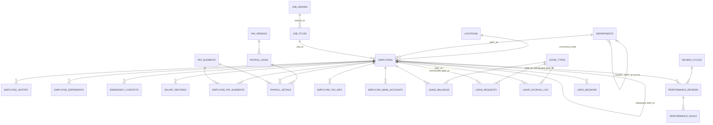

# HRMS Data Dictionary

Schema: `HRMS` (Oracle Database 19c). Source of truth is the DDL under `schema/`. Business meaning is taken from DDL `COMMENT ON` statements, check constraints, and how the column is used by the packages, triggers, forms and seed data in this repository; where meaning is inferred only from the name it is marked *(inferred)*.

Conventions used throughout:

- **Key**: PK = primary key, FK = foreign key, UK = unique key, VC = virtual column.
- **Null**: N = `NOT NULL`, Y = nullable.
- Surrogate keys are populated from `SEQ_*` sequences (`schema/sequences/hrms_sequences.sql`) by the packages; Forms base-table blocks rely on the same sequences in `PRE-INSERT` triggers.
- `ACTIVE_FLAG CHAR(1) DEFAULT 'Y' NOT NULL` is the soft-delete flag on reference and master tables (physical delete of `EMPLOYEES` is blocked by `TRG_EMP_INSTEAD_OF_DELETE`). Only `DEPARTMENTS` has a `CHECK (ACTIVE_FLAG IN ('Y','N'))`; other tables accept any single character.

## Standard audit columns

Almost every table carries this block; it is documented once here and referred to as **[audit]** below.

| Column | Type | Null | Default | Meaning |
|---|---|---|---|---|
| `CREATED_BY` | `VARCHAR2(30)` | N | – | Oracle/application user who inserted the row. Packages pass `USER` or the Forms `:GLOBAL.current_user`; `TRG_EMP_BEFORE_INSERT` defaults it to `USER`. |
| `CREATED_DATE` | `DATE` | N | `SYSDATE` | Insert timestamp. |
| `MODIFIED_BY` | `VARCHAR2(30)` | Y | – | Last updating user (set by packages / `TRG_EMP_BEFORE_UPDATE`). Absent on append-only tables. |
| `MODIFIED_DATE` | `DATE` | Y | – | Last update timestamp. Absent on append-only tables. |

Entity-relationship overview:

---

## 1. Core / organisation (`schema/tables/01_core_tables.sql`)

### 1.1 `DEPARTMENTS`
*Organization departments and cost centers* (DDL comment). Hierarchical via `PARENT_DEPT_ID`. Sequence: `SEQ_DEPARTMENT` (defined, unused – seed data uses literal IDs 1–10). Audited by `TRG_DEPARTMENT_AUDIT`. Note: this table declares **no foreign keys**.

| Column | Type | Null | Key / Default | Business meaning |
|---|---|---|---|---|
| `DEPT_ID` | `NUMBER(10)` | N | PK | Surrogate department identifier. |
| `DEPT_CODE` | `VARCHAR2(20)` | N | UK `UK_DEPT_CODE` | Short business code (seed: `EXEC`, `HR`, `FIN`, `IT`, `ITDEV`, `ITOPS`, `SALES`, `MKT`, `OPS`, `LEGAL`). |
| `DEPT_NAME` | `VARCHAR2(100)` | N | | Display name. |
| `PARENT_DEPT_ID` | `NUMBER(10)` | Y | (no FK) | *Self-referencing FK for department hierarchy* (DDL comment) – parent department; NULL = top level. Seed data uses non-contiguous IDs (1, 10, 20, 30, 31, 32 …) so sub-departments nest under tens. |
| `COST_CENTER` | `VARCHAR2(20)` | Y | | *Financial cost center code for GL integration* (DDL comment); emitted by `PKG_INTEGRATION.generate_gl_journal`. |
| `MANAGER_EMP_ID` | `NUMBER(10)` | Y | (no FK) | Department head employee *(inferred)*; used by `PKG_EMPLOYEE.transfer_employee` to look up new manager. |
| `LOCATION_CODE` | `VARCHAR2(10)` | Y | (no FK) | Primary location of the department *(inferred)*. |
| `ACTIVE_FLAG` | `CHAR(1)` | N | `'Y'`, CHK `IN ('Y','N')` | Soft-delete flag. |
| [audit] | | | | |

### 1.2 `LOCATIONS`
Physical office/site master. Natural key `LOCATION_CODE`. Referenced by `EMPLOYEES.LOCATION_CODE` (FK), `DEPARTMENTS.LOCATION_CODE` and `HOLIDAYS.LOCATION_CODE` (no FK).

| Column | Type | Null | Key / Default | Business meaning |
|---|---|---|---|---|
| `LOCATION_CODE` | `VARCHAR2(10)` | N | PK | Site code (seed: `HQ`, `SF`, `CHI`). |
| `LOCATION_NAME` | `VARCHAR2(100)` | N | | Site name. |
| `ADDRESS_LINE1` / `ADDRESS_LINE2` | `VARCHAR2(200)` | Y | | Street address. |
| `CITY` | `VARCHAR2(100)` | Y | | City. |
| `STATE_PROVINCE` | `VARCHAR2(100)` | Y | | State/province; surfaced in `VW_ACTIVE_EMPLOYEES` and EEO reporting. |
| `POSTAL_CODE` | `VARCHAR2(20)` | Y | | Postal code. |
| `COUNTRY_CODE` | `VARCHAR2(3)` | Y | | ISO-style country code *(inferred)*. |
| `PHONE_NUMBER` | `VARCHAR2(30)` | Y | | Site phone. Seed script inserts into a non-existent `PHONE` column instead. |
| `TIMEZONE` | `VARCHAR2(50)` | Y | `'America/New_York'` | IANA time-zone of the site. |
| `ACTIVE_FLAG` | `CHAR(1)` | N | `'Y'` | Soft-delete flag. |
| [audit] | | | | |

### 1.3 `JOB_GRADES`
Compensation bands. Grade number doubles as the authorization level in `PKG_SECURITY.has_permission` (grade ≥ 8 full access, ≥ 5 view-all). Salary validation in `PKG_VALIDATION.validate_salary_range`, `PKG_EMPLOYEE`, and `HRMS_VALIDATION_LIB` checks `BASE_SALARY` against `MIN_SALARY`/`MAX_SALARY`.

| Column | Type | Null | Key / Default | Business meaning |
|---|---|---|---|---|
| `GRADE_ID` | `NUMBER(5)` | N | PK | Grade identifier; also the numeric permission level (1–10 in seed; `SEQ_JOB_GRADE` starts at 100). |
| `GRADE_CODE` | `VARCHAR2(10)` | N | UK `UK_GRADE_CODE` | Grade code. Seed script omits this NOT NULL column (inserts `GRADE_LEVEL`, which does not exist). |
| `GRADE_NAME` | `VARCHAR2(50)` | N | | Display name (seed: "Entry Level" … "Executive"). |
| `MIN_SALARY` | `NUMBER(12,2)` | N | | Lower bound of the pay band. |
| `MAX_SALARY` | `NUMBER(12,2)` | N | CHK `MAX_SALARY >= MIN_SALARY` | Upper bound of the pay band. Midpoint `(MIN+MAX)/2` drives compa-ratio in `VW_EMPLOYEE_COMPENSATION` / `PKG_REPORTING`. |
| `OVERTIME_ELIGIBLE` | `CHAR(1)` | Y | `'N'` | Whether roles in this grade earn overtime *(inferred; not used by payroll code)*. |
| `ACTIVE_FLAG` | `CHAR(1)` | N | `'Y'` | Soft-delete flag. |
| [audit] | | | | |

### 1.4 `JOB_TITLES`
Position catalogue; each title belongs to exactly one grade.

| Column | Type | Null | Key / Default | Business meaning |
|---|---|---|---|---|
| `JOB_ID` | `NUMBER(10)` | N | PK | Job identifier. |
| `JOB_CODE` | `VARCHAR2(20)` | N | UK `UK_JOB_CODE` | Job code (seed: `CEO`, `SWE1`, `HRDIR`, …). |
| `JOB_TITLE` | `VARCHAR2(100)` | N | | Title text. |
| `JOB_FAMILY` | `VARCHAR2(50)` | Y | | Grouping of related jobs *(inferred; not populated by seed)*. |
| `GRADE_ID` | `NUMBER(5)` | N | FK → `JOB_GRADES` | Pay grade / permission level of the job. |
| `EEO_CATEGORY` | `VARCHAR2(10)` | Y | | US EEO-1 job category (seed uses `1.1`, `1.2`, `2`, `3`, `5`); aggregated by `PKG_REPORTING.get_eeo_report`. |
| `FLSA_STATUS` | `VARCHAR2(10)` | Y | `'EXEMPT'` | US Fair Labor Standards Act exempt/non-exempt status *(inferred)*. |
| `ACTIVE_FLAG` | `CHAR(1)` | N | `'Y'` | Soft-delete flag. |
| [audit] | | | | |

### 1.5 `EMPLOYEES`
*Master employee records – core entity of the HRMS system* (DDL comment). Written by `PKG_EMPLOYEE`, by the `HRMS_EMPLOYEE` base-table block, and guarded by `TRG_EMP_BEFORE_INSERT/UPDATE/INSTEAD_OF_DELETE`. Also acts as the **user table** for login (`PKG_SECURITY.authenticate` matches `EMAIL`). Sequence: `SEQ_EMPLOYEE`.

| Column | Type | Null | Key / Default | Business meaning |
|---|---|---|---|---|
| `EMP_ID` | `NUMBER(10)` | N | PK | Surrogate key; stored in `:GLOBAL.current_emp_id` after login. |
| `EMP_NUMBER` | `VARCHAR2(20)` | N | UK `UK_EMP_NUMBER` | Human-readable badge number, format `EMP-NNNNNN`, generated by `PKG_EMPLOYEE.generate_emp_number` (MAX+1). |
| `FIRST_NAME` / `MIDDLE_NAME` / `LAST_NAME` | `VARCHAR2(50)` | N / Y / N | | Legal name parts. |
| `DATE_OF_BIRTH` | `DATE` | Y | | Birth date; PII. |
| `GENDER` | `CHAR(1)` | Y | CHK `IN ('M','F','O')` | Gender code; aggregated in EEO report. |
| `MARITAL_STATUS` | `VARCHAR2(10)` | Y | | Marital status (seed: `SINGLE`, `MARRIED`, `DIVORCED`); no check constraint. |
| `NATIONALITY` | `VARCHAR2(50)` | Y | | Nationality *(inferred)*. |
| `SSN_ENCRYPTED` | `VARCHAR2(200)` | Y | | *AES-256 encrypted SSN – decrypted only in PKG_SECURITY* (DDL comment). Hex string produced by `PKG_SECURITY.encrypt_ssn`. |
| `EMAIL` | `VARCHAR2(100)` | Y | | Work e-mail; **login username**. Uniqueness enforced only case-insensitively by `TRG_EMP_BEFORE_INSERT` (not by constraint), and only among active employees. |
| `PHONE_WORK` / `PHONE_MOBILE` | `VARCHAR2(30)` | Y | | Phone numbers; validated by `PKG_COMMON.is_valid_phone` / `HRMS_VALIDATION_LIB.validate_phone`. |
| `ADDRESS_LINE1`, `ADDRESS_LINE2`, `CITY`, `STATE_PROVINCE`, `POSTAL_CODE`, `COUNTRY_CODE` | `VARCHAR2(200/200/100/100/20/3)` | Y | | Home address. |
| `HIRE_DATE` | `DATE` | N | | Original hire date. Future dates limited to +90 days by Forms, +180 days by trigger (drift). Drives `TENURE_YEARS`, leave `MIN_TENURE_DAYS` eligibility, new-hire reports. |
| `TERMINATION_DATE` | `DATE` | Y | | Set by `PKG_EMPLOYEE.terminate_employee`; cleared on rehire. |
| `TERMINATION_REASON` | `VARCHAR2(50)` | Y | | Free-text/ code reason for termination (seed: `RESIGNATION`). |
| `DEPT_ID` | `NUMBER(10)` | N | FK → `DEPARTMENTS` | Current department. |
| `JOB_ID` | `NUMBER(10)` | N | FK → `JOB_TITLES` | Current job title (→ grade → permission level). |
| `MANAGER_EMP_ID` | `NUMBER(10)` | Y | FK → `EMPLOYEES` | Direct manager; root of org tree when NULL. Used by `CONNECT BY` in `get_org_chart` / `VW_ORG_HIERARCHY` and as default leave approver. |
| `LOCATION_CODE` | `VARCHAR2(10)` | Y | FK → `LOCATIONS` | Work location. |
| `EMPLOYMENT_TYPE` | `VARCHAR2(20)` | Y | `'FULL_TIME'`, CHK `IN ('FULL_TIME','PART_TIME','CONTRACT','INTERN')` | Engagement type. |
| `EMPLOYMENT_STATUS` | `VARCHAR2(20)` | Y | `'ACTIVE'`, CHK `IN ('ACTIVE','ON_LEAVE','SUSPENDED','TERMINATED')` | *Current status* (DDL comment). Only `ACTIVE` employees can log in, are paid, accrue leave, or appear in most views. |
| `PHOTO_BLOB` | `BLOB` | Y | | Employee photo. |
| `NOTES` | `CLOB` | Y | | Free-form HR notes. |
| `ACTIVE_FLAG` | `CHAR(1)` | N | `'Y'` | Soft-delete flag; set to `'N'` on termination. |
| [audit] | | | | |

### 1.6 `EMPLOYEE_HISTORY`
Append-only log of job-related changes, written by `PKG_EMPLOYEE.log_history` (autonomous transaction) on hire, transfer, promotion, salary change, termination, rehire. `TRG_EMP_BEFORE_UPDATE` also attempts to insert here but uses a different column list (`HISTORY_ID`, `CHANGE_DATE`, `OLD_VALUE`, `NEW_VALUE`, …) that does not match this DDL. Sequence: `SEQ_EMP_HISTORY`.

| Column | Type | Null | Key / Default | Business meaning |
|---|---|---|---|---|
| `HIST_ID` | `NUMBER(15)` | N | PK | History row id. |
| `EMP_ID` | `NUMBER(10)` | N | FK → `EMPLOYEES` | Employee affected. |
| `CHANGE_TYPE` | `VARCHAR2(30)` | N | CHK `IN ('HIRE','TRANSFER','PROMOTION','DEMOTION','SALARY_CHANGE','TERMINATION','REHIRE','LEAVE_START','LEAVE_END','STATUS_CHANGE')` | Kind of event. |
| `EFFECTIVE_DATE` | `DATE` | N | | Business effective date of the change (may differ from `CREATED_DATE`). |
| `OLD_DEPT_ID` / `NEW_DEPT_ID` | `NUMBER(10)` | Y | | Department before/after (transfer). |
| `OLD_JOB_ID` / `NEW_JOB_ID` | `NUMBER(10)` | Y | | Job before/after (promotion/demotion). |
| `OLD_MANAGER_ID` / `NEW_MANAGER_ID` | `NUMBER(10)` | Y | | Manager before/after. |
| `OLD_SALARY` / `NEW_SALARY` | `NUMBER(12,2)` | Y | | Base salary before/after. |
| `OLD_LOCATION` / `NEW_LOCATION` | `VARCHAR2(10)` | Y | | Location code before/after. |
| `REASON_CODE` | `VARCHAR2(30)` | Y | | Reason code supplied by caller (e.g. termination reason). |
| `COMMENTS` | `VARCHAR2(4000)` | Y | | Free text. |
| `CREATED_BY`, `CREATED_DATE` | | | | Insert audit only (no MODIFIED_*). |

### 1.7 `EMPLOYEE_DEPENDENTS`
Family members for benefits. Read by `PKG_INTEGRATION.export_benefits_feed` (dependent count). Sequence: `SEQ_DEPENDENT` (unused in code).

| Column | Type | Null | Key / Default | Business meaning |
|---|---|---|---|---|
| `DEPENDENT_ID` | `NUMBER(10)` | N | PK | Dependent id. |
| `EMP_ID` | `NUMBER(10)` | N | FK → `EMPLOYEES` | Sponsoring employee. |
| `FIRST_NAME` / `LAST_NAME` | `VARCHAR2(50)` | N | | Dependent name. |
| `RELATIONSHIP` | `VARCHAR2(20)` | N | CHK `IN ('SPOUSE','CHILD','PARENT','DOMESTIC_PARTNER','OTHER')` | Relationship to employee. |
| `DATE_OF_BIRTH` | `DATE` | Y | | Birth date; PII. |
| `SSN_ENCRYPTED` | `VARCHAR2(200)` | Y | | Encrypted SSN (same scheme as `EMPLOYEES`). |
| `BENEFITS_ENROLLED` | `CHAR(1)` | Y | `'N'` | Whether the dependent is enrolled in benefits. |
| `ACTIVE_FLAG` | `CHAR(1)` | N | `'Y'` | Soft-delete flag. |
| [audit] | | | | |

### 1.8 `EMERGENCY_CONTACTS`
Emergency contact list per employee. Not referenced by any package or form in the repo (README claims an `HRMS_EMPLOYEE` block). Sequence: `SEQ_EMERGENCY_CONTACT` (unused).

| Column | Type | Null | Key / Default | Business meaning |
|---|---|---|---|---|
| `CONTACT_ID` | `NUMBER(10)` | N | PK | Contact id. |
| `EMP_ID` | `NUMBER(10)` | N | FK → `EMPLOYEES` | Employee. |
| `CONTACT_NAME` | `VARCHAR2(100)` | N | | Contact's name. |
| `RELATIONSHIP` | `VARCHAR2(30)` | Y | | Relationship (free text, no check). |
| `PHONE_PRIMARY` | `VARCHAR2(30)` | N | | Primary phone. |
| `PHONE_SECONDARY` | `VARCHAR2(30)` | Y | | Secondary phone. |
| `EMAIL` | `VARCHAR2(100)` | Y | | Contact e-mail. |
| `PRIORITY_ORDER` | `NUMBER(2)` | Y | `1` | Call order (1 = first). |
| `ACTIVE_FLAG` | `CHAR(1)` | N | `'Y'` | Soft-delete flag. |
| [audit] | | | | |

---

## 2. Payroll (`schema/tables/02_payroll_tables.sql`)

### 2.1 `SALARY_RECORDS`
Effective-dated base-salary history. Exactly one row per employee should have `ACTIVE_FLAG='Y'`; `PKG_PAYROLL.create_salary_record` end-dates the previous row. Audited by `TRG_SALARY_AUDIT`. Sequence: `SEQ_SALARY`.

| Column | Type | Null | Key / Default | Business meaning |
|---|---|---|---|---|
| `SALARY_ID` | `NUMBER(10)` | N | PK | Salary record id. |
| `EMP_ID` | `NUMBER(10)` | N | FK → `EMPLOYEES` | Employee. |
| `EFFECTIVE_DATE` | `DATE` | N | | Date the salary takes effect. |
| `END_DATE` | `DATE` | Y | | Date the salary stopped applying (NULL = current). |
| `BASE_SALARY` | `NUMBER(12,2)` | N | | Salary amount in `CURRENCY_CODE`, on `SALARY_BASIS`. Payroll divides annual salary by 12/24/26/52 per `PAY_FREQUENCY`. |
| `CURRENCY_CODE` | `VARCHAR2(3)` | Y | `'USD'` | ISO currency. |
| `PAY_FREQUENCY` | `VARCHAR2(20)` | Y | `'MONTHLY'`, CHK `IN ('WEEKLY','BIWEEKLY','SEMIMONTHLY','MONTHLY')` | How often the employee is paid. |
| `SALARY_BASIS` | `VARCHAR2(20)` | Y | `'ANNUAL'`, CHK `IN ('ANNUAL','HOURLY')` | Whether `BASE_SALARY` is an annual figure or hourly rate. |
| `CHANGE_REASON` | `VARCHAR2(50)` | Y | | Why the salary changed (`NEW_HIRE`, `PROMOTION`, `MERIT`, …). |
| `CHANGE_PCT` | `NUMBER(5,2)` | Y | | Percentage change vs. previous salary, computed by `create_salary_record`. |
| `APPROVED_BY` | `NUMBER(10)` | Y | (no FK) | Approving employee id *(inferred)*. |
| `APPROVAL_DATE` | `DATE` | Y | | Approval date. |
| `ACTIVE_FLAG` | `CHAR(1)` | N | `'Y'` | `'Y'` marks the current salary row. |
| [audit] | | | | |

### 2.2 `PAY_ELEMENTS`
Catalogue of earnings, deductions, taxes and benefits. Seed rows 100–103 (`FED_TAX`, `STATE_TAX`, `FICA`, `MEDICARE`) are hard-coded by ID in `PKG_PAYROLL` and `PKG_REPORTING`. Sequence: `SEQ_PAY_ELEMENT` (unused).

| Column | Type | Null | Key / Default | Business meaning |
|---|---|---|---|---|
| `ELEMENT_ID` | `NUMBER(10)` | N | PK | Element id. |
| `ELEMENT_CODE` | `VARCHAR2(30)` | N | UK `UK_PAY_ELEM_CODE` | Code (`BASE_SALARY`, `OVERTIME`, `401K`, `HEALTH_INS`, …). |
| `ELEMENT_NAME` | `VARCHAR2(100)` | N | | Display name. |
| `ELEMENT_TYPE` | `VARCHAR2(20)` | N | CHK `IN ('EARNING','DEDUCTION','TAX','BENEFIT','REIMBURSEMENT')` | Sign/role in the pay calculation; copied into `PAYROLL_DETAILS.ELEMENT_TYPE`. |
| `CALCULATION_TYPE` | `VARCHAR2(20)` | N | CHK `IN ('FLAT','PERCENTAGE','HOURS','FORMULA')` | How the amount is derived. |
| `DEFAULT_AMOUNT` | `NUMBER(12,2)` | Y | | Default flat amount. |
| `DEFAULT_PERCENTAGE` | `NUMBER(5,2)` | Y | | Default percentage of gross. |
| `TAXABLE_FLAG` | `CHAR(1)` | Y | `'Y'` | Whether the earning is taxable. |
| `PRETAX_FLAG` | `CHAR(1)` | Y | `'N'` | Whether the deduction reduces taxable wages (401k, health). |
| `EMPLOYER_PAID` | `CHAR(1)` | Y | `'N'` | Employer-side cost (not deducted from employee). |
| `GL_ACCOUNT_CODE` | `VARCHAR2(30)` | Y | | GL account for `PKG_INTEGRATION.generate_gl_journal`. |
| `PRIORITY_ORDER` | `NUMBER(5)` | Y | `100` | Processing order of deductions. |
| `ACTIVE_FLAG` | `CHAR(1)` | N | `'Y'` | Soft-delete flag. |
| [audit] | | | | |

### 2.3 `EMPLOYEE_PAY_ELEMENTS`
Employee-specific enrolment in a pay element (e.g. 401k at 6 %). Read by `PKG_PAYROLL.calculate_deductions`; end-dated by `PKG_EMPLOYEE.terminate_employee`. Sequence: `SEQ_EMP_PAY_ELEMENT` (unused).

| Column | Type | Null | Key / Default | Business meaning |
|---|---|---|---|---|
| `EMP_ELEMENT_ID` | `NUMBER(10)` | N | PK | Row id. |
| `EMP_ID` | `NUMBER(10)` | N | FK → `EMPLOYEES` | Employee. |
| `ELEMENT_ID` | `NUMBER(10)` | N | FK → `PAY_ELEMENTS` | Element. |
| `EFFECTIVE_DATE` | `DATE` | N | | Enrolment start. |
| `END_DATE` | `DATE` | Y | | Enrolment end (NULL = open). |
| `AMOUNT` | `NUMBER(12,2)` | Y | | Employee-specific flat amount. |
| `PERCENTAGE` | `NUMBER(5,2)` | Y | | Employee-specific percentage. |
| `OVERRIDE_AMOUNT` | `NUMBER(12,2)` | Y | | One-off override of the calculated amount *(inferred)*. |
| `ACTIVE_FLAG` | `CHAR(1)` | N | `'Y'` | Soft-delete flag. |
| [audit] | | | | |

### 2.4 `PAY_PERIODS`
Calendar of pay periods; the `HRMS_PAYROLL` form lists `STATUS='OPEN'` periods. Sequence: `SEQ_PAY_PERIOD`.

| Column | Type | Null | Key / Default | Business meaning |
|---|---|---|---|---|
| `PERIOD_ID` | `NUMBER(10)` | N | PK | Period id. |
| `PERIOD_NAME` | `VARCHAR2(50)` | N | | Label, e.g. "2024-03 Monthly". |
| `PAY_FREQUENCY` | `VARCHAR2(20)` | N | | Frequency this period belongs to (no check constraint here, unlike `SALARY_RECORDS`). |
| `PERIOD_START_DATE` / `PERIOD_END_DATE` | `DATE` | N | | Work-period boundaries. |
| `PAY_DATE` | `DATE` | N | | Date employees are paid; used as GL journal date. |
| `STATUS` | `VARCHAR2(20)` | Y | `'OPEN'`, CHK `IN ('OPEN','PROCESSING','CLOSED','REVERSED')` | Lifecycle: `OPEN` → `PROCESSING` (run created) → `CLOSED` (approved). |
| `CLOSED_BY` / `CLOSED_DATE` | `VARCHAR2(30)` / `DATE` | Y | | Who/when closed. |
| [audit] | | | | |

### 2.5 `PAYROLL_RUNS`
One payroll execution for a period. Sequence: `SEQ_PAYROLL_RUN`.

| Column | Type | Null | Key / Default | Business meaning |
|---|---|---|---|---|
| `RUN_ID` | `NUMBER(10)` | N | PK | Run id. |
| `PERIOD_ID` | `NUMBER(10)` | N | FK → `PAY_PERIODS` | Period being paid. |
| `RUN_TYPE` | `VARCHAR2(20)` | Y | `'REGULAR'`, CHK `IN ('REGULAR','SUPPLEMENTAL','BONUS','FINAL')` | Regular cycle vs. off-cycle run. |
| `RUN_DATE` | `DATE` | N | | When the run was created. |
| `STATUS` | `VARCHAR2(20)` | Y | `'PENDING'`, CHK `IN ('PENDING','CALCULATING','CALCULATED','APPROVED','PAID','REVERSED','ERROR')` | Lifecycle managed by `PKG_PAYROLL` (`create` → `calculate` → `approve` → `reverse`). |
| `TOTAL_GROSS` / `TOTAL_DEDUCTIONS` / `TOTAL_NET` / `TOTAL_EMPLOYER_COST` | `NUMBER(15,2)` | Y | | Run totals aggregated from `PAYROLL_DETAILS` after calculation. |
| `EMPLOYEE_COUNT` | `NUMBER(10)` | Y | | Employees processed. |
| `ERROR_COUNT` | `NUMBER(10)` | Y | `0` | Employees whose calculation raised an error (run still completes). |
| `SUBMITTED_BY` / `SUBMITTED_DATE` | | Y | | Submission for approval *(inferred)*. |
| `APPROVED_BY` / `APPROVED_DATE` | `VARCHAR2(30)` / `DATE` | Y | | Approval by payroll manager. |
| [audit] | | | | |

### 2.6 `PAYROLL_DETAILS`
Line items per employee per run (one row per pay element). Sign convention: earnings positive, taxes/deductions negative, so `SUM(AMOUNT)` = net pay (see `VW_PAYROLL_LATEST`). Sequence: `SEQ_PAYROLL_DETAIL`.

| Column | Type | Null | Key / Default | Business meaning |
|---|---|---|---|---|
| `DETAIL_ID` | `NUMBER(15)` | N | PK | Line id. |
| `RUN_ID` | `NUMBER(10)` | N | FK → `PAYROLL_RUNS` | Run. |
| `EMP_ID` | `NUMBER(10)` | N | FK → `EMPLOYEES` | Employee. |
| `ELEMENT_ID` | `NUMBER(10)` | N | FK → `PAY_ELEMENTS` | Element (100–103 = statutory taxes). |
| `ELEMENT_TYPE` | `VARCHAR2(20)` | N | | Denormalised copy of `PAY_ELEMENTS.ELEMENT_TYPE`. |
| `HOURS_WORKED` | `NUMBER(6,2)` | Y | | Hours for hourly/overtime elements. |
| `RATE` | `NUMBER(12,4)` | Y | | Rate applied (hourly rate or percentage). |
| `AMOUNT` | `NUMBER(12,2)` | N | | Signed amount for this period. |
| `YTD_AMOUNT` | `NUMBER(15,2)` | Y | | Year-to-date total for the element *(populated for taxes by `calculate_payroll`)*. |
| `STATUS` | `VARCHAR2(20)` | Y | `'CALCULATED'` | `CALCULATED` or `ERROR` (error rows are excluded from views). |
| `ERROR_MESSAGE` | `VARCHAR2(4000)` | Y | | `SQLERRM` captured for failed employees. |
| `CREATED_BY`, `CREATED_DATE` | | | | Insert audit only. |

### 2.7 `TAX_BRACKETS`
Configurable progressive tax table. **Not read by any code** – `PKG_PAYROLL` hard-codes 2024 federal brackets and flat state rates instead (TODO in source). Sequence: `SEQ_TAX_BRACKET` (unused).

| Column | Type | Null | Key / Default | Business meaning |
|---|---|---|---|---|
| `BRACKET_ID` | `NUMBER(10)` | N | PK | Bracket id. |
| `TAX_YEAR` | `NUMBER(4)` | N | | Tax year. |
| `FILING_STATUS` | `VARCHAR2(30)` | N | CHK `IN ('SINGLE','MARRIED_JOINT','MARRIED_SEPARATE','HEAD_OF_HOUSEHOLD')` | Filing status. |
| `BRACKET_MIN` / `BRACKET_MAX` | `NUMBER(12,2)` | N / Y | | Taxable-income band (`MAX` NULL = top band). |
| `TAX_RATE` | `NUMBER(5,4)` | N | | Marginal rate (e.g. 0.2200). |
| `BASE_TAX` | `NUMBER(12,2)` | Y | `0` | Cumulative tax at `BRACKET_MIN`. |
| `STATE_CODE` | `VARCHAR2(3)` | Y | | NULL = federal; otherwise state table. |
| `ACTIVE_FLAG` | `CHAR(1)` | N | `'Y'` | Soft-delete flag. |
| `CREATED_BY`, `CREATED_DATE` | | | | Insert audit only. |

### 2.8 `EMPLOYEE_TAX_INFO`
Per-employee, per-year withholding elections (W-4). Read by `PKG_PAYROLL.calculate_taxes`; defaults to `SINGLE`/0 allowances when missing. **No sequence defined** for `TAX_INFO_ID`.

| Column | Type | Null | Key / Default | Business meaning |
|---|---|---|---|---|
| `TAX_INFO_ID` | `NUMBER(10)` | N | PK | Row id. |
| `EMP_ID` | `NUMBER(10)` | N | FK → `EMPLOYEES`; UK `(EMP_ID, TAX_YEAR)` | Employee. |
| `TAX_YEAR` | `NUMBER(4)` | N | | Year the election applies to. |
| `FILING_STATUS` | `VARCHAR2(30)` | N | | Filing status (no check constraint here; payroll treats non-`SINGLE` as married). |
| `FEDERAL_ALLOWANCES` / `STATE_ALLOWANCES` | `NUMBER(3)` | Y | `0` | Allowances claimed; each reduces taxable income by a hard-coded 4,300. |
| `ADDITIONAL_FED_WH` / `ADDITIONAL_STATE_WH` | `NUMBER(12,2)` | Y | `0` | Extra flat withholding per period. |
| `EXEMPT_FLAG` | `CHAR(1)` | Y | `'N'` | Exempt from income-tax withholding. |
| `STATE_CODE` | `VARCHAR2(3)` | Y | | Work/residence state for state tax (defaults to `NY` in payroll when NULL). |
| `W4_RECEIVED_DATE` | `DATE` | Y | | Date the W-4 form was received. |
| `ACTIVE_FLAG` | `CHAR(1)` | N | `'Y'` | Soft-delete flag. |
| [audit] | | | | |

### 2.9 `EMPLOYEE_BANK_ACCOUNTS`
Direct-deposit instructions. Not referenced by any package/form in the repo. **No sequence defined** for `BANK_ACCT_ID`.

| Column | Type | Null | Key / Default | Business meaning |
|---|---|---|---|---|
| `BANK_ACCT_ID` | `NUMBER(10)` | N | PK | Row id. |
| `EMP_ID` | `NUMBER(10)` | N | FK → `EMPLOYEES` | Employee. |
| `BANK_NAME` | `VARCHAR2(100)` | Y | | Bank name. |
| `ROUTING_NUMBER` | `VARCHAR2(20)` | N | | ABA routing number – stored **in clear**. |
| `ACCOUNT_NUMBER_ENC` | `VARCHAR2(200)` | N | | Encrypted account number (same scheme as SSN, inferred from name). |
| `ACCOUNT_TYPE` | `VARCHAR2(20)` | Y | `'CHECKING'`, CHK `IN ('CHECKING','SAVINGS')` | Account type. |
| `DEPOSIT_TYPE` | `VARCHAR2(20)` | Y | `'FULL'`, CHK `IN ('FULL','PARTIAL_AMOUNT','PARTIAL_PERCENT','REMAINDER')` | Split-deposit rule. |
| `DEPOSIT_AMOUNT` / `DEPOSIT_PERCENTAGE` | `NUMBER(12,2)` / `NUMBER(5,2)` | Y | | Amount or % for partial deposits. |
| `PRIORITY_ORDER` | `NUMBER(2)` | Y | `1` | Order in which split deposits are applied. |
| `PRENOTE_SENT` / `PRENOTE_DATE` | `CHAR(1)` / `DATE` | Y | `'N'` | ACH pre-notification status. |
| `ACTIVE_FLAG` | `CHAR(1)` | N | `'Y'` | Soft-delete flag. |
| [audit] | | | | |

---

## 3. Leave (`schema/tables/03_leave_tables.sql`)

### 3.1 `LEAVE_TYPES`
Leave policy definitions (seed: `PTO`, `SICK`, `COMP`, `FMLA`, `JURY`, `BEREAVE`). Sequence: `SEQ_LEAVE_TYPE` (unused).

| Column | Type | Null | Key / Default | Business meaning |
|---|---|---|---|---|
| `LEAVE_TYPE_ID` | `NUMBER(5)` | N | PK | Type id. |
| `LEAVE_TYPE_CODE` | `VARCHAR2(20)` | N | UK | Code. |
| `LEAVE_TYPE_NAME` | `VARCHAR2(50)` | N | | Display name. |
| `PAID_FLAG` | `CHAR(1)` | Y | `'Y'` | Paid vs unpaid leave. |
| `ACCRUAL_FLAG` | `CHAR(1)` | Y | `'Y'` | Whether balance accrues over time (else granted/unlimited). |
| `ACCRUAL_RATE` | `NUMBER(6,2)` | Y | | Days accrued per `ACCRUAL_FREQUENCY` period; applied by `PKG_LEAVE.process_monthly_accrual`. |
| `ACCRUAL_FREQUENCY` | `VARCHAR2(20)` | Y | CHK `IN ('MONTHLY','BIWEEKLY','ANNUAL', NULL)` | Accrual cadence (only `MONTHLY` is processed by code). |
| `MAX_BALANCE` | `NUMBER(6,2)` | Y | | Accrual cap. |
| `CARRYOVER_MAX` | `NUMBER(6,2)` | Y | | Max days carried into next year (`process_year_end_carryover`). |
| `CARRYOVER_EXPIRY` | `NUMBER(3)` | Y | | Days after year start when carryover expires → `LEAVE_BALANCES.CARRYOVER_EXPIRY_DT`. |
| `MIN_TENURE_DAYS` | `NUMBER(5)` | Y | `0` | Minimum service before the type may be requested. |
| `REQUIRES_APPROVAL` | `CHAR(1)` | Y | `'Y'` | If `'N'`, requests are auto-approved on submit. |
| `REQUIRES_DOCUMENT` | `CHAR(1)` | Y | `'N'` | Supporting document required *(not enforced in code)*. |
| `ACTIVE_FLAG` | `CHAR(1)` | N | `'Y'` | Soft-delete flag. |
| [audit] | | | | |

### 3.2 `LEAVE_BALANCES`
One row per employee, leave type and calendar year. Sequence: `SEQ_LEAVE_BALANCE`.

| Column | Type | Null | Key / Default | Business meaning |
|---|---|---|---|---|
| `BALANCE_ID` | `NUMBER(10)` | N | PK | Row id. |
| `EMP_ID` | `NUMBER(10)` | N | FK → `EMPLOYEES`; UK `(EMP_ID, LEAVE_TYPE_ID, CALENDAR_YEAR)` | Employee. |
| `LEAVE_TYPE_ID` | `NUMBER(5)` | N | FK → `LEAVE_TYPES` | Leave type. |
| `CALENDAR_YEAR` | `NUMBER(4)` | N | | Year of the balance. |
| `OPENING_BALANCE` | `NUMBER(6,2)` | Y | `0` | Balance at start of year (includes carryover). |
| `ACCRUED` | `NUMBER(6,2)` | Y | `0` | Days accrued this year. |
| `USED` | `NUMBER(6,2)` | Y | `0` | Days taken (approved requests). |
| `ADJUSTMENT` | `NUMBER(6,2)` | Y | `0` | Manual +/- adjustments, including carryover expiry deductions. |
| `PENDING` | `NUMBER(6,2)` | Y | `0` | Days in `PENDING` requests (reserved). |
| `AVAILABLE` | `NUMBER(6,2)` | – | **VC** `OPENING_BALANCE + ACCRUED - USED + ADJUSTMENT - PENDING` | Days currently requestable. Note `VW_LEAVE_SUMMARY` recomputes `AVAILABLE` **without** subtracting `PENDING`, so the view and the column can disagree. |
| `CARRYOVER_FROM_PREV` | `NUMBER(6,2)` | Y | `0` | Portion of `OPENING_BALANCE` that came from last year. |
| `CARRYOVER_EXPIRY_DT` | `DATE` | Y | | Date after which unused carryover is removed by `expire_carryover`. |
| [audit] | | | | |

### 3.3 `LEAVE_REQUESTS`
Leave request workflow. Sequence: `SEQ_LEAVE_REQUEST`. `TRG_LEAVE_REQUEST_AUDIT` fires on `STATUS` change.

| Column | Type | Null | Key / Default | Business meaning |
|---|---|---|---|---|
| `REQUEST_ID` | `NUMBER(10)` | N | PK | Request id. |
| `EMP_ID` | `NUMBER(10)` | N | FK → `EMPLOYEES` | Requesting employee. |
| `LEAVE_TYPE_ID` | `NUMBER(5)` | N | FK → `LEAVE_TYPES` | Leave type. |
| `START_DATE` / `END_DATE` | `DATE` | N | CHK `END_DATE >= START_DATE` | Inclusive leave period. |
| `TOTAL_DAYS` | `NUMBER(5,1)` | N | | Business days requested (0.5 for half day), computed by `PKG_LEAVE.calculate_business_days`. |
| `HALF_DAY_FLAG` | `CHAR(1)` | Y | `'N'` | Single half-day request. |
| `HALF_DAY_PERIOD` | `VARCHAR2(10)` | Y | CHK `IN ('AM','PM', NULL)` | Which half. |
| `STATUS` | `VARCHAR2(20)` | Y | `'PENDING'`, CHK `IN ('PENDING','APPROVED','REJECTED','CANCELLED','TAKEN')` | Workflow state (`TAKEN` is never set by code). |
| `REASON` | `VARCHAR2(4000)` | Y | | Employee's reason. |
| `SUPPORTING_DOC_PATH` | `VARCHAR2(500)` | Y | | File path of supporting document. |
| `APPROVER_EMP_ID` | `NUMBER(10)` | Y | FK → `EMPLOYEES` | Manager expected to approve (defaults to `MANAGER_EMP_ID`). |
| `APPROVAL_DATE` / `APPROVAL_COMMENTS` | `DATE` / `VARCHAR2(4000)` | Y | | Approval/rejection details. |
| `CANCEL_REASON` / `CANCELLED_DATE` | `VARCHAR2(4000)` / `DATE` | Y | | Cancellation details. |
| [audit] | | | | |

### 3.4 `LEAVE_ACCRUAL_LOG`
Append-only record of each accrual posting from `process_monthly_accrual`. Sequence: `SEQ_LEAVE_ACCRUAL`.

| Column | Type | Null | Key / Default | Business meaning |
|---|---|---|---|---|
| `ACCRUAL_ID` | `NUMBER(15)` | N | PK | Row id. |
| `EMP_ID` | `NUMBER(10)` | N | FK → `EMPLOYEES` | Employee. |
| `LEAVE_TYPE_ID` | `NUMBER(5)` | N | FK → `LEAVE_TYPES` | Leave type. |
| `ACCRUAL_DATE` | `DATE` | N | | Posting date. |
| `ACCRUAL_AMOUNT` | `NUMBER(6,2)` | N | | Days accrued (may be capped by `MAX_BALANCE`). |
| `BALANCE_AFTER` | `NUMBER(6,2)` | Y | | Resulting `ACCRUED` balance. |
| `RUN_ID` | `NUMBER(10)` | Y | | Batch run identifier *(inferred; not populated by code)*. |
| `CREATED_BY`, `CREATED_DATE` | | | | Insert audit only. |

### 3.5 `HOLIDAYS`
Company holiday calendar, optionally per location. Read by `PKG_LEAVE.calculate_business_days` and `PKG_VALIDATION.validate_business_day`. Sequence: `SEQ_HOLIDAY` (unused).

| Column | Type | Null | Key / Default | Business meaning |
|---|---|---|---|---|
| `HOLIDAY_ID` | `NUMBER(5)` | N | PK | Row id. |
| `HOLIDAY_DATE` | `DATE` | N | | Calendar date (observed dates must be entered explicitly – code does not shift weekend holidays). |
| `HOLIDAY_NAME` | `VARCHAR2(100)` | N | | Name. |
| `LOCATION_CODE` | `VARCHAR2(10)` | Y | (no FK) | NULL = company-wide; else applies to one location. |
| `FLOATING_FLAG` | `CHAR(1)` | Y | `'N'` | Floating holiday *(inferred)*. |
| `ACTIVE_FLAG` | `CHAR(1)` | N | `'Y'` | Soft-delete flag. |
| `CREATED_BY`, `CREATED_DATE` | | | | Insert audit only. |

---

## 4. Performance & system (`schema/tables/04_performance_tables.sql`)

### 4.1 `REVIEW_CYCLES`
Annual/periodic review campaign. Sequence: `SEQ_REVIEW_CYCLE`.

| Column | Type | Null | Key / Default | Business meaning |
|---|---|---|---|---|
| `CYCLE_ID` | `NUMBER(10)` | N | PK | Cycle id. |
| `CYCLE_NAME` | `VARCHAR2(100)` | N | | Name, e.g. "FY2024 Annual Review". |
| `CYCLE_YEAR` | `NUMBER(4)` | N | | Review year. |
| `START_DATE` / `END_DATE` | `DATE` | N | | Cycle window. |
| `SELF_REVIEW_DUE` / `MANAGER_REVIEW_DUE` / `CALIBRATION_DUE` | `DATE` | Y | | Milestone deadlines. |
| `STATUS` | `VARCHAR2(20)` | Y | `'DRAFT'`, CHK `IN ('DRAFT','OPEN','IN_PROGRESS','CALIBRATION','CLOSED')` | Lifecycle managed by `PKG_PERFORMANCE.open_cycle/close_cycle`. |
| [audit] | | | | |

### 4.2 `PERFORMANCE_REVIEWS`
One review per employee per cycle. Sequence: `SEQ_PERF_REVIEW`.

| Column | Type | Null | Key / Default | Business meaning |
|---|---|---|---|---|
| `REVIEW_ID` | `NUMBER(10)` | N | PK | Review id. |
| `CYCLE_ID` | `NUMBER(10)` | N | FK → `REVIEW_CYCLES` | Cycle. |
| `EMP_ID` | `NUMBER(10)` | N | FK → `EMPLOYEES` | Reviewee. |
| `REVIEWER_EMP_ID` | `NUMBER(10)` | N | FK → `EMPLOYEES` | Reviewer (defaults to manager). |
| `REVIEW_TYPE` | `VARCHAR2(20)` | Y | `'ANNUAL'` | Review kind (no check constraint). |
| `STATUS` | `VARCHAR2(20)` | Y | `'NOT_STARTED'`, CHK `IN ('NOT_STARTED','SELF_REVIEW','MANAGER_REVIEW','MEETING_SCHEDULED','COMPLETED','ACKNOWLEDGED')` | Workflow: self-assessment → manager review → completed → acknowledged. `MANAGER_REVIEW` rows appear in `VW_PENDING_APPROVALS`. |
| `OVERALL_RATING` | `NUMBER(2,1)` | Y | CHK `BETWEEN 1.0 AND 5.0` | Manager's overall rating. |
| `RATING_LABEL` | `VARCHAR2(50)` | Y | | Text label derived from rating by `PKG_PERFORMANCE.get_rating_label` ("Exceptional" … "Unsatisfactory"). |
| `SELF_ASSESSMENT`, `MANAGER_ASSESSMENT`, `STRENGTHS`, `AREAS_FOR_IMPROVEMENT`, `DEVELOPMENT_PLAN`, `EMPLOYEE_COMMENTS` | `CLOB` | Y | | Narrative sections. |
| `EMPLOYEE_ACK_DATE` | `DATE` | Y | | When the employee acknowledged the review. |
| `CALIBRATED_RATING` | `NUMBER(2,1)` | Y | | Rating after calibration session. |
| `CALIBRATION_NOTES` | `VARCHAR2(4000)` | Y | | Calibration notes. |
| [audit] | | | | |

### 4.3 `PERFORMANCE_GOALS`
Goals attached to a review. Sequence: `SEQ_PERF_GOAL`.

| Column | Type | Null | Key / Default | Business meaning |
|---|---|---|---|---|
| `GOAL_ID` | `NUMBER(10)` | N | PK | Goal id. |
| `REVIEW_ID` | `NUMBER(10)` | N | FK → `PERFORMANCE_REVIEWS` | Parent review. |
| `EMP_ID` | `NUMBER(10)` | N | FK → `EMPLOYEES` | Employee (denormalised from review). |
| `GOAL_TITLE` | `VARCHAR2(200)` | N | | Title. |
| `GOAL_DESCRIPTION` | `CLOB` | Y | | Description. |
| `GOAL_CATEGORY` | `VARCHAR2(30)` | Y | CHK `IN ('BUSINESS','DEVELOPMENT','LEADERSHIP','INNOVATION','COMPLIANCE')` | Category. |
| `WEIGHT_PCT` | `NUMBER(5,2)` | Y | `0` | Weight of the goal in the overall rating. |
| `TARGET_DATE` | `DATE` | Y | | Due date. |
| `STATUS` | `VARCHAR2(20)` | Y | `'NOT_STARTED'`, CHK `IN ('NOT_STARTED','IN_PROGRESS','COMPLETED','DEFERRED','CANCELLED')` | Goal state; auto-set to `COMPLETED` when progress reaches 100. |
| `PROGRESS_PCT` | `NUMBER(5,2)` | Y | `0` | Completion percentage. |
| `SELF_RATING` / `MANAGER_RATING` | `NUMBER(2,1)` | Y | | Ratings for this goal. |
| `COMMENTS` | `CLOB` | Y | | Comments. |
| [audit] | | | | |

### 4.4 `AUDIT_LOG` (cross-cutting)
Central audit trail written by `PKG_AUDIT.log_action` and `PKG_COMMON.log_error/log_info` (autonomous transactions). Sequence: `SEQ_AUDIT` (`CACHE 100`).

| Column | Type | Null | Key / Default | Business meaning |
|---|---|---|---|---|
| `AUDIT_ID` | `NUMBER(15)` | N | PK | Row id. |
| `TABLE_NAME` | `VARCHAR2(60)` | N | | Audited table, or pseudo-values `ERROR_LOG` / `INFO_LOG` used by `PKG_COMMON`. |
| `RECORD_ID` | `NUMBER(15)` | N | | PK of the audited row (0 for error/info log entries). |
| `ACTION_TYPE` | `VARCHAR2(10)` | N | CHK `IN ('INSERT','UPDATE','DELETE')` | Action. All package callers pass `INSERT`/`UPDATE`; `TRG_LEAVE_REQUEST_AUDIT` passes `'STATUS_CHANGE'`, which violates the check constraint and exceeds 10 characters – because `log_action` swallows exceptions, leave status changes are silently not audited. `PKG_SECURITY.change_password` audits against a `USER_CREDENTIALS` table that does not exist in the schema. |
| `OLD_VALUES` / `NEW_VALUES` | `CLOB` | Y | | Hand-built JSON snapshots. |
| `CHANGED_BY` | `VARCHAR2(30)` | N | | Acting user. |
| `CHANGED_DATE` | `DATE` | N | `SYSDATE` | Timestamp. |
| `IP_ADDRESS` | `VARCHAR2(50)` | Y | | `SYS_CONTEXT('USERENV','IP_ADDRESS')`. |
| `SESSION_ID` | `VARCHAR2(100)` | Y | | `SYS_CONTEXT('USERENV','SESSIONID')`. |

### 4.5 `SYSTEM_PARAMETERS` (configuration)
Key/value configuration read via `PKG_COMMON.get_param(group, code)`. Seed groups: `SYSTEM`, `PAYROLL`, `SECURITY`, `NOTIFICATION`, `INTEGRATION`. Several parameters that exist here (`SESSION_TIMEOUT_MIN`, `SMTP_HOST`, `FROM_ADDRESS`, `FISCAL_YEAR_START`) are **duplicated as hard-coded constants** in `PKG_SECURITY`, `PKG_NOTIFICATION`, `PKG_COMMON`. Sequence: `SEQ_SYSTEM_PARAM` (unused).

| Column | Type | Null | Key / Default | Business meaning |
|---|---|---|---|---|
| `PARAM_ID` | `NUMBER(5)` | N | PK | Row id. |
| `PARAM_GROUP` | `VARCHAR2(50)` | N | UK `(PARAM_GROUP, PARAM_CODE)` | Namespace. |
| `PARAM_CODE` | `VARCHAR2(50)` | N | | Parameter name. |
| `PARAM_VALUE` | `VARCHAR2(4000)` | N | | Value as string (catch-all). |
| `PARAM_DESCRIPTION` | `VARCHAR2(200)` | Y | | Description. Seed script inserts into a non-existent `DESCRIPTION` column. |
| `DATA_TYPE` | `VARCHAR2(20)` | Y | `'VARCHAR2'` | Intended type of the value (not enforced). |
| `EDITABLE_FLAG` | `CHAR(1)` | Y | `'Y'` | Whether admins may change it in the UI. |
| [audit] | | | | |

### 4.6 `NOTIFICATION_QUEUE`
Outbound notification queue processed by `PKG_NOTIFICATION.process_queue` (email only). Sequence: `SEQ_NOTIFICATION`.

| Column | Type | Null | Key / Default | Business meaning |
|---|---|---|---|---|
| `NOTIFICATION_ID` | `NUMBER(15)` | N | PK | Row id. |
| `RECIPIENT_EMP_ID` | `NUMBER(10)` | Y | (no FK) | Recipient employee; email is resolved from `EMPLOYEES.EMAIL` at enqueue time. |
| `RECIPIENT_EMAIL` | `VARCHAR2(100)` | Y | | Resolved address. |
| `NOTIFICATION_TYPE` | `VARCHAR2(30)` | N | CHK `IN ('EMAIL','IN_APP','SMS')` | Channel (only `EMAIL` is delivered). |
| `SUBJECT` | `VARCHAR2(200)` | N | | Subject line. |
| `BODY` | `CLOB` | N | | Message body (plain text). |
| `STATUS` | `VARCHAR2(20)` | Y | `'PENDING'`, CHK `IN ('PENDING','SENT','FAILED','CANCELLED')` | Delivery state. |
| `PRIORITY` | `NUMBER(2)` | Y | `5` | 1 = highest; queue is processed in priority order. |
| `SENT_DATE` | `DATE` | Y | | Delivery timestamp. |
| `ERROR_MESSAGE` | `VARCHAR2(4000)` | Y | | SMTP error text. |
| `RETRY_COUNT` | `NUMBER(3)` | Y | `0` | Failed attempts; `retry_failed` re-queues while `< max`. |
| `REFERENCE_TABLE` / `REFERENCE_ID` | `VARCHAR2(60)` / `NUMBER(15)` | Y | | Business object that triggered the notification (e.g. `LEAVE_REQUESTS`/request id). |
| `CREATED_BY`, `CREATED_DATE` | | | | Insert audit only. |

### 4.7 `USER_SESSIONS` (Forms session tracking)
Application-level sessions created by `PKG_SECURITY.authenticate`, validated by `is_session_valid` (30-minute inactivity rule based on `LOGIN_TIME`), closed by `logout`. Sequence: `SEQ_USER_SESSION`.

| Column | Type | Null | Key / Default | Business meaning |
|---|---|---|---|---|
| `SESSION_ID` | `NUMBER(15)` | N | PK | Session token stored in `:GLOBAL.session_id`. Sequential, therefore guessable. |
| `EMP_ID` | `NUMBER(10)` | N | FK → `EMPLOYEES` | Logged-in employee. |
| `USERNAME` | `VARCHAR2(30)` | N | | Login name as typed (e-mail; may exceed 30 chars since `EMAIL` is 100). |
| `LOGIN_TIME` | `DATE` | N | | Login timestamp; timeout is measured from here, not from last activity. |
| `LOGOUT_TIME` | `DATE` | Y | | Logout/expiry timestamp. |
| `IP_ADDRESS` | `VARCHAR2(50)` | Y | | Client IP passed by the form. |
| `FORMS_MODULE` | `VARCHAR2(100)` | Y | | Current form module *(inferred; never populated)*. |
| `SESSION_STATUS` | `VARCHAR2(20)` | Y | `'ACTIVE'` | `ACTIVE`, `EXPIRED`, `LOGGED_OUT` (no check constraint). |
| `CREATED_DATE` | `DATE` | N | `SYSDATE` | Insert timestamp. |

### 4.8 `LOOKUP_VALUES` (generic lookup)
Generic code table; **not referenced by any code or seed data** in the repo. Sequence: `SEQ_LOOKUP` (unused).

| Column | Type | Null | Key / Default | Business meaning |
|---|---|---|---|---|
| `LOOKUP_ID` | `NUMBER(10)` | N | PK | Row id. |
| `LOOKUP_TYPE` | `VARCHAR2(50)` | N | UK `(LOOKUP_TYPE, LOOKUP_CODE)` | Domain name. |
| `LOOKUP_CODE` | `VARCHAR2(50)` | N | | Code. |
| `LOOKUP_VALUE` | `VARCHAR2(200)` | N | | Display value. |
| `DISPLAY_ORDER` | `NUMBER(5)` | Y | `0` | Sort order. |
| `PARENT_LOOKUP_ID` | `NUMBER(10)` | Y | (no FK) | Parent code for dependent lookups. |
| `ACTIVE_FLAG` | `CHAR(1)` | N | `'Y'` | Soft-delete flag. |
| `CREATED_BY`, `CREATED_DATE` | | | | Insert audit only. |

---

## 5. Sequences (`schema/sequences/hrms_sequences.sql`)

All `INCREMENT BY 1`. `NOCACHE` everywhere except `SEQ_AUDIT`.

| Sequence | Start | Cache | Feeds | Used by code? |
|---|---|---|---|---|
| `SEQ_DEPARTMENT` | 100 | NOCACHE | `DEPARTMENTS.DEPT_ID` | No |
| `SEQ_LOCATION` | 100 | NOCACHE | `LOCATIONS` (PK is a code, not a number) | No |
| `SEQ_JOB_GRADE` | 100 | NOCACHE | `JOB_GRADES.GRADE_ID` | No |
| `SEQ_JOB_TITLE` | 100 | NOCACHE | `JOB_TITLES.JOB_ID` | No |
| `SEQ_EMPLOYEE` | 10000 | NOCACHE | `EMPLOYEES.EMP_ID` | `PKG_EMPLOYEE`, `HRMS_EMPLOYEE` PRE-INSERT |
| `SEQ_EMP_HISTORY` | 1 | NOCACHE | `EMPLOYEE_HISTORY.HIST_ID` | `PKG_EMPLOYEE`, `TRG_EMP_BEFORE_UPDATE` |
| `SEQ_DEPENDENT` | 1 | NOCACHE | `EMPLOYEE_DEPENDENTS.DEPENDENT_ID` | No |
| `SEQ_EMERGENCY_CONTACT` | 1 | NOCACHE | `EMERGENCY_CONTACTS.CONTACT_ID` | No |
| `SEQ_EMP_NUMBER` | 1000 | NOCACHE | intended for `EMP_NUMBER` suffix | **No** – `generate_emp_number` uses `MAX()+1` instead (DDL comment flags this) |
| `SEQ_SALARY` | 1 | NOCACHE | `SALARY_RECORDS.SALARY_ID` | `PKG_PAYROLL` |
| `SEQ_PAY_ELEMENT` | 1 | NOCACHE | `PAY_ELEMENTS.ELEMENT_ID` | No |
| `SEQ_EMP_PAY_ELEMENT` | 1 | NOCACHE | `EMPLOYEE_PAY_ELEMENTS.EMP_ELEMENT_ID` | No |
| `SEQ_PAY_PERIOD` | 1 | NOCACHE | `PAY_PERIODS.PERIOD_ID` | `PKG_PAYROLL` |
| `SEQ_PAYROLL_RUN` | 1 | NOCACHE | `PAYROLL_RUNS.RUN_ID` | `PKG_PAYROLL` |
| `SEQ_PAYROLL_DETAIL` | 1 | NOCACHE | `PAYROLL_DETAILS.DETAIL_ID` | `PKG_PAYROLL` |
| `SEQ_TAX_BRACKET` | 1 | NOCACHE | `TAX_BRACKETS.BRACKET_ID` | No |
| `SEQ_LEAVE_TYPE` | 1 | NOCACHE | `LEAVE_TYPES.LEAVE_TYPE_ID` | No |
| `SEQ_LEAVE_BALANCE` | 1 | NOCACHE | `LEAVE_BALANCES.BALANCE_ID` | `PKG_LEAVE` |
| `SEQ_LEAVE_REQUEST` | 1 | NOCACHE | `LEAVE_REQUESTS.REQUEST_ID` | `PKG_LEAVE` |
| `SEQ_LEAVE_ACCRUAL` | 1 | NOCACHE | `LEAVE_ACCRUAL_LOG.ACCRUAL_ID` | `PKG_LEAVE` |
| `SEQ_HOLIDAY` | 1 | NOCACHE | `HOLIDAYS.HOLIDAY_ID` | No |
| `SEQ_REVIEW_CYCLE` | 1 | NOCACHE | `REVIEW_CYCLES.CYCLE_ID` | `PKG_PERFORMANCE` |
| `SEQ_PERF_REVIEW` | 1 | NOCACHE | `PERFORMANCE_REVIEWS.REVIEW_ID` | `PKG_PERFORMANCE` |
| `SEQ_PERF_GOAL` | 1 | NOCACHE | `PERFORMANCE_GOALS.GOAL_ID` | `PKG_PERFORMANCE` |
| `SEQ_AUDIT` | 1 | **CACHE 100** | `AUDIT_LOG.AUDIT_ID` | `PKG_AUDIT`, `PKG_COMMON` |
| `SEQ_NOTIFICATION` | 1 | NOCACHE | `NOTIFICATION_QUEUE.NOTIFICATION_ID` | `PKG_NOTIFICATION` |
| `SEQ_USER_SESSION` | 1 | NOCACHE | `USER_SESSIONS.SESSION_ID` | `PKG_SECURITY` |
| `SEQ_SYSTEM_PARAM` | 1 | NOCACHE | `SYSTEM_PARAMETERS.PARAM_ID` | No |
| `SEQ_LOOKUP` | 1 | NOCACHE | `LOOKUP_VALUES.LOOKUP_ID` | No |

Missing sequences: none defined for `EMPLOYEE_TAX_INFO.TAX_INFO_ID` or `EMPLOYEE_BANK_ACCOUNTS.BANK_ACCT_ID`.

---

## 6. Views (`schema/views/hrms_views.sql`)

Header: *Used by Oracle Reports (.rdf), Forms LOVs, and external reporting tools*. No in-repo form or package references them.

### 6.1 `VW_ACTIVE_EMPLOYEES`
*Denormalized view of active employees with department, job, manager, location, and salary* (DDL comment). Filter: `EMPLOYMENT_STATUS='ACTIVE' AND ACTIVE_FLAG='Y'`; left-joins the current `SALARY_RECORDS` row (active, effective ≤ today, not ended).

| Column | Source / derivation |
|---|---|
| `EMP_ID`, `EMP_NUMBER`, `FIRST_NAME`, `LAST_NAME`, `EMAIL`, `PHONE_WORK`, `PHONE_MOBILE`, `HIRE_DATE`, `EMPLOYMENT_TYPE`, `EMPLOYMENT_STATUS`, `DEPT_ID`, `JOB_ID`, `MANAGER_EMP_ID`, `LOCATION_CODE` | `EMPLOYEES` |
| `FULL_NAME` | `FIRST_NAME || ' ' || LAST_NAME` |
| `TENURE_YEARS` | `TRUNC(MONTHS_BETWEEN(SYSDATE, HIRE_DATE)/12, 1)` – years of service |
| `DEPT_NAME`, `DEPT_CODE`, `COST_CENTER` | `DEPARTMENTS` |
| `JOB_TITLE`, `JOB_CODE` | `JOB_TITLES` |
| `GRADE_ID`, `GRADE_NAME` | `JOB_GRADES` |
| `MANAGER_NAME` | self-join on `MANAGER_EMP_ID` |
| `LOCATION_NAME`, `CITY`, `STATE_PROVINCE`, `COUNTRY_CODE` | `LOCATIONS` |
| `CURRENT_SALARY`, `CURRENCY_CODE`, `PAY_FREQUENCY` | current `SALARY_RECORDS` row |

### 6.2 `VW_ORG_HIERARCHY`
*Hierarchical org chart using CONNECT BY. WARNING: Performance degrades significantly with >500 employees* (DDL comment). Roots: active employees with `MANAGER_EMP_ID IS NULL`.

| Column | Derivation |
|---|---|
| `EMP_ID`, `EMP_NUMBER`, `MANAGER_EMP_ID`, `DEPT_ID` | `EMPLOYEES` |
| `EMP_NAME` | first + last name |
| `ORG_LEVEL` | `LEVEL` – depth in reporting tree (1 = top) |
| `ORG_PATH` | `SYS_CONNECT_BY_PATH(name, ' > ')` – breadcrumb from root |
| `IS_LEAF` | `CONNECT_BY_ISLEAF` – 1 if employee has no active reports |

### 6.3 `VW_EMPLOYEE_COMPENSATION`
*Current compensation details with compa-ratio calculation*. Active employees joined to their `ACTIVE_FLAG='Y'` salary row and grade.

| Column | Derivation |
|---|---|
| `EMP_ID`, `EMP_NUMBER`, `EMP_NAME`, `DEPT_NAME`, `JOB_TITLE`, `GRADE_NAME` | joins |
| `BASE_SALARY` | current salary |
| `GRADE_MIN`, `GRADE_MAX` | `JOB_GRADES.MIN_SALARY/MAX_SALARY` |
| `GRADE_MIDPOINT` | `(MIN + MAX) / 2` |
| `COMPA_RATIO` | `ROUND(BASE_SALARY / GRADE_MIDPOINT * 100, 1)` – salary as % of band midpoint (100 = at midpoint) |
| `SALARY_EFFECTIVE_DATE`, `LAST_CHANGE_REASON`, `LAST_CHANGE_PCT` | `SALARY_RECORDS.EFFECTIVE_DATE/CHANGE_REASON/CHANGE_PCT` |

### 6.4 `VW_LEAVE_SUMMARY`
*Current year leave balances with utilization*; filter `CALENDAR_YEAR = EXTRACT(YEAR FROM SYSDATE)` and active employees.

| Column | Derivation |
|---|---|
| `EMP_ID`, `EMP_NUMBER`, `EMP_NAME`, `DEPT_NAME`, `LEAVE_TYPE_NAME` | joins |
| `OPENING_BALANCE`, `ACCRUED`, `USED`, `ADJUSTMENT`, `PENDING` | `LEAVE_BALANCES` |
| `AVAILABLE` | `OPENING_BALANCE + ACCRUED - USED + ADJUSTMENT` – **omits `- PENDING`**, unlike the table's virtual column |
| `UTILIZATION_PCT` | `ROUND(USED * 100 / NULLIF(OPENING_BALANCE + ACCRUED, 0), 1)` |

### 6.5 `VW_PAYROLL_LATEST`
*Latest payroll run details per employee* – aggregates `PAYROLL_DETAILS` for the single run with `MAX(RUN_ID)` among `STATUS='APPROVED'` runs, excluding `STATUS='ERROR'` detail rows.

| Column | Derivation |
|---|---|
| `EMP_ID`, `EMP_NUMBER`, `EMP_NAME`, `PERIOD_NAME` | joins |
| `GROSS_PAY` | `SUM(AMOUNT) WHERE ELEMENT_TYPE='EARNING'` |
| `TOTAL_TAXES` | `SUM(ABS(AMOUNT)) WHERE ELEMENT_TYPE='TAX'` |
| `TOTAL_DEDUCTIONS` | `SUM(ABS(AMOUNT)) WHERE ELEMENT_TYPE IN ('DEDUCTION','BENEFIT')` |
| `NET_PAY` | `SUM(AMOUNT)` (relies on signed amounts) |

### 6.6 `VW_PENDING_APPROVALS`
*Unified view of items pending approval across modules* – `UNION ALL` of `LEAVE_REQUESTS.STATUS='PENDING'` and `PERFORMANCE_REVIEWS.STATUS='MANAGER_REVIEW'`.

| Column | Meaning |
|---|---|
| `APPROVAL_TYPE` | `'LEAVE'` or `'PERFORMANCE'` |
| `ITEM_ID` | `REQUEST_ID` or `REVIEW_ID` |
| `APPROVER_ID` | `APPROVER_EMP_ID` or `REVIEWER_EMP_ID` |
| `REQUESTOR_NAME` | employee name |
| `ITEM_DESCRIPTION` | leave type name, or `'Performance Review - ' || CYCLE_NAME` |
| `REQUEST_DATE` | `CREATED_DATE` |
| `DETAILS` | `'N day(s) MM/DD-MM/DD'` for leave; review status for performance |

---

## 7. Triggers on tables (`plsql/triggers/`)

| Trigger | Table | Timing | Effect on data |
|---|---|---|---|
| `TRG_EMP_BEFORE_INSERT` | `EMPLOYEES` | BEFORE INSERT | Defaults `CREATED_BY/CREATED_DATE/ACTIVE_FLAG/EMPLOYMENT_STATUS`; raises `-20501` if `HIRE_DATE > SYSDATE+180`; raises `-20502` if another active employee has the same e-mail (case-insensitive). |
| `TRG_EMP_BEFORE_UPDATE` | `EMPLOYEES` | BEFORE UPDATE | Sets `MODIFIED_BY/MODIFIED_DATE`; raises `-20503` on direct `TERMINATED → ACTIVE`; attempts `EMPLOYEE_HISTORY` inserts (column mismatch – see tech-debt registry). |
| `TRG_EMP_INSTEAD_OF_DELETE` | `EMPLOYEES` | BEFORE DELETE | Raises `-20504`; physical deletes are impossible. |
| `TRG_SALARY_AUDIT` | `SALARY_RECORDS` | AFTER I/U/D | `AUDIT_LOG` row with JSON of salary/flag. |
| `TRG_LEAVE_REQUEST_AUDIT` | `LEAVE_REQUESTS` | AFTER UPDATE OF STATUS | `AUDIT_LOG` row (action `'STATUS_CHANGE'`, which violates `CHK_AUDIT_ACTION` and length 10 → silently dropped). |
| `TRG_DEPARTMENT_AUDIT` | `DEPARTMENTS` | AFTER I/U/D | `AUDIT_LOG` row. |

## 8. Reference / seed value domains (`data/seed/`)

| Domain | Values in seed data |
|---|---|
| `LOCATIONS.LOCATION_CODE` | `HQ`, `SF`, `CHI` |
| `DEPARTMENTS.DEPT_CODE` | 10 departments: `EXEC`(1), `HR`(10), `FIN`(20), `IT`(30), `ITDEV`(31), `ITOPS`(32), `SALES`(40), `MKT`(50), `OPS`(60), `LEGAL`(70) |
| `JOB_GRADES.GRADE_ID` | 1–10 ("Entry Level" → "Executive"); grade ≥ 8 = full system access |
| `JOB_TITLES` | 26 titles (IDs 1–26) |
| `LEAVE_TYPES.LEAVE_TYPE_CODE` | `PTO`, `SICK`, `COMP`, `FMLA`, `JURY`, `BEREAVE` |
| `PAY_ELEMENTS.ELEMENT_ID` | 1–7 earnings/deductions/benefits; 100 `FED_TAX`, 101 `STATE_TAX`, 102 `FICA`, 103 `MEDICARE` |
| `HOLIDAYS` | 10 US federal holidays for 2024 |
| `SYSTEM_PARAMETERS` | `SYSTEM.APP_VERSION=4.2.0`, `SYSTEM.COMPANY_NAME=Acme Corporation`, `PAYROLL.DEFAULT_PAY_FREQUENCY=MONTHLY`, `PAYROLL.FISCAL_YEAR_START=10`, `SECURITY.SESSION_TIMEOUT_MIN=30`, `SECURITY.PASSWORD_MIN_LENGTH=8`, `NOTIFICATION.SMTP_HOST`, `NOTIFICATION.FROM_ADDRESS`, `INTEGRATION.GL_FEED_STATUS=ACTIVE`, `INTEGRATION.BENEFITS_FEED_STATUS=ACTIVE` |
| `EMPLOYEES` | 24 employees (IDs 1–24, `EMP-000001`…), 1 terminated |
| `SALARY_RECORDS` | 23 active salary rows |
