# HRMS Dependency Map

Multi-layer dependency graph for the Oracle Forms / PL/SQL HRMS, built from direct references in the source (Forms XML trigger text, PLL bodies, package bodies, trigger bodies, view/DDL text). Each edge is tagged with its evidence type:

- **direct** – a call or SQL reference found in the artifact's body.
- **declared** – listed in the package spec's `-- Dependencies:` header comment but **no** corresponding call exists in the body.
- **runtime** – reference to an object that is not defined in this repository (form, directory object, table).

Layers, top to bottom:

```
L0  Menu module          HRMS_MENU.mmb
L1  Forms (.fmb XML)     HRMS_LOGIN, HRMS_MENU, HRMS_EMPLOYEE, HRMS_LEAVE, HRMS_PAYROLL, HRMS_PERFORMANCE
L2  Forms libraries      HRMS_COMMON_LIB.pll, HRMS_VALIDATION_LIB.pll
L3  PL/SQL packages      PKG_SECURITY, PKG_EMPLOYEE, PKG_PAYROLL, PKG_LEAVE, PKG_PERFORMANCE, PKG_REPORTING,
                         PKG_INTEGRATION, PKG_VALIDATION, PKG_NOTIFICATION, PKG_COMMON, PKG_AUDIT
L4  DB triggers          TRG_EMP_*, TRG_SALARY_AUDIT, TRG_LEAVE_REQUEST_AUDIT, TRG_DEPARTMENT_AUDIT
L5  DB objects           30 tables, 29 sequences, 6 views
L6  Oracle built-ins /   DBMS_CRYPTO, UTL_RAW, UTL_SMTP, UTL_TCP, UTL_FILE, DBMS_OUTPUT, DBMS_SCHEDULER,
    external             directory objects, SMTP server, GL / ADP / time-clock flat files
```

---

## 1. End-to-end overview (Mermaid)

```mermaid
graph TD
  subgraph L0_L1[Presentation - Menu and Forms]
    MMB[HRMS_MENU.mmb]
    LOGIN[HRMS_LOGIN]
    MENU[HRMS_MENU]
    EMP[HRMS_EMPLOYEE]
    LEAVE[HRMS_LEAVE]
    PAY[HRMS_PAYROLL]
    PERF[HRMS_PERFORMANCE]
    REPORTS[HRMS_REPORTS - missing]:::missing
    ADMIN[HRMS_ADMIN - missing]:::missing
  end
  subgraph L2[Forms libraries]
    COMMONLIB[HRMS_COMMON_LIB.pll]
    VALLIB[HRMS_VALIDATION_LIB.pll]
  end
  subgraph L3[PL/SQL packages]
    SEC[PKG_SECURITY]
    PEMP[PKG_EMPLOYEE]
    PPAY[PKG_PAYROLL]
    PLEAVE[PKG_LEAVE]
    PPERF[PKG_PERFORMANCE]
    PVAL[PKG_VALIDATION]
    PNOT[PKG_NOTIFICATION]
    PREP[PKG_REPORTING]
    PINT[PKG_INTEGRATION]
    PCOM[PKG_COMMON]
    PAUD[PKG_AUDIT]
  end
  subgraph L4[Triggers]
    TEMP[TRG_EMP_BEFORE_INSERT / UPDATE / DELETE]
    TAUD[TRG_SALARY_AUDIT / TRG_LEAVE_REQUEST_AUDIT / TRG_DEPARTMENT_AUDIT]
  end
  subgraph L5[Database objects]
    CORE[(Core tables: EMPLOYEES, DEPARTMENTS, JOB_*, LOCATIONS, EMPLOYEE_HISTORY ...)]
    PAYT[(Payroll tables: SALARY_RECORDS, PAY_PERIODS, PAYROLL_RUNS, PAYROLL_DETAILS ...)]
    LEAVET[(Leave tables: LEAVE_TYPES, LEAVE_BALANCES, LEAVE_REQUESTS, HOLIDAYS ...)]
    PERFT[(Performance tables: REVIEW_CYCLES, PERFORMANCE_REVIEWS, PERFORMANCE_GOALS)]
    SYST[(System tables: AUDIT_LOG, SYSTEM_PARAMETERS, NOTIFICATION_QUEUE, USER_SESSIONS)]
    SEQ[(SEQ_* sequences)]
    VW[(VW_* views)]
  end
  subgraph L6[Built-ins and external]
    CRYPTO[DBMS_CRYPTO / UTL_RAW]
    SMTP[UTL_SMTP / UTL_TCP -> SMTP server]
    FILE[UTL_FILE -> directory objects]
    SCHED[DBMS_SCHEDULER jobs - not in repo]:::missing
  end

  MMB --> MENU & EMP & LEAVE & PAY & PERF & REPORTS & ADMIN
  MMB --> SEC
  LOGIN --> SEC
  LOGIN --> MENU
  MENU --> COMMONLIB
  MENU --> SEC
  MENU --> EMP & LEAVE & PAY & PERF & REPORTS & ADMIN
  EMP --> COMMONLIB & VALLIB
  EMP --> SEC & PEMP & PVAL
  LEAVE --> COMMONLIB
  LEAVE --> SEC & PLEAVE
  PAY --> COMMONLIB
  PAY --> SEC & PPAY
  PERF --> COMMONLIB
  PERF --> SEC
  EMP & LEAVE & PAY & PERF & LOGIN -->|base-table blocks / SQL| CORE

  COMMONLIB --> SEC & PCOM
  VALLIB -->|SQL on JOB_GRADES| CORE

  SEC --> PAUD
  SEC -->|undeclared| PEMP
  SEC --> CRYPTO
  PEMP --> PCOM & PAUD & PNOT
  PEMP ==>|circular| PPAY
  PPAY -.->|declared only| PEMP
  PPAY --> PCOM & PAUD
  PPAY --> FILE
  PLEAVE --> PAUD & PNOT
  PPERF --> PAUD & PNOT
  PVAL --> PCOM
  PNOT --> PCOM
  PNOT --> SMTP
  PREP --> PCOM
  PINT --> PCOM
  PINT --> FILE
  PLEAVE & PNOT & PPAY & PINT -.-> SCHED

  PEMP --> CORE & PAYT & LEAVET & SEQ
  PPAY --> PAYT & CORE & SEQ
  PLEAVE --> LEAVET & CORE & SEQ
  PPERF --> PERFT & CORE & SEQ
  SEC --> CORE & SYST & SEQ
  PNOT --> SYST & CORE & SEQ
  PCOM --> SYST & SEQ
  PAUD --> SYST & SEQ
  PVAL --> CORE & LEAVET
  PREP --> CORE & PAYT & LEAVET
  PINT --> PAYT & CORE & SYST

  TEMP -->|on EMPLOYEES| CORE
  TEMP --> SEQ
  TAUD -->|on SALARY_RECORDS, LEAVE_REQUESTS, DEPARTMENTS| PAUD
  VW --> CORE & PAYT & LEAVET & PERFT

  classDef missing stroke-dasharray: 5 5,fill:#fff3f3;
```



---

## 2. Layer-by-layer edge list

### 2.1 Menu → Forms / Packages (L0 → L1, L3)

| From | To | Evidence | Notes |
|---|---|---|---|
| `HRMS_MENU.mmb` | `HRMS_EMPLOYEE`, `HRMS_PAYROLL`, `HRMS_LEAVE`, `HRMS_PERFORMANCE` | direct (`OPEN_FORM`) | |
| `HRMS_MENU.mmb` | `HRMS_REPORTS`, `HRMS_ADMIN` | runtime | Forms not in repo |
| `HRMS_MENU.mmb` | `PKG_SECURITY.has_permission`, `PKG_SECURITY.logout` | direct | |

### 2.2 Forms → Forms (L1 → L1)

| From | To | Evidence |
|---|---|---|
| `HRMS_LOGIN` | `HRMS_MENU` | direct (`OPEN_FORM` after successful login) |
| `HRMS_MENU` | `HRMS_EMPLOYEE`, `HRMS_LEAVE`, `HRMS_PAYROLL`, `HRMS_PERFORMANCE` | direct |
| `HRMS_MENU` | `HRMS_REPORTS`, `HRMS_ADMIN` | runtime (missing) |
| All child forms | `:GLOBAL.session_id`, `:GLOBAL.current_user`, `:GLOBAL.current_emp_id` set by `HRMS_LOGIN` | direct (implicit shared state) |

### 2.3 Forms → PLL (L1 → L2)

| Form | `HRMS_COMMON_LIB` | `HRMS_VALIDATION_LIB` |
|---|---|---|
| `HRMS_LOGIN` | – | – |
| `HRMS_MENU` | attached | – |
| `HRMS_EMPLOYEE` | attached | attached |
| `HRMS_LEAVE` | attached | – |
| `HRMS_PAYROLL` | attached | – |
| `HRMS_PERFORMANCE` | attached | – |

### 2.4 Forms → PL/SQL packages (L1 → L3, direct)

| Form | Package.unit |
|---|---|
| `HRMS_LOGIN` | `PKG_SECURITY.authenticate` |
| `HRMS_MENU` | `PKG_SECURITY.has_permission`, `PKG_SECURITY.logout` |
| `HRMS_EMPLOYEE` | `PKG_SECURITY.is_session_valid`, `PKG_SECURITY.has_permission`, `PKG_EMPLOYEE.generate_emp_number`, `PKG_VALIDATION.validate_email_format` |
| `HRMS_LEAVE` | `PKG_SECURITY.is_session_valid`, `PKG_LEAVE.submit_leave_request`, `PKG_LEAVE.cancel_leave_request` |
| `HRMS_PAYROLL` | `PKG_SECURITY.is_session_valid`, `PKG_SECURITY.has_permission`, `PKG_PAYROLL.create_payroll_run`, `PKG_PAYROLL.calculate_payroll`, `PKG_PAYROLL.approve_payroll` |
| `HRMS_PERFORMANCE` | `PKG_SECURITY.is_session_valid` |

### 2.5 Forms → DB objects directly (L1 → L5, bypassing packages)

| Form | Object | How |
|---|---|---|
| `HRMS_LOGIN` | `EMPLOYEES` | `SELECT EMP_ID … WHERE UPPER(EMAIL)=…` after authenticate |
| `HRMS_EMPLOYEE` | `EMPLOYEES`, `SALARY_RECORDS` | base-table blocks (Forms generates DML) |
| `HRMS_EMPLOYEE` | `DEPARTMENTS`, `JOB_TITLES`, `EMPLOYEES`, `LOCATIONS` | record groups for LOVs |
| `HRMS_EMPLOYEE` | `SEQ_EMPLOYEE` | `PRE-INSERT` |
| `HRMS_LEAVE` | `LEAVE_REQUESTS`, `LEAVE_BALANCES`, `LEAVE_TYPES` | base-table blocks, LOV record group |
| `HRMS_PAYROLL` | `PAY_PERIODS`, `PAYROLL_RUNS` | base-table blocks |
| `HRMS_PERFORMANCE` | `REVIEW_CYCLES`, `PERFORMANCE_REVIEWS`, `PERFORMANCE_GOALS`, `EMPLOYEES` | base-table blocks, `POST-QUERY` lookup |

Because `HRMS_EMPLOYEE` uses base-table blocks, Forms-generated `INSERT/UPDATE/DELETE` on `EMPLOYEES` fire the `TRG_EMP_*` triggers directly, **not** `PKG_EMPLOYEE` – i.e. the form and the package are two parallel write paths to the same table.

### 2.6 PLL → packages / DB (L2 → L3, L5)

| From | To | Evidence |
|---|---|---|
| `HRMS_COMMON_LIB.handle_error` | `PKG_COMMON.log_error` | direct |
| `HRMS_COMMON_LIB.check_session` | `PKG_SECURITY.is_session_valid` | direct |
| `HRMS_VALIDATION_LIB.validate_salary_range` | `JOB_GRADES` | direct SQL |
| `HRMS_VALIDATION_LIB` (email/phone/ssn/date) | *none* – re-implements `PKG_VALIDATION`/`PKG_COMMON` rules locally | duplication, see tech-debt registry |

### 2.7 Package → package (L3 → L3)

Adjacency matrix. **D** = direct call in body, **d** = declared in spec header only, **U** = direct call that is *not* declared.

| caller ↓ / callee → | COMMON | AUDIT | VALIDATION | NOTIFICATION | SECURITY | EMPLOYEE | PAYROLL | LEAVE | PERFORMANCE | REPORTING | INTEGRATION |
|---|---|---|---|---|---|---|---|---|---|---|---|
| `PKG_COMMON` | | | | | | | | | | | |
| `PKG_AUDIT` | | | | | | | | | | | |
| `PKG_VALIDATION` | D | | | | | | | | | | |
| `PKG_NOTIFICATION` | D | | | | | | | | | | |
| `PKG_SECURITY` | d | D | | | | **U** | | | | | |
| `PKG_EMPLOYEE` | D | D | | D | | | **D** | | | | |
| `PKG_PAYROLL` | D | D | | d | | **d** | | | | | |
| `PKG_LEAVE` | d | D | | D | | d | | | | | |
| `PKG_PERFORMANCE` | d | D | | D | | d | | | | | |
| `PKG_REPORTING` | D | | | | | d | d | | | | |
| `PKG_INTEGRATION` | D | | | | | d | d | | | | |

Direct call detail:

| Caller | Callee | Units called |
|---|---|---|
| `PKG_VALIDATION` | `PKG_COMMON` | `is_valid_email`, `is_valid_phone` |
| `PKG_NOTIFICATION` | `PKG_COMMON` | `log_info`, `log_error` |
| `PKG_SECURITY` | `PKG_AUDIT` | `log_action` (login/logout) |
| `PKG_SECURITY` | `PKG_EMPLOYEE` | `set_session_context` – **undeclared** |
| `PKG_EMPLOYEE` | `PKG_COMMON` | `log_error` |
| `PKG_EMPLOYEE` | `PKG_AUDIT` | `log_action` |
| `PKG_EMPLOYEE` | `PKG_NOTIFICATION` | `send_notification` |
| `PKG_EMPLOYEE` | `PKG_PAYROLL` | `create_salary_record` (in `create_employee`) |
| `PKG_PAYROLL` | `PKG_COMMON` | `log_error` |
| `PKG_PAYROLL` | `PKG_AUDIT` | `log_action` |
| `PKG_LEAVE` | `PKG_AUDIT` | `log_action` |
| `PKG_LEAVE` | `PKG_NOTIFICATION` | `send_notification` |
| `PKG_PERFORMANCE` | `PKG_AUDIT` | `log_action` |
| `PKG_PERFORMANCE` | `PKG_NOTIFICATION` | `send_notification` |
| `PKG_REPORTING` | `PKG_COMMON` | `log_info` |
| `PKG_INTEGRATION` | `PKG_COMMON` | `log_info`, `log_error`, `get_param` |

Dependency depth (compile order for a clean install): `PKG_COMMON`, `PKG_AUDIT` → `PKG_VALIDATION`, `PKG_NOTIFICATION` → `PKG_EMPLOYEE`/`PKG_PAYROLL` (must be compiled spec-first because of the cycle) → `PKG_SECURITY`, `PKG_LEAVE`, `PKG_PERFORMANCE`, `PKG_REPORTING`, `PKG_INTEGRATION`.

### 2.8 Packages → tables / sequences (L3 → L5)

R = read, W = write (insert/update/delete), S = `NEXTVAL`.

| Package | Tables (R/W) | Sequences |
|---|---|---|
| `PKG_COMMON` | `AUDIT_LOG` (W), `SYSTEM_PARAMETERS` (R/W) | `SEQ_AUDIT` |
| `PKG_AUDIT` | `AUDIT_LOG` (R/W) | `SEQ_AUDIT` |
| `PKG_VALIDATION` | `JOB_GRADES` (R), `HOLIDAYS` (R), `EMPLOYEES` (R) | – |
| `PKG_NOTIFICATION` | `NOTIFICATION_QUEUE` (R/W), `EMPLOYEES` (R) | `SEQ_NOTIFICATION` |
| `PKG_SECURITY` | `EMPLOYEES` (R), `JOB_TITLES` (R), `USER_SESSIONS` (R/W) | `SEQ_USER_SESSION` |
| `PKG_EMPLOYEE` | `EMPLOYEES` (R/W), `EMPLOYEE_HISTORY` (W), `DEPARTMENTS` (R), `JOB_TITLES` (R), `JOB_GRADES` (R), `SALARY_RECORDS` (R), `EMPLOYEE_PAY_ELEMENTS` (W), `LEAVE_REQUESTS` (W) | `SEQ_EMPLOYEE`, `SEQ_EMP_HISTORY` |
| `PKG_PAYROLL` | `SALARY_RECORDS` (R/W), `PAY_PERIODS` (R/W), `PAYROLL_RUNS` (R/W), `PAYROLL_DETAILS` (R/W), `PAY_ELEMENTS` (R), `EMPLOYEE_PAY_ELEMENTS` (R), `EMPLOYEE_TAX_INFO` (R), `EMPLOYEES` (R), `DEPARTMENTS` (R) | `SEQ_SALARY`, `SEQ_PAY_PERIOD`, `SEQ_PAYROLL_RUN`, `SEQ_PAYROLL_DETAIL` |
| `PKG_LEAVE` | `LEAVE_REQUESTS` (R/W), `LEAVE_BALANCES` (R/W), `LEAVE_TYPES` (R), `LEAVE_ACCRUAL_LOG` (W), `HOLIDAYS` (R), `EMPLOYEES` (R) | `SEQ_LEAVE_REQUEST`, `SEQ_LEAVE_BALANCE`, `SEQ_LEAVE_ACCRUAL` |
| `PKG_PERFORMANCE` | `REVIEW_CYCLES` (R/W), `PERFORMANCE_REVIEWS` (R/W), `PERFORMANCE_GOALS` (R/W), `EMPLOYEES` (R), `JOB_TITLES` (R), `DEPARTMENTS` (R) | `SEQ_REVIEW_CYCLE`, `SEQ_PERF_REVIEW`, `SEQ_PERF_GOAL` |
| `PKG_REPORTING` | `EMPLOYEES`, `DEPARTMENTS`, `LOCATIONS`, `JOB_TITLES`, `JOB_GRADES`, `SALARY_RECORDS`, `LEAVE_BALANCES`, `LEAVE_TYPES`, `PAYROLL_DETAILS`, `PAYROLL_RUNS` (all R) | – |
| `PKG_INTEGRATION` | `PAYROLL_DETAILS`, `PAYROLL_RUNS`, `PAY_PERIODS`, `PAY_ELEMENTS`, `EMPLOYEES`, `DEPARTMENTS`, `EMPLOYEE_DEPENDENTS`, `SYSTEM_PARAMETERS` (all R) | – |

Tables with **no** package or form reference in the repo: `EMERGENCY_CONTACTS` (README says `HRMS_EMPLOYEE` has a block for it, but the export does not), `EMPLOYEE_BANK_ACCOUNTS`, `TAX_BRACKETS` (comment-only), `LOOKUP_VALUES`, `LOCATIONS` (only via views/reporting/LOV record group).

Sequences defined but never used: `SEQ_DEPARTMENT`, `SEQ_LOCATION`, `SEQ_JOB_GRADE`, `SEQ_JOB_TITLE`, `SEQ_EMP_NUMBER`, `SEQ_DEPENDENT`, `SEQ_EMERGENCY_CONTACT`, `SEQ_PAY_ELEMENT`, `SEQ_EMP_PAY_ELEMENT`, `SEQ_TAX_BRACKET`, `SEQ_LEAVE_TYPE`, `SEQ_HOLIDAY`, `SEQ_SYSTEM_PARAM`, `SEQ_LOOKUP`.

### 2.9 Packages → Oracle built-ins / external systems (L3 → L6)

| Package | Built-in / external | Purpose |
|---|---|---|
| `PKG_SECURITY` | `DBMS_CRYPTO` (AES-256 CBC PKCS5, MD5), `UTL_RAW` | SSN encryption, password hashing |
| `PKG_NOTIFICATION` | `UTL_SMTP`, `UTL_TCP` → `smtp.internal.company.com:25` | Email delivery |
| `PKG_PAYROLL` | `UTL_FILE` → directory `PAYROLL_OUTPUT` | Pay register flat file |
| `PKG_INTEGRATION` | `UTL_FILE` → directories `GL_FEED_OUT`, `BENEFITS_FEED_OUT`, `TIME_ATTENDANCE_IN` | GL journal export, ADP benefits feed, time-clock import |
| `PKG_INTEGRATION` | external LDAP/AD (placeholder) | `sync_org_structure` |
| `PKG_AUDIT` | `SYS_CONTEXT('USERENV', …)` | IP / session capture |
| `PKG_COMMON`, `PKG_AUDIT`, `PKG_EMPLOYEE`, `PKG_PAYROLL`, `PKG_LEAVE`, `PKG_PERFORMANCE` | `DBMS_OUTPUT` | Debug output |
| `PKG_LEAVE.process_monthly_accrual`, `expire_carryover`, `PKG_NOTIFICATION.process_queue`, `PKG_PAYROLL`, `PKG_INTEGRATION` | `DBMS_SCHEDULER` (jobs not in repo) | Batch execution |

### 2.10 Triggers → packages / tables (L4 → L3, L5)

| Trigger | Fires on | Depends on |
|---|---|---|
| `TRG_EMP_BEFORE_INSERT` | `EMPLOYEES` | `EMPLOYEES` (self-query for email uniqueness) |
| `TRG_EMP_BEFORE_UPDATE` | `EMPLOYEES` | `EMPLOYEE_HISTORY` (W), `SEQ_EMP_HISTORY` |
| `TRG_EMP_INSTEAD_OF_DELETE` | `EMPLOYEES` | – |
| `TRG_SALARY_AUDIT` | `SALARY_RECORDS` | `PKG_AUDIT.log_action` → `AUDIT_LOG`, `SEQ_AUDIT` |
| `TRG_LEAVE_REQUEST_AUDIT` | `LEAVE_REQUESTS` (STATUS) | `PKG_AUDIT.log_action` |
| `TRG_DEPARTMENT_AUDIT` | `DEPARTMENTS` | `PKG_AUDIT.log_action` |

Consequence: every write to `SALARY_RECORDS` by `PKG_PAYROLL.create_salary_record` (itself called from `PKG_EMPLOYEE.create_employee`) also fires `TRG_SALARY_AUDIT` → `PKG_AUDIT`, so a single employee-create touches five packages.

### 2.11 Table → table (foreign keys, L5 → L5)

```
JOB_TITLES.GRADE_ID             -> JOB_GRADES
EMPLOYEES.DEPT_ID               -> DEPARTMENTS
EMPLOYEES.JOB_ID                -> JOB_TITLES
EMPLOYEES.MANAGER_EMP_ID        -> EMPLOYEES              (self, reporting line)
EMPLOYEES.LOCATION_CODE         -> LOCATIONS
EMPLOYEE_HISTORY.EMP_ID         -> EMPLOYEES
EMPLOYEE_DEPENDENTS.EMP_ID      -> EMPLOYEES
EMERGENCY_CONTACTS.EMP_ID       -> EMPLOYEES
SALARY_RECORDS.EMP_ID           -> EMPLOYEES
EMPLOYEE_PAY_ELEMENTS.EMP_ID    -> EMPLOYEES
EMPLOYEE_PAY_ELEMENTS.ELEMENT_ID-> PAY_ELEMENTS
PAYROLL_RUNS.PERIOD_ID          -> PAY_PERIODS
PAYROLL_DETAILS.RUN_ID          -> PAYROLL_RUNS
PAYROLL_DETAILS.EMP_ID          -> EMPLOYEES
PAYROLL_DETAILS.ELEMENT_ID      -> PAY_ELEMENTS
EMPLOYEE_TAX_INFO.EMP_ID        -> EMPLOYEES
EMPLOYEE_BANK_ACCOUNTS.EMP_ID   -> EMPLOYEES
LEAVE_BALANCES.EMP_ID           -> EMPLOYEES
LEAVE_BALANCES.LEAVE_TYPE_ID    -> LEAVE_TYPES
LEAVE_REQUESTS.EMP_ID           -> EMPLOYEES
LEAVE_REQUESTS.LEAVE_TYPE_ID    -> LEAVE_TYPES
LEAVE_REQUESTS.APPROVER_EMP_ID  -> EMPLOYEES
LEAVE_ACCRUAL_LOG.EMP_ID        -> EMPLOYEES
LEAVE_ACCRUAL_LOG.LEAVE_TYPE_ID -> LEAVE_TYPES
PERFORMANCE_REVIEWS.CYCLE_ID    -> REVIEW_CYCLES
PERFORMANCE_REVIEWS.EMP_ID      -> EMPLOYEES
PERFORMANCE_REVIEWS.REVIEWER_EMP_ID -> EMPLOYEES
PERFORMANCE_GOALS.REVIEW_ID     -> PERFORMANCE_REVIEWS
PERFORMANCE_GOALS.EMP_ID        -> EMPLOYEES
USER_SESSIONS.EMP_ID            -> EMPLOYEES
```

Not enforced by FK although semantically a reference (`DEPARTMENTS` has **no** foreign keys at all): `DEPARTMENTS.PARENT_DEPT_ID → DEPARTMENTS` (hierarchy), `DEPARTMENTS.LOCATION_CODE → LOCATIONS`, `DEPARTMENTS.MANAGER_EMP_ID → EMPLOYEES` (would create a DEPARTMENTS⇄EMPLOYEES cycle at DDL level), `HOLIDAYS.LOCATION_CODE → LOCATIONS`, `AUDIT_LOG.RECORD_ID`, `NOTIFICATION_QUEUE.RECIPIENT_EMP_ID / REFERENCE_ID`, `LOOKUP_VALUES.PARENT_LOOKUP_ID`.

### 2.12 Views → tables (L5 → L5)

| View | Tables |
|---|---|
| `VW_ACTIVE_EMPLOYEES` | `EMPLOYEES` (×2, manager self-join), `DEPARTMENTS`, `JOB_TITLES`, `JOB_GRADES`, `LOCATIONS`, `SALARY_RECORDS` |
| `VW_ORG_HIERARCHY` | `EMPLOYEES` (`CONNECT BY`) |
| `VW_EMPLOYEE_COMPENSATION` | `EMPLOYEES`, `DEPARTMENTS`, `JOB_TITLES`, `JOB_GRADES`, `SALARY_RECORDS` |
| `VW_LEAVE_SUMMARY` | `LEAVE_BALANCES`, `EMPLOYEES`, `DEPARTMENTS`, `LEAVE_TYPES` |
| `VW_PAYROLL_LATEST` | `PAYROLL_DETAILS`, `EMPLOYEES`, `PAYROLL_RUNS`, `PAY_PERIODS` |
| `VW_PENDING_APPROVALS` | `LEAVE_REQUESTS`, `EMPLOYEES`, `LEAVE_TYPES`, `PERFORMANCE_REVIEWS`, `REVIEW_CYCLES` |

No form, PLL or package in the repo references any view; they are consumed only by artifacts outside the repo (Oracle Reports, BI).

---

## 3. Circular dependencies

### 3.1 `PKG_EMPLOYEE` ⇄ `PKG_PAYROLL` (package level) — **confirmed**

```
PKG_EMPLOYEE.create_employee ──direct──▶ PKG_PAYROLL.create_salary_record
PKG_PAYROLL  ──declared (spec header)──▶ PKG_EMPLOYEE          (no call found in body)
```

- `PKG_EMPLOYEE.pkb` line ~273: `-- NOTE: Circular dependency - calls PKG_PAYROLL.create_salary_record`.
- `PKG_PAYROLL.pks` header declares `PKG_EMPLOYEE` as a dependency and the README lists the `PKG_EMPLOYEE`/`PKG_PAYROLL` circular dependency as a known issue; the checked-in `PKG_PAYROLL` body does not contain any `PKG_EMPLOYEE` call, so in the current snapshot the cycle is *declared* in one direction and *direct* in the other. Because both specs must exist before either body compiles, the cycle still constrains deployment order and makes `PKG_PAYROLL` invalid whenever `PKG_EMPLOYEE`'s spec changes (and vice versa via the declared/README relationship).
- Transitively, the cycle pulls `PKG_COMMON`, `PKG_AUDIT`, `PKG_NOTIFICATION` and `TRG_SALARY_AUDIT` into a single employee-create transaction.

### 3.2 `PKG_SECURITY` → `PKG_EMPLOYEE` → … (session context) — **undeclared coupling, not a true cycle**

`PKG_SECURITY.authenticate` calls `PKG_EMPLOYEE.set_session_context` although the spec declares only `PKG_COMMON`, `PKG_AUDIT`. `PKG_EMPLOYEE` does not call `PKG_SECURITY` (the `terminate_employee` TODO "Revoke system access via PKG_SECURITY" would close the loop if implemented). Flagged because implementing that TODO as written would create a second package cycle.

### 3.3 Form ⇄ trigger ⇄ package write paths to `EMPLOYEES` — **logical cycle of authority**

```
HRMS_EMPLOYEE (base-table block DML) ──▶ EMPLOYEES ──▶ TRG_EMP_BEFORE_INSERT/UPDATE/DELETE
HRMS_EMPLOYEE (PRE-INSERT)           ──▶ PKG_EMPLOYEE.generate_emp_number
PKG_EMPLOYEE.create_employee         ──▶ EMPLOYEES ──▶ same triggers
```

Not a compile-time cycle, but three components (form triggers, DB triggers, package) each enforce overlapping and conflicting rules on the same rows (90-day vs 180-day hire-date rule; Forms `DELETE_RECORD` vs trigger that forbids delete). See TECH_DEBT_REGISTRY TD-VAL-01/03.

### 3.4 Table-level self references (by design)

- `EMPLOYEES.MANAGER_EMP_ID → EMPLOYEES` – reporting hierarchy; consumed by `CONNECT BY` in `PKG_EMPLOYEE.get_org_chart` and `VW_ORG_HIERARCHY`. No constraint prevents a manager loop (A manages B manages A), which would raise `ORA-01436` in those queries.
- `DEPARTMENTS.PARENT_DEPT_ID → DEPARTMENTS` – department tree, same loop risk, and not even FK-enforced.
- `DEPARTMENTS.MANAGER_EMP_ID` ↔ `EMPLOYEES.DEPT_ID` – mutual reference between departments and employees, left unconstrained on the department side.

### 3.5 No cycles found

- PLL ↔ PLL: `HRMS_COMMON_LIB` and `HRMS_VALIDATION_LIB` do not reference each other.
- Views: none reference other views.
- Triggers → `PKG_AUDIT` → `AUDIT_LOG`: `AUDIT_LOG` has no trigger, so no recursive audit.
