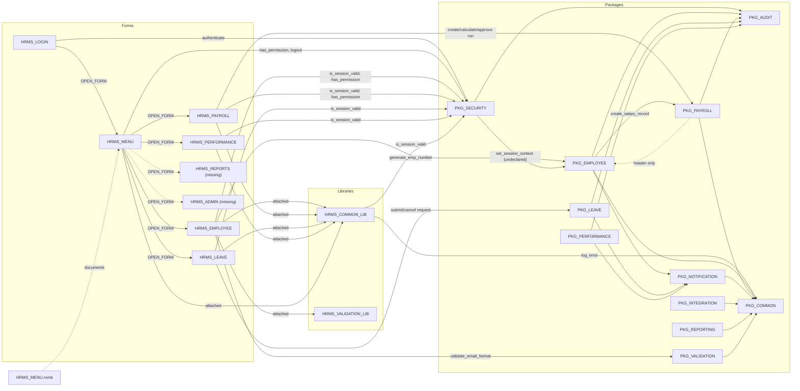
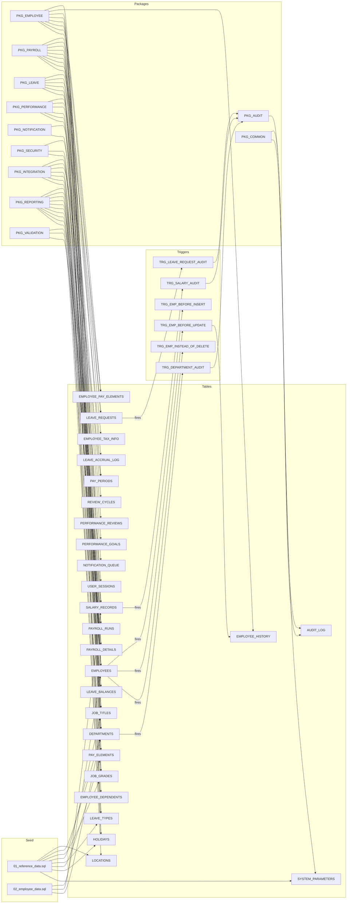
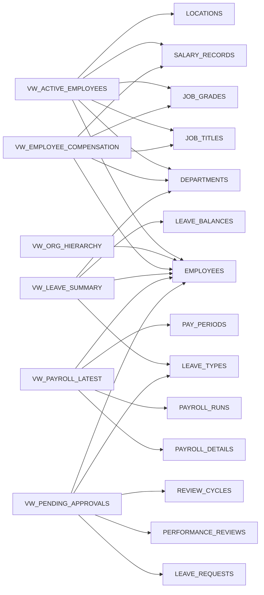

# HRMS Dependency Map

Component-to-component dependencies derived from reading every source file in the repository. Each
relationship is presented as a table and in the Mermaid diagrams below. Counts used here (6 forms, 2 PLL
libraries, 1 menu module, 11 packages, 30 tables, 6 views, 29 sequences, 7 DB triggers, 2 seed scripts)
are the actual repository contents, not the README figures (18 forms / 12 packages / 42 tables / 15 views /
200+ triggers / 8 reports). Oracle Reports `.rdf` files are referenced by `README.md`, `hrms_views.sql` and
`PKG_REPORTING.pks` but none exist in the repo, so no report dependencies can be mapped.

Legend for evidence type:

- **body** — an executable call/DML statement in a `.pkb`, trigger, form trigger text or library.
- **header** — declared only in a `.pks` `Dependencies:` comment.
- **comment/TODO** — mentioned only in a comment.

---

## 1. Forms -> Libraries / Menu / Forms

| From (form) | To | Kind | Evidence |
|---|---|---|---|
| HRMS_EMPLOYEE | HRMS_COMMON_LIB | attached library | `HRMS_EMPLOYEE.xml` line 22 |
| HRMS_EMPLOYEE | HRMS_VALIDATION_LIB | attached library | line 23 |
| HRMS_EMPLOYEE | HRMS_MENU (menu module) | menu | line 16 |
| HRMS_PAYROLL | HRMS_COMMON_LIB | attached library | `HRMS_PAYROLL.xml` line 19 |
| HRMS_PAYROLL | HRMS_MENU (menu module) | menu | line 16 |
| HRMS_LEAVE | HRMS_COMMON_LIB | attached library | `HRMS_LEAVE.xml` line 19 |
| HRMS_LEAVE | HRMS_MENU (menu module) | menu | line 16 |
| HRMS_PERFORMANCE | HRMS_COMMON_LIB | attached library | `HRMS_PERFORMANCE.xml` line 18 |
| HRMS_PERFORMANCE | HRMS_MENU (menu module) | menu | line 15 |
| HRMS_MENU | HRMS_COMMON_LIB | attached library | `HRMS_MENU.xml` line 16 |
| HRMS_LOGIN | HRMS_MENU (form) | `OPEN_FORM` | `HRMS_LOGIN.xml` line 93 |
| HRMS_MENU | HRMS_EMPLOYEE, HRMS_PAYROLL, HRMS_LEAVE, HRMS_PERFORMANCE | `OPEN_FORM` | `HRMS_MENU.xml` lines 63, 79, 91, 103, 153-159 |
| HRMS_MENU | HRMS_REPORTS, HRMS_ADMIN | `OPEN_FORM` to **missing** forms | `HRMS_MENU.xml` lines 119, 161, 165; `HRMS_MENU.mmb.sql` lines 46-47 |

No form trigger text calls any procedure/function defined in either PLL library; the attachments are declarative only.

## 2. Forms -> Packages

| From (form) | To (package.routine) | Evidence (line) |
|---|---|---|
| HRMS_LOGIN | `PKG_SECURITY.authenticate` | `HRMS_LOGIN.xml` 75 |
| HRMS_MENU | `PKG_SECURITY.has_permission` | `HRMS_MENU.xml` 26, 30, 34, 75, 115 |
| HRMS_MENU | `PKG_SECURITY.logout` | 131, 149 |
| HRMS_EMPLOYEE | `PKG_SECURITY.is_session_valid` | `HRMS_EMPLOYEE.xml` 35 |
| HRMS_EMPLOYEE | `PKG_SECURITY.has_permission` | 45 |
| HRMS_EMPLOYEE | `PKG_EMPLOYEE.generate_emp_number` | 327 |
| HRMS_EMPLOYEE | `PKG_VALIDATION.validate_email_format` | 377 |
| HRMS_PAYROLL | `PKG_SECURITY.is_session_valid`, `has_permission` | `HRMS_PAYROLL.xml` 28, 34, 137 |
| HRMS_PAYROLL | `PKG_PAYROLL.create_payroll_run` | 98 |
| HRMS_PAYROLL | `PKG_PAYROLL.calculate_payroll` | 122 |
| HRMS_PAYROLL | `PKG_PAYROLL.approve_payroll` | 142 |
| HRMS_LEAVE | `PKG_SECURITY.is_session_valid` | `HRMS_LEAVE.xml` 25 |
| HRMS_LEAVE | `PKG_LEAVE.cancel_leave_request` | 84 |
| HRMS_LEAVE | `PKG_LEAVE.submit_leave_request` | 152 |
| HRMS_PERFORMANCE | `PKG_SECURITY.is_session_valid` | `HRMS_PERFORMANCE.xml` 23 |

Libraries -> packages: `HRMS_COMMON_LIB` -> `PKG_COMMON.log_error` (line 25), `PKG_SECURITY.is_session_valid` (line 134). `HRMS_VALIDATION_LIB` -> none.

## 3. Forms / Libraries -> Tables and Sequences (direct SQL)

| From | Table / sequence | Use | Evidence |
|---|---|---|---|
| HRMS_LOGIN | `EMPLOYEES` | SELECT | `HRMS_LOGIN.xml` 86-90 |
| HRMS_EMPLOYEE | `EMPLOYEES` | block base table; `RG_MANAGERS` | 111, 488 |
| HRMS_EMPLOYEE | `SALARY_RECORDS` | block base table | 432 |
| HRMS_EMPLOYEE | `DEPARTMENTS` | `RG_DEPARTMENTS`, validate/post-query lookups | 466, 391 |
| HRMS_EMPLOYEE | `JOB_TITLES`, `JOB_GRADES` | `RG_JOB_TITLES`, lookups | 476, 402 |
| HRMS_EMPLOYEE | `LOCATIONS` | `RG_LOCATIONS` | 500 |
| HRMS_EMPLOYEE | `SEQ_EMPLOYEE` | `NEXTVAL` in `PRE-INSERT` | 326 |
| HRMS_PAYROLL | `PAY_PERIODS`, `PAYROLL_RUNS` | block base tables | 52, 70 |
| HRMS_LEAVE | `LEAVE_REQUESTS`, `LEAVE_BALANCES` | block base tables | 54, 176 |
| HRMS_LEAVE | `LEAVE_TYPES` | `RG_LEAVE_TYPES` | 195 |
| HRMS_PERFORMANCE | `REVIEW_CYCLES`, `PERFORMANCE_REVIEWS`, `PERFORMANCE_GOALS` | block base tables | 41, 58, 96 |
| HRMS_PERFORMANCE | `EMPLOYEES` | `POST-QUERY` lookup | 79 ff. |
| HRMS_VALIDATION_LIB | `JOB_GRADES` | SELECT | `HRMS_VALIDATION_LIB.pll.sql` 123 |

## 4. Packages -> Packages

Rows marked **body** are executable. Rows marked **header only** are declared in the `.pks` but have no
corresponding call in the `.pkb`. Rows marked **body, undeclared** are executable but absent from the header.

| From | To | Evidence type | Location |
|---|---|---|---|
| PKG_EMPLOYEE | PKG_PAYROLL (`create_salary_record`) | body | `PKG_EMPLOYEE.pkb` 275, 617, 778 |
| PKG_EMPLOYEE | PKG_PAYROLL (`calculate_final_pay`) | comment/TODO | 739 |
| PKG_EMPLOYEE | PKG_AUDIT (`log_action`) | body | 298, 388, 570, 641, 723, 792 |
| PKG_EMPLOYEE | PKG_NOTIFICATION (`send_notification`) | body | 306, 317, 727 |
| PKG_EMPLOYEE | PKG_COMMON (`log_error`) | body | 335, 574, 743 |
| PKG_EMPLOYEE | PKG_SECURITY | comment/TODO | 738 |
| PKG_PAYROLL | PKG_COMMON (`log_error`) | body | `PKG_PAYROLL.pkb` 547, 892 |
| PKG_PAYROLL | PKG_AUDIT (`log_action`) | body | `PKG_PAYROLL.pkb` 57, 599 |
| PKG_PAYROLL | PKG_EMPLOYEE | **header only** (`.pks` line 6, "is_active check" line 9) | no `PKG_EMPLOYEE.` reference anywhere in `PKG_PAYROLL.pkb` |
| PKG_PAYROLL | PKG_NOTIFICATION | header only | `.pks` line 6 |
| PKG_LEAVE | PKG_AUDIT (`log_action`) | body | `PKG_LEAVE.pkb` 204, 262, 313, 363, 421 |
| PKG_LEAVE | PKG_NOTIFICATION (`send_notification`) | body | `PKG_LEAVE.pkb` 186, 251, 305 |
| PKG_LEAVE | PKG_EMPLOYEE, PKG_COMMON | header only | `PKG_LEAVE.pks` |
| PKG_PERFORMANCE | PKG_AUDIT, PKG_NOTIFICATION | body | `PKG_PERFORMANCE.pkb` 29 (audit); 83, 121, 172 (notification) |
| PKG_PERFORMANCE | PKG_EMPLOYEE, PKG_COMMON | header only | `PKG_PERFORMANCE.pks` |
| PKG_NOTIFICATION | PKG_COMMON (`log_error`, `log_info`) | body | `PKG_NOTIFICATION.pkb` 61, 140 |
| PKG_INTEGRATION | PKG_COMMON (`log_info`, `log_error`, `get_param`) | body | `PKG_INTEGRATION.pkb` 74, 81, 138, 145, 178, 185, 192, 201, 209 |
| PKG_INTEGRATION | PKG_PAYROLL, PKG_EMPLOYEE | header only | `PKG_INTEGRATION.pks` line 6 |
| PKG_REPORTING | PKG_COMMON (`log_info`) | body | `PKG_REPORTING.pkb` 202 |
| PKG_REPORTING | PKG_EMPLOYEE, PKG_PAYROLL | header only | `PKG_REPORTING.pks` line 6 |
| PKG_SECURITY | PKG_AUDIT (`log_action`) | body | `PKG_SECURITY.pkb` 77, 233 |
| PKG_SECURITY | PKG_EMPLOYEE (`set_session_context`) | **body, undeclared** | `PKG_SECURITY.pkb` 75 (header lists only `PKG_COMMON`, `PKG_AUDIT`) |
| PKG_SECURITY | PKG_COMMON | header only | `PKG_SECURITY.pks` |
| PKG_VALIDATION | PKG_COMMON (`is_valid_email`, `is_valid_phone`) | body | `PKG_VALIDATION.pkb` 54, 61 |
| PKG_AUDIT | — | none | leaf package |
| PKG_COMMON | — | none | leaf package |

### Effective (body-level) call graph

```
PKG_SECURITY    -> PKG_EMPLOYEE, PKG_AUDIT
PKG_EMPLOYEE    -> PKG_PAYROLL, PKG_AUDIT, PKG_NOTIFICATION, PKG_COMMON
PKG_PAYROLL     -> PKG_AUDIT, PKG_COMMON
PKG_LEAVE       -> PKG_AUDIT, PKG_NOTIFICATION
PKG_PERFORMANCE -> PKG_AUDIT, PKG_NOTIFICATION
PKG_NOTIFICATION-> PKG_COMMON
PKG_INTEGRATION -> PKG_COMMON
PKG_REPORTING   -> PKG_COMMON
PKG_VALIDATION  -> PKG_COMMON
PKG_AUDIT, PKG_COMMON -> (none)
```

## 5. Packages -> Tables

| Package | INSERT | UPDATE | DELETE | SELECT (FROM/JOIN) | Sequences |
|---|---|---|---|---|---|
| PKG_AUDIT | AUDIT_LOG | — | AUDIT_LOG (`purge_old_records`) | AUDIT_LOG | SEQ_AUDIT |
| PKG_COMMON | AUDIT_LOG | SYSTEM_PARAMETERS | — | SYSTEM_PARAMETERS | SEQ_AUDIT |
| PKG_EMPLOYEE | EMPLOYEES, EMPLOYEE_HISTORY | EMPLOYEES, SALARY_RECORDS, EMPLOYEE_PAY_ELEMENTS, LEAVE_REQUESTS | — | EMPLOYEES, DEPARTMENTS, JOB_TITLES, JOB_GRADES, SALARY_RECORDS, LEAVE_REQUESTS | SEQ_EMPLOYEE, SEQ_EMP_HISTORY |
| PKG_INTEGRATION | — | — | — | PAYROLL_DETAILS, PAYROLL_RUNS, PAY_PERIODS, PAY_ELEMENTS, EMPLOYEES, DEPARTMENTS, EMPLOYEE_DEPENDENTS (+ SYSTEM_PARAMETERS via PKG_COMMON) | — |
| PKG_LEAVE | LEAVE_REQUESTS, LEAVE_BALANCES, LEAVE_ACCRUAL_LOG | LEAVE_REQUESTS, LEAVE_BALANCES | — | EMPLOYEES, LEAVE_TYPES, LEAVE_BALANCES, LEAVE_REQUESTS, HOLIDAYS | SEQ_LEAVE_REQUEST, SEQ_LEAVE_BALANCE, SEQ_LEAVE_ACCRUAL |
| PKG_NOTIFICATION | NOTIFICATION_QUEUE | NOTIFICATION_QUEUE | — | EMPLOYEES, NOTIFICATION_QUEUE | SEQ_NOTIFICATION |
| PKG_PAYROLL | SALARY_RECORDS, PAY_PERIODS, PAYROLL_RUNS, PAYROLL_DETAILS | SALARY_RECORDS, PAY_PERIODS, PAYROLL_RUNS, PAYROLL_DETAILS | — | EMPLOYEES, DEPARTMENTS, SALARY_RECORDS, PAY_ELEMENTS, EMPLOYEE_PAY_ELEMENTS, EMPLOYEE_TAX_INFO, PAY_PERIODS, PAYROLL_RUNS, PAYROLL_DETAILS | SEQ_SALARY, SEQ_PAY_PERIOD, SEQ_PAYROLL_RUN, SEQ_PAYROLL_DETAIL |
| PKG_PERFORMANCE | REVIEW_CYCLES, PERFORMANCE_REVIEWS, PERFORMANCE_GOALS | REVIEW_CYCLES, PERFORMANCE_REVIEWS, PERFORMANCE_GOALS | — | EMPLOYEES, JOB_TITLES, DEPARTMENTS, PERFORMANCE_REVIEWS | SEQ_REVIEW_CYCLE, SEQ_PERF_REVIEW, SEQ_PERF_GOAL |
| PKG_REPORTING | — | — | — | EMPLOYEES, DEPARTMENTS, LOCATIONS, JOB_TITLES, JOB_GRADES, SALARY_RECORDS, LEAVE_BALANCES, LEAVE_TYPES, PAYROLL_RUNS, PAYROLL_DETAILS | — |
| PKG_SECURITY | USER_SESSIONS | USER_SESSIONS | — | EMPLOYEES, JOB_TITLES, USER_SESSIONS | SEQ_USER_SESSION |
| PKG_VALIDATION | — | — | — | JOB_GRADES, HOLIDAYS, EMPLOYEES | — |

Tables not touched by any package or form: `TAX_BRACKETS` (only mentioned in `PKG_PAYROLL` comments),
`EMPLOYEE_BANK_ACCOUNTS`, `LOOKUP_VALUES`, `EMERGENCY_CONTACTS`. `EMPLOYEE_DEPENDENTS` is read only by `PKG_INTEGRATION`.

## 6. Triggers -> Tables / Packages / Sequences

| Trigger | Fires on | Reads/writes | Package calls | Sequences | Evidence |
|---|---|---|---|---|---|
| TRG_EMP_BEFORE_INSERT | EMPLOYEES | SELECT `EMPLOYEES` | — | — | `trg_employees.sql` 12-56 |
| TRG_EMP_BEFORE_UPDATE | EMPLOYEES | INSERT `EMPLOYEE_HISTORY` (column names do not match DDL) | `PKG_EMPLOYEE.rehire_employee` (comment only, line 70) | SEQ_EMP_HISTORY | 62-112 |
| TRG_EMP_INSTEAD_OF_DELETE | EMPLOYEES | — (raises error) | — | — | 120-130 |
| TRG_SALARY_AUDIT | SALARY_RECORDS | — | `PKG_AUDIT.log_action` | (SEQ_AUDIT indirectly) | `trg_audit.sql` 10-41 |
| TRG_LEAVE_REQUEST_AUDIT | LEAVE_REQUESTS | — | `PKG_AUDIT.log_action` | (SEQ_AUDIT indirectly) | 47-60 |
| TRG_DEPARTMENT_AUDIT | DEPARTMENTS | — | `PKG_AUDIT.log_action` | (SEQ_AUDIT indirectly) | 66-84 |

## 7. Views -> Tables

| View | Base tables | Lines |
|---|---|---|
| VW_ACTIVE_EMPLOYEES | EMPLOYEES (self-join for manager), DEPARTMENTS, JOB_TITLES, JOB_GRADES, LOCATIONS, SALARY_RECORDS | `hrms_views.sql` 10-37 |
| VW_ORG_HIERARCHY | EMPLOYEES | 47-57 |
| VW_EMPLOYEE_COMPENSATION | EMPLOYEES, DEPARTMENTS, JOB_TITLES, JOB_GRADES, SALARY_RECORDS | 63-80 |
| VW_LEAVE_SUMMARY | LEAVE_BALANCES, EMPLOYEES, DEPARTMENTS, LEAVE_TYPES | 86-103 |
| VW_PAYROLL_LATEST | PAYROLL_DETAILS, EMPLOYEES, PAYROLL_RUNS, PAY_PERIODS | 109-129 |
| VW_PENDING_APPROVALS | LEAVE_REQUESTS, EMPLOYEES, LEAVE_TYPES, PERFORMANCE_REVIEWS, REVIEW_CYCLES | 135-159 |

## 8. Seed scripts -> Tables

| Script | INSERT | UPDATE |
|---|---|---|
| `data/seed/01_reference_data.sql` | LOCATIONS, DEPARTMENTS, JOB_GRADES, JOB_TITLES, LEAVE_TYPES, PAY_ELEMENTS, HOLIDAYS, SYSTEM_PARAMETERS | — |
| `data/seed/02_employee_data.sql` | EMPLOYEES, SALARY_RECORDS | DEPARTMENTS (`MANAGER_EMP_ID`, lines 164-170) |

Execution-order implication: `02_employee_data.sql` inserting `EMPLOYEES` fires `TRG_EMP_BEFORE_INSERT`;
inserting `SALARY_RECORDS` fires `TRG_SALARY_AUDIT` -> `PKG_AUDIT`; updating `DEPARTMENTS` fires
`TRG_DEPARTMENT_AUDIT` -> `PKG_AUDIT`. Seed therefore transitively depends on `PKG_AUDIT`, `AUDIT_LOG` and `SEQ_AUDIT`.

---

## 9. Mermaid diagrams

### 9.1 Forms, libraries, menu and packages



Solid arrows = executable (body) dependencies; dashed arrows = header-only / missing targets.

### 9.2 Packages, triggers, seed scripts and tables



### 9.3 Views -> tables



---

## 10. Circular Dependencies

### 10.1 Documented cycle: PKG_EMPLOYEE <-> PKG_PAYROLL

| Direction | Declared in `.pks` | Executable in `.pkb` | Evidence |
|---|---|---|---|
| PKG_EMPLOYEE -> PKG_PAYROLL | yes (`PKG_EMPLOYEE.pks` header; body comment line 273 "Circular dependency") | **yes** — `PKG_PAYROLL.create_salary_record(...)` called in `create_employee` (line 275), `promote_employee` (617), `rehire_employee` (778); `calculate_final_pay` only in TODO (739) | `plsql/packages/PKG_EMPLOYEE.pkb` |
| PKG_PAYROLL -> PKG_EMPLOYEE | yes (`PKG_PAYROLL.pks` line 6 "Dependencies: PKG_EMPLOYEE, ..."; line 9 "Circular dependency with PKG_EMPLOYEE (is_active check)") | **no** — `PKG_PAYROLL.pkb` (897 lines) contains no `PKG_EMPLOYEE.` reference; employee status is checked with inline SQL against `EMPLOYEES` instead | `plsql/packages/PKG_PAYROLL.pkb` |

Verdict: the cycle is **documented in both headers and in the README (line 130), but only one direction is
executable** in the checked-in bodies. At the Oracle object-dependency level the two packages therefore do
*not* form a compile-time cycle today: `PKG_PAYROLL` can be compiled first, then `PKG_EMPLOYEE`. The
`is_active` call that the `PKG_PAYROLL.pks` header describes appears to have been replaced by direct SQL
(or was never implemented). Any modernisation that re-introduces `PKG_EMPLOYEE.is_active` into payroll
would create the real cycle, which Oracle tolerates only for package bodies (specs must remain acyclic).

### 10.2 Other cycles found in the package call graph

Cycle detection over the **body-level** edges listed in section 4 (Tarjan/DFS by inspection):

```
PKG_SECURITY -> PKG_EMPLOYEE -> PKG_PAYROLL -> PKG_AUDIT      (no back edge)
PKG_SECURITY -> PKG_EMPLOYEE -> PKG_NOTIFICATION -> PKG_COMMON (no back edge)
PKG_SECURITY -> PKG_EMPLOYEE -> PKG_COMMON                    (no back edge)
```

`PKG_AUDIT` and `PKG_COMMON` are leaves; `PKG_NOTIFICATION`, `PKG_INTEGRATION`, `PKG_REPORTING`,
`PKG_VALIDATION` depend only on `PKG_COMMON`; `PKG_LEAVE` and `PKG_PERFORMANCE` depend only on `PKG_AUDIT`
and `PKG_NOTIFICATION`. **No executable cycle exists** in the body-level graph. A valid compile order is:

```
PKG_COMMON, PKG_AUDIT, PKG_NOTIFICATION, PKG_VALIDATION, PKG_INTEGRATION, PKG_REPORTING,
PKG_PAYROLL, PKG_LEAVE, PKG_PERFORMANCE, PKG_EMPLOYEE, PKG_SECURITY
```

Cycle detection over the **header-declared** edges (what the authors believed):

- `PKG_EMPLOYEE <-> PKG_PAYROLL` — declared both ways (see 10.1).
- `PKG_EMPLOYEE -> PKG_PAYROLL -> PKG_EMPLOYEE -> PKG_NOTIFICATION -> PKG_COMMON` — no further cycle.
- `PKG_SECURITY` header omits `PKG_EMPLOYEE`, so the header graph misses the real
  `PKG_SECURITY -> PKG_EMPLOYEE -> PKG_PAYROLL` chain; with the observed edge added there is still no cycle
  because nothing calls back into `PKG_SECURITY` (the `PKG_EMPLOYEE.pkb` line 738 reference is a TODO comment).

### 10.3 Cross-layer cycles worth noting for migration

These are not package-to-package cycles but do create circular runtime coupling:

| Cycle | Path | Evidence |
|---|---|---|
| Employee insert <-> audit | `PKG_EMPLOYEE.create_employee` inserts `EMPLOYEES` -> `TRG_EMP_BEFORE_INSERT` re-queries `EMPLOYEES`; `PKG_EMPLOYEE` then calls `PKG_PAYROLL.create_salary_record` -> insert `SALARY_RECORDS` -> `TRG_SALARY_AUDIT` -> `PKG_AUDIT` (autonomous commit) while the outer transaction is still open | `PKG_EMPLOYEE.pkb` 258-282, `trg_employees.sql` 42-54, `trg_audit.sql` 32-39 |
| Session context | `HRMS_LOGIN` -> `PKG_SECURITY.authenticate` -> `PKG_EMPLOYEE.set_session_context` sets package globals that Forms later re-derive independently from `:GLOBAL.*` (`HRMS_LOGIN.xml` 82-90) — two parallel session states that must be kept in sync | `PKG_SECURITY.pkb` 75, `PKG_EMPLOYEE.pkb` 948-963 |
| Header/body divergence | 7 header-declared package edges have no body call, and 1 body call (`PKG_SECURITY -> PKG_EMPLOYEE`) is undeclared; dependency documentation cannot be trusted without reading bodies | section 4 |
