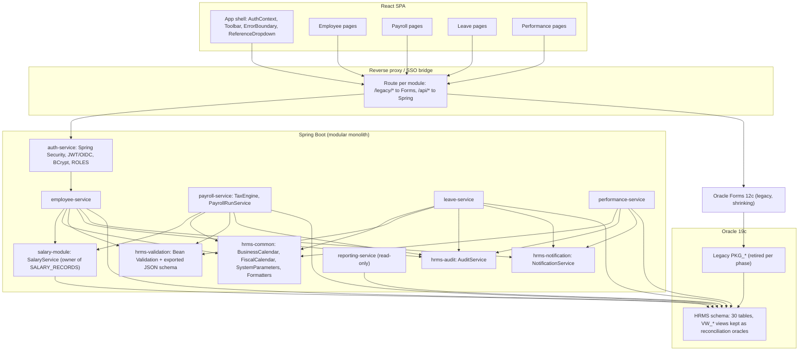

# HRMS Modernization Blueprint

Strategy evaluation for moving the Oracle Forms 12c / PL/SQL HRMS to a **Spring Boot backend + React frontend**. Every judgement below is tied to evidence already catalogued in [APPLICATION_INVEONTORY.md](APPLICATION_INVEONTORY.md), [DEPENDENCY_MAP.md](DEPENDENCY_MAP.md), [DATA_DICTIONARY.md](DATA_DICTIONARY.md) and [TECH_DEBT_REGISTRY.md](TECH_DEBT_REGISTRY.md), plus the six Forms XML exports under `forms/xml-exports/` and the eleven packages under `plsql/packages/`.

Companion documents produced with this blueprint: [COMPONENT_MAPPING.md](COMPONENT_MAPPING.md) (form → Java/React mapping), [CUTOVER_PLAN.md](CUTOVER_PLAN.md) (phasing), [RISK_REGISTER.md](RISK_REGISTER.md), [TEST_STRATEGY.md](TEST_STRATEGY.md).

> Scope note: only what is checked in is evaluated. `HRMS_REPORTS` and `HRMS_ADMIN` forms, `HRMS_REPORT_LIB.pll`, Oracle Reports `.rdf` files, `USER_CREDENTIALS`, `DBMS_SCHEDULER` job DDL, directory-object DDL and any `tests/` directory are **not in the repository** (see [APPLICATION_INVEONTORY.md](APPLICATION_INVEONTORY.md) §8). Where they matter they are called out as gaps, not evaluated as code.

---

## 1. The four strategies being compared

| Option | Description | What it means for this repo |
|---|---|---|
| **(a) Lift-and-shift to Oracle APEX** | Regenerate each form as an APEX page on the same schema; keep all PL/SQL packages, DB triggers and views untouched. | Fast for base-table blocks (`HRMS_EMPLOYEE`, `HRMS_PAYROLL`, `HRMS_PERFORMANCE`); inherits every item in `TECH_DEBT_REGISTRY.md` unchanged. Not the requested target stack. |
| **(b) Rewrite as Spring Boot + React** | Re-implement business rules in Java services over JPA entities; React SPA; PL/SQL retired per module. | Target stack. Highest one-off effort, only option that can fix SEC-*/ARCH-* structurally. |
| **(c) Rewrite as .NET + Blazor** | Same as (b) with a different runtime. | Functionally equivalent rewrite; scored lower on *target-stack fit* only because the organisation has chosen Spring Boot + React. Included for completeness. |
| **(d) Hybrid: PL/SQL packages as API layer, new UI on top** | Expose `PKG_*` through ORDS/JDBC-backed Spring controllers; React UI; Forms retired but packages stay authoritative. | Cheap where a package is *already* the only write path (`PKG_LEAVE`, `PKG_PERFORMANCE`, most of `PKG_PAYROLL`); unsafe where the package is the problem (`PKG_SECURITY`) or where the form bypasses it (`HRMS_EMPLOYEE`). |

Scoring scale used in every table: **1 = poor, 5 = excellent** from the migration team's point of view (so *low effort* = 5, *low risk* = 5).

Criteria:

- **Effort** – engineering work to reach functional parity for the area.
- **Risk** – probability of regression or a failed cutover.
- **Business-logic reuse** – how much of the existing, *correct* logic survives.
- **Security posture** – how much of the SEC-* backlog the option retires.
- **Target-stack fit** – alignment with Spring Boot + React.

---

## 2. Security / Session

**Sources:** `forms/xml-exports/HRMS_LOGIN.xml`, `forms/xml-exports/HRMS_MENU.xml`, `plsql/packages/PKG_SECURITY.pks/.pkb` (`authenticate`, `logout`, `is_session_valid`, `has_permission`, `encrypt_ssn`/`decrypt_ssn`, `hash_password`, `change_password`), `USER_SESSIONS` table (`schema/tables/04_performance_tables.sql`), shared `:GLOBAL.session_id` / `:GLOBAL.current_user` / `:GLOBAL.current_emp_id` state set in `HRMS_LOGIN.xml` lines 82–90.

### 2.1 What the code actually does

| Concern | Evidence | Registry ID |
|---|---|---|
| AES-256 key for `SSN_ENCRYPTED` / `ACCOUNT_NUMBER_ENC` is a string literal | `PKG_SECURITY.pkb:7` `c_encryption_key := UTL_RAW.CAST_TO_RAW('HR$ystem_…')` | SEC-01 |
| Passwords hashed with unsalted MD5 | `PKG_SECURITY.pkb:14-24` `DBMS_CRYPTO.HASH_MD5` | SEC-02 |
| Authentication is simulated – `authenticate` never compares a password; there is no `USER_CREDENTIALS` DDL; `change_password` only writes an audit row | `PKG_SECURITY.pkb:59-61`, `:230-233` | SEC-05 |
| Authorization derived from `JOB_GRADES.GRADE_ID` (≥8 all, ≥5 view) | `PKG_SECURITY.pkb:148-168` `has_permission` | SEC-07 |
| Session token is `SEQ_USER_SESSION.NEXTVAL`; validity = status + 30 min since `LOGIN_TIME` | `PKG_SECURITY.pkb:64`, `:98-127` | SEC-08 |
| No lockout, timing side channel, duplicate-email → `MIN(EMP_ID)` | `PKG_SECURITY.pkb:28`, `:48-56` | SEC-04, SEC-09, SEC-10 |
| Cleartext password from Forms applet | `HRMS_LOGIN.xml:11` header | SEC-06 |
| Session state is Forms `:GLOBAL` variables read by every child form (`DEFAULT_WHERE` in `HRMS_LEAVE.xml:35-36` concatenates `:GLOBAL.current_emp_id` into SQL) | `DEPENDENCY_MAP.md §2.2` | – |
| `authenticate` calls `PKG_EMPLOYEE.set_session_context` (undeclared upward dependency) | `PKG_SECURITY.pkb:75` | ARCH-03 |
| `USER_SESSIONS.USERNAME VARCHAR2(30)` vs `EMPLOYEES.EMAIL VARCHAR2(100)` | `DATA_DICTIONARY.md §4.7` | DATA-04 |

### 2.2 Comparison

| Criterion | (a) APEX | (b) Spring Boot + React | (c) .NET + Blazor | (d) Hybrid |
|---|---|---|---|---|
| Effort | 4 | 2 | 2 | 4 |
| Risk | 1 | 4 | 4 | 1 |
| Business-logic reuse | 5 (but the logic is wrong) | 1 | 1 | 5 (but the logic is wrong) |
| Security posture | 1 | 5 | 5 | 1 |
| Target-stack fit | 1 | 5 | 2 | 3 |
| **Total** | **12** | **17** | **14** | **14** |

### 2.3 Recommendation: **(b) Full rewrite – do not keep PL/SQL authentication or authorization**

Justification:

1. **There is nothing to reuse.** `authenticate` (`PKG_SECURITY.pkb:30-80`) resolves an e-mail to an `EMP_ID` and opens a session; it never verifies a credential because no credential store exists (SEC-05). Wrapping it in an API (option d) would expose a login endpoint that accepts *any* password for *any* active e-mail. APEX (option a) would do the same behind an APEX page.
2. **The key material is in the source.** Option (d) would keep `encrypt_ssn`/`decrypt_ssn` with the literal key (SEC-01) reachable from the new API. The only safe path is a Java-side crypto service with vault/KMS-managed keys and a one-off re-encryption migration of `EMPLOYEES.SSN_ENCRYPTED` and `EMPLOYEE_BANK_ACCOUNTS.ACCOUNT_NUMBER_ENC`.
3. **Password hashes must be discarded anyway.** Unsalted MD5 (SEC-02) cannot be upgraded in place; since no hash table exists in the repo, the new system starts from a forced reset / SSO federation regardless of option.
4. **The session model does not fit a stateless API.** A sequential integer in `USER_SESSIONS` (SEC-08) is not a bearer token. Spring Security + JWT (or an OIDC provider) replaces `is_session_valid`, and `:GLOBAL.current_emp_id` becomes a JWT claim resolved server-side (see [COMPONENT_MAPPING.md](COMPONENT_MAPPING.md) – `HRMS_LEAVE` `DEFAULT_WHERE`).
5. **Grade-based authorization cannot express the roles the forms need.** `has_permission` (SEC-07) is called with `('PAYROLL','VIEW')`, `('PAYROLL','APPROVE')`, `('EMPLOYEE','EDIT')`, `('ADMIN','VIEW')`, `('REPORTS','VIEW')` from `HRMS_MENU.xml` / `HRMS_PAYROLL.xml` / `HRMS_EMPLOYEE.xml`. A "payroll clerk" is impossible without grade ≥ 8. The rewrite introduces `ROLES` / `ROLE_PERMISSIONS` and maps the grade rule as a *seed* for initial role assignment only.
6. **Hybrid is actively unsafe here** because the API layer would inherit ARCH-03 (security package depending on `PKG_EMPLOYEE`) and every SEC-* item while adding a new, network-reachable attack surface for `search_employees` SQL injection (SEC-03) if the same style is used for employee lookups.

Delivered as: `auth-service` (Spring Security, JWT/OIDC, BCrypt/Argon2, `ROLES` model) in Phase 0/1 of [CUTOVER_PLAN.md](CUTOVER_PLAN.md). The legacy Forms tier keeps its own `PKG_SECURITY` session only behind the SSO bridge until Phase 5.

---

## 3. Employee

**Sources:** `forms/xml-exports/HRMS_EMPLOYEE.xml`, `plsql/packages/PKG_EMPLOYEE.pks/.pkb`, `plsql/triggers/trg_employees.sql`, `forms/libraries/HRMS_VALIDATION_LIB.pll.sql`; tables `EMPLOYEES`, `EMPLOYEE_HISTORY`, `SALARY_RECORDS` (`DATA_DICTIONARY.md §1.5, §1.6, §2.1`).

### 3.1 What the code actually does

| Concern | Evidence | Registry ID |
|---|---|---|
| **Three write paths** to `EMPLOYEES`: base-table block DML in `HRMS_EMPLOYEE.xml` (block `EMPLOYEE`, `DMLDataTargetName="HRMS.EMPLOYEES"`, lines 110-117), `TRG_EMP_*` DB triggers, and `PKG_EMPLOYEE.create_employee/update_employee`. Form DML bypasses `PKG_EMPLOYEE` entirely – no `log_history`, no notification, no salary validation. | `DEPENDENCY_MAP.md §2.5, §3.3`; `trg_employees.sql:3-5` calls this an anti-pattern | ARCH-02 |
| Hire-date rule is **90 days** in the form (`HRMS_EMPLOYEE.xml:383`) and **180 days** in `TRG_EMP_BEFORE_INSERT` (`trg_employees.sql:35`) | | VAL-01 |
| `TRG_EMP_BEFORE_UPDATE` inserts into `EMPLOYEE_HISTORY` columns (`HISTORY_ID`, `CHANGE_DATE`, `OLD_VALUE`…) that do not exist in the DDL (`HIST_ID`, `EFFECTIVE_DATE`, `OLD_DEPT_ID`…) | `trg_employees.sql:78-110` vs `01_core_tables.sql` | BUG-03 |
| `generate_emp_number` = `MAX()+1`, race under concurrency; `SEQ_EMP_NUMBER` unused | `PKG_EMPLOYEE.pkb:43` | BUG-01, PERF-04 |
| `search_employees` builds SQL by concatenation | `PKG_EMPLOYEE.pkb:445-499` | SEC-03 |
| `create_employee` calls `PKG_PAYROLL.create_salary_record` – the Employee⇄Payroll cycle | `PKG_EMPLOYEE.pkb:~273`, `PKG_PAYROLL.pks` header | ARCH-01 |
| `set_session_context` lives here but is called by `PKG_SECURITY` | `PKG_SECURITY.pkb:75` | ARCH-03 |
| `terminate_employee` TODOs: no session revocation, `calculate_final_pay` does not exist | `PKG_EMPLOYEE.pkb:739` | BUG-07 |
| Validation rules exist three times (PLL, `PKG_VALIDATION`, inline in `PKG_EMPLOYEE.validate_employee`) | `HRMS_VALIDATION_LIB.pll.sql`, `PKG_VALIDATION.pkb` | VAL-02, VAL-03 |
| Header claims 5 blocks / 8 LOVs; export defines 2 blocks (`EMPLOYEE`, `SALARY`) and 4 LOVs | `HRMS_EMPLOYEE.xml` header vs body (blocks at lines 110, 431; record groups 465-499) | – (header/body mismatch; not a registry item) |

### 3.2 Comparison

| Criterion | (a) APEX | (b) Spring Boot + React | (c) .NET + Blazor | (d) Hybrid |
|---|---|---|---|---|
| Effort | 3 | 2 | 2 | 3 |
| Risk | 2 | 3 | 3 | 2 |
| Business-logic reuse | 3 (reuses the *bypass*) | 3 (rules re-derived from `PKG_EMPLOYEE` + triggers) | 3 | 4 |
| Security posture | 1 (SEC-03 kept) | 5 | 5 | 2 |
| Target-stack fit | 1 | 5 | 2 | 3 |
| **Total** | **10** | **18** | **15** | **14** |

### 3.3 Recommendation: **(b) Rewrite, with a shared `SalaryService` extracted first**

- **Against lift-and-shift (a):** APEX would regenerate the base-table blocks as APEX forms, i.e. it would *institutionalise* ARCH-02. The DB triggers would remain the only rules on that path, and `TRG_EMP_BEFORE_UPDATE` is likely invalid against the checked-in DDL (BUG-03), so Forms-path updates today probably write **no** history at all. Lifting that behaviour is lifting a defect.
- **Against pure hybrid (d):** `PKG_EMPLOYEE` is the *right* place for the rules but the form does not use it, so the API would have to be the first caller ever to route all writes through it. At that point every rule still has to be reconciled (90 vs 180 days, which history columns are real), and `search_employees` (SEC-03) would need rewriting anyway. The reconciliation work is the rewrite.
- **Why (b):** a single `EmployeeService` becomes the only write path: `EmployeeNumberGenerator` backed by `SEQ_EMP_NUMBER` (fixes BUG-01/PERF-04), Bean Validation + one `HireDateRule` (resolving VAL-01 to a single agreed value, see [TEST_STRATEGY.md](TEST_STRATEGY.md) "preserve vs fix"), `EmployeeHistoryService` writing the *real* `EMPLOYEE_HISTORY` columns, and a JPA `Specification`-based search replacing the dynamic SQL. `TRG_EMP_*` are retired once the form is gone; `TRG_EMP_INSTEAD_OF_DELETE` semantics (`-20504`, soft delete only) become a service invariant.
- **ARCH-01:** `create_employee` → `create_salary_record` is the only real edge of the cycle. Extract `SalaryService` (owner of `SALARY_RECORDS`, "exactly one `ACTIVE_FLAG='Y'` row per employee" invariant, `TRG_SALARY_AUDIT` behaviour) as a shared module depended on by *both* Employee and Payroll services. This must land before Employee cutover (Phase 3) so Payroll (Phase 4) can be split later without a cycle.

---

## 4. Payroll

**Sources:** `forms/xml-exports/HRMS_PAYROLL.xml`, `plsql/packages/PKG_PAYROLL.pks/.pkb`; tables `PAY_PERIODS`, `PAYROLL_RUNS`, `PAYROLL_DETAILS`, `PAY_ELEMENTS`, `EMPLOYEE_PAY_ELEMENTS`, `EMPLOYEE_TAX_INFO`, `TAX_BRACKETS` (`DATA_DICTIONARY.md §2`).

### 4.1 What the code actually does

| Concern | Evidence | Registry ID |
|---|---|---|
| Form is thin: two read-only base-table blocks (`PAY_PERIOD`, `PAYROLL_RUN`) + three buttons calling `create_payroll_run`, `calculate_payroll`, `approve_payroll` | `HRMS_PAYROLL.xml:51-142` | – |
| `calculate_federal_tax` hard-codes 2024 brackets; `calculate_state_tax` is a `CASE` with `ELSE 0.05`; `TAX_BRACKETS` never read; `c_allowance_amount` 4300 constant | `PKG_PAYROLL.pkb:605-714` | BUG-02 |
| Row-by-row cursor loop, `COMMIT` every 50 employees → half-calculated runs on failure | `PKG_PAYROLL.pkb:295-326` | PERF-01, PERF-02 |
| Pay-element IDs 100–103 (`FED_TAX`, `STATE_TAX`, `FICA`, `MEDICARE`) hard-coded | `DATA_DICTIONARY.md §2.2` | – |
| `get_payslip` YTD placeholders = 0; `generate_pay_register` writes flat file via `UTL_FILE` to directory `PAYROLL_OUTPUT` (no DDL) | `PKG_PAYROLL.pkb:784-785`, `:842` | BUG-08, SEC-11, ARCH-05 |
| `PKG_PAYROLL.pks` declares `PKG_EMPLOYEE` dependency; body has no such call | `DEPENDENCY_MAP.md §3.1` | ARCH-01 |
| Header claims 4 blocks / 3 LOVs; export has 2 blocks, 0 LOVs | `HRMS_PAYROLL.xml` header vs blocks at lines 51, 69 | – (header/body mismatch; not a registry item) |

### 4.2 Comparison

| Criterion | (a) APEX | (b) Spring Boot + React | (c) .NET + Blazor | (d) Hybrid |
|---|---|---|---|---|
| Effort | 4 | 1 | 1 | 4 |
| Risk | 3 | 2 | 2 | 3 |
| Business-logic reuse | 5 (incl. BUG-02) | 2 | 2 | 5 (incl. BUG-02) |
| Security posture | 2 | 4 | 4 | 3 |
| Target-stack fit | 1 | 5 | 2 | 3 |
| **Total** | **15** | **14** | **11** | **18** |

### 4.3 Recommendation: **(d) Hybrid short-term → (b) rewrite as the Phase 4 deliverable**

Payroll is the one area where the raw scores favour hybrid, and where the answer is *time-dependent*:

- **Short-term hybrid is viable.** `HRMS_PAYROLL.xml` already treats `PKG_PAYROLL` as an API: the form itself contains no calculation logic. A `PayrollController` that calls `create_payroll_run` / `calculate_payroll` / `approve_payroll` via JDBC (`SimpleJdbcCall`) and reads `PAY_PERIODS` / `PAYROLL_RUNS` through JPA reproduces the form exactly. This lets the Forms tier be retired for payroll operators early, and gives the parallel-run harness in [TEST_STRATEGY.md](TEST_STRATEGY.md) a stable oracle.
- **Short-term hybrid does not fix money.** BUG-02 means withholding is wrong for any tax year other than 2024 and for any state not in the `CASE`. Hybrid *freezes* that. PERF-02's partial commits also mean the API would have to add idempotent restart logic around a package that cannot provide it.
- **Therefore the target is (b).** A Java `TaxEngine` driven by `TAX_BRACKETS` (year + filing status + state; the table already exists with no reader – DATA-05), a `PayrollRunService` that calculates a run in one transaction (or in explicitly checkpointed, restartable batches via Spring Batch), and a `PayRegisterExporter` replacing `UTL_FILE`. The corrected engine is validated against the legacy engine only for **2024 inputs**, where both must agree; for other years the test oracle is the bracket table, not the package (see [TEST_STRATEGY.md](TEST_STRATEGY.md) "preserve vs fix").
- **ARCH-01 constraint.** `SALARY_RECORDS` ownership must already have moved to the shared `SalaryService` (Section 3.3) before the payroll rewrite; otherwise the Java `PayrollService` re-creates the cycle by owning salary records that `EmployeeService` also writes. Payroll is therefore the *last* domain to cut over (Phase 4).

---

## 5. Leave

**Sources:** `forms/xml-exports/HRMS_LEAVE.xml`, `plsql/packages/PKG_LEAVE.pks/.pkb`; tables `LEAVE_REQUESTS`, `LEAVE_BALANCES`, `LEAVE_TYPES`, `HOLIDAYS`, `LEAVE_ACCRUAL_LOG` (`DATA_DICTIONARY.md §3`).

### 5.1 What the code actually does

| Concern | Evidence | Registry ID |
|---|---|---|
| Self-contained: form blocks are read-only (`LEAVE_REQUEST`, `LEAVE_BALANCE`) plus a control block; all writes go through `PKG_LEAVE.submit_leave_request` / `cancel_leave_request` | `HRMS_LEAVE.xml:85`, `:153-159` | – |
| `PKG_LEAVE` depends only on `PKG_AUDIT`, `PKG_NOTIFICATION` (direct); `PKG_EMPLOYEE`/`PKG_COMMON` are declared-only | `DEPENDENCY_MAP.md §2.7` | – |
| Row filter is `DEFAULT_WHERE 'EMP_ID = ' || :GLOBAL.current_emp_id` – client-side trust of a global | `HRMS_LEAVE.xml:35-36` | – |
| `expire_carryover` over-deducts when carryover already consumed | `PKG_LEAVE.pkb:606-623` | BUG-04 |
| `calculate_business_days` ignores observed holidays | `PKG_LEAVE.pkb:9-11` | BUG-05 |
| Half-day AM/PM on same day reported as overlap | `PKG_LEAVE.pkb:45-62` | BUG-06 |
| `VW_LEAVE_SUMMARY.AVAILABLE` omits `- PENDING` unlike the table's virtual column | `hrms_views.sql:96` | VAL-05 |
| Error contract: `-20201` insufficient balance, `-20202` overlap, `-20203` invalid type / tenure, `-20204` bad status transition, `-20210/-20211/-20212` date rules | `PKG_LEAVE.pkb:92-150, 226, 282, 332` | – |
| Header claims 5 blocks / 3 LOVs (Approvals, Team Calendar tabs); export has 3 blocks, 1 LOV; `get_pending_requests` / `get_team_calendar` exist in the package but have no UI | `HRMS_LEAVE.xml` header vs body, `PKG_LEAVE.pks` | – (header/body mismatch; not a registry item) |
| Accrual / carryover batches assume `DBMS_SCHEDULER` jobs that are not in the repo | `PKG_LEAVE.pks` comments | PROC-02 |

### 5.2 Comparison

| Criterion | (a) APEX | (b) Spring Boot + React | (c) .NET + Blazor | (d) Hybrid |
|---|---|---|---|---|
| Effort | 4 | 3 | 3 | 4 |
| Risk | 3 | 4 | 4 | 3 |
| Business-logic reuse | 5 (incl. BUG-04/05/06) | 4 (rules are explicit and small) | 4 | 5 |
| Security posture | 2 | 4 | 4 | 3 |
| Target-stack fit | 1 | 5 | 2 | 3 |
| **Total** | **15** | **20** | **17** | **18** |

### 5.3 Recommendation: **(b) Rewrite**

`PKG_LEAVE` is 673 lines of clear, single-purpose logic with a well-defined error contract and no cross-domain writes. It is a textbook rewrite candidate:

- The rules (`MIN_TENURE_DAYS`, ≤ 5 days in the past, business-day count with holidays, overlap check, balance check against `AVAILABLE`) map one-to-one to a `LeaveRequestService` with domain exceptions carrying the same codes.
- The rewrite is the natural moment to **fix** BUG-04 (`GREATEST(0, CARRYOVER_FROM_PREV - USED)` + idempotency flag), BUG-05 (observed-holiday shift) and BUG-06 (`HALF_DAY_PERIOD` in overlap predicate) – all agreed as "fix" in [TEST_STRATEGY.md](TEST_STRATEGY.md).
- Accrual / carryover become Spring `@Scheduled` jobs (replacing the missing `DBMS_SCHEDULER` DDL) using set-based JPQL/SQL (PERF-05).
- Hybrid (d) scores close, but would leave BUG-04/05/06 in place and keep `PKG_NOTIFICATION`'s `UTL_SMTP`-from-the-database path alive (ARCH-05).

---

## 6. Performance

**Sources:** `forms/xml-exports/HRMS_PERFORMANCE.xml`, `plsql/packages/PKG_PERFORMANCE.pks/.pkb`; tables `REVIEW_CYCLES`, `PERFORMANCE_REVIEWS`, `PERFORMANCE_GOALS` (`DATA_DICTIONARY.md §4.1-4.3`).

### 6.1 What the code actually does

| Concern | Evidence | Registry ID |
|---|---|---|
| Read-mostly browser: cycle → reviews → goals master/detail; only `PKG_SECURITY.is_session_valid` is called; no `PKG_PERFORMANCE` call from the form | `HRMS_PERFORMANCE.xml:23`, `DEPENDENCY_MAP.md §2.4` | – |
| `PERFORMANCE_REVIEW` block `UpdateAllowed="Yes"`, `PERFORMANCE_GOAL` `InsertAllowed="Yes"` – base-table writes that bypass `PKG_PERFORMANCE` (same pattern as ARCH-02 but with no DB triggers on these tables) | `HRMS_PERFORMANCE.xml:57-95` (`PERFORMANCE_REVIEW`, `PERFORMANCE_GOAL` blocks) | ARCH-02 (pattern) |
| `PKG_PERFORMANCE` depends only on `PKG_AUDIT`, `PKG_NOTIFICATION`; no cross-domain writes | `DEPENDENCY_MAP.md §2.7, §2.8` | – |
| Explicit state machines: `REVIEW_CYCLES` DRAFT→OPEN→CLOSED (`-20401`), `PERFORMANCE_REVIEWS` `NOT_STARTED→SELF_REVIEW→MANAGER_REVIEW→…→ACKNOWLEDGED` (`-20402`), rating 1.0–5.0 (`-20403`), goal auto-`COMPLETED` at 100 % | `PKG_PERFORMANCE.pkb:46, 110, 143`; `DATA_DICTIONARY.md §4.2-4.3` | – |
| `generate_reviews_for_cycle` per-employee loop | `PKG_PERFORMANCE.pkb` | PERF-05 |
| Header claims 4 blocks (`REVIEW_DETAIL`); export defines 3 | `HRMS_PERFORMANCE.xml` header vs blocks at lines 40, 57, 95 | – (header/body mismatch; not a registry item) |
| "Calibration" scheduler job referenced in spec comment; no DDL | `PKG_PERFORMANCE.pks` | PROC-02 |

### 6.2 Comparison

| Criterion | (a) APEX | (b) Spring Boot + React | (c) .NET + Blazor | (d) Hybrid |
|---|---|---|---|---|
| Effort | 5 | 4 | 4 | 4 |
| Risk | 4 | 5 | 5 | 4 |
| Business-logic reuse | 5 | 4 | 4 | 5 |
| Security posture | 2 | 4 | 4 | 3 |
| Target-stack fit | 1 | 5 | 2 | 3 |
| **Total** | **17** | **22** | **19** | **19** |

### 6.3 Recommendation: **(b) Rewrite – and do it first**

Performance is the safest module to move: read-mostly, no cross-domain writes, no DB triggers, no money, no PII beyond names, and its only external dependency is the session check that the new `auth-service` replaces. Its state machines are small enough to port with characterization tests in a single phase. It is Phase 1 in [CUTOVER_PLAN.md](CUTOVER_PLAN.md) precisely because a failed cutover can be rolled back by flipping a proxy route with no data reconciliation beyond three tables.

The one behaviour that must *change* is the base-table `UpdateAllowed`/`InsertAllowed` on reviews and goals: the React UI writes only through `PerformanceReviewService`, which enforces the same transitions `PKG_PERFORMANCE` does (`-20401/-20402/-20403`).

---

## 7. Cross-cutting packages and libraries

| Artifact | Lines | Disposition | Rationale |
|---|---|---|---|
| `PKG_COMMON` | 121+283 | Rewrite as `hrms-common` Java module (`BusinessCalendar`, `FiscalCalendar` Oct-1 start, `Formatters`, `SystemParameterService`) | Pure functions; the only stateful part (`SYSTEM_PARAMETERS` get/set) becomes a cached config service so VAL-06 (params ignored) is fixed by making services *read* it. |
| `PKG_AUDIT` | 32+72 | Rewrite as `AuditService` + Hibernate Envers or an `@AfterReturning` aspect writing `AUDIT_LOG` | Current version swallows all errors and `CHK_AUDIT_ACTION` rejects `STATUS_CHANGE` (ARCH-04). Widen the domain in the migration. |
| `PKG_VALIDATION` | 47+125 | **Single source of truth** → shared validation schema (Bean Validation annotations + a JSON schema exported to React) | Resolves VAL-02/VAL-03: one definition consumed by both tiers. |
| `PKG_NOTIFICATION` | 42+177 | Rewrite as `NotificationService` (Spring Mail / queue) | Removes `UTL_SMTP` from the DB (ARCH-05); hard-coded SMTP host (VAL-06) becomes config. |
| `PKG_INTEGRATION` | 50+213 | Rewrite in Phase 5; `import_time_attendance` parsing and `sync_org_structure` are TODO stubs today (BUG-08) | Flat-file drops via `UTL_FILE` to undefined directory objects (PROC-02, SEC-11). |
| `PKG_REPORTING` | 63+207 | Hybrid initially (ref-cursor reports exposed via read-only JDBC), rewrite in Phase 5 | Read-only; `refresh_reporting_tables` is a stub. The 6 `VW_*` views are kept as reconciliation oracles ([TEST_STRATEGY.md](TEST_STRATEGY.md)). |
| `HRMS_COMMON_LIB.pll` | – | React: `Toolbar` component, `useErrorHandler` hook, `AuthContext` | See [COMPONENT_MAPPING.md](COMPONENT_MAPPING.md) §7. |
| `HRMS_VALIDATION_LIB.pll` | – | **Do not port.** Delete; UI consumes the shared validation schema | VAL-02 (regex rejects sub-domains), VAL-03 (3× duplication), VAL-04 (comment/code mismatch). |

---

## 8. Overall recommendation matrix

| Area | (a) APEX | (b) Spring Boot + React | (c) .NET + Blazor | (d) Hybrid | **Recommended** | Cutover phase |
|---|---|---|---|---|---|---|
| Security / Session | 12 | **17** | 14 | 14 | **(b)** – hybrid unsafe (SEC-01/02/05/07/08) | 0 / 1 |
| Performance | 17 | **22** | 19 | 19 | **(b)** | 1 |
| Leave | 15 | **20** | 17 | 18 | **(b)** – fix BUG-04/05/06 in the port | 2 |
| Employee | 10 | **18** | 15 | 14 | **(b)** after extracting shared `SalaryService` (ARCH-01/02) | 3 |
| Payroll | 15 | 14 | 11 | **18** | **(d) → (b)**: hybrid façade first, Java `TaxEngine` (BUG-02) as the Phase 4 exit criterion | 4 |
| Reporting / Integration | – | – | – | – | Hybrid read-only → rewrite | 5 |

Lift-and-shift to APEX (a) is not recommended for any area: it is not the target stack and, more importantly, it preserves every write-path and security defect intact. .NET + Blazor (c) is technically equivalent to (b) and loses only on target-stack fit.

---

## 9. Coherent target architecture

The per-area choices reconcile into one modular-monolith Spring Boot application (splittable into services later) with shared modules extracted from the reuse analysis in DEPENDENCY_MAP.md §2.7: `PKG_COMMON`/`PKG_AUDIT`/`PKG_VALIDATION`/`PKG_NOTIFICATION` are depended on by everything and become shared modules; `SALARY_RECORDS` is the one table shared by two domains and gets its own module to break ARCH-01.

Design rules that make the per-area decisions consistent:

1. **One write path per table.** Every table has exactly one owning Java module; Forms base-table DML and DB triggers are retired with the form that used them (ARCH-02). `SALARY_RECORDS` → `salary-module`, never `employee-service` or `payroll-service` directly (ARCH-01).
2. **Identity comes from the token, not the client.** `:GLOBAL.current_emp_id` is replaced by a JWT claim; every "my records" query (`HRMS_LEAVE` `DEFAULT_WHERE`) is filtered server-side from that claim.
3. **Session context is owned by auth.** `PKG_EMPLOYEE.set_session_context` moves into `auth-service` (ARCH-03).
4. **Configuration is read, not hard-coded.** `SYSTEM_PARAMETERS` is the source for session timeout, SMTP, fiscal-year start (VAL-06).
5. **Validation is defined once.** `hrms-validation` is the only place a rule such as the hire-date limit exists; React consumes the exported schema (VAL-01/02/03).
6. **Legacy views stay until Phase 5** as the independent oracle for data reconciliation ([TEST_STRATEGY.md](TEST_STRATEGY.md)).

---

## Sources

- [APPLICATION_INVEONTORY.md](APPLICATION_INVEONTORY.md) – artifact inventory, §8 missing artefacts.
- [DEPENDENCY_MAP.md](DEPENDENCY_MAP.md) – §2.4/2.5 form→package/table edges, §2.7 package adjacency, §3 cycles.
- [DATA_DICTIONARY.md](DATA_DICTIONARY.md) – table/column detail, §6 views, §8 seed domains.
- [TECH_DEBT_REGISTRY.md](TECH_DEBT_REGISTRY.md) – SEC-*, PERF-*, VAL-*, BUG-*, ARCH-*, DATA-*, PROC-* items cited above.
- [README.md](README.md) – stated architecture and known issues.
- `forms/xml-exports/HRMS_LOGIN.xml`, `HRMS_MENU.xml`, `HRMS_EMPLOYEE.xml`, `HRMS_PAYROLL.xml`, `HRMS_LEAVE.xml`, `HRMS_PERFORMANCE.xml`; `forms/libraries/*.pll.sql`; `plsql/packages/*.pks/.pkb`; `plsql/triggers/trg_employees.sql`.
