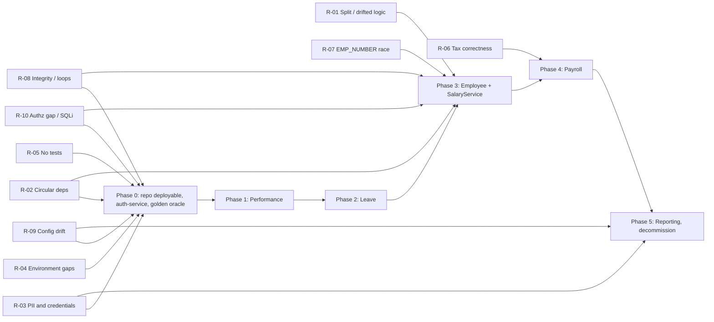

# Migration Risk Register

Top-10 risks for the Oracle Forms → Spring Boot + React migration described in [MODERNIZATION_BLUEPRINT.md](MODERNIZATION_BLUEPRINT.md) and sequenced in [CUTOVER_PLAN.md](CUTOVER_PLAN.md). Every risk cites the exact row of [TECH_DEBT_REGISTRY.md](TECH_DEBT_REGISTRY.md) (TDR) and/or section of [DATA_DICTIONARY.md](DATA_DICTIONARY.md) (DD) that evidences it; mitigations name the phase in which they are executed and the gate in [TEST_STRATEGY.md](TEST_STRATEGY.md) that proves them.

Scales: Likelihood/Impact = Low / Medium / High. Score = Likelihood × Impact on a 1–3 scale (max 9).

---

## 1. Register

| ID | Risk | Category | Likelihood | Impact | Evidence / source reference | Mitigation |
|---|---|---|---|---|---|---|
| **R-01** | **Business logic does not translate cleanly** because it is split across three layers – Forms triggers, DB triggers and packages – and the same rules exist in three drifting copies. A port that reads only `PKG_EMPLOYEE` misses the Forms-side defaults/rules and the trigger-side rules; a port that reads all three has to choose between contradictory versions. | Business logic / translation | High | High | TDR **ARCH-02** (`HRMS_EMPLOYEE.xml` base-table blocks, `trg_employees.sql:5`): *"Business rules split between Forms triggers, DB triggers and packages; the form writes `EMPLOYEES`/`SALARY_RECORDS` directly, bypassing `PKG_EMPLOYEE`"*. TDR **VAL-01** (`HRMS_EMPLOYEE.xml:383-384` vs `trg_employees.sql:35-37`): hire-date limit **90 days** in the form, **180 days** in the trigger. TDR **VAL-03**: *"Same rules implemented three times (PLL, `PKG_VALIDATION`, inline in `PKG_EMPLOYEE`/`PKG_PAYROLL`)"*. DD §7 lists the trigger rules (`-20501…-20504`). | (a) Phase 0: utPLSQL characterization of the package layer **and** SQL-level tests that fire the triggers, so both server-side copies are captured ([TEST_STRATEGY.md](TEST_STRATEGY.md) §3). (b) [COMPONENT_MAPPING.md](COMPONENT_MAPPING.md) §3.2 enumerates every Forms/DB trigger rule with its target; review is against that list, not against the package alone. (c) Explicit *preserve-vs-fix* decision per drifted rule (VAL-01 → one limit in `SYSTEM_PARAMETERS`) recorded before Phase 3 ([TEST_STRATEGY.md](TEST_STRATEGY.md) §4). (d) Single write path per aggregate in Java (`EmployeeService`); DB triggers stay enabled during the Phase 3 bake and are dropped only at exit ([CUTOVER_PLAN.md](CUTOVER_PLAN.md) §7.3). |
| **R-02** | **Circular / undeclared dependencies break independent compilation and deployment.** `PKG_EMPLOYEE` and `PKG_PAYROLL` reference each other, so recompiling either invalidates the other; `PKG_SECURITY` silently depends on `PKG_EMPLOYEE`. Any attempt to cut over Employee or Payroll alone while the other stays in PL/SQL leaves half of `SALARY_RECORDS` ownership on each side. | Architecture / deployment | High | High | TDR **ARCH-01** (`PKG_EMPLOYEE.pkb` → `PKG_PAYROLL.create_salary_record`; `PKG_PAYROLL.pks` header → `PKG_EMPLOYEE`; README:127): *"Recompiling either invalidates the other; blocks independent deployment"*. TDR **ARCH-03** (`PKG_SECURITY.pkb:74` → `PKG_EMPLOYEE.set_session_context`, not declared in `PKG_SECURITY.pks`): *"Security package depends on employee package (upward dependency), undeclared"*. [DEPENDENCY_MAP.md](DEPENDENCY_MAP.md) §3.1–3.2. | (a) Phase 0: `auth-service` owns session context, removing the ARCH-03 edge before any domain moves. (b) Phase 3 entry gate: shared `salary-module` (`SalaryService`) is the single owner of `SALARY_RECORDS`; Java `payroll-service` depends on `salary-module`, never on `employee-service` ([CUTOVER_PLAN.md](CUTOVER_PLAN.md) §7.1, §8.1). (c) Phase 0 CI build compiles the schema from scratch and fails on `INVALID` objects, so the cycle is at least *visible* during the parallel-run period. (d) ArchUnit rule in the Java build: no package cycle between `employee`, `payroll`, `salary`. |
| **R-03** | **PII and credential migration.** SSNs and bank account numbers are encrypted with a literal key in source; anyone with the repo can decrypt them, and key rotation forces a re-encryption of every row with no rollback if done in place. Password hashes are unsalted MD5 – but in fact *no* credential store exists, so the legacy "hashes" cannot be migrated at all. | Security / data protection | High | High | TDR **SEC-01** (`PKG_SECURITY.pkb:6-7`): *"Symmetric encryption key for SSNs / bank accounts is a literal in the package body … Anyone with `SELECT ON DBA_SOURCE` or the repo can decrypt every SSN"*; mitigation text: *"rotate key and re-encrypt `SSN_ENCRYPTED`, `ACCOUNT_NUMBER_ENC`"*. TDR **SEC-02** (`PKG_SECURITY.pkb:16-24` `hash_password`): *"Passwords hashed with unsalted `DBMS_CRYPTO.HASH_MD5`"*; *"force reset"*. TDR **SEC-05**: no `USER_CREDENTIALS` table. DD §1.5 `SSN_ENCRYPTED VARCHAR2(200)` (*"decrypted only in PKG_SECURITY"*), §1.7 `EMPLOYEE_DEPENDENTS.SSN_ENCRYPTED`, §2.9 `EMPLOYEE_BANK_ACCOUNTS.ACCOUNT_NUMBER_ENC`. | (a) Phase 0: `FieldEncryptionService` with vault/KMS-managed key (AES-GCM); **two-step re-encryption** into new `_V2` columns with readers switched only after `decrypt_legacy(x) == decrypt_v2(x')` holds for every row; old columns dropped in Phase 5 ([CUTOVER_PLAN.md](CUTOVER_PLAN.md) §4.3). (b) Legacy key treated as compromised: rotate immediately after step (ii), audit `ALL_SOURCE` access. (c) Passwords: new `USER_ACCOUNTS` with BCrypt/Argon2; forced set-password or SSO federation at first login – nothing is "rehashed" because nothing exists to rehash. (d) Test data never contains production PII; synthetic SSNs/accounts only ([TEST_STRATEGY.md](TEST_STRATEGY.md) §6.5). |
| **R-04** | **Environment gaps prevent building a parallel legacy environment.** The seed script does not load; the menu opens forms that are not in the repo; scheduler jobs and `UTL_FILE` directory objects have no DDL; Forms binaries and a build script are absent. Without a running legacy instance there is no parallel-run oracle. | Environment / deployability | High | High | TDR **DATA-01** (`data/seed/01_reference_data.sql` vs DDL): *"Seed inserts use `LOCATIONS.PHONE` (DDL: `PHONE_NUMBER`), `JOB_GRADES.GRADE_LEVEL` (not in DDL) while omitting NOT NULL `GRADE_CODE`, and `SYSTEM_PARAMETERS.DESCRIPTION` (DDL: `PARAM_DESCRIPTION`) … Seed script fails on `ORA-00904`"*. TDR **PROC-02**: *"Menu opens forms that are not in the repo (`HRMS_REPORTS`, `HRMS_ADMIN`, `HRMS_DEPARTMENT`, `HRMS_LOV`, `HRMS_TOOLBAR`) … no DDL for `DBMS_SCHEDULER` jobs or `UTL_FILE` directory objects"*. TDR **PROC-03**: *"`.fmb/.pll/.mmb` binaries absent; only XML/`.sql` text exports … no build script"*. [APPLICATION_INVEONTORY.md](APPLICATION_INVEONTORY.md) §8. | Phase 0 work items 0.1–0.4 ([CUTOVER_PLAN.md](CUTOVER_PLAN.md) §4.2): repair seed column lists; write the build script and run it in CI against a containerised Oracle; regenerate binaries from XML with `frmf2xml -reverse`; for every missing artefact record a decision (*recovered from production* / *re-specified* / *out of scope*) – no artefact is invented. `HRMS_REPORTS`/`HRMS_ADMIN` are rebuilt from requirements in Phase 5 only. Accept that `TRG_EMP_BEFORE_UPDATE` will not compile (BUG-03) and document it rather than patching legacy. |
| **R-05** | **No test safety net.** Nothing in the repo is executable in CI; every drift item in the registry went unnoticed for this reason. Porting without a golden oracle means the new system can only be compared to *documentation* of the old one, not its behaviour. | Process / quality | High | High | TDR **PROC-01** (README:120; no `tests/` directory): *"No automated tests; README states 'all testing is manual via Forms'. Nothing in the repo can be executed in CI. … the drift items above went unnoticed"*. | Phase 0 item 0.5: utPLSQL characterization suites for `PKG_SECURITY.authenticate`, `PKG_EMPLOYEE.generate_emp_number`, `PKG_LEAVE.submit_leave_request`, `PKG_PAYROLL.create_payroll_run/calculate_payroll/approve_payroll`; outputs committed as golden fixtures **before** any Java is written ([TEST_STRATEGY.md](TEST_STRATEGY.md) §3). Three-level gate (unit / contract diff / view reconciliation) is mandatory for every phase exit ([TEST_STRATEGY.md](TEST_STRATEGY.md) §2, §5). |
| **R-06** | **Payroll tax miscalculation.** Federal brackets are hard-coded for 2024, state tax is a `CASE` with a 5 % default for any unlisted state, the allowance amount is a literal and the `TAX_BRACKETS` table is never read. Faithfully porting this produces wrong withholding from tax year 2025 onward; fixing it means the new engine *cannot* match legacy on non-2024 inputs, which complicates parallel-run. | Correctness / financial | High | High | TDR **BUG-02** (`PKG_PAYROLL.pkb:605-714` `calculate_taxes`): *"Federal brackets hard-coded for 2024; state tax is a `CASE` with `ELSE 0.05` for unknown states; `TAX_BRACKETS` table is never read (`TODO`). Allowance amount `4300` hard-coded. → Wrong withholding from 2025; wrong tax for any state not listed"*. Source `PKG_PAYROLL.pkb:644` `-- TODO: Read from TAX_BRACKETS table instead of hard-coding`; `:714` `ELSE 0.05`. DD §2.7 `TAX_BRACKETS` (exists, no reader – TDR DATA-05). TDR PERF-01/02 (row-by-row loop, `COMMIT` every 50) compound the blast radius of a bad run. | Phase 4 split ([CUTOVER_PLAN.md](CUTOVER_PLAN.md) §8): **4a** hybrid façade keeps legacy calculation while the UI moves; **4b** `TaxEngine` reads `TAX_BRACKETS` and is run in **shadow mode** against the legacy engine. Golden fixtures for 2024 must match to the cent; for non-2024 inputs the *expected* difference is pre-computed from the bracket table and asserted ([TEST_STRATEGY.md](TEST_STRATEGY.md) §4 "fix" decision). Unknown state → hard error, not 5 %. `TAX_BRACKETS` populated and reviewed by payroll/finance before 4b entry. Restartable batch replaces partial commits. |
| **R-07** | **Duplicate employee numbers under concurrent hiring.** `generate_emp_number` computes `MAX()+1` without a lock. During parallel-run, Forms (legacy path) and React (new path) both create employees; if the Java side simply calls the package or copies the algorithm, the race widens. | Concurrency / data integrity | Medium | Medium | TDR **BUG-01** (`PKG_EMPLOYEE.pkb:37-45`, `hrms_sequences.sql:19-21`): *"`generate_emp_number` uses `MAX()+1` with no lock → duplicate `EMP_NUMBER` under concurrent hires (`UK_EMP_NUMBER` violation)"*. TDR PERF-04 (full scan with function on column). TDR DATA-03: *"`SEQ_EMP_NUMBER` defined but bypassed"*. DD §5 `SEQ_EMP_NUMBER`. | Java `EmployeeNumberGenerator` uses `SEQ_EMP_NUMBER` (`'EMP-' || LPAD(nextval,6,'0')`) – the sequence already exists, so no DDL is invented. Phase 3 entry: reset `SEQ_EMP_NUMBER` to `MAX(existing)+1` once, in the same change that disables legacy inserts (Employee flag `NEW`). Concurrency test (50 parallel creates, zero `UK_EMP_NUMBER` violations) is a Phase 3 unit gate ([CUTOVER_PLAN.md](CUTOVER_PLAN.md) §7.4). `UK_EMP_NUMBER` stays as the last line of defence; the API maps the violation to `409` with retry. |
| **R-08** | **Data-integrity gaps and hierarchy loops.** `DEPARTMENTS.PARENT_DEPT_ID`, `DEPARTMENTS.MANAGER_EMP_ID`, `LOCATION_CODE` and several other columns have no FK; a manager or department loop makes `CONNECT BY` (`VW_ORG_HIERARCHY`, `get_org_chart`) raise `ORA-01436`, which would fail the reconciliation harness itself and any org-chart page. JPA relationships will also expose orphans as `EntityNotFoundException`. | Data integrity | Medium | High | TDR **DATA-02** (`schema/tables/01_core_tables.sql` `DEPARTMENTS`): *"No FKs on `PARENT_DEPT_ID`, `MANAGER_EMP_ID`, `LOCATION_CODE`; `HOLIDAYS.LOCATION_CODE`, `NOTIFICATION_QUEUE.RECIPIENT_EMP_ID`, `SALARY_RECORDS.APPROVED_BY` also unconstrained. → Orphans; hierarchy loops possible (`CONNECT BY` will raise `ORA-01436`)"*. DD §1.1 `PARENT_DEPT_ID` *"(no FK)"*, ER diagram `DEPARTMENTS |o--o{ DEPARTMENTS : "PARENT_DEPT_ID (no FK)"`; DD §1.5 `MANAGER_EMP_ID` *"Used by `CONNECT BY` in `get_org_chart` / `VW_ORG_HIERARCHY`"*; DD §6.2 *"Performance degrades significantly with >500 employees"*. TDR PERF-03. | Phase 0: data-quality query pack (orphan counts per unconstrained column; loop detection with `CONNECT BY NOCYCLE … WHERE CONNECT_BY_ISCYCLE = 1`) run against production extract before any FK is added; add FKs as `NOVALIDATE` first, then `VALIDATE` after clean-up (deferrable for the `DEPARTMENTS ⇄ EMPLOYEES` pair as the TDR suggests). Java `EmployeeService.assertAcyclicManagerChain()` rejects loop-creating updates ([COMPONENT_MAPPING.md](COMPONENT_MAPPING.md) §3.2). Reconciliation queries use `NOCYCLE` so the harness reports loops instead of failing ([TEST_STRATEGY.md](TEST_STRATEGY.md) §2.3). Test fixtures are generated acyclic by construction ([TEST_STRATEGY.md](TEST_STRATEGY.md) §6.4). |
| **R-09** | **Configuration drift.** `SYSTEM_PARAMETERS` is seeded and editable by admins but the packages ignore it in favour of constants (session timeout, SMTP host/from, fiscal-year start). A port that reads the table will behave differently from legacy wherever an admin has changed a parameter that legacy never honoured – and the parallel-run diff will flag it as a defect. | Configuration / behavioural parity | Medium | Medium | TDR **VAL-06** (`PKG_SECURITY.pkb:8` vs `SYSTEM_PARAMETERS(SECURITY.SESSION_TIMEOUT_MIN)`; `PKG_NOTIFICATION.pkb:7-8` vs `NOTIFICATION.SMTP_HOST/FROM_ADDRESS`; `PKG_COMMON.get_fiscal_year` vs `PAYROLL.FISCAL_YEAR_START`): *"Configuration exists in `SYSTEM_PARAMETERS` (seeded) but packages use hard-coded constants instead of `PKG_COMMON.get_param`. → Admin edits to parameters have no effect"*. DD §4.5 `SYSTEM_PARAMETERS`. | Phase 0: audit production `SYSTEM_PARAMETERS` vs the constants in source; where they differ, business decides the value **before** cutover and the table is corrected. `SystemParameterService` (cached) is the only configuration source in Java; the hard-coded values become the *defaults* used when a row is missing, so behaviour is identical unless the table says otherwise. Parallel-run fixtures pin parameter values so diffs are attributable. Phase 5 admin UI edits the table with an audit trail. |
| **R-10** | **Authorization gap and SQL injection.** Access is derived from salary grade (≥ 8 = everything), so a role model must be *invented* during migration with no legacy source of truth for who should hold which permission; meanwhile `search_employees` concatenates user input into dynamic SQL. Exposing that procedure through a REST façade (as a hybrid approach would) turns a Forms-only weakness into an internet-facing one. | Security / access control | High | High | TDR **SEC-07** (`PKG_SECURITY.pkb:150-160` `has_permission`, `HRMS_MENU.mmb.sql`): *"Authorization is derived from `JOB_GRADES.GRADE_ID` (≥8 = everything, ≥5 = view). No role/permission model; changing a salary grade changes access rights"*. TDR **SEC-03** (`PKG_EMPLOYEE.pkb:442-466` `search_employees`): *"Dynamic SQL built by string concatenation of `p_last_name`, `p_first_name`, `p_emp_number` … Source labels it `SQL injection possible`"*. Related: SEC-05 (no password check), SEC-08 (sequential session id). | Security is a **full rewrite**, never a façade ([MODERNIZATION_BLUEPRINT.md](MODERNIZATION_BLUEPRINT.md) §2.3). Phase 0: `ROLES`/`ROLE_PERMISSIONS`/`USER_ROLES`; initial assignments *seeded* from the grade rule (so day-one access equals legacy) and then reviewed by HR/Payroll owners before Phase 3; unit test proves the seeded role table reproduces the `has_permission` truth table for grades 1–10 ([CUTOVER_PLAN.md](CUTOVER_PLAN.md) §4.4). `search_employees` is **not** wrapped – Phase 3 replaces it with a JPA `Specification` with bound parameters; SAST rule forbids string-built JPQL/SQL. `PKG_EMPLOYEE.search_employees` execute grant is revoked from the application user in Phase 3. |

---

## 2. Heat map

| | Impact: Low | Impact: Medium | Impact: High |
|---|---|---|---|
| **Likelihood: High** | – | – | R-01, R-02, R-03, R-04, R-05, R-06, R-10 |
| **Likelihood: Medium** | – | R-07, R-09 | R-08 |
| **Likelihood: Low** | – | – | – |

Seven of ten risks sit in the top-right cell; all seven are addressed by Phase 0 deliverables (R-02 partially, R-03, R-04, R-05, R-10) or by the Phase 3/4 gating design (R-01, R-06). This is the justification for a comparatively heavy Phase 0 in [CUTOVER_PLAN.md](CUTOVER_PLAN.md) §4.

---

## 3. Risk → phase → gate

---

## 4. Residual risks accepted (not in the top 10)

| Registry item | Why not top-10 | Handling |
|---|---|---|
| SEC-04 no lockout, SEC-06 cleartext password in Forms, SEC-09 timing channel, SEC-10 `MIN(EMP_ID)` on duplicate e-mail | Eliminated wholesale by the Security rewrite (R-10 umbrella) | Phase 0 |
| BUG-03 `TRG_EMP_BEFORE_UPDATE` column mismatch | Trigger is retired, not ported | Phase 3 |
| BUG-04/05/06 leave calculation | Contained to one self-service module; explicit fix decisions | Phase 2, [TEST_STRATEGY.md](TEST_STRATEGY.md) §4 |
| BUG-07 termination TODOs, BUG-08 YTD/integration placeholders | Legacy behaviour is "does nothing"; new behaviour is additive | Phase 3 / 4 / 5 |
| ARCH-04 audit swallowing, ARCH-05 DB-owned SMTP/file I/O | Replaced by `hrms-audit` / `hrms-notification` / HTTP download | Phase 0 / 4 / 5 |
| ARCH-06 documentation vs code (README, form headers) | Documentation debt; already recorded in [APPLICATION_INVEONTORY.md](APPLICATION_INVEONTORY.md) | Ongoing |
| DATA-04 `USER_SESSIONS.USERNAME` length, DATA-05 dead schema elements | Additive column widening; dead elements ignored until Phase 5 | Phase 0 / 5 |
| PERF-01…07 | Addressed as a by-product of the rewrite (set-based jobs, batch, indexes) | Phases 2–4 |

---

## Sources

- [TECH_DEBT_REGISTRY.md](TECH_DEBT_REGISTRY.md) – rows SEC-01/02/03/05/07/08, VAL-01/03/06, BUG-01/02, ARCH-01/02/03, DATA-01/02/03/05, PERF-01/02/03/04, PROC-01/02/03 (quoted verbatim in the Evidence column).
- [DATA_DICTIONARY.md](DATA_DICTIONARY.md) – §1.1 `DEPARTMENTS`, §1.5 `EMPLOYEES`, §1.7 `EMPLOYEE_DEPENDENTS`, §2.7 `TAX_BRACKETS`, §2.9 `EMPLOYEE_BANK_ACCOUNTS`, §4.5 `SYSTEM_PARAMETERS`, §5 sequences, §6.2 `VW_ORG_HIERARCHY`, §7 triggers.
- [DEPENDENCY_MAP.md](DEPENDENCY_MAP.md) – §3 cycles and undeclared dependencies.
- [APPLICATION_INVEONTORY.md](APPLICATION_INVEONTORY.md) – §8 missing artefacts.
- [README.md](README.md) – lines 120 (manual testing) and 127 (declared dependency).
- [MODERNIZATION_BLUEPRINT.md](MODERNIZATION_BLUEPRINT.md), [COMPONENT_MAPPING.md](COMPONENT_MAPPING.md), [CUTOVER_PLAN.md](CUTOVER_PLAN.md), [TEST_STRATEGY.md](TEST_STRATEGY.md) – companion documents.
- `plsql/packages/PKG_SECURITY.pkb`, `PKG_EMPLOYEE.pkb`, `PKG_PAYROLL.pkb`, `plsql/triggers/trg_employees.sql`, `data/seed/01_reference_data.sql`.
