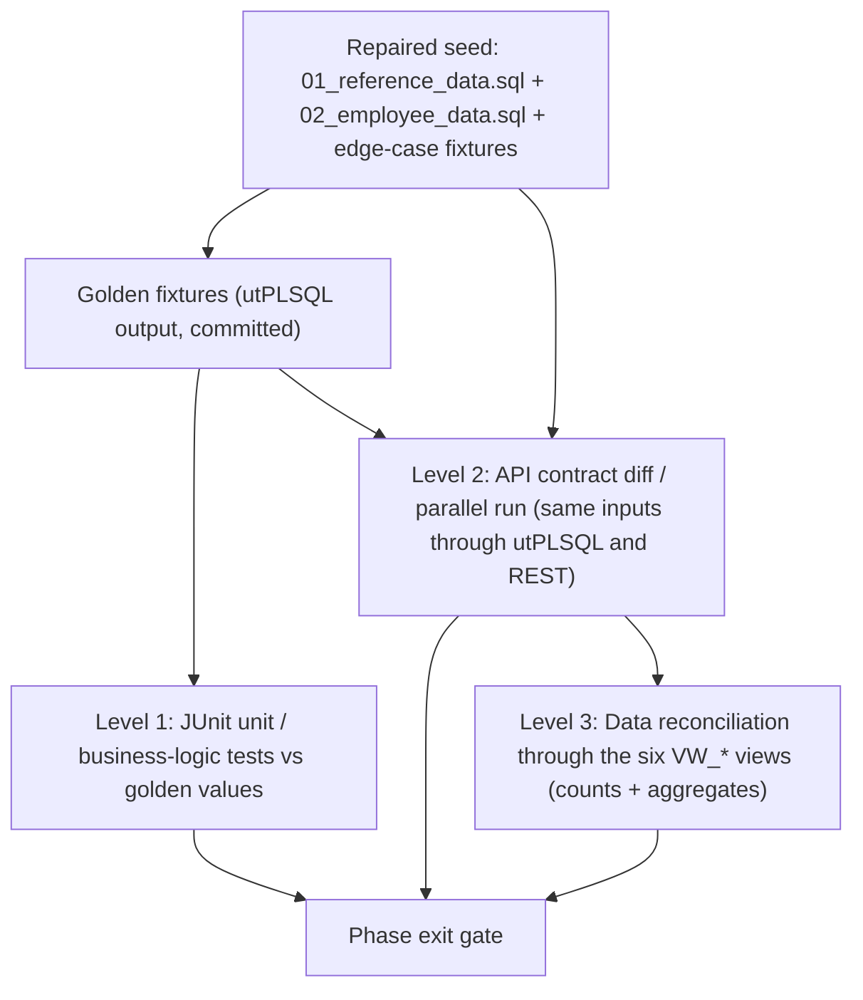

# Test Strategy: Validating the Forms → Spring Boot + React Migration

How each phase of [CUTOVER_PLAN.md](CUTOVER_PLAN.md) is proven correct, and how the test data that proves it is produced. Every phase must pass the same **three validation levels** before its proxy flag is flipped to `NEW` for all users; the mapping of legacy constructs to the code under test is in [COMPONENT_MAPPING.md](COMPONENT_MAPPING.md); the defects the tests must *not* preserve are in [TECH_DEBT_REGISTRY.md](TECH_DEBT_REGISTRY.md).

> Starting position: the repository has **no automated tests** – no `tests/` directory, no utPLSQL, and `README.md:120` states all testing is manual via Forms (PROC-01). Everything below is new.

---

## 1. Principles

1. **Golden oracle before porting.** The legacy PL/SQL, running against the repaired seed, is characterized with utPLSQL first; its outputs are committed as fixtures. Java is then written to those fixtures, not to the source code's comments (which are frequently wrong – ARCH-06, VAL-04).
2. **Tests assert the corrected value where a defect is being fixed.** For every known bug the team records a *preserve* or *fix* decision (§4). A "fix" fixture carries both `expected_legacy` and `expected_new`; the parallel-run diff must show *exactly* that difference and nothing else.
3. **Same database, same inputs.** Legacy and new run against the same schema state (cloned per scenario), so differences are attributable to code, not data.
4. **Reconciliation through the six `VW_*` views**, which no in-repo form or package references (`DATA_DICTIONARY.md` §6) and which therefore stay stable while everything else moves.
5. **No production PII, ever.** All fixtures are synthetic (§6.5).

---

## 2. The three validation levels

### 2.1 Level 1 — Unit / business-logic (JUnit 5 vs golden values)

- Pure-Java tests of services and validators, no database (`@ExtendWith(MockitoExtension.class)`) plus a thin slice of `@DataJpaTest` against Testcontainers Oracle for repository queries that replace dynamic SQL (`search_employees`, SEC-03).
- Inputs and expected outputs come from the golden fixtures (§3) as parameterised tests (`@CsvFileSource`), so a change to a fixture is a reviewable diff.
- Each legacy error code (`-20001 … -20504`, [COMPONENT_MAPPING.md](COMPONENT_MAPPING.md) §11) has at least one test asserting the Java exception type, `ApiError.code`, and HTTP status.
- Bean Validation rules in `hrms-validation` are tested once, centrally; the exported JSON schema consumed by React is snapshot-tested so the two tiers cannot drift (VAL-03 regression guard).

### 2.2 Level 2 — API contract diff / parallel run

Harness (`tools/parallel-run/`, new): for each scenario file

1. restore the scenario's schema snapshot (Oracle Flashback or a per-scenario PDB clone);
2. execute the **legacy path** – the utPLSQL block that calls the package exactly as the form does (same argument order and defaults, e.g. `PKG_LEAVE.submit_leave_request(p_emp_id, p_leave_type_id, p_start_date, p_end_date, p_half_day_flag, p_reason, p_user)` as in `HRMS_LEAVE.xml:152-160`);
3. capture: return value / `SQLCODE`, affected rows of the domain tables (excluding `CREATED_DATE/MODIFIED_DATE`), `AUDIT_LOG` rows (action + table), `NOTIFICATION_QUEUE` rows (type + recipient);
4. restore the snapshot again;
5. execute the **new path** – the REST call with the same payload and a JWT for the same `empId`;
6. capture the same artefacts;
7. diff; the result must be empty **or** match the scenario's declared `expected_diff` (only permitted for "fix" decisions in §4).

Where the legacy has no API (Forms-only logic such as `HRMS_EMPLOYEE` base-table DML), step 2 executes the equivalent SQL the form would issue (`INSERT INTO EMPLOYEES …`) so the DB triggers fire – this is how the trigger layer (`-20501…-20504`) gets a legacy oracle.

### 2.3 Level 3 — Data reconciliation through the six `VW_*` views

Run after each Level-2 scenario suite and nightly during bake periods, against a **legacy-written** and a **new-written** copy of the same scenario script. Compare counts and aggregates, never full rows (views contain `SYSDATE`-dependent columns such as `TENURE_YEARS`).

| View (`DATA_DICTIONARY.md` §6) | Count checks | Aggregate checks | Phase(s) | Notes |
|---|---|---|---|---|
| `VW_ACTIVE_EMPLOYEES` (§6.1) | `COUNT(*)`; `COUNT GROUP BY DEPT_ID`, `LOCATION_CODE`, `EMPLOYMENT_TYPE`, `GRADE_ID` | `SUM(CURRENT_SALARY)`, `COUNT(CURRENT_SALARY IS NULL)` (must be 0 – every active employee has exactly one active salary row) | 3, 4, 5 | `TENURE_YEARS` excluded (date-dependent). |
| `VW_ORG_HIERARCHY` (§6.2) | `COUNT(*)`; `COUNT GROUP BY ORG_LEVEL`; `COUNT WHERE IS_LEAF=1` | `MAX(ORG_LEVEL)`; `ORG_PATH` equality per `EMP_ID` (string compare) | 3, 5 | Harness query wraps the view's base SQL with `CONNECT BY NOCYCLE` and reports `CONNECT_BY_ISCYCLE=1` rows as a **hard failure** rather than letting `ORA-01436` abort the run (DATA-02). The unmodified view must also execute without error. |
| `VW_EMPLOYEE_COMPENSATION` (§6.3) | `COUNT(*)` (= active employees with an active salary row) | per `EMP_ID`: `BASE_SALARY`, `GRADE_MIN`, `GRADE_MAX`, `GRADE_MIDPOINT`; **`COMPA_RATIO` equal to 1 dp** (view formula `ROUND(BASE_SALARY / GRADE_MIDPOINT * 100, 1)`) – the Java `SalaryService.compaRatio()` is unit-tested against the same formula and the view is the cross-check; `AVG(COMPA_RATIO) GROUP BY GRADE_NAME` | 3, 4 | Detects a wrong grade join or a duplicate active salary row (would double-count). |
| `VW_LEAVE_SUMMARY` (§6.4) | `COUNT(*)` per `(EMP_ID, LEAVE_TYPE_NAME)` for current `CALENDAR_YEAR` | per row: `OPENING_BALANCE`, `ACCRUED`, `USED`, `ADJUSTMENT`, `PENDING`; `SUM(USED)`, `SUM(PENDING)` per type; `UTILIZATION_PCT` | 2, 5 | **`AVAILABLE` in this view is `OPENING + ACCRUED − USED + ADJUSTMENT` and omits `− PENDING`** (VAL-05), while `LEAVE_BALANCES.AVAILABLE` (virtual column) and the new API subtract `PENDING`. The harness therefore asserts `view.AVAILABLE − api.available == view.PENDING` for every row – an exact, explainable offset – until the view is corrected in Phase 5, after which the offset must be 0. |
| `VW_PAYROLL_LATEST` (§6.5) | `COUNT(*)` (= employees with an approved run) | per `EMP_ID`: `GROSS_PAY`, `TOTAL_TAXES`, `TOTAL_DEDUCTIONS`, `NET_PAY` **to the cent**; `SUM(NET_PAY)`, `SUM(GROSS_PAY)`; invariant `GROSS_PAY − TOTAL_TAXES − TOTAL_DEDUCTIONS == NET_PAY` | 4, 5 | The view derives `NET_PAY` as `SUM(AMOUNT)` and relies on taxes/deductions being **negative** – the Java engine must keep that sign convention or the view (and reconciliation) silently breaks. `STATUS='ERROR'` detail rows are excluded by the view; their count is compared separately from `PAYROLL_DETAILS`. |
| `VW_PENDING_APPROVALS` (§6.6) | `COUNT GROUP BY APPROVAL_TYPE`; `COUNT GROUP BY APPROVER_ID` | `MIN/MAX(REQUEST_DATE)` | 1, 2, 5 | `PERFORMANCE` rows = reviews in `MANAGER_REVIEW`; `LEAVE` rows = `PENDING` requests. `DETAILS` string compared exactly (`'N day(s) MM/DD-MM/DD'`) to catch business-day count differences. |

Tolerance: monetary values 0.00; ratios 0.1 (matching the views' own `ROUND(…,1)`); counts 0.

---

## 3. Characterization testing with utPLSQL (the golden oracle)

Delivered in Phase 0 (item 0.5 of [CUTOVER_PLAN.md](CUTOVER_PLAN.md)). Suites live in a new `tests/utplsql/` directory (does not exist today). Each suite runs against the repaired seed and writes its observed outputs to `tests/golden/<package>.<procedure>.csv`, which is then committed and reviewed – **the review is where "preserve vs fix" is decided** (§4).

| Package.procedure | Scenarios characterised | Observed outputs captured | Notes / known defects surfaced |
|---|---|---|---|
| `PKG_SECURITY.authenticate(p_username, p_password, p_ip_address)` | active seed user by e-mail (all 24 seed employees); terminated user (`EMP-000099`); unknown e-mail; mixed-case e-mail; e-mail > 30 chars; **any password value** | return `session_id` or `-1`; `USER_SESSIONS` row (`USERNAME`, `EMP_ID`, `IP_ADDRESS`, `SESSION_STATUS`); `AUDIT_LOG` row; `SQLCODE` | Confirms SEC-05 (password ignored – every password authenticates), SEC-08 (sequential ids), DATA-04 (`ORA-12899` for long e-mail), SEC-10 (duplicate e-mail → `MIN(EMP_ID)`). **None of these behaviours are ported**; the fixture documents the baseline so the Phase 0 security review can sign off the deliberate divergence. Also characterise `is_session_valid` (fresh, expired at +31 min, logged-out) and `has_permission` for grades 1–10 × modules × actions – this truth table **is** ported (as seeded role assignments). |
| `PKG_EMPLOYEE.generate_emp_number` | empty table; seed (max `EMP-000099`); after gap (`EMP-000100` deleted → next is `EMP-000101`, not reuse); two sessions calling concurrently (utPLSQL + `DBMS_SCHEDULER` one-off job or two SQL*Plus sessions) | returned string; whether `UK_EMP_NUMBER` is violated on subsequent insert | Format `EMP-` + 6 digits is preserved; `MAX()+1` and the race (BUG-01) are **not** – Java uses `SEQ_EMP_NUMBER`. Fixture pins the *format* and the *next value after seed* (`EMP-000100`), both of which the sequence reproduces once reset to 100. |
| `PKG_LEAVE.submit_leave_request(p_emp_id, p_leave_type_id, p_start_date, p_end_date, p_half_day_flag, p_reason, p_user)` | each leave type × (single day, multi-day, spanning weekend, spanning a `HOLIDAYS` row, spanning a weekend-observed holiday, half day AM, half day PM, AM+PM same day, overlapping an existing PENDING/APPROVED request, start 6 days in the past, start > end, tenure < `MIN_TENURE_DAYS`, balance insufficient, `ACCRUAL_FLAG='N'` type with zero balance, terminated employee) | `request_id` or `SQLCODE` (`-20001/-20201/-20202/-20203/-20210/-20211/-20212`); `LEAVE_REQUESTS` row (`TOTAL_DAYS`, `STATUS`, `APPROVER_EMP_ID`); `LEAVE_BALANCES.PENDING` delta; `NOTIFICATION_QUEUE` row | Surfaces BUG-05 (weekend holiday not observed → `TOTAL_DAYS` one too high) and BUG-06 (AM+PM same day → `-20202`). Also characterise `approve/reject/cancel_leave_request` (balance movements), `calculate_business_days`, `run_monthly_accrual`, `process_carryover`, `expire_carryover` (BUG-04: run once, then run again with `USED > 0` – observe over-deduction). |
| `PKG_PAYROLL.create_payroll_run(p_period_id, p_run_type, p_user)` | OPEN period; CLOSED period (`-20102`); each `RUN_TYPE`; second run for the same period | `run_id` / `SQLCODE`; `PAYROLL_RUNS` row (`STATUS='PENDING'`, `RUN_TYPE`, `CREATED_BY`) | Straightforward; preserved as-is. |
| `PKG_PAYROLL.calculate_payroll(p_run_id, p_user)` | seed 23 salary rows across `MONTHLY`/`BIWEEKLY`; employee with no active salary (`-20104` → `ERROR` detail row, run continues); employee with `EMPLOYEE_TAX_INFO` for each `FILING_STATUS` and each of the 10 hard-coded states + one unlisted state; taxable income at each 2024 bracket boundary ±0.01 (single: 11 600 / 47 150 / 100 525 / 191 950 / 243 725 / 609 350; joint: 23 200 / 94 300 / 201 050 / 383 900 / 487 450 / 731 200); allowances 0–5; `EMPLOYEE_PAY_ELEMENTS` earnings/deductions; a run of 51+ employees to observe the `COMMIT` every 50 (PERF-02) | per `(EMP_ID, ELEMENT_ID)` `AMOUNT` for elements 100–103 and all earnings/deductions; `PAYROLL_RUNS.TOTAL_GROSS/TOTAL_NET/EMPLOYEE_COUNT/STATUS`; `ERROR` rows | Surfaces BUG-02: unlisted state taxed at 5 %; brackets hard-coded to 2024; allowance `4300`. Fixture records the legacy value **and**, for the fix cases, the `TAX_BRACKETS`-derived value (§4). |
| `PKG_PAYROLL.approve_payroll(p_run_id, p_user)` | `CALCULATED` run; `PENDING` run (`-20103`); already `APPROVED`; user without approve permission (note: the package itself does not check permission – the *form* does, `HRMS_PAYROLL.xml:137`) | `PAYROLL_RUNS.STATUS/APPROVED_BY/APPROVED_DATE`; `AUDIT_LOG` | The permission check moves to `@PreAuthorize` and is tested at Level 1; the package behaviour (no check) is *not* preserved. |

Supporting characterisation (same approach, lower priority): `PKG_PERFORMANCE.submit_self_assessment/submit_manager_review/acknowledge_review/update_goal_progress`, `PKG_EMPLOYEE.create_employee/terminate_employee/rehire_employee/validate_employee`, `PKG_COMMON.is_business_day/get_fiscal_year`, and the trigger layer via direct DML (§2.2).

---

## 4. Preserve-vs-fix decisions for known defects

Recorded here so that Level-1 tests **assert the corrected value** and Level-2 diffs can declare the expected divergence. Anything not listed is *preserve*.

| Defect | Legacy behaviour (golden `expected_legacy`) | Decision | Corrected behaviour (`expected_new`) | Where asserted |
|---|---|---|---|---|
| **BUG-02** tax engine (`PKG_PAYROLL.pkb:605-714`) | Federal brackets hard-coded 2024; state `CASE` with `ELSE 0.05`; allowance `4300` literal; `TAX_BRACKETS` never read | **Fix** | `TaxEngine` reads `TAX_BRACKETS` by `(TAX_YEAR, FILING_STATUS, STATE)`; unknown state → `MISSING_TAX_RATE` error (run continues, detail row `ERROR`); allowance and standard deduction are table/parameter driven. **For tax-year 2024 inputs the new value must equal legacy to the cent** (the bracket table is seeded from the legacy constants, which is the correctness proof of the seeding). For non-2024 years and unlisted states the fixture's `expected_new` is computed independently from the bracket table by a spreadsheet owned by Payroll, not by the Java code. | Level 1 `TaxEngineTest` (boundary table); Level 2 payroll scenarios with `expected_diff` for non-2024 / unlisted-state cases; Level 3 `VW_PAYROLL_LATEST` to the cent on 2024 periods |
| **BUG-04** `expire_carryover` (`PKG_LEAVE.pkb:606-623`) | `ADJUSTMENT −= CARRYOVER_FROM_PREV` regardless of usage → over-deduction when carryover already used | **Fix** | Deduct `GREATEST(0, CARRYOVER_FROM_PREV − used_from_carryover)`; idempotent (second run is a no-op, recorded in `LEAVE_ACCRUAL_LOG`) | Level 1 `LeaveBalanceServiceTest.expireCarryover_*` (asserts the smaller deduction and the no-op); Level 2 scenario `carryover-expiry-after-usage` with `expected_diff` on `ADJUSTMENT`; Level 3 `VW_LEAVE_SUMMARY.ADJUSTMENT` differs by exactly the over-deduction amount |
| **BUG-05** observed holidays (`PKG_LEAVE.pkb:9` → `PKG_COMMON.is_business_day`) | Holiday on Saturday/Sunday not shifted; the weekday is counted as a working day | **Fix** | `BusinessCalendar` treats the observed date (Sat→Fri, Sun→Mon; `HOLIDAYS` has no observed-date column today, so the shift is computed) as non-working | Level 1 `BusinessCalendarTest` using the seed `HOLIDAYS` rows plus synthetic Saturday and Sunday holidays (e.g. a Saturday holiday makes the preceding Friday non-working); Level 2 scenario `leave-across-observed-holiday` with `expected_diff` on `TOTAL_DAYS` (−1); Level 3 `VW_PENDING_APPROVALS.DETAILS` day count differs by the predicted amount |
| **BUG-06** half-day overlap (`check_leave_overlap`) | AM + PM on the same day → `-20202` | **Fix** | Overlap predicate includes `HALF_DAY_PERIOD`; AM + PM allowed, AM + AM rejected | Level 1; Level 2 scenario `half-day-am-pm-same-day` (`expected_legacy = -20202`, `expected_new = request_id`) |
| **VAL-01** hire-date limit (`HRMS_EMPLOYEE.xml:383-384` 90 days vs `trg_employees.sql:35-37` 180 days) | Two limits; API path allows dates the UI forbids | **Fix – one limit** | Single value in `SYSTEM_PARAMETERS` (`HR.MAX_FUTURE_HIRE_DAYS`); recommended **90** (the value users actually see) – **the business owner confirms the number before Phase 3**; tests are parameterised on the configured value | Level 1 `HireDateWithinLimitValidatorTest` at limit −1 / limit / limit +1 days; Level 2 `create-employee-hire-date-{89,90,91,179,180,181}` scenarios: legacy trigger accepts 91–180, new rejects → declared `expected_diff` |
| VAL-05 `VW_LEAVE_SUMMARY.AVAILABLE` omits `− PENDING` | View and table disagree | **Fix in Phase 5 only** (view untouched during Phases 1–4 to keep the oracle stable) | API uses table semantics (`− PENDING`); view corrected in Phase 5 and harness re-baselined | Level 3 offset rule (§2.3) |
| BUG-01 `MAX()+1` | Race → duplicate `EMP_NUMBER` | **Fix** | `SEQ_EMP_NUMBER`; format and next-value preserved | Level 1 concurrency test; Level 2 format assertion |
| BUG-03 `TRG_EMP_BEFORE_UPDATE` history columns | Trigger does not compile / history never written | **Fix** | `EmployeeHistoryService` writes real `EMPLOYEE_HISTORY` columns | Level 1; Level 2 shows *additional* history rows on the new side – declared `expected_diff` |
| SEC-05 password not verified; SEC-07 grade-based authz; SEC-08 sequential session | – | **Replace** (not ported) | BCrypt/Argon2 verify; role table (seeded from grade rule); random JWT `jti` | Level 1 only – no legacy equivalent to diff; `has_permission` truth table reproduced by the seeded roles |
| BUG-07 termination TODOs, BUG-08 YTD = 0 | No-ops | **Fix (additive)** | Sessions revoked on terminate; YTD computed | Level 1; Level 2 `expected_diff` on `USER_SESSIONS` / payslip YTD |
| PERF-02 `COMMIT` every 50 | Partial runs on failure | **Fix** | Restartable batch; a failure leaves the run in `ERROR` with no committed partial detail rows | Level 1 batch restart test; Level 2 scenario `calculate-with-failure-at-employee-60` |

---

## 5. Phase-aligned test matrix and acceptance gates

| Phase ([CUTOVER_PLAN.md](CUTOVER_PLAN.md)) | Level 1 – unit (JUnit) | Level 2 – contract diff / parallel run | Level 3 – reconciliation views | Acceptance gate (all must hold) |
|---|---|---|---|---|
| **0** Foundation | `auth-service`: BCrypt verify; JWT issue/expire from `SYSTEM_PARAMETERS`; role seeding reproduces `has_permission` truth table (grades 1–10 × `PAYROLL/EMPLOYEE/LEAVE/ADMIN/REPORTS` × `VIEW/EDIT/APPROVE/CREATE`); `FieldEncryptionService` round-trip; `SystemParameterService` defaults; `hrms-validation` schema snapshot | SSO bridge smoke (token → Forms session → `HRMS_MENU` opens with correct `:GLOBAL.current_emp_id` for every seed user); re-encryption: `decrypt_legacy(old) == decrypt_v2(new)` for all rows with `SSN_ENCRYPTED`/`ACCOUNT_NUMBER_ENC` | Baseline capture of all six views on the repaired seed (committed as `tests/golden/views-baseline.csv`); all views compile | Seed loads with 0 errors (DATA-01); utPLSQL golden suites (§3) committed and green; CI builds schema from scratch with `INVALID` = {`TRG_EMP_BEFORE_UPDATE`} only; security sign-off of the SEC-05/07/08 divergence |
| **1** Performance | Review/goal state machines; rating bounds and labels; goal auto-complete; `generate_reviews_for_cycle` set | `create_review_cycle/open/generate/create_review/submit_self/submit_manager/acknowledge/add_goal/update_goal_progress` – empty diff on `REVIEW_CYCLES`, `PERFORMANCE_REVIEWS`, `PERFORMANCE_GOALS`, `AUDIT_LOG`, `NOTIFICATION_QUEUE` | `VW_PENDING_APPROVALS` (`PERFORMANCE`): counts by approver; `AVG(OVERALL_RATING)` per cycle (from base table, 1 dp) | Empty diff; view counts equal; 2-week bake with zero rollback |
| **2** Leave | `BusinessCalendar` incl. observed holidays (**corrected**); overlap predicate incl. AM/PM (**corrected**); balance rule with `− PENDING`; tenure; 5-day past rule; full `-2020x/-2021x` contract; carryover expiry (**corrected**) | `submit/approve/reject/cancel_leave_request`, `run_monthly_accrual`, `process_carryover`, `expire_carryover` – empty diff **except** declared BUG-04/05/06 cases | `VW_LEAVE_SUMMARY`: all balance columns equal; `AVAILABLE` offset == `PENDING`; `VW_PENDING_APPROVALS` (`LEAVE`) counts and `DETAILS` strings equal except observed-holiday cases | Empty diff outside declared cases; one accrual cycle reconciled via `LEAVE_ACCRUAL_LOG`; scheduler hand-over verified (no double accrual) |
| **3** Employee | `EmployeeNumberGenerator` (`EMP-000100` after seed; 50-thread race → 0 violations); every `-2000x/-2001x/-2050x` rule; hire-date limit (**single configured value**); e-mail uniqueness on insert *and* update; `-20503`/`-20504` invariants; acyclic manager check; `SalaryService` one-active-row invariant and `compaRatio()`; JPA `Specification` search equivalence with `search_employees` result sets for 20 filter combinations (SEC-03 replacement) | `create/update/transfer/promote/terminate/rehire_employee` and direct `INSERT/UPDATE/DELETE EMPLOYEES` (trigger layer) – empty diff except VAL-01 (91–180 days) and BUG-03 (extra history rows); `EMP_NUMBER` compared by format | `VW_ACTIVE_EMPLOYEES` counts/sums; `VW_EMPLOYEE_COMPENSATION` per-employee compa-ratio to 1 dp and exactly one active salary row; `VW_ORG_HIERARCHY` counts, `MAX(ORG_LEVEL)`, `ORG_PATH` per employee, no cycles | Read-only React pages reconciled first (`NEW_READONLY`); then writes; triggers dropped only after 1-week bake with empty nightly diff |
| **4a** Payroll façade | Controller authz (`PAYROLL:VIEW/APPROVE`); DTO mapping of `PAY_PERIODS/PAYROLL_RUNS/PAYROLL_DETAILS` | Façade calls the *same* package – diff must be empty by construction; verifies JDBC parameter mapping and error-code translation (`-20102/-20103`) | `VW_PAYROLL_LATEST` unchanged before/after façade cutover (same engine) | Empty diff; operators run one full period through the React UI |
| **4b** Payroll engine | `TaxEngine` boundary table for 2024 (all 6 single + 6 joint thresholds ±0.01, 4 frequencies, allowances 0–5); 10 legacy states + unlisted → `MISSING_TAX_RATE`; FICA/Medicare wage base; gross by frequency; sign convention; batch restart at employee 60 | `create → calculate → approve` for all 23 seed salary rows × `MONTHLY`/`BIWEEKLY` × filing statuses: per `(RUN, EMP_ID, ELEMENT_ID)` `AMOUNT` diff 0.00 for 2024; declared `expected_diff` for non-2024 / unlisted-state fixtures; `ERROR` rows identical | `VW_PAYROLL_LATEST` per employee gross/taxes/deductions/net to the cent; `SUM(NET_PAY)`; `GROSS − TAXES − DEDUCTIONS == NET` | Shadow mode: N (≥ 3) consecutive real periods with 0.00 difference on 2024-rule inputs and fully explained differences otherwise, signed off by Payroll; then `payroll.engine=JAVA` |
| **5** Reporting / decommission | Report query tests; admin CRUD validation; corrected `VW_LEAVE_SUMMARY` and `NOCYCLE` `VW_ORG_HIERARCHY` unit-tested as SQL | `PKG_REPORTING` ref cursors vs REST, row-for-row per report | **Final full pass** of all six views old vs new *before* view definitions change; re-baseline committed *after* | Zero legacy proxy hits for 30 days; no `INVALID` objects; `tests/golden/views-baseline.csv` regenerated and reviewed |

---

## 6. Test-data production

### 6.1 Repair `data/seed/01_reference_data.sql` first (DATA-01)

The seed does not load today (`ORA-00904`). Fix, in this order, then commit a CI job that runs DDL + seed against a containerised Oracle on every push:

| Table | Seed as checked in | DDL (`schema/tables/*.sql`) | Fix |
|---|---|---|---|
| `LOCATIONS` | column `PHONE` | `PHONE_NUMBER` | rename in insert list |
| `JOB_GRADES` | column `GRADE_LEVEL` (all 10 inserts, lines 23–41) | no `GRADE_LEVEL`; `GRADE_CODE` is NOT NULL | drop `GRADE_LEVEL`, add `GRADE_CODE` (e.g. `G01`…`G10`) |
| `SYSTEM_PARAMETERS` | column `DESCRIPTION` | `PARAM_DESCRIPTION` | rename |

Post-condition (asserted in CI): 10 `DEPARTMENTS`, 3 `LOCATIONS`, 10 `JOB_GRADES`, 26 `JOB_TITLES`, 6 `LEAVE_TYPES`, 11 `PAY_ELEMENTS`, 10 `HOLIDAYS`, 10 `SYSTEM_PARAMETERS` (counts from the insert statements in the file).

### 6.2 Reuse `data/seed/02_employee_data.sql`

Loads as-is once `01_reference_data.sql` succeeds: **24 `EMPLOYEES`** (`EMP_ID` 1–43 non-contiguous plus `EMP_ID 99`, `EMP-000099`, `EMPLOYMENT_STATUS='TERMINATED'`) and **23 `SALARY_RECORDS`** (one active row per non-terminated employee). This is the base state for every golden fixture; the terminated employee is the ready-made rehire / login-denied case.

### 6.3 Respect the fixed coded domains

Fixtures may only use values that the code or constraints hard-code; the harness validates every fixture against this list before running:

| Domain | Allowed values | Source |
|---|---|---|
| `LOCATION_CODE` | `HQ`, `SF`, `CHI` | `DATA_DICTIONARY.md` §8; `LOCATIONS` seed |
| `JOB_GRADES.GRADE_ID` | 1–10; **≥ 8 ⇒ full access, ≥ 5 ⇒ view-all** in `PKG_SECURITY.has_permission` | `DATA_DICTIONARY.md` §8, `PKG_SECURITY.pkb:150-160` |
| `LEAVE_TYPES.LEAVE_TYPE_CODE` | `PTO`, `SICK`, `COMP`, `FMLA`, `JURY`, `BEREAVE` | seed |
| `PAY_ELEMENTS.ELEMENT_ID` | 11 seeded elements; **100 `FED_TAX`, 101 `STATE_TAX`, 102 `FICA`, 103 `MEDICARE` are hard-coded in `PKG_PAYROLL.calculate_taxes`** and must exist with `ELEMENT_TYPE='TAX'` | `PKG_PAYROLL.pkb`, seed |
| `EMPLOYMENT_STATUS` / `EMPLOYMENT_TYPE` / `GENDER` | `CHK_EMP_STATUS`, `CHK_EMP_TYPE`, `CHK_EMP_GENDER` | `01_core_tables.sql:140-142` |
| `PAY_FREQUENCY` | `WEEKLY`, `BIWEEKLY`, `SEMIMONTHLY`, `MONTHLY` | `CHK_PAY_FREQ` |
| `FILING_STATUS` | `SINGLE`, `MARRIED_JOINT`, `MARRIED_SEPARATE`, `HEAD_OF_HOUSEHOLD` | `CHK_FILING_STATUS` |
| `STATE` for tax | `CA NY TX FL WA IL PA OH NJ MA` (listed) + at least one unlisted (e.g. `CO`) to exercise the `ELSE 0.05` path | `PKG_PAYROLL.pkb:704-714` |
| Review / goal / run statuses | `CHK_REVIEW_STATUS`, `CHK_GOAL_STATUS`, `CHK_GOAL_CATEGORY`, `CHK_RUN_TYPE`, `CHK_RUN_STATUS`, `CHK_PERIOD_STATUS`, `CHK_LR_STATUS` | `schema/tables/0[2-4]_*.sql` |

### 6.4 Generate edge-case fixtures from constraints

A generator (`tools/fixtures/`, new) reads the DDL `CHECK`/`NOT NULL`/`FK`/`UK` constraints and the rules in §3 and emits deterministic SQL fixture sets (seeded RNG, committed output). Required sets:

| Fixture set | Contents | Drives |
|---|---|---|
| `hire-date-limits` | employees with `HIRE_DATE` = today + {0, 89, 90, 91, 179, 180, 181} | VAL-01 decision; `-20501`; Forms 90-day rule |
| `salary-grade-bands` | for each grade 1–10: salary at `MIN_SALARY`, `(MIN+MAX)/2`, `MAX_SALARY`, `MIN − 1`, `MAX + 1` | `validate_salary_range`, `SalaryService.assertWithinGrade`, `COMPA_RATIO` = 100.0 at midpoint |
| `leave-overlaps` | pairs of requests: identical dates; adjacent; partial overlap; AM+PM same day; AM+AM same day; PENDING vs APPROVED vs CANCELLED existing | `-20202`, BUG-06 |
| `leave-holidays` | requests spanning each seed `HOLIDAYS` row; a synthetic holiday on a Saturday and one on a Sunday; request spanning year end | BUG-05, `TOTAL_DAYS`, `-20212` |
| `leave-balances` | balances at exactly requested days, requested − 0.5, 0; `ACCRUAL_FLAG='N'` type; carryover fully / partially used before expiry | `-20201`, BUG-04 |
| `terminated-rehire` | seed `EMP-000099` plus a synthetic terminated employee with an open `SALARY_RECORDS` row and an open `USER_SESSIONS` row | `rehire_employee`, `-20503`, BUG-07 |
| `manager-chains` | chains of depth 1–6 generated **acyclic by construction** (each new employee's manager is drawn from already-created employees only); a deliberately cyclic 3-node chain in a *negative* fixture used only to prove the `NOCYCLE` harness and `assertAcyclicManagerChain()` | `VW_ORG_HIERARCHY`, `ORA-01436`, `-20004`, DATA-02 |
| `salary-uniqueness` | one active salary row per employee (positive); two active rows (negative, must be rejected by `SalaryService`, and is *detected* by `VW_EMPLOYEE_COMPENSATION` row-count > employee count) | one-`ACTIVE_FLAG='Y'` invariant |
| `payroll-tax-boundaries` | `EMPLOYEE_TAX_INFO` rows placing annualised taxable income at each bracket boundary ± 0.01 for every filing status; allowances 0–5; each listed state + `CO`; `PAY_FREQUENCY` × 4; `TAX_BRACKETS` rows for 2024 (seeded from the legacy constants) and 2025 (from Payroll) | BUG-02, `TaxEngine`, `VW_PAYROLL_LATEST` |
| `payroll-run-size` | 60 synthetic employees so a run crosses the 50-row `COMMIT` boundary; one with no salary row at position 55 | PERF-02, `-20104` |
| `duplicate-email` | second employee with the same e-mail differing only in case; one active, one terminated | `-20502`, SEC-10 |
| `long-email` | e-mail of 45 characters | DATA-04 |

### 6.5 PII handling

- **Never copy production `SSN_ENCRYPTED`, `EMPLOYEE_DEPENDENTS.SSN_ENCRYPTED`, `EMPLOYEE_BANK_ACCOUNTS.ACCOUNT_NUMBER_ENC/ROUTING_NUMBER`, dates of birth, or addresses** into any test environment. The parallel-run harness runs against the *synthetic* seed plus fixtures, not against a production clone; production is only used for the read-only data-quality queries in R-08 ([RISK_REGISTER.md](RISK_REGISTER.md)) and the one-off re-encryption job.
- Synthetic SSNs use the SSA-invalid ranges (area `900–999` or `000`, group `00`, serial `0000`); synthetic routing numbers fail the ABA checksum; bank account numbers are random digits. Generated by the fixture tool from the seeded RNG so they are stable across runs.
- Synthetic SSNs/accounts are encrypted in fixtures with the **test** vault key through `FieldEncryptionService` – never with the legacy literal key from `PKG_SECURITY.pkb:6-7`, which must be treated as compromised (SEC-01).
- Test user credentials are stored only as **BCrypt (cost ≥ 10) or Argon2id** hashes in `USER_ACCOUNTS`; plaintext test passwords live in the CI secret store, not in fixtures. No MD5 (SEC-02) anywhere in the new code base, enforced by a SAST rule.
- Encryption keys, JWT signing keys and DB credentials for test environments come from the vault/KMS (Testcontainers gets a per-run ephemeral key); nothing is committed.
- Golden fixture CSVs are reviewed for accidental PII before commit (regex scan for 9-digit patterns and e-mail domains other than the synthetic `@company.com` used by the seed).

---

## 7. Tooling summary

| Concern | Tool | New path |
|---|---|---|
| PL/SQL characterization | utPLSQL 3.x | `tests/utplsql/` |
| Golden fixtures | CSV, reviewed in PRs | `tests/golden/` |
| Java unit | JUnit 5, Mockito, AssertJ, `@DataJpaTest` with Testcontainers Oracle | `backend/src/test/` |
| Contract diff / parallel run | Java harness driving utPLSQL + REST, per-scenario Flashback/PDB clone | `tools/parallel-run/` |
| Reconciliation | SQL pack over the six `VW_*` views, run by the harness and nightly in bake | `tools/reconcile/` |
| Fixture generation | constraint-driven generator, seeded RNG | `tools/fixtures/` |
| React | Vitest + React Testing Library for components (`Toolbar`, `ReferenceDropdown`, `useErrorHandler`); Playwright for golden-path flows per phase; validation-schema snapshot test | `frontend/src/**/*.test.tsx`, `frontend/e2e/` |
| Architecture | ArchUnit (no `employee` ⇄ `payroll` cycle; only `salary` writes `SALARY_RECORDS`) | `backend/src/test/.../ArchitectureTest.java` |

---

## Sources

- [DATA_DICTIONARY.md](DATA_DICTIONARY.md) – §6.1–6.6 view derivations (reconciliation rules), §7 trigger effects, §8 seed domains, §1.5/§2.1/§3.x constraint names.
- [TECH_DEBT_REGISTRY.md](TECH_DEBT_REGISTRY.md) – BUG-01…08, VAL-01/05, SEC-01/02/03/05/07/08/10, DATA-01/02/04, PERF-02, PROC-01 (preserve-vs-fix table).
- [APPLICATION_INVEONTORY.md](APPLICATION_INVEONTORY.md) – confirmation that no `tests/` directory or test tooling exists.
- [DEPENDENCY_MAP.md](DEPENDENCY_MAP.md) – package call graph used to scope characterization suites.
- [README.md](README.md) – line 120 (manual testing only).
- [CUTOVER_PLAN.md](CUTOVER_PLAN.md), [COMPONENT_MAPPING.md](COMPONENT_MAPPING.md), [MODERNIZATION_BLUEPRINT.md](MODERNIZATION_BLUEPRINT.md), [RISK_REGISTER.md](RISK_REGISTER.md) – companion documents.
- `data/seed/01_reference_data.sql`, `data/seed/02_employee_data.sql`, `schema/tables/*.sql`, `plsql/packages/PKG_PAYROLL.pkb`, `PKG_LEAVE.pkb`, `PKG_SECURITY.pkb`, `PKG_EMPLOYEE.pkb`, `forms/xml-exports/HRMS_LEAVE.xml`, `HRMS_PAYROLL.xml`.
