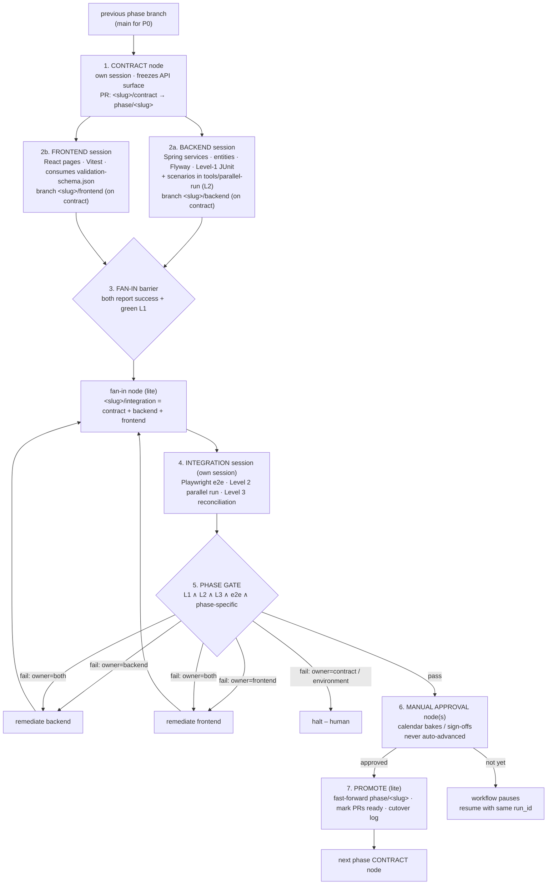

# HRMS Modernization – Phase Workflow

Companion to [CUTOVER_PLAN.md](CUTOVER_PLAN.md), [TEST_STRATEGY.md](TEST_STRATEGY.md), [COMPONENT_MAPPING.md](COMPONENT_MAPPING.md) and [MODERNIZATION_BLUEPRINT.md](MODERNIZATION_BLUEPRINT.md). This document describes the Devin dynamic workflow defined in [`.devin/skills/hrms-phase-workflow/workflow.py`](.devin/skills/hrms-phase-workflow/workflow.py): how each phase P0–P5 is executed as the same fan-out/fan-in graph of Devin sessions, how the branches stack, and what happens when a gate fails.

The workflow **implements and validates code**. It never flips production proxy flags, never drops anything on Oracle and never advances through a calendar bake on its own – those are recorded as manual-approval nodes and post-promotion actions for humans.

---

## 1. The reusable per-phase sub-graph

Every phase is one call of `run_phase(PHASES[pid])`. The graph is identical for P0–P5; phase differences are data in the `PHASES` catalogue, not code branches.



| Node | Session | Mode | What it produces |
|---|---|---|---|
| Contract | own | default | `contracts/<slug>/openapi.yaml`, `error-codes.md` (from COMPONENT_MAPPING.md §11), `frontend/src/generated/validation-schema.json`, contract PR |
| Backend | own | default | services/entities/Flyway, Level-1 JUnit, scenarios registered in `tools/parallel-run/`, PR |
| Frontend | own, parallel with backend | default | React pages reusing `AuthContext`/`ProtectedRoute`/`Toolbar`/`useErrorHandler`/`ReferenceDropdown`, Vitest, msw-mocked Playwright specs, PR |
| Fan-in | own | lite | integration-merge branch, full build on merged tree, draft PR |
| Integration | own | default | verdict per level, routed findings, published reports |
| Approval | own | lite | `approved` / `approver` / `notes` via a blocking question to the human |
| Promote | own | lite | fast-forwarded phase branch, PRs marked ready, cutover-log entry |

Every node runs on its own VM in its own Devin session (`repos=[REPO]`, separate-VM default) and returns a JSON object against a fixed schema; the workflow makes every routing decision from those fields, never from prose.

---

## 2. Contract-first rule

Nothing fans out until the contract node has landed. The contract freezes, for the module of the phase:

1. **REST/OpenAPI surface** – every endpoint of the module as mapped in COMPONENT_MAPPING.md (§1 auth, §3 employee/salary, §4 payroll, §5 leave, §6 performance, §9 reporting/integration), with DTOs, authorities (`@PreAuthorize`) and status codes.
2. **`ApiError.code` values** – the legacy `-20xxx` numbers from COMPONENT_MAPPING.md §11 that the module may return, with HTTP status and triggering rule. They stay numeric so Level-2 diffs remain comparable.
3. **`validation-schema.json`** – exported from `hrms-validation` (TEST_STRATEGY.md §2.1) for the module's DTOs; React consumes it, never re-implements a rule (VAL-01/02/03).
4. Phase-specific contract items (flag names, declared intentional differences such as BUG-04/05/06 in P2, tax element IDs in P4, …).

Rules enforced by the prompts:

- Backend and frontend sessions **implement the contract exactly**. If either believes it is wrong, it implements it anyway and reports the problem in `blockers`; the workflow halts and a human amends the contract. A contract is never edited from an implementation branch.
- The integration session may return `failure_owner=contract`. That is a hard stop (`RuntimeError`) – the workflow will not silently loosen a frozen surface to get green.
- P0's contract is the foundation contract: auth + reference endpoints, the `ApiError` envelope, the `validation-schema.json` format itself, the SSO-bridge exchange, and the proxy flag vocabulary that every later contract reuses.

---

## 3. Fan-out / fan-in

**Fan-out.** After the contract lands, `parallel(run_backend(...), run_agent(frontend))` starts the two implementation sessions together. Both branches are cut from the contract branch and open PRs *into* the contract branch. Neither session may touch the other's tree; the frontend works against msw mocks generated from the OpenAPI, the backend against Testcontainers PostgreSQL.

**Barrier.** `parallel()` returns only when both coroutines finish. The workflow then refuses fan-in unless every implementation result has `blockers == ""` and `level1_passed == true`. A failing or blocked session raises and stops the phase – the integration session is never started on half-finished work.

**Fan-in node.** A lite session resets `<slug>/integration` to the contract branch and merges the backend stack and the frontend branch at the exact SHAs reported by the sessions (not "latest"), resolves clerical conflicts only, runs the full build on the merged tree and opens a draft PR. Substantive conflicts or a broken merged build stop the phase.

**Integration session.** Own session, reads only; produces the verdict (§4).

---

## 4. Integration session ↔ TEST_STRATEGY.md levels + Playwright

| Check in the integration session | TEST_STRATEGY.md | Tooling | Pass rule |
|---|---|---|---|
| Full backend JUnit + frontend Vitest on the merged tree | §2.1 Level 1 | Gradle/Maven + Vitest | green |
| Playwright golden-path e2e, real stack (React ↔ Spring ↔ PostgreSQL, no mocks) | §7 React row (`frontend/e2e/`) | Playwright | phase golden path passes |
| API contract diff / parallel run vs legacy utPLSQL | §2.2 Level 2 | `tools/parallel-run/` (Java: utPLSQL runner on Oracle + REST runner on PostgreSQL + diff) | zero diffs except those **declared in the contract** |
| Reconciliation of the phase's `VW_*` views | §2.3 Level 3 | `tools/reconcile/`, `tests/reconciliation/pg/` | row-for-row equal except documented offsets (VAL-05 until P5) |
| Phase-specific static/infra checks | §5 acceptance-gate column | per phase | as listed in `PHASES[pid]["integration"]["extra"]` |

Per-phase view scope (TEST_STRATEGY.md §5): P0 all six views vs `tests/golden/views-baseline.csv`; P1 `VW_PENDING_APPROVALS` (PERFORMANCE); P2 `VW_LEAVE_SUMMARY`, `VW_PENDING_APPROVALS` (LEAVE); P3 `VW_EMPLOYEE_DIRECTORY`, `VW_ORG_HIERARCHY`, `VW_EMPLOYEE_COMPENSATION`; P4 `VW_PAYROLL_LATEST`; P5 final six-view reconciliation.

**P4 deviation.** The Level-2 check *is* the `PayrollShadowRunner` shadow-mode comparison (CUTOVER_PLAN.md §8.2–§8.4): legacy `PKG_PAYROLL.calculate_payroll` on Oracle vs the Java `TaxEngine`/`PayrollRunService` on PostgreSQL for every fixture period, diffed per `(RUN, EMP_ID, ELEMENT_ID)`; any non-zero cent on 2024-rule inputs fails the gate. The same runner is later pointed at real production periods for the manual shadow gate (§6).

**Phase gate** (`gate_passed`): `level1_passed ∧ level2_passed ∧ level3_passed ∧ e2e_passed ∧ phase_specific_passed ∧ failure_owner == "none"`. There is no partial pass.

---

## 5. Stacked-branch layout

Phase branches stack bottom-up; inside a phase the sub-branches stack contract → {backend, frontend} → integration-merge. Sub-branches use the `<slug>/…` namespace so they can coexist with `phase/<slug>`.

```
main (BASE_BRANCH)
└── phase/p0-foundation                     ← fast-forwarded to p0 integration head on P0 promote
    │   p0-foundation/contract              PR → phase/p0-foundation
    │   p0-foundation/backend               PR → p0-foundation/contract
    │   p0-foundation/frontend              PR → p0-foundation/contract
    │   p0-foundation/integration           = contract + backend + frontend, PR → phase/p0-foundation
    └── phase/p1-performance                ← cut from phase/p0-foundation
        │   p1-performance/contract | backend | frontend | integration
        └── phase/p2-leave
            │   p2-leave/…
            └── phase/p3-employee
                │   p3-employee/contract
                │   p3-employee/backend-salary      PR → contract        (salary-module, ARCH-01)
                │   p3-employee/backend             PR → backend-salary  (employee-service, stacked)
                │   p3-employee/frontend            PR → contract
                │   p3-employee/integration         = contract + backend-salary + backend + frontend
                └── phase/p4-payroll
                    │   p4-payroll/…
                    └── phase/p5-reporting-decommission
                            p5-reporting-decommission/…
```

Rules:

- The contract node cuts `<slug>/contract` (and, if missing, `phase/<slug>`) from the **previous phase branch** (`previous_phase_branch()`), never from `main` directly – P1 sees P0's foundation code, P3 sees P2's leave code, etc.
- Backend/frontend PRs target the contract branch so their diffs show only implementation. The integration-merge PR targets the phase branch and is the artifact the integration report is attached to.
- On promote, `phase/<slug>` is **fast-forwarded** to the integration head (must be a fast-forward; otherwise the promote node stops). PRs are marked ready for review; **merging the stack into `main` is done by humans bottom-up** (P0 first). The workflow never merges to `main`.
- Only `<slug>/integration` may ever be force-pushed (it is rebuilt on every fan-in round). Implementation branches are append-only.

---

## 6. Phase-specific deviations

| Phase | Deviation | Where encoded |
|---|---|---|
| **P0 foundation** | Runs first, same sub-graph; its "module" is the foundation (auth-service, proxy + SSO bridge, app shell, shared modules `hrms-common`/`hrms-validation`/`hrms-audit`/`hrms-notification`, golden oracle + utPLSQL suites, PostgreSQL Flyway baseline, CDC, `tools/parallel-run` + `tools/reconcile` skeletons). Manual approval `P0.security-signoff` for the SEC-01/02/05/07/08 auth divergences. Nothing goes live. | `PHASES["P0"]` |
| **P1 performance** | Manual approval `P1.bake-4-weeks` after the gate. | `PHASES["P1"]["approvals"]` |
| **P2 leave** | Level-2 whitelist limited to declared BUG-04/05/06; Level-3 accepts the VAL-05 `AVAILABLE`/`PENDING` offset until P5. Manual approval `P2.accrual-cycle`. | `PHASES["P2"]` |
| **P3 employee** | Backend is **two sequential nodes** (`backend_sequence`): `backend-salary` (salary-module, sole owner of `SALARY_RECORDS`) must land before `backend` (employee-service, stacked on it) starts – ARCH-01, CUTOVER_PLAN.md §7.1. The frontend starts from the contract in parallel with the salary node; its write flows are built but rendered only under `employee=NEW`, and the fan-in barrier waits for the whole backend stack, so write-path integration can only happen after salary is live. Integration runs read-only (`NEW_READONLY`) then write scenarios. Manual approval `P3.readonly-then-write-bake`. | `run_backend()`, `PHASES["P3"]` |
| **P4 payroll** | Integration = `PayrollShadowRunner` shadow comparison (Level 2). React payroll pages are built and e2e-tested behind `payroll=NEW` but go live only after manual approval `P4.shadow-gate` (≥3 consecutive real production periods, 0.00 diff, other diffs signed off) which promotes `payroll.engine=JAVA` and `payroll=NEW` together. Second approval `P4.rollback-window-closed` (3 more production periods) before P5 starts. | `PHASES["P4"]` |
| **P5 reporting / decommission** | Manual approval `P5.zero-hit-30-days` (30 days of zero `/legacy/*` proxy hits) before Forms/WebLogic/Oracle decommission. Static gate: no PL/SQL, PL/pgSQL, trigger or `.pll` in the target. | `PHASES["P5"]` |

**Calendar gates are manual-approval nodes.** The approval node is a lite Devin session whose only job is to ask the named approver (blocking) whether the criteria are met and return `approved`. The workflow does not compute dates, poll dashboards or wait out the period. If the answer is no, the phase returns `status="waiting-approval"` and the workflow stops before the next phase's contract node.

---

## 7. Failure routing and rebase procedure

When the gate fails, the integration report's `failure_owner` decides the route. The rule the integration session applies:

| Evidence | `failure_owner` | Action |
|---|---|---|
| Level-2 diff, Level-3 mismatch, backend JUnit failure, API violates contract | `backend` | remediation session on the **top backend branch** (`<slug>/backend`; for P3 it may fix in `backend-salary` and rebase `backend` onto it) |
| Playwright fails while API responded per contract; Vitest failure; validation-schema misuse in UI | `frontend` | remediation session on `<slug>/frontend` |
| Both kinds | `both` | both remediation sessions **in parallel** |
| Frozen contract itself is wrong | `contract` | **halt** – human amends the contract PR and re-runs |
| Harness / Oracle connection / infra | `environment` | **halt** – fix environment, resume with same `run_id` |

Every finding line is prefixed `[backend]`, `[frontend]`, `[contract]` or `[env]`; a remediation session fixes only its own prefix, adds a Level-1 test reproducing each finding first, pushes to the **same branch** (no rebase/force-push of implementation branches) and reports the new `head_sha`.

**Rebase + re-run.** After remediation the workflow updates the recorded head SHAs and loops:

1. Fan-in node resets `<slug>/integration` to the contract branch and re-merges the backend stack and frontend at the new SHAs (force-push allowed on the integration branch only), rebuilds the merged tree.
2. Integration session re-runs *all* checks (L1, Playwright, L2, L3, phase-specific) – not just the failed ones – at the new integration SHA.
3. Gate re-evaluated.

The loop is bounded by `MAX_REMEDIATION_ROUNDS` (3). Exceeding it raises with the last report URL; a human decides whether to extend, re-scope, or roll back per CUTOVER_PLAN.md rollback rules.

---

## 8. Running, resuming and configuring

```text
run_workflow(script=<contents of .devin/skills/hrms-phase-workflow/workflow.py>, run_id="hrms-phases-2026q3")
```

Environment variables read at start (defaults in the file):

| Variable | Default | Purpose |
|---|---|---|
| `HRMS_WF_BASE_BRANCH` | `devin/1789629102-hrms-analysis-artifacts` | branch P0 is cut from; must carry the reference documents |
| `HRMS_WF_PHASES` | `P0,P1,P2,P3,P4,P5` | subset to run (in order); earlier phases must already be promoted |
| `HRMS_WF_APPROVED_GATES` | empty | gate ids granted out of band, e.g. `P1.bake-4-weeks,P4.shadow-gate` |

**Resuming after a calendar gate.** A run that stopped at `P1.bake-4-weeks` is resumed – weeks later – by re-running the *same script* with the *same `run_id`* and `HRMS_WF_APPROVED_GATES=P1.bake-4-weeks`. Every completed node (contract, backend, frontend, fan-in, integration, earlier phases) replays from the journal; the approval node is skipped as pre-approved; the promote node and P2's contract node run next. The same mechanism resumes after a halt (`contract`/`environment`) once the human fix is in – the failed node is retried, the rest replays.

**Resuming a crashed run.** Same script, same `run_id`, no other change: completed calls replay, the in-flight call re-runs.

Phase labels visible in the run journal follow `P<n>.<node>[.r<round>]`, e.g. `P3.backend-salary`, `P2.integration.r2`, `P4.approval.P4.shadow-gate`.

---

## 9. What the workflow deliberately does not do

- Flip production proxy flags (`performance=NEW`, `payroll.engine=JAVA`, …) or drop `PKG_*`/`TRG_*` on Oracle – recorded as post-promotion actions in the cutover log for operators.
- Merge phase branches into `main` – humans merge the stack bottom-up after review.
- Compute or wait out bake periods – manual-approval nodes only.
- Weaken a gate: partial passes, skipped levels or undeclared Level-2 diffs never promote.
